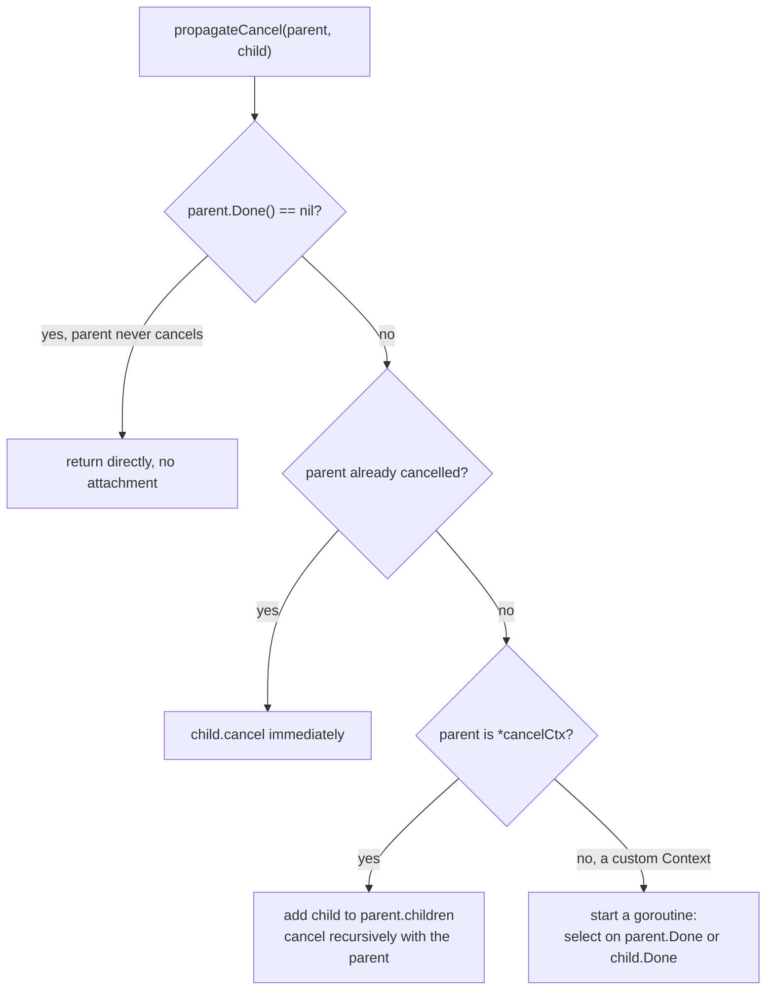
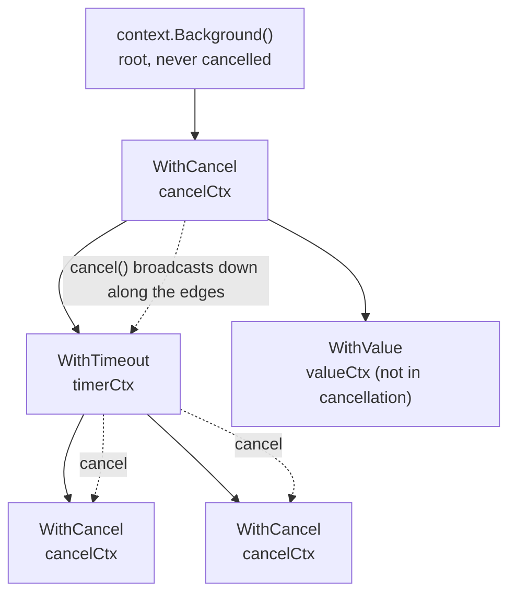

# 11.8 Context

A request entering a server seldom runs to completion inside a single goroutine. It fans out into
a tree of goroutines: one queries the database, one calls a downstream RPC, one reads the cache,
and each of these spawns smaller units of work in turn. Once the originator of the request no longer
needs the result, say the client has disconnected, or the upstream has already timed out, all the
work still running across that tree becomes pure waste, holding connections, locks, and memory while
no one will ever read what it produces. The problem then becomes: **how do we propagate the signal
"stop here" from the root of the tree out to every leaf, so each of them can stop on its own.**

The `context` package is Go's standard answer to this problem. It carries cancellation, deadlines,
and request-scoped metadata explicitly along the call chain, so that a tree of goroutines can be
cancelled as a unit. This section first makes clear why it is cooperative rather than forced, then
walks through the implementation along the structure of the cancellation tree, and finally places it
within the lineage of structured concurrency and its cross-language relatives.

## 11.8.1 Why Cancellation Is a Signal, Not a Command

The most naive idea is to give a goroutine a "kill it" API. Go pointedly has no such API, and this is
not an oversight but a design lesson learned from those who came before.

Java once offered `Thread.stop()`, which could forcibly terminate a thread from the outside. It was
deprecated as far back as JDK 1.2, for the reason written in the official deprecation note: the
stopped thread immediately throws `ThreadDeath` and **releases all the monitor locks it currently
holds**. A lock is held to protect some invariant; if the holding thread is interrupted partway
through and the lock is released anyway, other threads will see a shared object in an intermediate
state with its invariant broken, and with no warning at all. Later JDKs simply made `Thread.stop()`
throw `UnsupportedOperationException` outright, closing that door for good. Forced termination is
dangerous at root because the outside has no way to know whether the target is, at that instant,
inside some critical region that must not be interrupted.

Go therefore took the opposite path: the runtime offers no means to "kill a goroutine," and
cancellation is a **signal** that the goroutine itself inspects at safe checkpoints and then decides
on its own how to wind down. Undoing, rolling back, releasing resources: only the code itself knows
how to do these correctly, so the decision is handed back to the code itself.

Before `context` existed, this signal could be hand-written with a channel. Closing a channel wakes
every receiver waiting on it ([10.4](../ch10chan/readme.md)), which is exactly the natural carrier
for "broadcast a cancellation once":

```go
cancel := make(chan struct{})

go func() {
	done := make(chan struct{}, 1)
	go func() {
		defer func() { done <- struct{}{} }()
		do() // perform the operation that needs to run
	}()
	select {
	case <-cancel:
		// cancelled early: wait for the started work to wind down, then undo its side effects
		<-done
		undo()
	case <-done:
		// finished cleanly
	}
}()

// cancel for some reason
close(cancel)
```

This code already contains everything that matters about `context`: the canceller is only responsible
for sending the signal (`close(cancel)`), while the cancelled party waits in a `select` for the
cancellation signal alongside normal completion, and on receiving the signal winds down at a safe
point of its own choosing. What `context` does is abstract this hand-written pattern into an interface,
and solve a problem the hand-written version does not: when work fans out into a tree, how to make a
single cancellation propagate **automatically** along the tree to every descendant.

## 11.8.2 The Cancellation Tree

The `context` interface is small, and only two of its methods relate to cancellation:

```go
type Context interface {
	Deadline() (deadline time.Time, ok bool) // deadline, ok==false if none
	Done() <-chan struct{}                    // channel closed on cancellation
	Err() error                               // returns the cancellation reason after Done is closed
	Value(key any) any                        // fetch a request-scoped value (see 11.8.6)
}
```

The channel returned by `Done()` is the hub of the whole mechanism: it **carries no data and uses only
the act of closing to broadcast cancellation**. The standard way to use it is to place it in a `select`
alongside one's own normal work:

```go
select {
case <-ctx.Done():
	return ctx.Err() // upstream has cancelled; stop the work in hand and report the reason
case res := <-work:
	// got the result normally
}
```

Every `context` derives from a root. `context.Background()` is the root of this tree and is never
cancelled; `WithCancel`, `WithTimeout`, `WithDeadline`, and `WithValue` each take a parent `context`
and return a derived child `context`. The cancellation capability is carried by the internal
`cancelCtx`, sketched below:

```go
// cancelCtx: a cancellable context (trimmed sketch)
type cancelCtx struct {
	Context                       // embeds the parent context

	mu       sync.Mutex           // protects the fields below
	done     atomic.Value         // chan struct{}, created lazily, closed on first cancel
	children map[canceler]struct{} // set of descendants, set to nil after first cancel
	err      atomic.Value         // cancellation reason, written on first cancel
	cause    error                // finer-grained cancellation cause (see 11.8.4)
}
```

A few design points are worth calling out. `done` is **created lazily**: the channel is allocated only
when someone actually calls `Done()` to wait on it; a context that never listens for cancellation
therefore spends not a cent on a channel. Both `err` and `done` are stored in `atomic.Value`, so that
high-frequency queries like `Err()` can take a single atomic read and bypass the mutex; the source
comment says this is "about 5x faster in tight loops."

Cancellation itself is a top-down recursion. Inside the lock, `cancel` does three things: it closes its
own `done` channel (broadcasting to every goroutine waiting on it), then iterates over `children`
calling each one's `cancel`, and finally sets `children` to `nil`. A single cancellation at the root
spreads down the tree to every descendant this way:

```go
func (c *cancelCtx) cancel(removeFromParent bool, err, cause error) {
	c.mu.Lock()
	if c.err.Load() != nil {
		c.mu.Unlock()
		return // already cancelled, return idempotently
	}
	c.err.Store(err)
	c.cause = cause
	d, _ := c.done.Load().(chan struct{})
	if d == nil {
		c.done.Store(closedchan) // no one called Done() yet; store an already-closed sentinel
	} else {
		close(d)                 // broadcast cancellation
	}
	for child := range c.children {
		child.cancel(false, err, cause) // recursively cancel descendants
	}
	c.children = nil
	c.mu.Unlock()
	if removeFromParent {
		removeChild(c.Context, c) // detach self from the parent's children to prevent leaks
	}
}
```

How a child is attached to its parent is arranged by `propagateCancel`, which must handle the different
shapes a parent context can take:



The last branch is the one most worth discussing. When the parent is a user-defined `Context` rather
than the standard library's `*cancelCtx`, there is no `children` table to attach to, so
`propagateCancel` falls back to starting a goroutine that `select`s on both `parent.Done()` and
`child.Done()` at once: if the parent cancels first, the cancellation is forwarded to the child; if the
child finishes first, this goroutine exits on its own. This "watcher goroutine" fallback is a point
many explanations miss, yet it is exactly what makes cancellation propagation hold for **any** parent
that implements the `Context` interface, and its foundation is still the
"closing a channel is a broadcast" idiom from [10.4](../ch10chan/readme.md).

The shape of the whole tree is now clear:



Cancellation flows in one direction down the parent-to-child edges: cancel a node, and it together with
its entire subtree is cancelled, while its parent and siblings are unaffected.

## 11.8.3 Deadlines: A Timer That Cancels Itself

Timeouts and deadlines are, in essence, "a cancellation that fires automatically at a set time." The
`timerCtx` returned by `WithDeadline` adds only a timer on top of `cancelCtx`:

```go
// timerCtx: a context with a deadline (sketch)
type timerCtx struct {
	cancelCtx               // reuses the full Done/Err/children cancellation machinery
	timer    *time.Timer    // timer that triggers cancel when the time arrives
	deadline time.Time
}
```

`WithDeadline` uses `time.AfterFunc` ([9.10](../ch09sched/timer.md)) to register a callback that, when
the time arrives, calls `cancel` with `DeadlineExceeded` as the reason. `WithTimeout(parent, d)` is
nothing more than a thin wrapper over `WithDeadline(parent, time.Now().Add(d))`. There is also a sound
optimization hidden here: if the parent's deadline is already earlier than the one being set,
`WithDeadline` degrades directly into `WithCancel`, because the parent will cancel the child along with
itself when its own time arrives, so installing a separate timer for the child would be redundant.

Whether cancellation is triggered manually or by a timer, every `WithCancel` / `WithTimeout` returns a
`cancel` function, and **the caller is obliged to call it**, even when the work has finished normally.
There are two reasons. For `cancelCtx`, `cancel` detaches itself from the parent's `children` table;
not calling it leaves this child node hanging off the parent until the parent itself is cancelled, which
under a long-lived parent is a memory leak. For `timerCtx`, `cancel` also `Stop`s that timer, returning
its resources promptly. The idiomatic form is `defer cancel()`, and `go vet` will warn when `cancel`
is missed on some path of the control flow.

## 11.8.4 Three Additions in Go 1.21

Go 1.21 added three tools to `context` that the community had long called for, filling several gaps in
the original abstraction.

`AfterFunc(ctx, f)` registers a callback: when `ctx` is cancelled (or times out), `f` runs in a new
goroutine. It folds the repeatedly hand-written task of "listen on `Done()` and then clean up" into the
standard library, sparing you from starting a dedicated `select` goroutine for every cleanup task. It
returns a `stop` function and uses `sync.Once` to guarantee that at most one of `f` and `stop` takes
effect, avoiding a double trigger.

`WithoutCancel(parent)` derives a context that **severs the cancellation chain while keeping the value
chain**. Its `Done()` returns `nil` and `Err()` is always `nil`, but `Value` still passes through to the
parent. The typical use is: the request has ended, yet under the request-scoped metadata (such as a
trace ID) you want to start a wind-down task that should not be cancelled along with the request, such
as writing an audit log asynchronously.

`WithDeadlineCause` / `WithTimeoutCause`, together with the companion `Cause(ctx)`, solve the problem
that the original `Err()` could only distinguish the two coarse outcomes of "was cancelled" and "timed
out." They allow attaching a specific **cause** error when a timeout occurs, and `Cause(ctx)` retrieves
it, letting upper-layer logs state clearly "why it was cancelled" rather than stopping at
`context deadline exceeded`.

## 11.8.5 Structured Concurrency: Placing It in the Lineage

`context` solves "how cancellation propagates down a tree of goroutines," but it does not constrain the
**shape** of that tree: the moment `go` runs, the new goroutine's lifetime escapes the code that started
it, and nothing forces it to terminate before some scope ends. Nathaniel Smith made this point thoroughly
in his 2018 article *Notes on structured concurrency, or: Go statement considered harmful*: a bare `go`
(and `spawn` elsewhere) is to concurrency what `goto` is to control flow; it makes the lifetimes of
concurrency no longer nest, so there is no way to reason at the lexical level about whether "all the work
this code started has finished by the time it returns."

His prescription is **structured concurrency**: let concurrency also obey lexical block structure, so
that all tasks started within a scope must finish before that scope exits. His Trio library implements it
with a nursery: a task can only be spawned inside a nursery, and the block containing the nursery does
not exit until every task in the box has finished; if any task errors, the rest of the box is cancelled
and the error is thrown outward. This line of thinking went on to influence several languages:

| System | Structured concurrency | Cancellation mechanism |
| --- | --- | --- |
| Python Trio / asyncio | nursery / TaskGroup | `Cancelled` exception injection |
| Kotlin coroutines | `coroutineScope` scope | `Job` tree, cancellation propagates along the scope |
| Java (JDK 21+, preview) | `StructuredTaskScope` | closing the scope cancels unfinished child tasks |
| .NET | convention + compiler assistance | `CancellationToken` passed explicitly |
| Go | no language-level primitive, approximated by libraries | `context` + `errgroup` |

Several comparisons are worth savoring. Kotlin's `Job` forms a cancellation tree almost isomorphic to
`context`, with cancellation propagating along the scope's parent-child relationship; Java's
`StructuredTaskScope` (through several rounds of JEP previews, and still a preview feature as of JDK 25)
automatically cancels unfinished child tasks when the scope closes, building the nursery straight into the
standard library; .NET's `CancellationToken` resembles Go's `context` most closely, likewise passing a
cancellation token explicitly to be checked cooperatively by the callee, the difference being that .NET
uses an `OperationCanceledException` to convey cancellation while Go gives only a channel that you must
actively `select` on.

Go did not introduce a nursery at the language level, but approximates it at the library layer with
`golang.org/x/sync/errgroup`: `errgroup.WithContext` returns a group and a derived `context`, and when
any goroutine in the group returns an error, this `context` is cancelled, thereby notifying the rest of
the goroutines to stop, while `g.Wait()` blocks until the whole group finishes. This gives an
approximation of "enter together, leave together, fall together," but it remains a convention rather than
an enforcement, and the compiler will not stop you from bare-`go`-ing yet another goroutine outside the
`errgroup` that escapes the scope. This is precisely Go's current trade-off: keep structured concurrency
at the library and specification layer rather than casting it into the language.

## 11.8.6 The Controversy over Value Passing and the Case for Explicit Parameters

The `Value` method of `Context` is another long-disputed design. `valueCtx` is minimal:

```go
type valueCtx struct {
	Context     // parent
	key, val any
}
```

Its `Value(key)` returns when it hits its own key, and otherwise walks up the parent chain, so a single
lookup is an $O(d)$ linked-list search, where $d$ is the derivation depth. This dictates that it is
**suited only to shallow and sparse request-scoped data**, such as a trace ID or an authenticated
principal, rather than being treated as an offhand global dictionary.

The deeper controversy lies in "what should be passed via `Value`." The line drawn by the official
documentation is: use it only for **request-scoped data that crosses API and process boundaries**, and
do not use it to pass a function's optional parameters. Dave Cheney went further in *Context isn't for
cancellation*, arguing that even value passing beyond cancellation is itself worth questioning, because
`Value` is dynamically typed with both key and value as `any`, which bypasses compile-time checking and
hides a dependency that should have been declared explicitly inside an opaque pocket, leaving the caller
no way to know which keys in the `context` a given function actually depends on.

What draws the most question about `context`, though, is the convention itself that "every function's
first parameter must explicitly carry `ctx`." The article *Context should go away for Go 2* represents
the opposing side: cancellation and timeout are an almost ubiquitous cross-cutting concern, yet they have
to be expressed through a parameter threaded manually layer by layer, which pollutes nearly every function
signature and is all too easy to forget passing at some layer, quietly breaking the chain. The supporting
side holds that explicitness is exactly Go's trade-off: having the cancellation capability appear in the
signature, with propagation statically checked by `go vet`, beats hiding it in some implicit thread-local
storage with no way to trace it. This debate remains unsettled to this day, and the explicit parameter
passing of `context` is once again Go leaning toward the former over the latter, between "simple and
visible" and "clean signatures."

## Further Reading

1. The Go Authors. *Package context.* https://pkg.go.dev/context ; source at
   `src/context/context.go` (this section is checked against Go 1.26).
2. Sameer Ajmani. *Go Concurrency Patterns: Context.* The Go Blog, 2014.
   https://go.dev/blog/context
3. Nathaniel J. Smith. *Notes on structured concurrency, or: Go statement considered harmful.*
   2018. https://vorpus.org/blog/notes-on-structured-concurrency-or-go-statement-considered-harmful/
4. Oracle. *Java Thread Primitive Deprecation* (why `Thread.stop` was deprecated).
   https://docs.oracle.com/en/java/javase/21/docs/api/java.base/java/lang/doc-files/threadPrimitiveDeprecation.html
5. JEP 505: *Structured Concurrency* (`StructuredTaskScope`, fifth preview in JDK 25).
   https://openjdk.org/jeps/505
6. Dave Cheney. *Context isn't for cancellation.* 2017.
   https://dave.cheney.net/2017/08/20/context-isnt-for-cancellation
7. Michael Hudson-Doyle. *Context should go away for Go 2.* faiface, 2017.
   https://faiface.github.io/post/context-should-go-away-go2/
8. Gustavo Niemeyer. *Death of goroutines under control* (tomb, an early practice of cooperative
   cancellation). 2011. https://blog.labix.org/2011/10/09/death-of-goroutines-under-control ;
   companion library `gopkg.in/tomb.v2`.
9. Go proposal #14660 (*context: new package for standard library*, the original proposal for `context`
   entering the standard library, https://github.com/golang/go/issues/14660); proposal #56661
   (*context.AfterFunc / WithoutCancel / WithDeadlineCause*, Go 1.21).
   This book [10.4 Closing](../ch10chan/readme.md), [9.10 Timers](../ch09sched/timer.md),
   [11.9 Memory Consistency Model](./mem.md).
