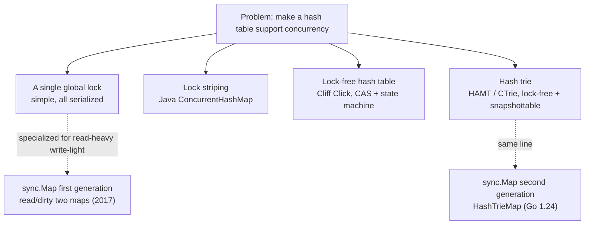
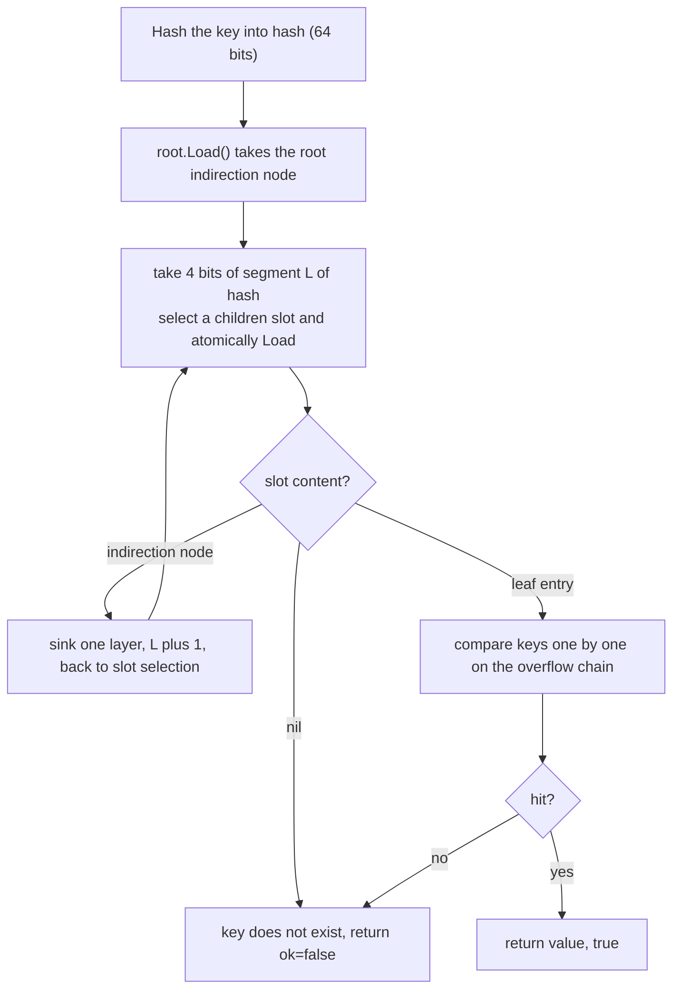

# 11.7 Concurrency-Safe Hash Table

> `sync.Map` went through a complete internal rewrite in Go 1.24: the original
> read/dirty two-map design was replaced by a concurrent hash-trie. This section first makes the
> origin of each of these two generations of design clear, then places them back into the
> solution lineage of concurrent hash tables.

The language's built-in `map` is not concurrency-safe. When multiple goroutines read and write the same `map` simultaneously without synchronization,
the runtime actively detects the concurrent access and terminates the process with `fatal error: concurrent map read and map write`
([5.2](../../part2lang/ch05data/map.md) introduced this detection mechanism; it is unrecoverable, and `recover`
cannot intercept it). For services with availability requirements, this is a design question that must be answered head-on: when multiple goroutines need to share
one table, what structure should be used.

The most naive answer is to wrap an ordinary `map` in a lock:

```go
// An ordinary map plus a read-write lock: the most direct, and often good enough, concurrency-safe table
type RWMutexMap struct {
	mu   sync.RWMutex
	data map[any]any
}

func (m *RWMutexMap) Load(k any) (v any, ok bool) {
	m.mu.RLock()
	v, ok = m.data[k]
	m.mu.RUnlock()
	return
}

func (m *RWMutexMap) Store(k, v any) {
	m.mu.Lock()
	m.data[k] = v
	m.mu.Unlock()
}
```

This approach is simple, type-safe (you define the key and value types yourself), and fast enough in most scenarios. It has a bottleneck in only one place:
all reads must contend for the same lock. `RWMutex` allows multiple readers to hold the lock concurrently, but holding the lock itself requires updating the reader count, which is one
atomic write to a shared cache line, and as core counts grow it becomes a contention point ([11.2](./mutex.md) discussed this). What `sync.Map`
sets out to solve is exactly this scenario where reads are so frequent that the lock itself becomes expensive. Before looking at how it does this, let us lay out the whole map of solutions.

## 11.7.1 The Solution Lineage of Concurrent Hash Tables

Making a hash table support concurrency has accumulated a lineage from coarse to fine in the industry, and understanding it lets us see clearly where each of the two generations of `sync.Map` design
stands.

**A single global lock.** The `RWMutexMap` above is one. Correct and simple, but all operations serialize on a single lock,
which is the lower bound of scalability.

**Lock striping.** The table is cut into several segments, each with its own lock; keys fall into a segment by hash value, and an operation only locks
the segment it lands in. $S$ segments in theory reduce lock contention by a factor of $S$. The `ConcurrentHashMap` that Doug Lea wrote for Java
(JDK 1.5, 2004) is the classic implementation of this idea, defaulting to 16 segments in its early form. The cost is that segment granularity is fixed: too few segments still contend,
too many waste memory and complicate whole-table operations (such as `size` and `resize`). JDK 8 further refined segment locks down to bucket level,
making the read path lock-free (relying on `volatile` array entries) and the write path use CAS or `synchronized` on the bucket head.

**Lock-free hash tables.** Cliff Click's lock-free hash table (2007) goes further, using a set of state machines and CAS
to perform insertion, resizing, and migration, with reads and writes taking no lock at any point; during resizing the old and new tables coexist, and readers and writers help with the relocation.
It pushes scalability to the extreme, at the cost of an implementation that is extremely delicate, hard to verify, and heavily dependent on the memory model.

**Hash tries and snapshottable concurrent structures.** Another thread comes from functional data structures. Phil Bagwell proposed in 2001
the *Hash Array Mapped Trie* (HAMT): the key's hash value is sliced every $b$ bits, indexing layer by layer into a trie with branching factor
$2^b$, with leaves storing key-value pairs. It naturally supports structural sharing and is the underlying structure of Scala's and Clojure's immutable maps.
Aleksandar Prokopec and others built on this in 2012 to propose *CTrie* (concurrent trie), using an indirection node
(I-node) as a stable anchor for CAS, making insertion and deletion lock-free throughout, and supporting $O(1)$ lock-free, linearizable snapshots
(which is its most distinctive ability relative to other concurrent tables). The new implementation of `sync.Map` in Go 1.24 belongs to this line.



The two generations of `sync.Map` are not isolated on this lineage; they land respectively from the two directions of "specialization for read-heavy write-light" and "hash trie".
We take them apart in turn below.

## 11.7.2 First Generation: the read/dirty Two-Map Design

`sync.Map` was introduced in 2017 (Go 1.9), and its documentation states up front the two kinds of scenarios it excels at, unchanged to this day:

1. **Write once, read many times**, where a key once written stays essentially read-only, like an append-only cache;
2. **Multiple goroutines read and write disjoint key sets**, each operating on its own keys.

What these two kinds of scenarios have in common is: in steady state, the vast majority of operations are either reads, or hit a key that already exists. The first-generation design
makes a core bet on this basis, placing already-stabilized keys into a read-only, lock-free-accessible table, letting the hot path bypass the lock entirely.

To this end `Map` maintains two tables, an atomically readable `read` and a lock-protected `dirty`. A trimmed sketch:

```go
// sync.Map first generation (Go 1.9-1.23): read/dirty two maps (sketch)
type Map struct {
	mu Mutex

	// read is the half that can be read lock-free. It is an atomically loaded read-only snapshot;
	// load never needs mu, and only a promotion of dirty replaces it wholesale.
	read atomic.Pointer[readOnly]

	// dirty is the half protected by mu, holding the latest complete set of keys,
	// and is also the only place new keys land.
	dirty map[any]*entry

	// misses records how many times read missed and was forced to take the lock and query dirty.
	// Once it accumulates to a threshold, dirty is promoted wholesale to read.
	misses int
}

type readOnly struct {
	m       map[any]*entry
	amended bool // true when dirty has keys that read does not
}
```

The key point is not the two `map`s, but that they store `*entry`, a pointer to a pointer to a value. `read` and `dirty`
hold **the same `entry` pointer** for the same key, so "updating the value of an existing key" degenerates into a single CAS on that atomic pointer inside `entry`,
and the two tables automatically see the same new value, without any synchronization:

```go
// entry is the slot for a key. The value is updated through an atomic pointer, avoiding locks.
type entry struct {
	// p points to the actual value. Three states:
	//   normal pointer -> valid value
	//   nil            -> deleted, but dirty may still retain this entry
	//   expunged       -> deleted, and dirty no longer holds this entry
	p atomic.Pointer[any]
}
```

**Lock-free read path.** `Load` first atomically loads `read`, returns directly on a hit, and the whole path has no lock:

```go
func (m *Map) Load(key any) (value any, ok bool) {
	read := m.loadReadOnly()      // atomically load the read-only snapshot
	e, ok := read.m[key]
	if !ok && read.amended {      // read does not have it, dirty might
		m.mu.Lock()
		read = m.loadReadOnly()   // query again after locking, to avoid racing with a promotion
		e, ok = read.m[key]
		if !ok && read.amended {
			e, ok = m.dirty[key]
			m.missLocked()        // record a miss, which may trigger a promotion
		}
		m.mu.Unlock()
	}
	if !ok {
		return nil, false
	}
	return e.load()
}
```

**Miss counting and promotion.** Only when a key cannot be found in `read` does it degenerate to locking and querying `dirty`.
Each such slow path records one miss; once misses accumulate to `len(dirty)`, meaning "the cost of rebuilding read has already been amortized by the slow path",
the whole `dirty` is atomically promoted to the new `read`, and `dirty` is cleared and the count zeroed:

```go
func (m *Map) missLocked() {
	m.misses++
	if m.misses < len(m.dirty) {
		return
	}
	m.read.Store(&readOnly{m: m.dirty}) // dirty rises wholesale to become the new read-only snapshot
	m.dirty = nil
	m.misses = 0
}
```

This promotion mechanism amortizes "reading a newly written key initially requires a lock" into amortized lock-free. A new key first enters only `dirty`, and after several
slow-path accesses is promoted into `read`, after which reads of it all take the lock-free fast path. The first kind of scenario (write once read many) thus converges
to almost entirely lock-free reads; the second kind (disjoint key sets) rarely misses each other across goroutines and so rarely contends for the lock.

**Lazy deletion.** Deletion does not immediately remove the key from `read`; it only atomically sets `entry.p` to `nil`, and the entry set to `nil`
still stays in `read`. It is left for the next `dirty` rebuild: if `dirty` has by then been newly built, these `nil` values are
further CAS'd to `expunged` and not copied into the new `dirty`, deferring physical deletion to this moment. The two states `nil`/`expunged`
distinguish "deleted but read still recognizes it" from "deleted and dirty has abandoned it", keeping deletion as far as possible on lock-free `entry` operations.

The whole philosophy of the first generation is to trade space (two copies of `map`) and a little latency (a new key must be read several times before promotion) for a lock-free read path.
It is indeed elegant for the two kinds of scenarios it declares, but the cost is written into the design too.

## 11.7.3 The Degradation of the First Generation: Why a Rewrite

The amortized lock-free property of read/dirty presupposes that "the key set tends toward stability". Once the workload deviates from the two declared scenarios, it degrades significantly:

- **Write-heavy or frequent key churn.** Every write of a new key not in `read` requires a lock, and when misses accumulate to the threshold
  the whole `dirty` has to be copied again to rebuild it. When the key set keeps changing, the $O(n)$ whole-table copy becomes a constant overhead.
- **Memory amplification.** In steady state the same set of keys stores a pointer in each of `read` and `dirty`, and deletion relies on lazy reclamation,
  so memory usage approaches double.
- **Lock granularity is still global.** The slow path has only one `mu`, and once churn makes the slow path frequent, all writes crowd back onto this lock,
  enjoying none of the scalability gains of the striping or lock-free lineages.

The `unique` package (the value-canonicalization facility introduced in Go 1.23) amplified these weaknesses to an unacceptable degree: its internal table is write-heavy and has keys constantly entering and leaving,
exactly the worst load for read/dirty. The community first landed a concurrent hash trie in `internal/concurrent` for this, and then used it to rewrite `sync.Map` accordingly. Starting from Go 1.24 (early 2025), `sync.Map` no longer has
read/dirty; its implementation is reduced to a thin layer that hands all the work over to `internal/sync.HashTrieMap`:

```go
// sync.Map from Go 1.24: API unchanged, implementation swapped wholesale to HashTrieMap
type Map struct {
	_ noCopy
	m isync.HashTrieMap[any, any]
}

func (m *Map) Load(key any) (any, bool) { return m.m.Load(key) }
func (m *Map) Store(key, value any)     { m.m.Store(key, value) }
```

Not a character of the public API changed; this rewrite is completely transparent to users: what was swapped out is only "how the same contract is fulfilled".

## 11.7.4 Second Generation: HashTrieMap

`HashTrieMap` is the engineering landing of the CTrie line. It slices the key's 64-bit hash value every 4 bits, indexing layer by layer into a trie with
**branching factor 16**. Each internal node (indirection node) has 16 child slots; layer $L$ uses segment $L$ (4 bits) of the hash value
to select a child, and $64 / 4 = 16$ layers suffice to walk through all hash bits. The trimmed structure:

```go
const (
	nChildrenLog2 = 4
	nChildren     = 1 << nChildrenLog2 // 16 children per internal node, measured to be the sweet spot for load performance
	nChildrenMask = nChildren - 1
)

// indirection node: an internal node of the trie
type indirect[K comparable, V any] struct {
	node[K, V]
	dead     atomic.Bool                          // node has been removed, readers must retry
	mu       Mutex                                // protects only changes to this node's children
	parent   *indirect[K, V]
	children [nChildren]atomic.Pointer[node[K, V]] // 16 atomic child slots
}

// leaf node: a key-value pair, with an overflow chain handling hash collisions
type entry[K comparable, V any] struct {
	node[K, V]
	overflow atomic.Pointer[entry[K, V]] // keys colliding in the same slot are strung into a chain
	key      K
	value    V
}
```

The pivot of the design is that every slot in the `children` array is an `atomic.Pointer`. **The read path is lock-free throughout**: starting from the root,
each layer takes 4 bits of the hash value to select a child slot, atomically loads that slot, compares keys on the overflow chain and returns if it is a leaf, and sinks one layer if it is an indirection node:

```go
func (ht *HashTrieMap[K, V]) Load(key K) (value V, ok bool) {
	hash := ht.keyHash(/* key */)
	i := ht.root.Load()
	hashShift := 8 * goarch.PtrSize // 64
	for hashShift != 0 {
		hashShift -= nChildrenLog2          // consume 4 bits per layer
		n := i.children[(hash>>hashShift)&nChildrenMask].Load() // atomically load the child slot
		if n == nil {
			return *new(V), false           // slot empty, key does not exist
		}
		if n.isEntry {
			return n.entry().lookup(key)    // reached a leaf, compare keys on the overflow chain
		}
		i = n.indirect()                    // sink one layer
	}
	panic("ran out of hash bits")
}
```

The whole read path has only atomic loads, no lock, no CAS, no miss counting. It treats all keys alike, and there is no warm-up period of the first generation's kind
where "a new key must be read several times before entering the lock-free fast path".



**The write path's lock is local.** `Store`, `LoadOrStore`, and deletion lock the `mu` of the relevant indirection node,
not a single global lock, so writes on different subtrees can truly run in parallel. This is the natural form of the lock-striping idea on a trie: segments are no longer
a fixed split but grow dynamically with the shape of the tree. After deleting a key, if an indirection node becomes empty, it is marked `dead` and removed from its parent;
a reader that hits a `dead` node retries, keeping the tree compact. Hash collisions (different keys in the same slot) are handled linearly on the leaf's
`overflow` chain.

Contrast it with the first generation: read/dirty trades "whole-table copy + promotion" for lock-free reads, and the copy cost explodes when writes are heavy;
`HashTrieMap` trades "immutable path + local lock" for lock-free reads, and a write touches only one root-to-leaf path and the lock of one node,
naturally dispersing as the key set grows. The cost is that a single read walks at most 16 layers of pointer hops, with a constant factor slightly higher than one `map` hash lookup,
but it saves the first generation's warm-up, whole-table copy, and doubled memory. For write-heavy loads like `unique`, this is a decisive improvement;
for the read-heavy write-light loads the first generation excelled at, it does not lose either.

## 11.7.5 When to Use sync.Map, When to Use RWMutex + map

The two generations of implementation changed their innards, but the official guidance to users has stayed consistent: **most code should use an ordinary `map` with a lock, not
`sync.Map`**. There are two layers to the reasoning.

The first is applicability. The advantage of `sync.Map` concentrates in the two scenarios it declares. For loads falling outside them, especially those with balanced reads and writes or needing frequent
whole-table operations, `RWMutex + map` is often simpler and no slower.

The second is the cost of type safety, which is often overlooked. The keys and values of `sync.Map` are `any`, so each access carries boxing, unboxing, and interface
assertion, and the compiler has no way to check key and value types for you; `RWMutex + map` can be a statically typed table like `map[string]*Session`, where type
errors are caught at compile time. Go 1.18 generics did not change the public signature of `sync.Map` (it is still
`any`), so it cannot enjoy the generics of `HashTrieMap[K, V]` internally, and the loss of type safety remains.

Treat `sync.Map` as a specialized tool honed for a specific scenario: use it only after confirming the load falls within its two use cases and that lock contention is measured to be the
bottleneck; in all other cases an ordinary `map` plus a lock is the safer default choice. Performance gains never come for free; `sync.Map`
trades type safety and a narrowing of applicability for lock-free reads in those two scenarios.

## Further Reading

1. Phil Bagwell. *Ideal Hash Trees.* EPFL Technical Report, 2001.
   https://infoscience.epfl.ch/record/64398 (HAMT, the origin of the hash trie)
2. Aleksandar Prokopec, Nathan G. Bronson, Phil Bagwell, Martin Odersky.
   *Concurrent Tries with Efficient Non-Blocking Snapshots.* PPoPP 2012.
   https://doi.org/10.1145/2145816.2145836 (CTrie, the direct conceptual source of HashTrieMap)
3. Doug Lea. *Overview of package util.concurrent (ConcurrentHashMap).* and JSR-166.
   http://gee.cs.oswego.edu/dl/classes/EDU/oswego/cs/dl/util/concurrent/intro.html
   (the classic implementation of a lock-striped concurrent hash table)
4. Cliff Click. *A Lock-Free Hash Table.* Stanford EE380, February 21, 2007.
   https://web.stanford.edu/class/ee380/Abstracts/070221.html
5. The Go Authors. *sync.Map documentation.* https://pkg.go.dev/sync#Map
   (the official statement of the two applicable scenarios and the memory model guarantees)
6. The Go Authors. *internal/sync/hashtriemap.go.* Go source tree.
   https://github.com/golang/go/blob/master/src/internal/sync/hashtriemap.go
7. Go issues golang/go#21031 (discussion of sync.Map scalability), #70683 (the rewrite driven by unique),
   and the related commits introducing `HashTrieMap` and switching `sync.Map` to use it.
8. This book's [5.2 Hash Tables](../../part2lang/ch05data/map.md), [11.2 Mutex](./mutex.md),
   [12.2 Allocator Components](../../part4memory/ch12alloc/component.md) (mcentral's "restructuring data
   structures for concurrency" is the same kind of evolution).
