# 11.9 Memory Consistency Models

> Go's memory model went through an important revision in 2022 with Go 1.19.
> After laying out the current model, this section devotes space to the background of that
> revision (see [11.9.8](#1198-the-evolution-of-the-design)).

The reader may have noticed that in the earlier discussion of the Go runtime and compiler we
kept steering clear of one topic: Go's memory model. The avoidance was not without reason. To
explain it properly requires groundwork in concurrency, synchronization primitives, and even
the hardware layer, and only now is that groundwork in place. As the close of this chapter,
and as the book's summary of Go's synchronization primitives and patterns, we take up the
topic here and answer the question still unresolved in the reader's mind: when two Goroutines
read and write the same variable at once, under what conditions is one side's write
guaranteed to be seen by the other.

## 11.9.1 Why the Memory Model Matters

A memory consistency model, or memory model for short, is a contract that stands between the
language's users and the language itself, between the language and the operating-system
platform, and between the operating-system platform and the hardware platform. It defines the
conditions under which the timing of reads and writes under parallelism can be pinned down,
and answers this question: does a given shared variable carry enough synchronization for one
thread's write to be seen by another thread's read.

Once a Go program is written, it must pass in turn through the compiler's transformations and
optimizations, through the dynamic optimizers such as the operating system or virtual machine
it runs on, and through the CPU's optimization of the instruction stream, before it executes.
Any one of these stages may adjust the order in which a variable is read or written, making it
diverge from the order the programmer wrote down. Without a memory model as a guarantee, there
is no way to reason about whether the program is correct when it finally executes.

The choices made in a memory model have far-reaching consequences for a program's portability
and maintainability. Too strong a model compresses the optimization room available to hardware
and compiler and lowers the performance ceiling; and a hardware architecture that has settled
on a strong model cannot easily shift to a weaker one without breaking compatibility, where the
cost of breaking compatibility is to require the programs on top of it to be rewritten at the
source level.

Spanning the three parties of user, software, and hardware makes the design of a memory model
unusually thorny, and it remains an open research problem to this day. Before we discuss Go's
memory model, we first survey the existing memory models, along with the experience and lessons
of the successive contracts struck between software and hardware.

To make "the order being adjusted" concretely visible, consider a minimal producer-consumer
program. They share `data` and `done`; one writes the data and sets the flag, the other waits
for the flag to be set and then reads the data:

```go
var data int
var done bool

func producer() {
	data = 42      // (1)
	done = true    // (2)
}

func consumer() {
	for !done {    // (3)
	}
	print(data)    // (4)
}
```

In the source, (1) is written before (2), and intuitively, once `consumer` reads
`done == true`, it should read `data == 42`. Yet this program does not guarantee that it prints
42, and it may also get stuck in the loop and never exit. The three kinds of optimization
mentioned earlier each show their face here: the compiler may swap the independent (1) and (2),
or hoist the read of `done` out of the loop so that it repeatedly reads a stale value from the
same register; the CPU issues instructions out of order, maintaining only the data dependencies
visible to a single core; and a write may first linger in the core's private store buffer, with
the time at which it becomes visible to other cores decided by the cache-coherence protocol, not
necessarily matching the order of the writes.

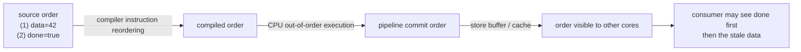

These three optimizations share one bottom line: none of them changes the behavior observable
by a single Goroutine itself. Once a second Goroutine enters the picture, "observable" needs a
cross-Goroutine set of rules to redefine it, and that set of rules is the memory model.

## 11.9.2 Strong Ordering and Weak Ordering

Let a synchronization model be a set of constraints on memory accesses, constraints that specify
how and when synchronization must be performed; then a synchronization model is said to satisfy
weak ordering with respect to hardware if and only if the hardware and all software that obeys
the synchronization model are sequentially consistent.

This definition comes from the work of Adve and Hill in 1990. Its meaning is that real hardware
by default permits the reordering of ordinary reads and writes, and only when the program
explicitly uses synchronization operations (memory barriers, atomic instructions) does it
guarantee the ordering between those synchronization points. Strongly ordered hardware is
friendlier to the programmer, while weakly ordered hardware leaves more optimization opportunity
to the compiler and the processor. The cost is thereby transferred: writing a correct concurrent
program on top of weak ordering requires the programmer to place synchronization in the right
spots.

## 11.9.3 The Data-Race-Free Paradigm

If there are two concurrent accesses to the same memory location, at least one of which is a
write, and there is no synchronization operation between them establishing an order, then a data
race occurs. A program that contains no data race in any of its executions is called
data-race-free (DRF). Modern memory models, on this basis, strike a bargain between the
software-hardware side and the programmer:

> Hardware and compiler promise: so long as a program has no data races, it will behave as if
> sequentially consistent; for programs that do contain data races, they make no promise, or
> only a limited one.

This bargain is called DRF-SC (Data-Race-Free implies Sequential Consistency). It converts the
hard problem of "understanding the weak memory model" into the relatively well-defined, and
tool-detectable, obligation of "eliminating data races." Go stands precisely on this side, and
the happens-before relation discussed later is the concrete form in which it lands.

## 11.9.4 Historical Practice

In the engineering practice of memory models, C++ is an example worth referring to. Below we use
several typical kinds of consistency to sketch this spectrum, from strong to weak.

Linearizability, also called strong consistency or atomic consistency. It requires that every
read can read the value of the most recent write to that data, and that the order of all
threads' operations is consistent with the order under a global clock.

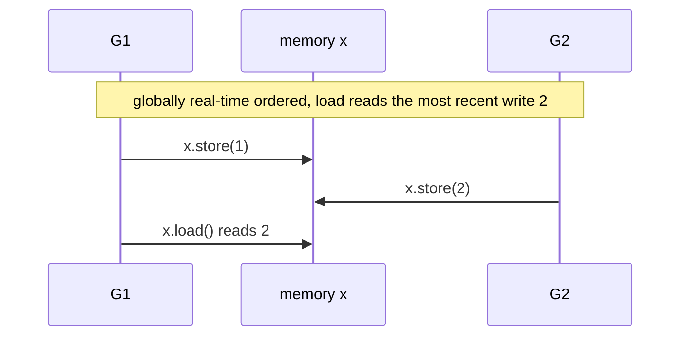

Here both writes to `x` by `G1` and `G2` are atomic, `x.store(1)` strictly happens before
`x.store(2)`, and `x.store(2)` in turn strictly happens before `x.load()`. Linearizability's
requirement of a global clock is hard to realize, and the drive to research weaker-consistency
algorithms comes mostly from here.

Sequential consistency likewise requires that every read can read the value of the most recent
write to the data, but does not require consistency with the order of a global clock.

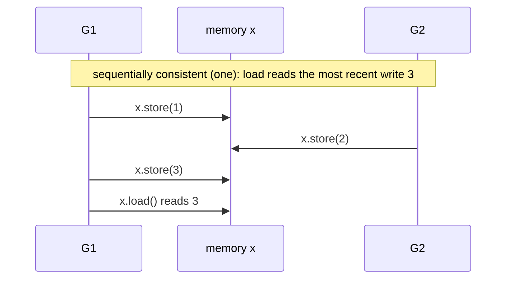

or

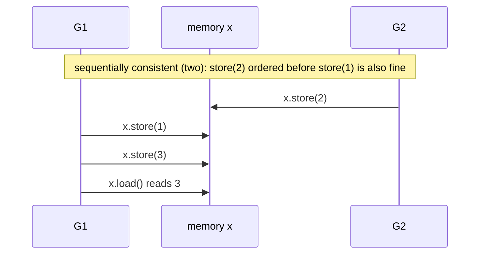

Under sequential consistency, `x.load()` must read the value of the most recent write, while
between `x.store(2)` and `x.store(1)` there is no ordering guarantee, so long as `G2`'s
`x.store(2)` is ordered before `x.store(3)`.

Causal consistency relaxes things further: it preserves order only for operations that have a
causal relationship, and imposes no requirement on operations with no causal relationship.

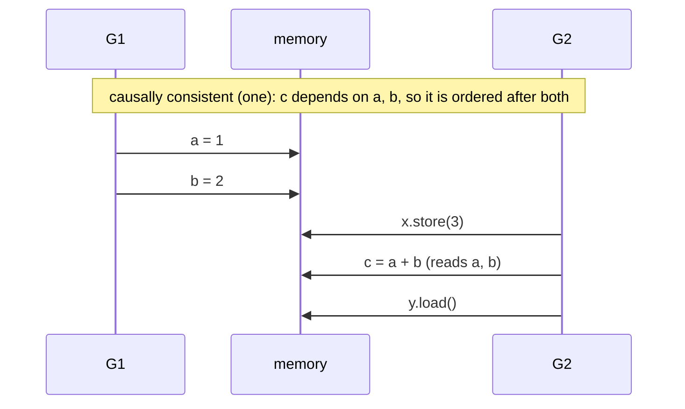

or

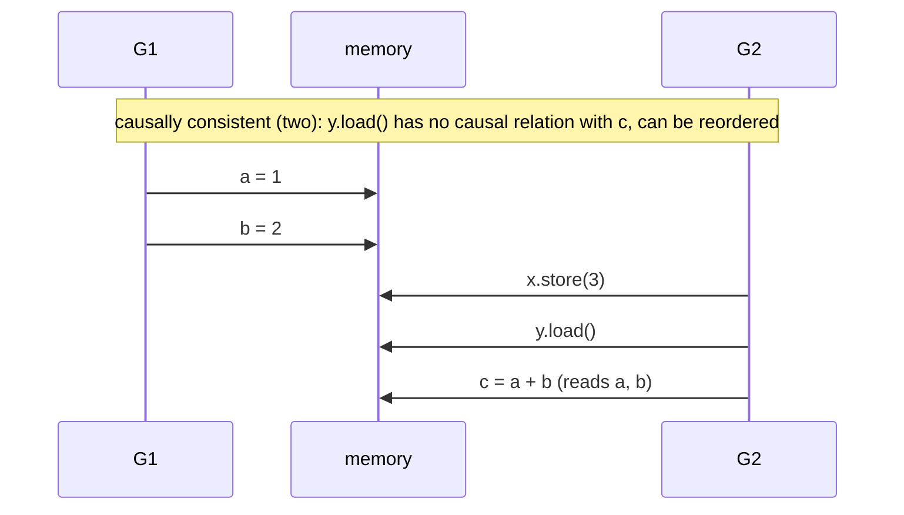

or alternatively

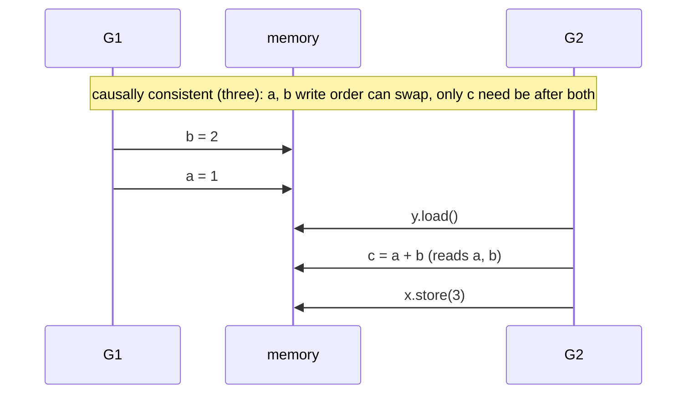

All three arrangements above satisfy causal consistency, because throughout the process only `c`
depends on `a` and `b`, while `x` and `y` are unrelated in this example (in a real scenario, to
conclude that `x` and `y` truly are unrelated often requires more information).

Eventual consistency is the weakest requirement of all. It guarantees only that some operation
will be observed at some point in the future, but does not constrain the time at which it is
observed. This one can be slightly strengthened, for example by stipulating that the time of
observation is always bounded, though that is already rather far from the topic of this section.

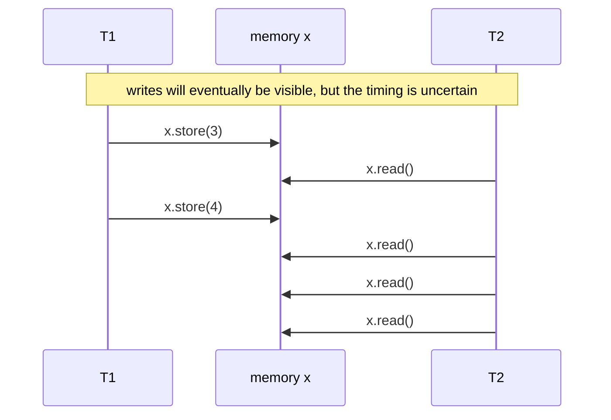

Let the initial value of `x` be 0; then the results of the four `x.read()` calls in T2 may be
any of the following, and are not limited to these:

```
3 4 4 4 // the writes to x are observed very quickly
0 3 3 4 // there is some delay before the writes to x are observed
0 0 0 4 // the last read sees the final value of x, but the earlier changes were not observed
0 0 0 0 // none of the writes to x are observed in the current period, but at some future point x will surely be observed as 4
```

## 11.9.5 Hardware Memory Models and Differences Between Chips

Return to the buggy program in 11.9.1. We said that the order of writing `data` and setting
`done` may be scrambled by the hardware. This section unpacks the catch-all term "hardware":
different chips do not make the same promises about ordering, some strict, some loose.
Understanding these differences is not so the reader can memorize them. Quite the opposite, it is
to explain why Go uses one unified model to keep them all out of sight behind it.

### First Distinguish Two Things: Cache Coherence and Memory Consistency

Among multiple cores there is a cache-coherence protocol that guarantees that, for the **same**
variable, all cores will eventually agree on "in what order these writes happen." This is often
mistaken for the memory model, but it is not. Cache coherence concerns only a single variable;
memory consistency concerns, across multiple variables, what one core's read-write order looks
like in the eyes of other cores. The former is the foundation of the latter but cannot replace it
(see the textbook by Sorin, Hill, and Wood, and the 1996 survey by Adve and Gharachorloo). What
we have to worry about is the latter.

### How the Order Gets Scrambled

Imagine that each CPU core has an outbox, the store buffer. When a core writes a variable, it
does not wait for it to actually reach memory; it drops it in the outbox and moves on to the next
task. This way the core need not stop and wait, at the cost that other cores can see this write
only after the letter in the outbox has actually been sent out. So "I write `data` first, then
write `done`" may, in others' eyes, become seeing `done` first. The receiving end has a
symmetric scene: the invalidation queue can make a core temporarily read a stale value;
out-of-order execution and speculative execution let instructions complete out of program order.
These mechanisms all serve a single purpose, making a single core run faster. They are
transparent to single-threaded code, but for multithreaded code they need rules to constrain
them.

### From Strong to Weak: Which Chip Will Your Code Run On

Lay out real hardware from strong to weak by the tightness of its constraints, and you get
roughly this spectrum.

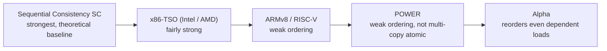

**Sequential consistency (SC)** is the theoretical baseline. It is the easiest to understand,
yet almost no commercial general-purpose CPU actually adopts it, because it requires giving up
optimizations such as the outbox, at too high a performance cost (Lamport 1979).

**x86-TSO** (Intel and AMD) sits at the strong end. It permits only one reordering: a read after
a write may complete before that write is actually sent out (store→load), and on top of this a
core can read its own outbox writes early. Apart from this, all writes take effect on all cores
simultaneously in one global order, so it is **multi-copy atomic** (Sewell et al. gave a rigorous
x86-TSO model in 2010). Concurrent code that "happens not to break" day-to-day on x86 mostly
benefits from TSO.

**ARMv8 / AArch64** falls at the weak end, where all four reorderings can happen. One detail
worth telling is that early ARMv8 was not multi-copy atomic, and Arm later revised the
architecture around 2017 to be multi-copy atomic, more precisely other-multi-copy-atomic: a core
can see its own write early, but once any write is seen by some other core, it becomes visible to
all other cores at the same time. This revision made the model considerably simpler (Pulte et al.
2018).

**POWER** (IBM) is likewise weakly ordered, and is **not** multi-copy atomic: two writes may be
seen in different orders by different readers. This is precisely its biggest divergence from
revised ARMv8 (Sarkar et al. 2011).

**DEC Alpha** is the historical oddity. It is loose enough to reorder even loads with an address
dependency: even when `p` is a pointer just read out, `*p` may read content older than `p`. The
Linux kernel set up a dedicated `read_barrier_depends` barrier for this (a no-op on all other
architectures), later folded it into `READ_ONCE` (v4.15), and finally removed this explicit
interface (v11.9).

**RISC-V**'s default model RVWMO is weakly ordered, and the specification also defines an optional
Ztso extension, providing stronger ordering for implementations that need TSO.

| Model | Allowed reorderings | Multi-copy atomic | Representative platforms |
| --- | --- | --- | --- |
| Sequential consistency SC | none | yes | theoretical baseline |
| x86-TSO | only store→load (incl. outbox forwarding) | yes | Intel, AMD |
| ARMv8 (revised) | all four | yes | Arm mobile / server |
| POWER | all four | no | IBM POWER |
| Alpha | all four, and dependent loads can also be reordered | no | DEC Alpha (historical) |
| RISC-V RVWMO | all four (optional Ztso provides TSO) | see text | RISC-V |

### Giving Hardware a Checkup: Litmus Tests

How do you judge which reorderings a chip actually permits? Researchers use a group of very small
concurrent programs to perform the checkup, called litmus tests. Each test is only a handful of
lines, yet it can precisely force out one particular reordering. A few of the most common are as
follows.

| Test | Shape | What it probes | Models where the counterintuitive result appears |
| --- | --- | --- | --- |
| SB store buffering | two threads each write first, then read the other's variable | store→load and the outbox | x86-TSO, ARMv8, POWER, RISC-V (only SC forbids) |
| MP message passing | one side writes data then sets a flag, the other reads data after seeing the flag | store→store and load→load | ARMv8, POWER, RISC-V (SC, x86-TSO forbid) |
| LB load buffering | two threads each read first, then write | load→store | ARMv8, POWER, RISC-V (SC, x86-TSO forbid) |
| IRIW independent reads of independent writes | two writers and two readers, asking whether the readers agree on the order of the two writes | multi-copy atomicity | POWER, pre-revision ARM (SC, x86-TSO, revised ARMv8 forbid) |
| dependent load | MP, with the reader dereferencing the loaded pointer | whether address dependencies are ordered | only Alpha |

Among these, IRIW is especially key: it specifically probes multi-copy atomicity, cleanly
separating POWER and pre-revision ARM, which can diverge, from SC, x86-TSO, and revised ARMv8,
which do not. And the dependent-load item is set up almost solely for Alpha.

> To go one step deeper: the models above are not verbal agreements but have been written into
> machine-checkable forms. There are two roads to modeling hardware. One is operational,
> describing an abstract machine with outboxes and queues executing step by step; the other is
> axiomatic, treating one execution as a relation graph between events and constraining which
> outcomes are legal with a few acyclicity conditions. Alglave, Maranget, and Tautschnig's
> *Herding Cats* (2014) gives a unified axiomatic framework, and the accompanying herd, litmus,
> and diy tools can both simulate on the model and run litmus tests on real chips, and have even
> uncovered implementation defects in ARM hardware through this. This line of work is the
> methodological source of today's official Arm and RISC-V memory models.

### What This Means for Go

Reading this far, the reader may grow a little uneasy: must one memorize all these differences to
write concurrency correctly? The answer is exactly the opposite.

Go supports many architectures including amd64, arm64, ppc64, and riscv64, which sit at different
positions on the spectrum above. Go's promise is that, whatever the underlying one is, the same Go
memory model holds. The compiler and runtime are what deliver it: on each target architecture they
generate the corresponding barriers and atomic instructions, absorbing the strong-weak differences
of the hardware. In other words, the "trade data-race-freedom for sequential consistency" bargain
of 11.9.3 is delivered precisely by the toolchain at this layer. The reader needs to face only one
model; the clamor of the chips never reaches your code. This is the meaning of the memory model's
existence.

## 11.9.6 The Language-Level Memory Model and the Lessons of Industry

The previous section was about hardware. But even running code on a fairly strong chip like x86,
it may still break, because above the hardware there is another role that alters order: the
compiler. The compiler's optimizations are all built on the premise of "not changing
single-threaded observable behavior," and it knows nothing of multiple threads. Hoisting the read
of `done` out of the loop, keeping a variable in a register for a long stretch, reordering
independent reads and writes for the sake of optimization: these transformations, entirely correct
for a single thread, are enough to break the program in 11.9.1. So a hardware memory model alone is
not enough; we also need a layer of the language's own memory model to bring the compiler under
constraint as well.

The language-level memory model is surprisingly hard to get right. It must placate two demands
that pull against each other: give the programmer a semantics that can be reasoned about, while not
shutting off the optimizations of compiler and hardware. Industry's answer is precisely the DRF-SC
contract discussed in 11.9.3, whose idea can be traced back to Adve and Hill's 1990 definition of
weak ordering. But writing this contract into an actual language has, history shows, been a string
of trial and error.

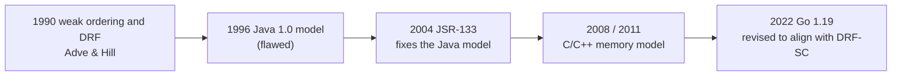

The most famous cautionary tale is Java. The first version of the memory model released with Java
1.0 in 1996 was flawed: volatile variables did not carry synchronization semantics and could not be
used to establish ordering for the surrounding ordinary accesses; final fields could still appear to
change in the eyes of other threads, defeating the very purpose of immutable objects; and the model
also permitted some absurd, causality-violating results. The Java community spent several years and,
through JSR-133, only got it redone in Java 5 (2004): centered on happens-before, giving final fields
a clear visibility guarantee (on the premise that `this` does not escape during construction),
guaranteeing sequential consistency for data-race-free programs, and defining a bounded,
non-causality-violating semantics for programs with races (Manson, Pugh, and Adve 2005). The lesson
of this history is plain: a memory model is extremely hard to get right the first time, and even Java
got a version wrong first.

C and C++, in their 2011 standards, introduced a more fine-grained model, whose theoretical
foundation is the 2008 work of Boehm and Adve. It splits atomic operations into several memory-order
tiers: sequential consistency (`seq_cst`), acquire and release (`acquire`/`release`), and relaxed
(`relaxed`), plus an even weaker-intentioned `consume`. This mechanism is extremely powerful, able to
hug the hardware and squeeze out performance, and also extremely hard to use correctly. C/C++ also
took the stance of "sequential consistency if no data race, otherwise nothing at all": any data race
is undefined behavior.

> A difficulty still unsolved to this day: relaxed atomics bring about so-called out-of-thin-air
> (OOTA) values. The standard wants to forbid such self-justifying, conjured-from-nothing results,
> yet finds that any sufficiently strict prohibition incidentally forbids the optimizations people
> want. To this day, the C++ standard can give only a non-normative "recommendation," unable to
> produce a precise definition (see WG21 document P1217). Relatedly, `memory_order_consume`, because
> no compiler can implement it to spec (implementations all degrade it into `acquire`), has been
> officially discouraged (P0371). This corner is the acknowledged hardest bone in the memory-model
> field, and we will return to it in [11.9.9](#1199-frontiers-and-open-problems).

Despite differing in detail, C, C++, Java, JavaScript, Rust, Swift, and Go ultimately converge on the
same promise: data-race-free programs are sequentially consistent. Their divergence lies in how they
treat programs with races. C and C++ choose undefined behavior, where the compiler may do anything;
Java, JavaScript, and Go confine the result to a bounded range. Go stands on the latter side,
explicitly refusing undefined behavior: even when a program is written wrongly, the behavior is
bounded and debuggable. Carrying these lessons of industry, we can now look at Go's own memory model
and read the origin of each of its choices.

## 11.9.7 The Happens-Before Relation

Go's Goroutines run concurrently atop multiple parallel threads, and what its memory model must
answer is precisely **for a given Goroutine, after a variable is written, under what conditions it is
sure to be read**. To this end, the model introduces an event ordering, defining **happens before**,
to characterize a partial order among memory operations in a Go program.

We may use $<$ to denote happens before; then if event $e_1 < e_2$, we have $e_2 > e_1$; and if
$e_1 \not< e_2$ and $e_2 \not< e_1$, we say $e_1$ and $e_2$ happen concurrently. Within a single
Goroutine, the happens-before order is the order defined by the program.

We describe the concept of a partial order in a slightly academic way. Happens before is a strict
partial order, a binary relation satisfying the three properties of irreflexivity, asymmetry, and
transitivity. Let the set of all events be $E$; then for $<$ we have:

1. irreflexivity: $\forall e \in E,\ \lnot\,(e < e)$;
2. asymmetry: $\forall e_1, e_2 \in E,\ (e_1 < e_2) \Rightarrow \lnot\,(e_2 < e_1)$;
3. transitivity: $\forall e_1, e_2, e_3 \in E,\ (e_1 < e_2) \wedge (e_2 < e_3) \Rightarrow (e_1 < e_3)$.

This partial order over event timing looks, at first glance, as if it concerns only the concurrency
model and has nothing to do with memory. The reason it is called a memory model is precisely that it
is tightly bound to memory: the partial order in timing between concurrent operations is exactly what
defines the visibility of memory operations.

Since Go 1.19, the memory model breaks this partial order down more finely, to make it possible to
discuss visibility rigorously. It decomposes happens before into the transitive closure of the union
of two more basic relations:

- *sequenced before* (program order): the partial order specified by the language spec for control
  flow and expression evaluation within a single Goroutine;
- *synchronized before* (synchronization order): derived from a mapping `W`. `W` indicates, for each
  read-type operation, which write-type operation it reads from; when a synchronizing read `r`
  observes a synchronizing write `w` (that is, `W(r) = w`), we say `w` is synchronized before `r`.

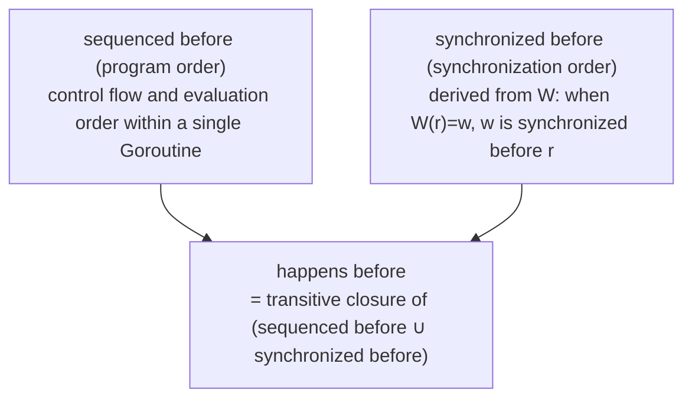

Visibility is decided on this basis: an ordinary read `r` can read a certain write `w` provided that
`w` happens before `r`, and there is no other write `w'` to the same location such that `w` happens
before `w'` happens before `r`. In other words, what `r` reads is the write nearest to it in the
happens-before order that has not been overwritten by a later write. When that location has no data
race, such a `w` is uniquely determined, and the program's result can then be explained by some
sequentially consistent interleaved execution, which is exactly the DRF-SC of 11.9.3 (whose proof
agrees with the C++ memory-model framework proposed by Boehm and Adve at PLDI 2008).

The compiler and CPU usually produce various optimizations that affect the execution order the
program originally defined, and these include: the compiler's instruction reordering, and the CPU's
out-of-order execution. Beyond this, because of caching, under a multi-core CPU a write result on one
CPU core occurs only in that core's nearest cache, and to be read by another CPU it must wait for
memory to be swapped back to a lower-level cache and then swapped to the other core before it can be
read.

The happens before in Go (expressed after 1.19 as synchronized before) gives the following
guarantees:

1. Initialization: the completion of an imported package's `init` < the start of the importing party's
   `init`; the completion of all `init` < the start of `main.main`;
2. Goroutine creation: the `go` statement < that Goroutine beginning to execute;
3. Goroutine destruction: a Goroutine's exit forms no guaranteed ordering with any event;
4. channel: a send < the completion of the corresponding receive (holds for any channel);
5. channel: `close(ch)` < a receive that returns the zero value because the channel is closed;
6. channel: for an unbuffered channel, a receive < the completion of the corresponding send;
7. channel: for a buffered channel of capacity $C$, the $k$-th receive < the completion of the
   $k+C$-th send;
8. mutex: for a lock `l` and $n < m$, the $n$-th `l.Unlock()` < the return of the $m$-th `l.Lock()`;
9. mutex: for `l.RLock`, there exists an $n$ such that it returns after the $n$-th `l.Unlock`, and the
   matching `l.RUnlock` < the return of the $n+1$-th `l.Lock`;
10. once: the completion of `f()` within `once.Do(f)` < the return of any `once.Do(f)`;
11. atomic: if the effect of atomic operation A is observed by atomic operation B, then A < B, and all
    atomic operations have a sequentially consistent total order.

Item 11 is a formal clause newly added in the 1.19 revision. Before that, the memory order of
`sync/atomic` had long had no explicit promise, which is one of the backgrounds of the revision the
next section discusses.

So over the more than a decade of Go's development, has the design of the memory model been settled?

## 11.9.8 The Evolution of the Design

To answer this question, we must return to the road the Go memory model has traveled. How it took
shape step by step is as worth knowing as today's text.

The earliest Go memory model document came out alongside the language specification and set up only a
single happens-before relation, paired with a few rules for init, goroutine, channel, mutex, once, and
so on. The direction was right, and simple enough, yet it left several gaps. First, the semantics of
atomic operations were left hanging, `sync/atomic` long had no formal memory-order promise, and the
early documentation even advised against using atomic for synchronization, while library authors who
needed lock-free data structures in fact had to rely on an undocumented contract all along. Second, a
single happens-before relation could neither rigorously characterize the behavior under races nor align
with the real behavior of hardware and compiler. Third, whether a pattern such as double-checked locking
was legal lacked any clear statement on which to base a judgment.

In 2021, Russ Cox published the three long essays in the *Memory Models* series, in order *Hardware
Memory Models*, *Programming Language Memory Models*, and *Updating the Go Memory Model*,
systematically tracing the origins and lessons of the hardware and the C/C++ and Java memory models,
and discussing the direction of Go's revision. The companion to it was proposal golang/go#50590.

In 2022, with Go 1.19, this revision formally landed, with the document version marked "Version of June
6, 2022."

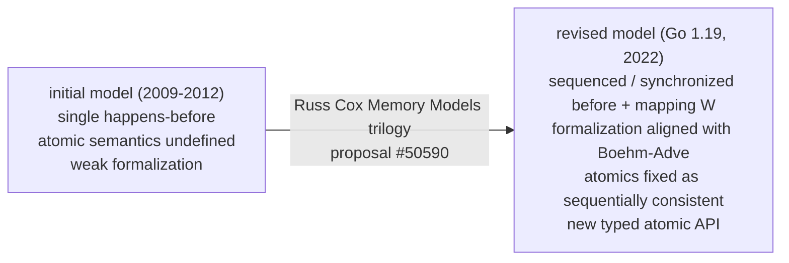

The revision touched three places. First, it reorganized the vocabulary and formalization, splitting
the single happens before into sequenced before and synchronized before, demoting happens before to the
transitive closure of the union of the two, with the whole formalization aligned to the Boehm-Adve
framework, taking DRF-SC as the goal, and declaring alignment with the DRF-SC guarantees of C, C++,
Java, JavaScript, Rust, and Swift. Second, it formally fixed the memory order of atomic operations,
nailing `sync/atomic` down as sequentially consistent atomics, with semantics aligned to C++'s SC
atomics and Java's `volatile`, by which library authors gained an explicit contract. Third, it added a
typed atomic API (Go 1.19, proposal #50860), namely
`atomic.Int32/Int64/Uint32/Uint64/Bool/Pointer[T]/Uintptr/Value`, encoding "this field must be accessed
atomically" into the type, which both reduces the hazard of missing an atomic access elsewhere when
using bare `atomic.AddInt64(&x, …)` and guarantees memory alignment.

This revision did not change the observable behavior of Go programs, nor did it loosen or tighten the
promise to users. What it did was write a contract long quietly obeyed into rigorous and verifiable
text. Implementations will change, but the written-out design rationale can endure.

## 11.9.9 Frontiers and Open Problems

Go's memory model is, in engineering terms, already settled, and to use it day-to-day one need not read
any further down. But the science beneath this contract is far from finished. This section, for the
interested reader, sketches a few frontiers of memory-model research. Most are still academic proposals
and have not entered any language standard.

What cannot be avoided is still the out-of-thin-air (OOTA) problem mentioned in the previous section.
How to give relaxed atomics a semantics that both forbids out-of-thin-air values and does not hinder
optimization is the hardest core this field has had for years. Around it, several representative routes
have appeared over the last decade.

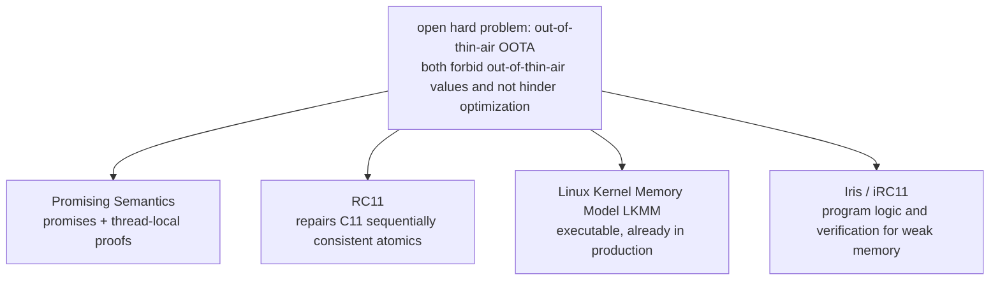

One route is Promising Semantics (Kang et al. 2017). It allows a thread to first make a promise about
some future write, letting other threads read it early, but each promise must come with a thread-local
proof showing that this write would eventually be produced even without the promise, thereby sealing off
the loop of self-justification. It is considered the first model to simultaneously achieve "forbidding
OOTA" and "preserving optimization"; the later Promising 2.0 (2020) made up for several global
optimizations it originally could not support. It must be stressed that this is a research proposal and
has not been adopted by any standard.

Another route is to repair the existing standard. Lahav et al. pointed out in 2017 that the semantics of
sequentially consistent atomics in C11 are flawed, and compiling to POWER per the standard's scheme is
even unsound; the RC11 they proposed fixed this point and preserved DRF-SC. Today's academic work mostly
takes RC11 as the baseline model of C11.

Some have also built the model directly into engineering. The Linux Kernel Memory Model (LKMM, Alglave et
al. 2018) is a formal model that can be executed by tools, written in cat/herd, covering `READ_ONCE`,
various barriers, and even RCU, lying for real in the kernel source tree (`tools/memory-model`) for kernel
developers to check their own concurrent code with litmus tests. It is one of the few memory models that
have walked from paper into production.

There is also a route of building a machine-checkable proof system for weak-memory programs. From GPS
(2014) to iRC11 based on the Iris framework, researchers have brought separation logic, ghost state, and
protocols into weak memory, able to formally verify the correctness of concurrent libraries, and in the
process discovered a data race in the `Arc` of the Rust standard library.

Putting these together yields a plain but forceful conclusion: on the matter of memory models, even the
top researchers are still wrestling with its foundational parts. The reason Go gives only a simple model,
and one that exposes sequentially consistent atomics alone, has precisely the difficulty of this
discipline as its footnote. In the next section we lay out the engineering trade-offs behind this
simplicity, along with Go's advice to its users.

## 11.9.10 Engineering Trade-offs and Advice

The most design-revealing stroke in Go's memory model is that it hands users only sequentially
consistent atomics and does not expose weakly ordered ones. C++ offers a full set of tiers,
`memory_order_relaxed/acquire/release/seq_cst`, able to squeeze hardware performance to the limit, at the
cost of handing the hard task of "understanding the weak memory model" to application developers as is,
where the slightest carelessness leads to error. Go's judgment is that for most programs the performance
of SC atomics is already enough, and the reasonability it buys is worth more than that bit of peak
performance. This is consistent with Go's orientation in scheduling, garbage collection, and elsewhere:
ceding a controllable amount of performance in exchange for simple and dependable semantics.

So over the more than a decade of Go's development, has the design of the memory model truly been solved?
The answer is a cautious one. Go did not chase the strongest or fastest model, but chose a point where the
user is least likely to err and planted itself there. So Go's advice to its users can be reduced to a
single line: do not try to be clever. In practice it comes down to one thing: use synchronization
primitives to eliminate data races, use channels where channels will do, use `sync` and `sync/atomic`
where you must share memory, and keep checking with `-race`.

To help the reader feel firsthand the counterintuitive scene that the store buffer brings about in
11.9.1, below is an interactive demo. It simulates a result the memory model permits. Note that JavaScript
is sequentially consistent and single-threaded and does not trigger real hardware reordering, so this is
illustrative only; if your runtime does not support scripts, reading the textual description above is
enough.

<div class="reorder-sandbox" style="border:1px solid #ccc;border-radius:8px;padding:12px;margin:12px 0;font-size:14px;">
  <div style="display:flex;gap:24px;flex-wrap:wrap;">
    <div>
      <strong>Core 1 (producer)</strong>
      <pre style="margin:6px 0;">data = 42   enters store buffer
done = true not yet flushed to memory</pre>
    </div>
    <div>
      <strong>Core 2 (consumer)</strong>
      <pre style="margin:6px 0;">while(!done){}
print(data)</pre>
    </div>
  </div>
  <div style="margin:8px 0;">
    <button type="button" class="rs-step" style="padding:4px 10px;">Step</button>
    <button type="button" class="rs-reset" style="padding:4px 10px;">Reset</button>
  </div>
  <div class="rs-log" style="font-family:monospace;white-space:pre-wrap;background:#f6f8fa;padding:8px;border-radius:6px;min-height:6em;"></div>
</div>

<script>
(function () {
  document.querySelectorAll(".reorder-sandbox").forEach(function (box) {
    var log = box.querySelector(".rs-log");
    var steps = [
      "Initial: memory data=0, done=false.",
      "Core 1: flushes done=true out of the store buffer first (no dependency on the data write).",
      "Core 2: reads done=true and breaks out of the loop.",
      "Core 2: reads data. At this moment data=42 still lingers in Core 1's store buffer, so it reads the stale value 0.",
      "Core 1: data=42 only now flushes to memory, too late.",
      "Conclusion: with no synchronization order, the consumer printed 0 instead of 42. One channel send-receive is enough to avoid it."
    ];
    var i = 0;
    function render() {
      log.textContent = steps.slice(0, i).map(function (s, k) {
        return (k + 1) + ". " + s;
      }).join("\n");
    }
    box.querySelector(".rs-step").addEventListener("click", function () {
      if (i < steps.length) { i++; render(); }
    });
    box.querySelector(".rs-reset").addEventListener("click", function () {
      i = 0; render();
    });
    render();
  });
})();
</script>

## Further Reading

1. The Go Authors. *The Go Memory Model* (Version of June 6, 2022).
   https://go.dev/ref/mem
2. Russ Cox. *Memory Models* (series, 2021): *Hardware Memory Models*,
   *Programming Language Memory Models*, *Updating the Go Memory Model*.
   https://research.swtch.com/mm
3. Hans-J. Boehm and Sarita V. Adve. "Foundations of the C++ Concurrency Memory Model."
   *PLDI 2008*.
4. Leslie Lamport. "Time, Clocks, and the Ordering of Events in a Distributed System."
   *Communications of the ACM*, 21(7), 1978.
5. Leslie Lamport. "How to Make a Multiprocessor Computer That Correctly Executes
   Multiprocess Programs." *IEEE Transactions on Computers*, C-28(9), 1979.
6. Sarita V. Adve and Kourosh Gharachorloo. "Shared Memory Consistency Models:
   A Tutorial." *IEEE Computer*, 29(12), 1996.
7. Sarita V. Adve and Mark D. Hill. "Weak Ordering: A New Definition." *ISCA 1990*.
8. Jeremy Manson, William Pugh, and Sarita V. Adve. "The Java Memory Model." *POPL 2005*.
9. Peter Sewell, Susmit Sarkar, Scott Owens, Francesco Zappa Nardelli, Magnus O. Myreen.
   "x86-TSO: A Rigorous and Usable Programmer's Model for x86 Multiprocessors."
   *Communications of the ACM*, 53(7), 2010. https://doi.org/10.1145/1785414.1785443
10. Christopher Pulte, Shaked Flur, Will Deacon, Jon French, Susmit Sarkar, Peter Sewell.
    "Simplifying ARM Concurrency: Multicopy-atomic Axiomatic and Operational Models for
    ARMv8." *POPL 2018*. https://doi.org/10.1145/3158107
11. Susmit Sarkar, Peter Sewell, Jade Alglave, Luc Maranget, Derek Williams.
    "Understanding POWER Multiprocessors." *PLDI 2011*.
    https://doi.org/10.1145/1993498.1993520
12. Jade Alglave, Luc Maranget, Michael Tautschnig. "Herding Cats: Modelling, Simulation,
    Testing, and Data Mining for Weak Memory." *ACM TOPLAS*, 36(2), 2014.
    https://doi.org/10.1145/2627752 ; herd / litmus / diy tools: http://diy.inria.fr
13. Daniel J. Sorin, Mark D. Hill, David A. Wood. *A Primer on Memory Consistency and
    Cache Coherence.* Morgan & Claypool, 2011 (2nd ed. 2020).
14. Sarita V. Adve and Hans-J. Boehm. "Memory Models: A Case for Rethinking Parallel
    Languages and Hardware." *Communications of the ACM*, 53(8), 2010.
    https://doi.org/10.1145/1787234.1787255
15. Hans-J. Boehm et al. "P1217: Out-of-thin-air, revisited, again." WG21, 2019.
    https://www.open-std.org/jtc1/sc22/wg21/docs/papers/2019/p1217r2.html ;
    "P0371: Temporarily discourage memory_order_consume." WG21, 2016.
16. Jeehoon Kang, Chung-Kil Hur, Ori Lahav, Viktor Vafeiadis, Derek Dreyer.
    "A Promising Semantics for Relaxed-Memory Concurrency." *POPL 2017*.
    https://doi.org/10.1145/3009837.3009850 ; Promising 2.0: *PLDI 2020*.
17. Ori Lahav, Viktor Vafeiadis, Jeehoon Kang, Chung-Kil Hur, Derek Dreyer.
    "Repairing Sequential Consistency in C/C++11." *PLDI 2017*.
    https://doi.org/10.1145/3062341.3062352
18. Jade Alglave, Luc Maranget, Paul E. McKenney, Andrea Parri, Alan Stern.
    "Frightening Small Children and Disconcerting Grown-ups: Concurrency in the Linux
    Kernel." *ASPLOS 2018*. https://doi.org/10.1145/3173162.3177156
19. Hoang-Hai Dang, Jacques-Henri Jourdan, Jan-Oliver Kaiser, Derek Dreyer.
    "RustBelt Meets Relaxed Memory." *POPL 2020*. https://doi.org/10.1145/3371102
    (iRC11; building on Turon et al. GPS, *OOPSLA 2014*)
20. Go proposal #50590 (*Go Memory Model clarifications*);
    proposal #50860 (*typed atomic types in sync/atomic*).
