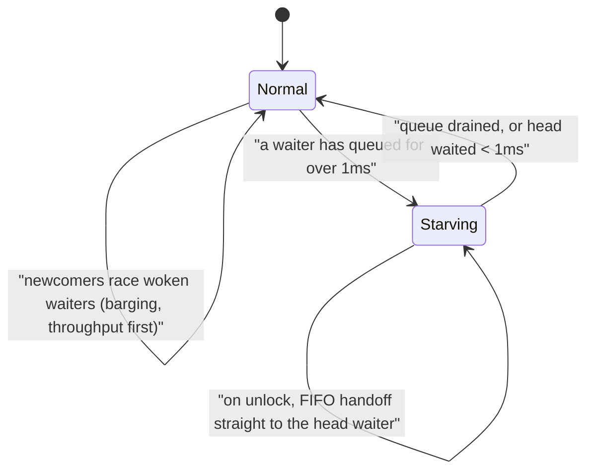

# 11.2 Mutex

`sync.Mutex` is the most basic synchronization primitive: it lets only one goroutine enter the
critical section at a time. Beneath that plain interface, it keeps weighing two goals that pull
against each other, **throughput** (hand the lock to someone as quickly as possible, do not let the
CPU sit idle) and **fairness** (do not let some unlucky waiter wait in line forever). The two cannot
both be maxed out: handing the lock off in strict arrival order is the fairest, but pays a context
switch on every handoff; letting a just-woken waiter compete freely with whoever is running is the
fastest, but can leave some waiter losing out again and again. This section first lays out the theory
and the hardware foundations of the old problem of mutual exclusion, then looks at how Go's mutex
walks this tightrope.

## 11.2.1 The Mutual Exclusion Problem and Its Hardware Foundation

Mutual exclusion is one of the earliest topics in concurrency theory. Dijkstra formalized the
"mutual exclusion problem" in 1965 and gave the first software solution that lets several processes
take turns entering the critical section using only ordinary reads and writes, with no special
hardware instructions. Later, Lamport's 1974 **bakery algorithm** carried this road to a beautiful
conclusion: each thread that wants to enter the critical section first "takes a number," then enters
in ascending order of numbers. This guarantees both mutual exclusion and first-come-first-served fair
queuing, all using only ordinary reads and writes, with no atomic read-modify-write instructions
needed.

A pure software solution is self-sufficient in theory but expensive in practice: the bakery algorithm
has to scan the numbers of all threads, so its cost grows with the thread count, and it relies
heavily on a sequentially consistent memory model ([11.9](./mem.md)), needing extra barriers on
modern weakly-ordered hardware. Modern locks therefore no longer take the pure software road. Instead
they stand directly on the **atomic read-modify-write** instructions the hardware provides:
compare-and-swap (CAS), fetch-and-add, and so on ([11.3](./atomic.md)). A single CAS atomically does
what the bakery algorithm needs several steps to simulate; once the foundation changes, the upper
design changes with it.

Around these primitives, locks have grown into a family, and understanding it helps make clear where
Go's mutex stands.

- The **spin lock** is the simplest: it retries a CAS over and over, entering once it wins and busy
  spinning in place to retry when it loses. It is nearly free under low contention but a disaster
  under high contention: several cores fight over the same lock variable, and every CAS makes that
  cache line repeatedly invalidate and re-fetch across cores, called **cache-line bouncing**, and the
  more contenders the worse it gets.
- The **ticket lock** uses fetch-and-add to issue numbers, then has each thread spin until its number
  is called, which restores FIFO fairness. But all waiters still spin on the same "now serving"
  variable, so the old cache-line bouncing problem is not eliminated.
- The **MCS lock** (Mellor-Crummey and Scott, 1991) is a classic among highly scalable locks. It has
  each waiter link itself into an **explicit queue** and spin on **its own** local variable, and when
  the previous lock holder releases, it only writes to that one local variable of its successor. As a
  result, no matter how many contenders there are, each handoff touches just one cache line, and the
  cache traffic under contention drops to a constant.

All of the above belong to the "busy wait" lineage, where waiters hold the CPU spinning. Another line
makes "sleep wait" cheap. In early days a thread could only block by trapping into the kernel, paying
the cost of a system call even when the lock had no contention at all. Linux's **futex** (fast
userspace mutex, Franke, Russell, and Kirkwood, 2002) solved this pain point: with no contention,
locking and unlocking happen entirely in userspace with a single atomic operation, and only when a
waiter really must be blocked or woken does it trap into the kernel with that userspace address to
queue up. Almost all modern userspace locks, including Go's mutex, stand on this "fast in userspace,
kernel as backstop" foundation of futex (and its equivalents on each platform). Go does not call
futex directly. Instead the runtime's semaphore (`runtime_SemacquireMutex` / `runtime_Semrelease`)
wraps the low-level blocking primitive of each platform and presents a uniform interface upward.

## 11.2.2 The State Word and the Fast Path: Nearly Zero Cost Without Contention

Go's mutex compresses a lock into two fields: a state word plus a semaphore.

```go
type Mutex struct {
    state int32  // bit field: bit0 locked, bit1 a woken waiter, bit2 starvation mode, remaining high bits waiter count
    sema  uint32 // semaphore used to block / wake waiters
}

const (
    mutexLocked      = 1 << iota // bit0: whether locked
    mutexWoken                   // bit1: whether a waiter has been woken and is racing for the lock
    mutexStarving                // bit2: whether in starvation mode
    mutexWaiterShift = iota      // = 3, the high bits state>>3 record the waiter count
    starvationThresholdNs = 1e6  // 1ms: the waiting threshold for switching into starvation mode
)
```

Packing several pieces of information into the same `int32` lets a single atomic operation read and
modify all the key state of the lock at once: whether it is locked, whether there is a woken waiter,
whether it is starving, and how many waiters there are. The low three bits are flags, the high bits
are the waiter count, and adding or removing one waiter is just adding or subtracting
`1<<mutexWaiterShift` to `state`. This bit-field encoding lets the fast path of locking degenerate
into a single CAS on one integer.

When no one is contending, locking just atomically changes `state` from 0 (unlocked, no waiters) to
`mutexLocked`:

```go
func (m *Mutex) Lock() {
    if atomic.CompareAndSwapInt32(&m.state, 0, mutexLocked) {
        return // fast path: one CAS succeeds, never entering the kernel
    }
    m.lockSlow() // a failed CAS means contention, switch to the slow path
}
```

This fast path does not enter the kernel and does not sleep. It is the key to why the mutex stays
light even though it is used at high frequency, and the vast majority of locks and unlocks end right
here. Only when the CAS fails, meaning the lock is held or there is already a waiter, do we fall into
the slow path `lockSlow`. Unlocking takes the symmetric fast path: clear the `mutexLocked` bit, and if
`state` ends up exactly 0 (no waiters, no other flags), everything is done, without even entering
`unlockSlow`.

## 11.2.3 The Slow Path: Spin First, Then Sleep

When contention happens, the goroutine does not go to sleep right away. Sleeping and waking both have
to deal with the runtime and are far from cheap, while a lock is often held only briefly and released
soon. So `lockSlow` first **spins** a few rounds, betting that the lock will free up soon, and if the
bet wins it saves a whole round of sleep and wake.

Spinning has strict admission conditions, and failing any one of them means giving up spinning and
going to sleep:

```go
func (m *Mutex) lockSlow() {
    var waitStartTime int64
    starving, awoke, iter := false, false, 0
    old := m.state
    for {
        // Only spin when "locked and not in starvation mode" and the runtime judges it worth spinning
        if old&(mutexLocked|mutexStarving) == mutexLocked && runtime_canSpin(iter) {
            // Before spinning, set a mutexWoken flag to tell Unlock it need not wake anyone else
            if !awoke && old&mutexWoken == 0 && old>>mutexWaiterShift != 0 &&
                atomic.CompareAndSwapInt32(&m.state, old, old|mutexWoken) {
                awoke = true
            }
            runtime_doSpin() // execute a number of PAUSE instructions
            iter++
            old = m.state
            continue
        }
        // ...the spin condition no longer holds: compute the new state, CAS to enqueue, block on the semaphore and sleep (details below)
    }
}
```

`runtime_canSpin` keeps "worth spinning" tight: it must be a multi-core machine, the spin count must
not exceed the cap (4 by default), and there must be no other goroutine waiting to run in the local
run queue. In other words, we spin only when "the lock is very likely to be acquired soon, and
spinning will not starve others"; once the lock is in starvation mode, or the spin count is exhausted,
we honestly hang ourselves on the semaphore `sema` and sleep, to be woken when the lock holder
unlocks. This "spin on short waits, sleep on long waits" hybrid strategy is not unique to Go.
pthread's adaptive mutex (`PTHREAD_MUTEX_ADAPTIVE_NP`), Java's biased / lightweight locks,
parking_lot, and others all take the same approach, differing only in the thresholds for how long to
spin and when to give up.

## 11.2.4 Fairness: Normal Mode and Starvation Mode

The most skillful piece of the mutex's design is the two modes introduced in Go 1.9. They correspond
to the two ends of the tightrope from 11.2.1: one end pursues throughput, the other holds onto
fairness.



**Normal mode** pursues throughput. Waiters queue in FIFO, but a just-woken waiter does not directly
get the lock. It has to compete for the same lock with the **newcomer** that is currently running and
also wants to lock. The newcomer has a natural advantage: it is already running on the CPU and need
not go through a wake-up, while the woken waiter has just climbed out of sleep and has not really been
scheduled yet. So the newcomer often "barges" in and grabs the lock. Barging reduces context switches
and significantly improves throughput, at the cost that the woken waiter who lost the race may be
pushed back to the head of the queue over and over, losing out time after time, and fall into
starvation.

To backstop the tail latency of this worst case, the mutex introduces **starvation mode**. When some
waiter's wait time from enqueue to acquiring the lock exceeds **1ms** (`starvationThresholdNs`) and it
still has not succeeded, it switches the mutex into starvation mode the moment it gets the lock. From
then on the rules invert: on unlock, no one is allowed to barge, and instead the lock's ownership is
**handed off straight to the head waiter in FIFO order** (on unlock the `mutexLocked` bit is not even
set, and the waiter who receives the handoff sets it after waking); a newly arrived goroutine, even if
it sees the lock "looking empty," does not try to acquire it and does not spin, but honestly lines up
at the tail. Once the queue drains, or the head waiter this time waited less than 1ms, the mutex
switches back to normal mode.

This mechanism incidentally resolves a question the reader often has: [if unlocking wakes the FIFO
head waiter, why can waiters still
starve](https://github.com/golang-design/under-the-hood/issues/80)? The key is that in normal mode,
"waking" is not the same as "handing off the lock." After `unlockSlow` earns the right to "wake one
person," the one it wakes is indeed the head waiter, but after waking it still has to compete anew
with newcomers. Being woken is only a ticket to the race, not the lock itself:

```go
func (m *Mutex) unlockSlow(new int32) {
    if new&mutexStarving == 0 {
        // normal mode
        old := new
        for {
            // no waiters, or someone has already been woken / grabbed the lock / it is already starvation mode, so no need to wake anyone
            if old>>mutexWaiterShift == 0 ||
                old&(mutexLocked|mutexWoken|mutexStarving) != 0 {
                return
            }
            // earn the right to "wake one person": decrement the waiter count, set mutexWoken
            new = (old - 1<<mutexWaiterShift) | mutexWoken
            if atomic.CompareAndSwapInt32(&m.state, old, new) {
                runtime_Semrelease(&m.sema, false, 1) // wake the head waiter, but it still has to race for the lock
                return
            }
            old = m.state
        }
    } else {
        // starvation mode: hand ownership straight to the head waiter, handoff=true means FIFO handoff
        runtime_Semrelease(&m.sema, true, 1)
    }
}
```

The two modes together let the mutex enjoy the high throughput of barging most of the time, while
using the 1ms threshold as a backstop for the worst case: any waiter is barged past for only a while,
and after 1ms it is guaranteed to get the lock in FIFO order. Normal mode is efficient because a
goroutine can grab the same lock many times in a row even with a pile of blocked waiters in front of
it; starvation mode is there specifically to suppress pathological tail latency.

## 11.2.5 How Others Do It: A Fairness Spectrum

"Throughput first, bounded backstop" is not unique to Go but a compromise the industry has repeatedly
converged on. Lining up the various locks by fairness gives a spectrum, with "fully fair" at one end
(strict FIFO direct handoff, no starvation but low throughput and large handoff cost) and "fully
unfair" at the other (free barging, high throughput but waiters may starve).

- **Java's `ReentrantLock`** simply leaves the choice to the user: a fair or unfair lock can be
  specified at construction. The default is the **unfair** lock, for the same reason Go chose barging,
  higher throughput; the fair lock grants strictly in FIFO order, suited to latency-sensitive
  scenarios that cannot tolerate starvation, but with markedly lower throughput.
- **Rust's `parking_lot`** takes "eventual fairness": normally it allows barging to grab throughput,
  but every short interval (on the order of 1ms) it forces one fair handoff, ensuring waiters do not
  starve indefinitely. The idea echoes Go's starvation mode, except the trigger is decided by a "time
  interval" rather than "a single waiter's wait time."

Go's 1ms threshold is one concrete and precise tradeoff point on this spectrum: by default it eats the
throughput dividend of barging, and uses a fixed time upper bound to backstop fairness into "bounded
waiting." This threshold is an engineering empirical value rather than a theoretical optimum, and it
strikes a compromise between "backing off too late, causing perceptible stalls" and "backing off too
often, dragging down throughput."

## 11.2.6 Read-Write Lock and TryLock

`sync.RWMutex` distinguishes readers from writers on top of mutual exclusion: multiple readers can
hold the lock at the same time, while a writer holds it exclusively. It suits read-heavy,
write-light scenarios, but watch out for the tradeoff in it: if readers keep arriving, a writer may go
a long time without getting the lock (writer starvation). Go's implementation therefore makes a reader
that arrives later also block when a writer is already waiting, so that the writer is not delayed
indefinitely by readers. For RWMutex's happens-before guarantees (one `Unlock` synchronizes before a
later `Lock`, and `RUnlock` synchronizes before a later `Lock`), see [11.9](./mem.md).

`TryLock` (and RWMutex's `TryLock` / `TryRLock`, all added in Go 1.18) tries to lock but **never
blocks**: it returns `true` if it acquires the lock and `false` immediately if it does not. Its use is
narrow, and the official docs specifically warn: occasions where using `TryLock` is correct do exist
but are rare, and frequent reliance on `TryLock` is often a sign that some lock usage itself has a
design problem. From the memory model's view, a successful `TryLock` is equivalent to a `Lock`, while
a failed `TryLock` establishes no synchronizes-before relationship.

> A small note on implementation location: since Go 1.24, the core implementations of `Mutex`,
> `RWMutex`, and others have moved down into the `internal/sync` package, and the standard library's
> `sync.Mutex` degenerates into a thin wrapper (embedding an `internal/sync.Mutex` and a `noCopy`
> marker, with methods forwarding directly). This move is so that internal packages such as the
> runtime can reuse the same implementation without forming a circular dependency on `sync`, and the
> mechanisms described in this section, the state word, the fast and slow paths, and the two modes, are
> unchanged.

## 11.2.7 Engineering Tradeoffs

The mutex's design is tradeoffs everywhere, and each one confirms that old saying: a gain in
performance never comes for free, it always comes with a relocation of complexity. Packing several
pieces of information into one `int32` with a state word bit field saves atomic operations on the lock
path at the price of obscure bit manipulation; betting on a spin for a short wait saves a sleep and
wake if the bet wins, or spins idle for a few rounds for nothing if it loses; trading throughput with
barging then forces in a whole starvation mode plus 1ms threshold to backstop fairness, and most of
the complexity of the entire `lockSlow` comes from this backstop layer.

Putting the mutex back into the panorama of Go concurrency, it and the [channel](../ch10chan/)
represent two styles: the mutex plainly expresses "mutual exclusion," the channel expresses
"communication." Go's maxim "do not communicate by sharing memory; instead, share memory by
communicating" recommends the latter, but this is a leaning, not a ban. Which one to use depends on
whether you mean to "protect a piece of shared state" or to "pass ownership of data between
goroutines," not on which is "more advanced." The next section turns to the atomic read-modify-write
foundation under the mutex's feet itself ([11.3](./atomic.md)).

## Further Reading

1. Edsger W. Dijkstra. "Solution of a Problem in Concurrent Programming Control."
   *Communications of the ACM*, 8(9), 1965. https://doi.org/10.1145/365559.365617
   (formalization of the mutual exclusion problem and the first software solution)
2. Leslie Lamport. "A New Solution of Dijkstra's Concurrent Programming Problem."
   *Communications of the ACM*, 17(8), 1974. https://doi.org/10.1145/361082.361093
   (the bakery algorithm)
3. John M. Mellor-Crummey, Michael L. Scott. "Algorithms for Scalable Synchronization on
   Shared-Memory Multiprocessors." *ACM TOCS*, 9(1), 1991.
   https://doi.org/10.1145/103727.103729 (the MCS lock and the foundation of scalable locks)
4. Hubertus Franke, Rusty Russell, Matthew Kirkwood. "Fuss, Futexes and Furwocks:
   Fast Userlevel Locking in Linux." *Proceedings of the Ottawa Linux Symposium*, 2002.
   (futex, the foundation of fast userspace locking)
5. Dmitry Vyukov. *sync: make Mutex more fair* (Go 1.9 starvation mode), 2016.
   https://go-review.googlesource.com/c/go/+/34310 ; for related discussion see issue #13086.
6. The Go Authors. *The Mutex implementation in runtime/internal.* `src/internal/sync/mutex.go`,
   `src/sync/mutex.go`. https://github.com/golang/go/tree/master/src/internal/sync
7. The Go Authors. *The Go Memory Model: Locks.* https://go.dev/ref/mem
8. This book, [11.3 Atomic Operations](./atomic.md), [11.9 The Memory Consistency Model](./mem.md).
