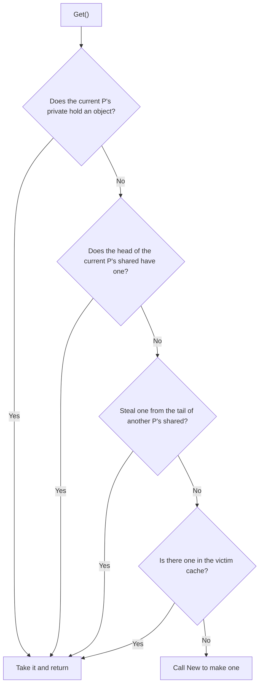

# 11.6 Object Pool

Allocating and then discarding the same kind of temporary object over and over puts heavy pressure on
the garbage collector ([13](../../part4memory/ch13gc)). `sync.Pool` offers a way out: stash a used object
and reuse it next time instead of allocating fresh every time. Its typical use is for temporary objects
like buffers and serializers that are "discarded after one use, yet needed again and again".

```go
var bufPool = sync.Pool{New: func() any { return new(bytes.Buffer) }}

b := bufPool.Get().(*bytes.Buffer)
b.Reset()           // the object you get back may be dirty, so reset it first
// ... use b ...
bufPool.Put(b)      // put it back when done, for others to reuse
```

`New` is the only field the user needs to supply: when the pool has no object to hand out, it falls back
to `New` to make one. So what `Get` returns is either an old object someone just put back, or a new one
freshly made by `New`, and the caller has no way, and no need, to tell the two apart. This section first
covers the ancient idea of reusing objects that the pool rests on, then unpacks the three layers it builds
for concurrency and GC: per-P sharding, the victim cache, and cooperation with the runtime's GC.

## 11.6.1 Object Reuse: An Ancient Memory Trick

"Prepare a batch of objects ahead of time and borrow-and-return them repeatedly rather than creating and
destroying them often" is a very old idea in memory management. The free list
([12.2](../../part4memory/ch12alloc/component.md)), the object pool, and the slab allocator (Bonwick 1994,
which the kernel uses to cache fixed-type objects) are all incarnations of it. Its value is twofold: it
saves the repeated cost of allocation and initialization; and, especially important for garbage-collected
languages, it reduces the rate at which live objects are produced, thereby lowering GC frequency and pause
times.

This second point is exactly what the `sync.Pool` documentation states as its job, "to cache allocated but
unused objects for later reuse, relieving pressure on the garbage collector". To see where this relief comes
from, we can roughly model Go's concurrent mark-and-sweep ([13](../../part4memory/ch13gc)) as having a
workload proportional to the number of live objects: the mark phase has to walk reachable objects, and the
sweep phase has to reclaim dead ones. Every time you `New` a temporary object and discard it after use, you
add a "born-then-dead" object to the heap, raising the allocation rate, which in turn triggers GC more often
and gives each GC round more objects to scan. Reuse turns this batch from "repeated birth and death" into
"borrowed and returned", which both lowers the allocation rate and stops them from becoming scan-and-reclaim
targets in every round. The fmt package is a textbook example: it uses a `sync.Pool` to maintain temporary
output buffers, the pool grows automatically under heavy concurrent printing and shrinks with GC when idle.
It turns this ancient trick into a standard part that is concurrency-safe and cooperates with Go's GC. Its
boundary bears emphasis: the pool is an optimization for GC pressure, not a container that manages object
lifetimes. A free list maintained only inside some short-lived object should not use `sync.Pool`. The
documentation makes clear that in such a scenario it is more worthwhile to let the object carry its own free
list, because the amortized benefit of `Pool` rests on "being silently shared among a package's many
concurrent users", and single-point use cannot spread out its fixed overhead.

## 11.6.2 One Per P, Avoiding Locks

The foundation of `sync.Pool`'s high performance is sharding the cache **by P**
([9.3](../ch09sched/mpg.md)): each P has its own small block of local cache, a `private` slot (holding a
single object, the fastest) plus a `shared` double-ended queue. Local access takes a lock-free fast path,
and synchronization is only needed when stealing across Ps. This is the same "layered contention reduction"
move as the memory allocator's mcache ([12.2](../../part4memory/ch12alloc/component.md)), the **thread cache**
in tcmalloc/jemalloc, and the JVM's **TLAB** (thread-local allocation buffer): make the allocation fast path
per-thread or per-P private to eliminate global lock contention. The only difference is that `sync.Pool`
caches user objects rather than raw memory.

```go
// per-P local cache (sketch)
type poolLocal struct {
    private any        // a single object accessible only by the current P (fastest, no sync needed)
    shared  poolChain  // this P can pushHead/popHead; any P can popTail (be stolen from)
    // pad fills the struct to 128 bytes so adjacent Ps' caches do not land in the same
    // cache line and cause false sharing
}
```

Why two levels, `private` and `shared`, rather than just the queue? Because the vast majority of "take one,
return it after use" accesses are tight take-and-return loops, and the single-object `private` slot reduces
this most common case to an ordinary field read and write, sparing even the enqueue and dequeue of the queue.
`shared` then absorbs the overflow: only when `private` is already occupied and another object needs to be
put back does it fall to the queue, and it is precisely this queue that lets objects flow between Ps. One
fast and one slow, one exclusive and one shared, a division of labor identical to the two levels of the
allocator's mcache `alloc` array plus mcentral ([12.2](../../part4memory/ch12alloc/component.md)).

`shared` is not an ordinary slice but a `poolChain`, a lock-free chained double-ended queue. Its access
permissions are asymmetric: **this P** does `pushHead`/`popHead` at the head (both pushing and taking back
happen at its own end, with no contention); **other Ps** can only `popTail` to steal from the tail. The head
belongs to the owner, the tail goes to the thief, so the owner's routine access and the thief's occasional
steal sit at opposite ends, minimizing cross-P contention. Early versions protected this shared queue with a
`Mutex`; Go 1.13 changed it to a CAS-based lock-free variable-length queue, the second instance in this
structure of "restructuring a data structure for concurrency".

`Get` turns this sharding into a near-to-far lookup chain, much like the scheduler's order for finding work
([9.2](../ch09sched/steal.md)): look at what is at hand first, then the shared area, then steal from others,
and only make a new one last:

```go
// the main body of Get (sketch, omitting race detection and procUnpin details)
func (p *Pool) Get() any {
    l, pid := p.pin()          // pin to the current P, disable preemption, get the local poolLocal
    x := l.private             // (1) look at private first, the fastest
    l.private = nil
    if x == nil {
        x, _ = l.shared.popHead()  // (2) then take from the head of this P's shared
        if x == nil {
            x = p.getSlow(pid)     // (3) none yet: steal from others / check the victim
        }
    }
    runtime_procUnpin()
    if x == nil && p.New != nil {
        x = p.New()            // (4) still none: make one now
    }
    return x
}
```



`Put` is the symmetric and simpler half: put it in `private` if possible (fastest), otherwise `pushHead`
it onto the head of this P's `shared`. Whether taking or putting, the local path touches no lock.

When stealing (`getSlow`), it starts from the P after the current one and scans the `shared` tails of the
other Ps one by one. Here is a detail that is easily misexplained: the index is taken as `(pid+i+1) mod size`,
with `i` running from $0$ to $size-1$. It looks like "start from the next one and go around once" avoids
yourself, but in fact when $i = size-1$ it wraps right back to `pid` itself. That is, the first $size-1$
iterations of the loop land on the other Ps, and **only the last returns to yourself**. This is exactly the
intended effect of "scan others first, look at yourself last", not "never take from yourself".

### pin and the per-P index

The opening `p.pin()` in `Get`/`Put` is the prerequisite for the whole lock-free fast path to hold. It does
two things: it calls `runtime_procPin` to pin the current goroutine to the P and disable preemption (so no
GC happens within this critical section, and the goroutine is not scheduled away, which is what makes the
reads and writes of `private` truly "exclusive"); then it uses the P's id as the index to `indexLocal` the
local `poolLocal` out of the per-P `local` array. `local` is a stretch of contiguous memory, and `indexLocal`
is just a single pointer computation of "base address + pid x stride". Only when the number of Ps is increased
after `GOMAXPROCS` changes, so the current pid runs past the end of the array, does it fall into the locking
slow path `pinSlow`, which reallocates the array under `allPoolsMu` and registers this Pool into `allPools`
(by which GC finds all Pools). This slow path triggers only at rare moments like a change in the number of
Ps; normally `pin` is a few atomic reads plus one pointer computation.

## 11.6.3 The Victim Cache: Reconciling with GC's Rhythm

Objects in a `sync.Pool` cannot stay forever, or they would become a memory leak, so every GC round cleans
up the Pool. But if one naively "empties everything the moment GC arrives", then the first batch of `Get`
calls after every GC all miss and all go to `New`, causing a periodic allocation spike, which is especially
painful for throughput-sensitive services.

Go 1.13 dissolves this jitter with a **victim cache**: when GC arrives, it does not discard the local cache
directly but first demotes it to a victim; only the next GC round actually reclaims the victim. So an object
must go untouched for two consecutive GC rounds before it is freed, and after the main cache misses, `Get`
can still fall back on the victim (see the last step of `getSlow` in the figure above). This smooths the
"cliff-like" emptying into a "two-stage" decay.

In code, this handover is done by `poolCleanup`, registered into the runtime, during the STW phase, because
the world has stopped, all Ps are effectively pinned, no lock is needed, and no allocation is allowed:

```go
// registered at the start of runtime GC (STW), see clearpools called in src/runtime/mgc.go
func init() { runtime_registerPoolCleanup(poolCleanup) }

func poolCleanup() {
    // 1. discard the victims left from the previous round (they have survived two GC cycles)
    for _, p := range oldPools {
        p.victim, p.victimSize = nil, 0
    }
    // 2. demote this round's main cache wholesale to victim
    for _, p := range allPools {
        p.victim, p.victimSize = p.local, p.localSize
        p.local, p.localSize = nil, 0
    }
    // 3. roster rotation: this round's allPools becomes next round's oldPools
    oldPools, allPools = allPools, nil
}
```

The three steps together form a one-way conveyor belt: main cache, victim, freed. `allPools` records the
pools with a non-empty main cache, `oldPools` records the pools with a non-empty victim, and both rosters are
protected by STW (or by the fact that `poolCleanup` cannot trigger during `pin`). This conveyor belt gives an
object a clear lower bound on its lifetime: an object put back before the $k$-th GC round is demoted to victim
only in round $k{+}1$ and can be freed only in round $k{+}2$, and any steal during this time resets its
lifetime. Compared with the one-cycle lifetime of "empty everything every GC round" before Go 1.13, the
average survival span doubles, and it is exactly this extra cycle that flattens the post-GC allocation spike.
Worth a mention is that an object in the victim can still be stolen back before it is freed. When `getSlow`
cannot steal from anyone's `shared`, it checks the victim, and once it takes an object and `Put`s it back, the
object returns to the main cache and dodges this round of freeing. So under allocation-intensive load, the
first wave of `Get` after a GC is very likely to fish out objects from the previous cycle's victim rather than
all going to `New`.

The name "victim cache" originally comes from CPU architecture (Jouppi 1990, adding a small fully-associative
cache next to a direct-mapped cache to catch the cache lines just evicted and reduce conflict misses).
`sync.Pool` borrows this name and idea: an object "evicted" from the main cache is not invalidated immediately
but retreats into a second-level cache to wait a while longer. Once again this shows that runtime design is
often the reuse of older system ideas.

## 11.6.4 The Prerequisites for Using It Right

`sync.Pool` has a few traits to keep in mind, or it is easy to misuse.

First, objects in the pool **may vanish at any time during GC**. The documentation's very first sentence
declares that "any item stored may be removed automatically at any time without notification". So it is only
suitable for holding temporary objects that can be rebuilt and have no state dependencies, and cannot be used
as a resource pool that needs keep-alive, like a connection pool. When GC comes the connections are gone, and
such needs should use a dedicated connection pool library.

Second, it **does not guarantee** that `Get` returns the object you previously `Put` in, nor does it guarantee
capacity. The documentation says plainly that the caller should not assume any relationship between the value
passed to `Put` and the value returned by `Get`. It is a "best-effort" cache, not a queue, and makes no
promise of "caching at least N". In the terms of the memory model ([11.9](./mem.md)), the only thing
guaranteed is: a `Put(x)` of some value `x` "synchronizes before" a `Get` that returns the same `x`.

Third, the object you get back may be "dirty", carrying state left by its previous user, and usually needs a
`Reset` before use (as in this section's opening handling of `bytes.Buffer`).

Put these points together and the role of `sync.Pool` is very clear: **born specifically to lower the GC
pressure of high-frequency temporary allocation**, no more and no less. It also reminds us of a more general
engineering discipline: pooling is an optimization that trades complexity for performance, and the performance
gain is never free. It shifts the burdens of "when to clear, whether the object is clean, whether there is
cross-P contention" onto the user. Only when a profiler confirms that temporary allocation really is the
bottleneck is it worth bringing in.

## Further Reading

1. Jeff Bonwick. *The Slab Allocator: An Object-Caching Kernel Memory Allocator.*
   USENIX Summer 1994. https://www.usenix.org/legacy/publications/library/proceedings/bos94/bonwick.html
   (the classic of object-caching allocation)
2. Norman P. Jouppi. *Improving Direct-Mapped Cache Performance by the Addition of a
   Small Fully-Associative Cache and Prefetch Buffers.* ISCA 1990.
   https://doi.org/10.1145/325164.325162 (the origin of the victim cache)
3. Sanjay Ghemawat, Paul Menage. *TCMalloc: Thread-Caching Malloc.*
   https://google.github.io/tcmalloc/design.html (the prototype idea of per-thread caching, isomorphic to this section's per-P sharding)
4. Go 1.13 Release Notes (the victim cache for sync.Pool). https://go.dev/doc/go1.13 ;
   proposal and discussion golang/go#22950. https://github.com/golang/go/issues/22950
5. The Go Authors. *sync.Pool documentation and src/sync/pool.go.* https://pkg.go.dev/sync#Pool
6. The Go Authors. *The Go Memory Model.* https://go.dev/ref/mem
   (the "synchronizes before" guarantee from `Put(x)` to a `Get` returning the same `x`)
7. The implementation evolution of `sync.Pool` (the original commits for the designs described in 11.6.2 / 11.6.3 of this section): Brad Fitzpatrick.
   *sync: add Pool type.* golang/go#4720 ; Dmitry Vyukov. *sync: scalable Pool.* 2014
   (per-P sharding, https://github.com/golang/go/commit/f8e0057bb71cded5bb2d0b09c6292b13c59b5748);
   Austin Clements. *sync: use lock-free structure for Pool stealing.* 2019
   (`shared` changed to a CAS lock-free queue, https://github.com/golang/go/commit/d5fd2dd6a17a816b7dfd99d4df70a85f1bf0de31);
   *sync: smooth out Pool behavior over GC with a victim cache.* 2019
   (the victim cache, https://github.com/golang/go/commit/2dcbf8b3691e72d1b04e9376488cef3b6f93b286).
8. This book's [9.2 Work Stealing](../ch09sched/steal.md), [11.9 Memory Consistency Model](./mem.md),
   [12.2 Allocator Components](../../part4memory/ch12alloc/component.md) (the shared design of per-P caching and stealing).
