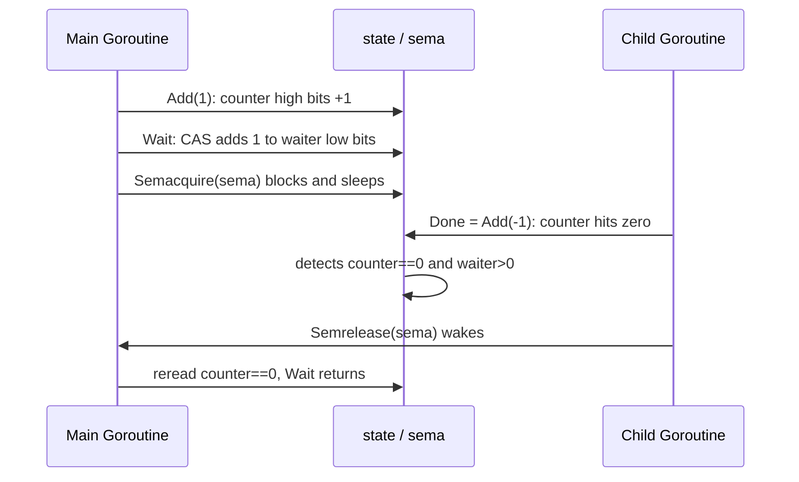

# 11.5 Wait Groups

The mutex ([11.2](./mutex.md)) and the condition variable ([11.4](./cond.md)) from the previous
sections solve the problem of "multiple Goroutines contending for the same shared state." This
section turns to `sync.WaitGroup`, which solves a different class of problem: one Goroutine spawns
several subtasks, then waits for all of them to finish before continuing. The former is contention,
the latter is rendezvous. This is one of the most common structures in concurrent programming,
called fork-join, and `WaitGroup` is exactly the Go standard library's answer to it.

## 11.5.1 The Lineage of Barriers and Latches

Before studying the implementation of `WaitGroup`, let us place it within the lineage of
synchronization primitives, so as to see clearly which class of problem it solves. Waiting for "a
group of events to all occur" has a dedicated family in the concurrency literature, called barriers
and latches. The members of this family take various forms, and Java's `java.util.concurrent` draws
the distinctions quite cleanly, which serves nicely to locate `WaitGroup`:

| Primitive | Form | Reusable | Count dynamically adjustable |
| --- | --- | --- | --- |
| `CountDownLatch` (Java) | A crowd of waiters wait for the count to reach 0, one-shot | No | No, fixed at construction |
| `CyclicBarrier` (Java) | $N$ peers wait for each other to arrive, auto-resets once all arrive | Yes | No, the number of participants is fixed |
| `Phaser` (Java) | A phased barrier, participants may register / deregister midway | Yes | Yes |
| `sync.WaitGroup` (Go) | One party waits for a group of tasks to all finish, fork-join | Yes (after Wait returns) | Yes (Add may be positive or negative) |

`WaitGroup` is closest to `CountDownLatch`: both are "a count drops from some positive value to 0,
and the waiters are released along with it." They differ in two places. First, the count of
`CountDownLatch` is fixed at construction, whereas the count of `WaitGroup` accumulates dynamically
through `Add`, which is more like the registration mechanism of `Phaser`. Second, `CountDownLatch`
is one-shot: once it reaches 0 it is spent, whereas `WaitGroup` can be reused after a round of
`Wait` returns.

`CyclicBarrier` is yet another form. It requires $N$ peer participants to all wait for each other,
a "many-to-many rendezvous" rather than the "one waits for many" of `WaitGroup`. We list it here to
make clear what `WaitGroup` is not: it does not make a group of Goroutines wait for each other, it
only makes one (or a few) waiters wait for a group of tasks to wrap up.

## 11.5.2 Usage: Add, Done, Wait

The `WaitGroup` interface has only three methods. `Add(delta)` adds `delta` to the task counter
(which may be positive or negative), `Done()` is equivalent to `Add(-1)`, and `Wait()` blocks until
the counter reaches zero. The most typical fork-join idiom looks like this:

```go
var wg sync.WaitGroup
for _, task := range tasks {
	wg.Add(1)          // add 1 to the count before spawning
	go func() {
		defer wg.Done() // subtract 1 from the count when the task ends
		process(task)
	}()
}
wg.Wait()              // block until all tasks are Done
```

The main Goroutine calls `Add(1)` before each spawn of a subtask, the subtask uses
`defer wg.Done()` to guarantee that the count is decremented whether it returns normally or
`return`s midway, and finally `Wait` suspends the main Goroutine until the count reaches zero. This
idiom has two iron rules, which [11.5.5](#1155-two-iron-rules) below will explain from the
standpoint of the implementation.

## 11.5.3 Internal Layout: Packing the Counter and the Waiters into One Word

The efficiency of `WaitGroup` hinges on packing two seemingly independent quantities into the same
64-bit word. Here is a trimmed sketch:

```go
// WaitGroup: wait for a group of tasks to finish (sketch, race and synctest details omitted)
type WaitGroup struct {
	noCopy noCopy      // triggers go vet to report "copied after first use"

	// One 64-bit word, sliced into bit fields (high to low):
	//   bits[0:32]   counter: number of unfinished tasks
	//   bits[32]     synctest bubble flag (used by the test framework, ignorable for the core mechanism)
	//   bits[33:64]  waiter: number of Goroutines blocked on Wait
	state atomic.Uint64
	sema  uint32       // the accompanying semaphore, on which Wait sleeps
}
```

Why squeeze counter and waiter into one word, instead of using two independent counters? The answer
is not to save those 4 bytes, but so that a single atomic operation can obtain a **consistent
snapshot** of both. Both `Add` and `Wait` need to read "how many tasks remain" and "how many
waiters there are" at the same time, in order to decide whether to return, to panic, or to wake. If
counter and waiter were two separate atomic variables, a concurrent modification could slip in
between the two independent atomic reads, yielding a self-contradictory pair of values (a torn
read). Packed into one word, a single `Load` or a single `CompareAndSwap` locks in the whole pair of
states, and only then does the concurrent decision have something firm to stand on.

There is also a piece of evolution buried here. The early `WaitGroup` field was `state1 [3]uint32`,
paired with a `state()` method that, at runtime, picked out the 8 bytes aligned to an 8-byte
boundary to serve as the 64-bit state and used the remaining 4 bytes as the semaphore. This awkward
alignment trick was meant to work around the restriction that 64-bit atomic operations on 32-bit
platforms require 8-byte alignment, while struct fields are not necessarily aligned. After Go 1.20
(2022) replaced `state` with `atomic.Uint64`, alignment was guaranteed by the type itself, and that
stretch of hand-written alignment code, along with the `state()` method, was retired ([11.3](./atomic.md)
discussed how typed atomics incidentally solve the alignment problem).

## 11.5.4 How Add and Wait Cooperate

Once the packing is understood, the core of `Add` comes down to a single bit operation. It shifts
`delta` left by 32 bits so that it lands exactly on the high 32 bits where the counter lives,
leaving the low-bit waiter undisturbed:

```go
func (wg *WaitGroup) Add(delta int) {
	state := wg.state.Add(uint64(delta) << 32) // add delta to the high 32 bits (counter)
	v := int32(state >> 32)                    // extract counter
	w := uint32(state & 0x7fffffff)            // extract waiter (mask off the bit 31 flag)

	if v < 0 {
		panic("sync: negative WaitGroup counter")
	}
	if v > 0 || w == 0 {
		return // counter is still > 0, or nobody is waiting at all, return directly
	}
	// reaching here: counter has just hit zero, and there are waiters. Wake them all.
	wg.state.Store(0)            // clear the state, ready for reuse in the next round
	for ; w != 0; w-- {
		runtime_Semrelease(&wg.sema, false, 0) // release the semaphore one by one
	}
}

func (wg *WaitGroup) Done() { wg.Add(-1) }
```

The logic of `Wait` is symmetric. It first reads the snapshot, and if the counter is already 0 there
is nothing to wait for and it returns; otherwise it uses a single CAS to add 1 to waiter (that is,
`state+1`, which acts exactly on the low bits), then blocks on the semaphore:

```go
func (wg *WaitGroup) Wait() {
	for {
		state := wg.state.Load()
		v := int32(state >> 32)
		if v == 0 {
			return // counter has already reached zero, no need to wait
		}
		// add 1 to waiter: state+1 lands exactly on the low bits. A failed CAS means the state
		// was concurrently modified, so reread and retry.
		if wg.state.CompareAndSwap(state, state+1) {
			runtime_SemacquireWaitGroup(&wg.sema, false) // sleep
			if wg.state.Load() != 0 {
				panic("sync: WaitGroup is reused before previous Wait has returned")
			}
			return
		}
	}
}
```

The two sides shake hands through `sema`, that runtime semaphore: `Wait` does a `Semacquire` on it
and sleeps, and the last `Done`, finding the counter at zero and the waiter count greater than 0,
issues a `Semrelease` once per waiter, waking the sleeping Goroutines one by one. The whole
interaction can be drawn as a timeline:



## 11.5.5 Two Iron Rules

`WaitGroup` is not hard to use correctly, but each way of using it incorrectly has its own dire
consequences. Both iron rules can be read straight off the implementation above.

First, **`Add` must happen before the Goroutine being waited on starts**, or more precisely, the
`Add` that lifts the count up from 0 must precede `Wait`. The reason is hidden in the snapshot taken
by `Wait`: the first thing it does is read the counter, and if it reads 0 it concludes there is
nothing to wait for and returns immediately. Imagine misplacing `Add(1)` inside the child Goroutine:

```go
var wg sync.WaitGroup
go func() {
	wg.Add(1)        // misplaced: may execute only after Wait has already read the counter
	defer wg.Done()
	work()
}()
wg.Wait()            // may read counter==0 and return without waiting at all
```

The `Wait` of the main Goroutine and the `Add` of the child Goroutine form a data race, and `Wait`
may well see the count as 0 first and release early, with the program moving on before `work()` has
finished. The panic in the implementation guarded by `if w != 0 && delta > 0 && v == delta`
(`Add called concurrently with Wait`) is precisely a fast-fail set up to catch this kind of
concurrent misuse.

Second, **the counter must not go negative**. If `Done` is called more times than `Add`, the counter
crosses 0 into the negative, and `Add` immediately `panic`s with `"sync: negative WaitGroup
counter"`. This is a deliberate fail-fast: a negative count almost always means the program logic is
wrong (some task was `Done`-ed twice, or an `Add` was missed), and rather than letting it slip by
quietly and leave behind an intermittent, strange bug, it is better to crash on the spot and pin the
error at the scene.

## 11.5.6 The Happens-Before Guarantee

`WaitGroup` is not merely a counter, it also carries a promise at the level of the memory model. In
the vocabulary of [11.9](./mem.md): **a `Done()` is synchronized before the return of the `Wait()`
it unblocks**. This is the very wording of the source comment. Its practical meaning is that all
writes to memory made by the child Goroutine before `Done` are visible to the main Goroutine after
`Wait` returns. So the following idiom is safe, with no extra locking needed:

```go
results := make([]int, len(tasks))
var wg sync.WaitGroup
for i, task := range tasks {
	wg.Add(1)
	go func() {
		defer wg.Done()
		results[i] = process(task) // each writes its own slot
	}()
}
wg.Wait()
total := 0
for _, r := range results { total += r } // after Wait, all writes are visible
```

Each subtask writes only its own cell `results[i]`, with no contention between them; the
happens-before of `Wait` guarantees that these writes have all settled by the time the main
Goroutine sums them up. Without this guarantee, reading `results` after `Wait` returns would be a
data race.

## 11.5.7 WaitGroup.Go and loopvar: Two Pitfalls Eliminated

The `Add(1) / go / defer Done()` trio of boilerplate is bound to be written wrong eventually, the
most common mistakes being a missing `Add` or a missing `Done`. Go 1.25 added a `Go` method to
`WaitGroup` that folds the boilerplate into a single line:

```go
func (wg *WaitGroup) Go(f func()) {
	wg.Add(1)
	go func() {
		defer func() {
			if x := recover(); x != nil {
				panic(x) // f must not panic: if it does, re-throw rather than Done
			}
			wg.Done()
		}()
		f()
	}()
}
```

So the loop at the start can be written as:

```go
var wg sync.WaitGroup
for _, task := range tasks {
	wg.Go(func() { process(task) })
}
wg.Wait()
```

`Add` and `Done` are gathered into `Go` together, and the pairing can no longer be gotten wrong. One
design point worth noting: if `f` panics, `Go` chooses to re-throw the panic rather than call
`Done`, because at that point, if `Done` were to wake `Wait`, the main Goroutine might exit before
the panic actually terminates the process, which is undesirable, and so `f` must not panic.

This simplification also incidentally closes another long-standing pitfall. Before Go 1.22, the
`for` loop variable shared a single address across iterations, and if the closure above captured the
loop variable `task` directly, all Goroutines would see the same, ever-changing value, forcing one to
write `task := task` by hand to copy it per iteration. Go 1.22 changed the loop variable so that each
iteration gets its own copy (a per-iteration loop variable), and this capture bug vanished. So
`wg.Go(func() { process(task) })` does away with both the boilerplate and the capture hazard at
once.

## 11.5.8 Toward Structured Concurrency

`WaitGroup` solves "wait for a group of tasks to finish," but leaves two things unattended: how to
collect the errors returned by the subtasks, and how to cancel the remaining still-running tasks once
one subtask fails. Filling in these two things brings us to the doorstep of structured concurrency.

Outside the standard library, `golang.org/x/sync/errgroup` is exactly this step. Its `Group` embeds a
`sync.WaitGroup` internally, layering error propagation and `context` cancellation on top:
`Go(func() error)` collects the first non-nil error, the `Context` derived by `WithContext`
automatically cancels when the first error appears, letting sibling tasks stop as early as possible,
and `SetLimit` can also use a buffered channel as a semaphore to bound the degree of concurrency.
`WaitGroup` manages "when all are finished," `context` ([11.8](./context.md)) manages "when to
cancel," and only when the two converge is structured concurrency's complete control over a group of
tasks assembled. `WaitGroup` is the starting point of this line, simple enough to have only three
methods, yet precisely the exact expression of fork-join, the most elementary concurrency structure.

## Further Reading

1. The Go Authors. *Package sync: type WaitGroup.*
   https://pkg.go.dev/sync#WaitGroup ; source `src/sync/waitgroup.go`.
2. The Go Authors. *Go 1.25 Release Notes* (adds `WaitGroup.Go`, proposal #63796).
   https://go.dev/doc/go1.25
3. The Go Authors. *The Go Memory Model* (Version of June 6, 2022).
   https://go.dev/ref/mem (Done is synchronized before the return of the Wait it unblocks).
4. The Go Authors. *Fixing For Loops in Go 1.22.*
   https://go.dev/blog/loopvar-preview ; spec change at https://go.dev/wiki/LoopvarExperiment .
5. Oracle. *java.util.concurrent: CountDownLatch, CyclicBarrier, Phaser.*
   https://docs.oracle.com/en/java/javase/21/docs/api/java.base/java/util/concurrent/package-summary.html
6. The Go Authors. *Package errgroup.*
   https://pkg.go.dev/golang.org/x/sync/errgroup ; source `golang.org/x/sync/errgroup`.
7. This book: [11.3 Atomic Operations](./atomic.md), [11.8 Context](./context.md), [11.9 The Memory Consistency Model](./mem.md).
