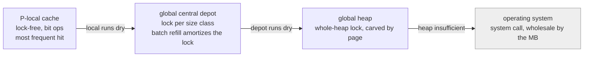

# 12.1 Design Principles

By now we have seen how a Go program starts up, and how the scheduler spreads goroutines across operating-system threads for execution. The single thing that scheduled code does most often is request memory: every `new`, every local variable that escapes to the heap, every slice growth, all funnel into the same entry point, `runtime.mallocgc`. This chapter is about the allocator behind that entry point. This section does not yet touch its parts; it answers a question that comes first: what mutually pulling goals must a memory allocator built for Go satisfy, and on which few judgments does it settle them? Once you understand these trade-offs, the structures and paths in the following sections ([12.2](./component.md)–[12.6](./tinyalloc.md)) will all have a clear origin.

## 12.1.1 Four Mutually Pulling Goals

Let us first draw the boundary. The "allocation" this chapter discusses refers specifically to **heap allocation**, the part that passes through `runtime.mallocgc`. Local variables on the stack are naturally reclaimed when the function returns; they are not the allocator's business. Only objects that escape to the heap enter this machinery. Whether an object stays on the stack or escapes to the heap is decided at compile time by the compiler's escape analysis:

```go
func f() *int {
    y := 2     // the address of y is returned, so y escapes to the heap -> the compiler inserts newobject
    return &y
}

func g() int {
    x := 2     // x does not escape, it stays on the stack -> no heap allocation is triggered
    return x
}
```

The `y` in `f` is rewritten by the compiler into a `runtime.newobject` call (the `new` keyword lands here too), and `newobject` simply calls `mallocgc` while passing along the type information. In other words, every allocation path discussed in this chapter has this one function as its entry. The details of escape analysis belong to the compiler ([15](../../part5toolchain/ch15compile)); here you need only remember: **what enters the allocator are the objects the compiler has judged cannot be placed on the stack**.

With the objects clarified, let us look at the goals the allocator must satisfy. A general-purpose memory allocator has to please four parties at once, and these four are not on good terms with one another:

- **Fast**. Allocation sits on the hot path; a service may allocate millions of objects per second. If a single allocation has to take a lock, look up a table, or make a system call, the throughput of the whole program is dragged down by it. The ideal allocation should be a few lock-free instructions.
- **Scalable**. Go programs are concurrent across many cores by nature; dozens or hundreds of goroutines may request memory at the same time. If all allocations share one global lock, contention grows fiercer as core count rises, and adding machines makes things slower instead. The allocator must let concurrent allocations disturb one another as little as possible.
- **Low fragmentation**. Stuffing an object into a slot larger than itself wastes space (internal fragmentation), and chopping the heap into scattered pieces that leave many gaps too small to hold a large object is also waste (external fragmentation). In a long-running service, fragmentation accumulates over time into real memory bloat.
- **Cooperating with the GC**. Go has no explicit `free`; when an object is reclaimed is decided by the garbage collector ([13](../ch13gc)). This requires the allocator, at the moment of allocation, to record the information reclamation needs (what type this memory is, whether it contains pointers, whether it is live), and to let the "rhythm" of allocation drive the GC to start at the right time.

These four conflict pairwise. The fastest approach is for each thread to grasp a large block of memory and manage it on its own, but then every thread hoards a copy and fragmentation rises. The most memory-frugal approach is to pack all objects into one compact global structure and carve them out on demand, but that inevitably requires a global lock, and scalability is gone. Allocator design is in essence the search for an engineering balance point within this four-cornered tug-of-war. Go's answer is not to invent a brand-new mechanism but to stand on the shoulders of a mature design and then make a dedicated modification for the GC corner.

## 12.1.2 The Lineage of tcmalloc: Replacing the Global Lock with Per-Thread Caches

Go's allocator descends from Google's **tcmalloc** (thread-caching malloc) [1]. tcmalloc's core insight for resolving the conflict between "fast" and "scalable" is a single sentence: **give each thread a local cache, let the vast majority of allocations complete locally, and never touch the global lock at all**. When a thread wants to allocate, it first looks at its own cache; a hit returns directly, a string of lock-free operations. Only when the local cache runs dry does it reach for the lock that protects the global structure, and that lock is cold at this moment, because it is rarely touched. Global contention is dissolved this way, "amortized into each thread's own locality".

This is the very same move the Go runtime uses again and again. The scheduler gives each P a local run queue ([9.2](../../part3concurrency/ch09sched/steal.md)), and only when the local queue is empty does it go steal from the global queue or another P; `sync.Pool` gives each P a local shard ([11.6](../../part3concurrency/ch11sync/pool.md)), the same idea. Breaking global contention into per-core locality is the most common contention-reduction technique in a high-concurrency runtime, and the reader will meet it repeatedly throughout the book.

When inheriting the tcmalloc skeleton, Go changed two key things. First, the local cache is not bound to an operating-system thread but to a **P** ([9.3](../../part3concurrency/ch09sched/mpg.md)). Because at any instant a P is held by only one M, accessing this cache naturally needs no lock, and the number of caches grows with `GOMAXPROCS` rather than with thread count, which is more controllable. Second, and more fundamentally: tcmalloc serves manual `malloc`/`free`, whereas Go must serve precise garbage collection, so Go grows a layer of GC metadata on top of every layer of the tcmalloc structure. One could say Go's allocator is "the skeleton of tcmalloc, plus flesh born to live in symbiosis with the GC", and this main thread will converge with the allocator in [13](../ch13gc).

Drawing this idea as a "cost gradient" gives the spine of the whole allocator: the closer to P-local, the more frequent the hit and the lower the cost; the further toward the global structures and the operating system, the higher the cost and the rarer the hit. The vast majority of allocations stop at the leftmost few lock-free instructions; only when a level comes up empty does the allocation move rightward and pay a greater synchronization cost.



This figure depicts the magnitude of cost; [12.2](./component.md) will give each layer its concrete components (mcache, mcentral, mheap) and draw the paths along which requests are split among them. The remaining three subsections of this section first lay out clearly the three judgments that support this gradient: how to carve up sizes, how to split by object, and how to mesh with the GC.

## 12.1.3 Size Classes: Trading a Little Internal Fragmentation for Allocation as Quick as Bit Operations

If objects were always allocated at their exact size, reclamation would leave holes of varying sizes on the heap; the next allocation would have to find a fitting one among these holes, which is both slow and apt to leave external fragmentation that can hold no object. The countermeasure tcmalloc and Go adopt is the **size class**: a set of discrete size tiers is laid out in advance, an allocation rounds the request up to the nearest tier, and objects of the same tier are gathered into a stretch of contiguous memory sliced into equal-sized slots (the span; see [12.2](./component.md)).

go1.26 lays out 68 size classes (including class 0, which stands for "zero bytes"; 67 actually carry allocations, defined in `internal/runtime/gc/sizeclasses.go`), covering 8 bytes to 32 KB. This design brings two direct benefits. First, **allocation degenerates into pure bit operations**: all slots within the same span are equal-sized, so to allocate one need only find a free slot in a free bitmap, a few shift and count instructions, with no size comparison and no scanning of holes (this fast path is `nextFreeFast` in [12.2](./component.md)). Second, **fragmentation is controllable**: adjacent tiers are spaced at an approximately geometric ratio, so when an object is rounded up to the next tier, the proportion wasted is held down by this spacing.

The cost is internal fragmentation: an object always has to be stuffed into a slot no smaller than itself. Here we should clear up for the reader a number that is often misreported. The design goal of the tiers is to keep the **relative waste caused by rounding** within about $1/8 = 12.5\%$, which is the spacing upper bound for the larger tiers; the `max waste` column in the source comments bears this out. For example, the worst-case waste of the 1024-byte tier (class 32) is 12.40%:

```text
// excerpt from the generated comment in sizeclasses.go
// class  bytes/obj  bytes/span  objects  tail waste  max waste
//     5         48        8192      170          32     31.52%
//    10        128        8192       64           0     11.72%
//    18        256        8192       32           0      5.86%
//    32       1024        8192        8           0     12.40%
```

The phrase "allocation degenerates into bit operations" deserves to be made concrete. Mapping a request size to a tier could be a single division or a loop of comparisons, but allocation is on the hot path, where even one division is too dear. The runtime uses **table lookups** instead: two index tables are generated in advance, one covering the small range in steps of 8 bytes and one covering the large range in steps of 128 bytes, compressing "size -> size class" into a single array subscript:

```go
// size -> size class: two pre-generated index tables, no division, no loop (sketch, taken from roundupsize)
func sizeToClass(size uintptr) uint8 {
    if size <= smallSizeMax-8 {                 // <= 1024, bucketed by 8 bytes
        return sizeToSizeClass8[divRoundUp(size, smallSizeDiv)]
    }
    return sizeToSizeClass128[divRoundUp(size-smallSizeMax, largeSizeDiv)] // bucketed by 128 bytes
}
```

Once the size class is obtained, the slot size, the number of slots per span, and so on are all gotten by looking up constant tables such as `SizeClassToSize`. Even a computation like "which slot within the span an address falls into", which would naturally require dividing by the slot length, the runtime replaces with a single multiply-and-shift using the pre-stored `SizeClassToDivMagic` (magic numbers of the form $\lceil 2^{32}/N \rceil$). Along the entire small-object fast path, therefore, one sees not a single real division or scan.

Back to fragmentation. This 12.5% is not a ceiling that applies to all tiers. The smallest few tiers, for the sake of alignment, have a higher relative waste instead: a 1-byte request has to occupy the full 8-byte smallest tier, a worst-case waste as high as 87.5%. This is not a contradiction; the absolute waste is only a few bytes, and what the alignment buys is a tidier memory layout. The `max waste` column also folds in the "tail waste" of a span end that cannot be filled into a whole slot. The accurate statement is: **size classes hold the rounding waste of larger objects within a spacing upper bound of about 12.5%, while for very small objects they trade a higher relative waste for alignment and uniform slots**, not "fragmentation never exceeds 12.5%". Making this clear is so the reader is not startled by that 87.5% column when reading the source comments.

## 12.1.4 Three Object Paths: Splitting by Size and by Whether Pointers Are Present

Having settled on "allocate by size class", `mallocgc` splits all requests along two dimensions (size, and whether pointers are present) into three paths. Below is the dispatch skeleton with the experimental switches and corner branches trimmed away, keeping exactly these three trunks:

```go
// the three-way dispatch of mallocgc (sketch, omitting sanitizer, experimental switch, and other branches)
func mallocgc(size uintptr, typ *_type, needzero bool) unsafe.Pointer {
    if size == 0 {
        return unsafe.Pointer(&zerobase) // zero-sized objects share one sentinel address
    }
    noscan := typ == nil || !typ.Pointers() // contains no pointers -> the GC need not scan it
    if size <= maxSmallSize-mallocHeaderSize { // about 32KB
        if noscan && size < maxTinySize {       // < 16B and pointer-free
            return mallocgcTiny(size, typ)      // path one: tiny objects (see 12.6)
        }
        return mallocgcSmall(size, typ, noscan) // path two: small objects (see 12.5)
    }
    return mallocgcLarge(size, typ, needzero)   // path three: large objects (see 12.4)
}
```

Each of the three paths answers the characteristics of one class of object:

- **Tiny objects** (smaller than `maxTinySize`, i.e. 16 bytes, and pointer-free; path in [12.6](./tinyalloc.md)). These objects are extremely small and astonishingly numerous; typical examples are single-character strings and boxed small integers. If each occupied its own slot, the overhead would mostly be wasted on the rounding of the slot. So the allocator **packs several tiny objects into the same 16-byte block**, laid out compactly within the block, until it is full before switching to a new block. They must be pointer-free, and precisely because of this the GC can treat the whole block as a single pointer-free unit, without having to distinguish the boundaries of the individual objects within the block.
- **Small objects** (16 bytes to about 32 KB; path in [12.5](./smallalloc.md)). These are the bulk of allocation, taking exactly the fast path described in 12.1.2 and 12.1.3: an equal-sized slot is taken by size class from the current P's local cache. Objects with pointers and those without take slightly different sub-paths, because the former need an extra pointer bitmap for the GC to scan.
- **Large objects** (larger than about 32 KB; path in [12.4](./largealloc.md)). These objects are inherently rare, and maintaining per-P caches and size classes for them would not pay off; hoarding a large object in the cache would instead tie up a big block of memory. So large objects **bypass the local cache and request pages directly from the global heap**. The cost of a single allocation is high, but because the frequency is low, that bit of locking overhead is amortized to insignificance.

There is an engineering detail on this dividing line: the threshold is written as `maxSmallSize - mallocHeaderSize`. go1.26 prepends an 8-byte `mallocHeaderSize` header to the slot of small objects that contain pointers, to encode scanning information, so the actual upper limit for pointer-bearing objects is slightly below 32768. As far as design goes, recording the divide as "about 32 KB" suffices; this layer of detail is left to [12.5](./smallalloc.md).

This 8-byte header is itself a piece of evolution. Earlier, Go stored an object's pointer bitmap centrally in a bitmap region on the side of the arena; to scan an object one first had to convert by address into the arena bitmap to look it up. From Go 1.22 on, the pointer information of smaller objects was inlined into this 8-byte header in front of the object (the `mallocHeaderSize` above), so that during scanning the data and the object sit in the same cache line, with better locality, at the cost of each pointer-bearing small object occupying 8 extra bytes. This kind of trade-off, "moving metadata from a centralized place to right next to the object in exchange for cache locality", will be seen again in [12.2](./component.md) and [13](../ch13gc).

## 12.1.5 Symbiosis with the GC: Allocation Is Accounting

Of the four goals, "cooperating with the GC" is what fundamentally distinguishes Go's allocator from an ordinary `malloc`, and it shows up in two places.

The first is **metadata**. For every stretch of memory handed out, the allocator records, in sync, the information reclamation needs on the span and arena it belongs to: which span this block belongs to, whether it contains pointers (the pointer bitmap), and whether it is live (the mark bitmap). The GC can therefore look up, from any address on the heap, "whether it is a pointer, and whether the object it points to is still alive", which is the precondition for precise garbage collection ([13](../ch13gc)) to hold. An ordinary `malloc` need not bother with any of this, because reclamation is commanded explicitly by the programmer. It is exactly this layer of metadata that makes the pointer-bearing and pointer-free objects mentioned in 12.1.3 take different sub-paths, and that forces tiny objects to be pointer-free.

The second is **rhythm**. When the GC starts is not triggered on a timer but decided by the pace of allocation: each time the heap grows to a target watermark, the next round of reclamation starts, and the target watermark is in turn adjusted dynamically by the previous round's live amount (the pacing of [13](../ch13gc)). To this end, every allocation does a bit of accounting in passing, updating the number of bytes allocated; and when a GC is in progress, the allocating goroutine also has to shoulder, "on the spot", a share of the marking work proportional to the size of this allocation (mark assist): the faster it allocates, the more it assists, lest allocation outrun reclamation and the heap bloat out of control. In other words, in Go **allocation itself is the GC's metronome**, which is also why the allocation entry is called `mallocgc` rather than `malloc`; the two letters gc are not decoration.

Taking these five subsections together, the design of Go's allocator can be bound up in a single sentence: **it is a layered cache, whose hot path is made into lock-free bit operations in each P's locality, keeping locking and system calls behind the increasingly cold rear, while weaving into every layer the metadata and rhythm the GC needs**. The next section [12.2](./component.md) gives the parts in this layered structure their names and positions, turning this section's principles into concrete components that can be checked against the source one by one.

## Further Reading

1. Sanjay Ghemawat, Paul Menage. *TCMalloc: Thread-Caching Malloc.*
   https://google.github.io/tcmalloc/design.html (the prototype of the idea of per-thread caches to avoid global lock contention)
2. Sanjay Ghemawat, Paul Menage. *TCMalloc (gperftools) original design document.*
   https://gperftools.github.io/gperftools/tcmalloc.html (the version Go referenced early on)
3. The Go Authors. *runtime/malloc.go.*
   https://github.com/golang/go/blob/master/src/runtime/malloc.go (the three-way dispatch entry of `mallocgc`)
4. The Go Authors. *internal/runtime/gc/sizeclasses.go.*
   https://github.com/golang/go/blob/master/src/internal/runtime/gc/sizeclasses.go
   (the rounding and fragmentation upper bounds of the 68 size classes, including the `max waste` column)
5. Jason Evans. *A Scalable Concurrent malloc(3) Implementation for FreeBSD (jemalloc).*
   BSDCan, 2006. (the isomorphic counterpart of arena + tcache)
6. The Go Authors. *runtime: use a per-object header for scanning (Go 1.22).*
   https://github.com/golang/go/issues/60130 (the evolution of the pointer bitmap from a centralized arena to an object-inlined header)
7. This book: [12.2 Components](./component.md), [12.5 Small Object Allocation](./smallalloc.md),
   [12.6 Tiny Object Allocation](./tinyalloc.md), [12.4 Large Object Allocation](./largealloc.md).
8. This book: [13 Garbage Collection](../ch13gc), an exposition of the symbiotic relationship between the allocator and the GC.
