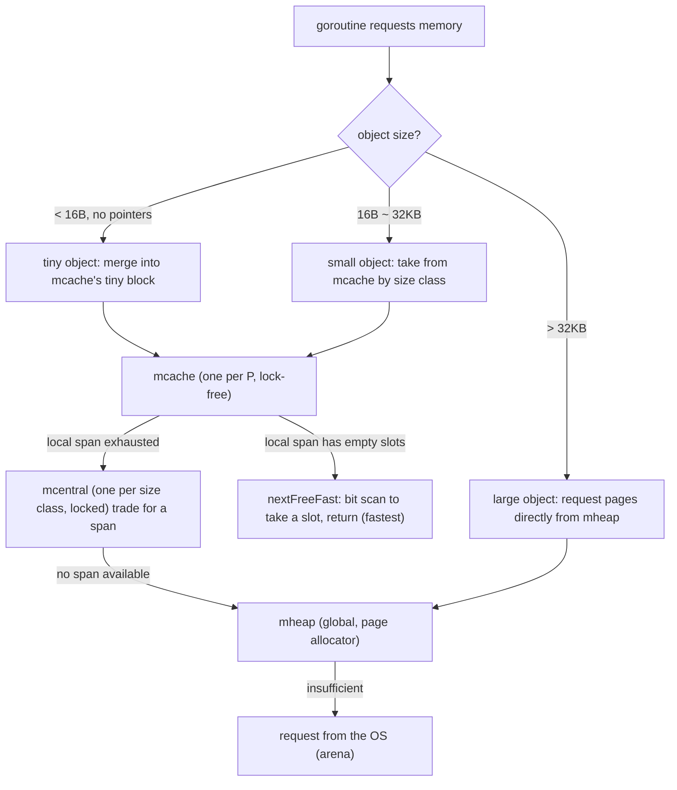

# 12.2 Components

[12.1](./basic.md) described the allocator as a layered structure that is "lock-free on the fast path, locked on the slow path." This section names and locates the few core components of that structure, and grounds them in their actual form in go1.26: what state each component carries, why it is designed the way it is, and how they chain together into a restocking pipeline. Once you have understood these few things, the later allocation paths ([12.4](./largealloc.md)–[12.6](./tinyalloc.md)) are just "a walk across this same picture."

To avoid falling back into translating the source field by field, the structs given below are all **trimmed sketches**: they keep only the fields relevant to the design, with comments explaining why each one exists. For the full definitions you can refer to `runtime/mheap.go`, `mcache.go`, and `mcentral.go`.

## 12.2.1 The free list: the underlying trick behind everything

Before getting to know the individual components, let us first meet a low-level trick they all share, the **free list**. The runtime manages a great many "fixed-size objects" (mcache, mspan, various kinds of metadata) through a fixed-size allocator called `fixalloc`, whose idea is extremely simple: string a batch of unallocated memory blocks into a chain using pointers, where **the head of each block of memory serves precisely as the pointer to the next block**. Allocation is taking off the head of the chain, and reclamation is inserting the block back at the head; both are $O(1)$ pointer operations:

```go
// fixalloc: a free-list allocator for fixed-size objects (sketch)
type fixalloc struct {
    size  uintptr        // the fixed size of each object
    list  *mlink         // free list: free blocks strung into a chain
    chunk uintptr        // cursor into the large block currently wholesaled from the OS
    nchunk uint32        // bytes remaining in the large block
}

func (f *fixalloc) alloc() unsafe.Pointer {
    if f.list != nil {        // the free list has a reusable block
        v := unsafe.Pointer(f.list)
        f.list = f.list.next  // take off the head of the chain
        return v
    }
    // the free list is empty: carve a block from the wholesaled chunk; if the chunk is also exhausted, wholesale more from the OS
    if f.nchunk < f.size {
        f.chunk = uintptr(persistentalloc(_FixAllocChunk, 0, f.stat))
        f.nchunk = _FixAllocChunk
    }
    v := unsafe.Pointer(f.chunk)
    f.chunk += f.size
    f.nchunk -= uint32(f.size)
    return v
}
```

"Storing the pointer to the next block in the head of the free block itself" is the essence of the free list. It needs no extra metadata array to record where the free slots are, and its space overhead is zero. This trick will recur repeatedly below: mspan uses it internally to string together free object slots, and mcache uses it to cache stacks. Once you understand it, many corners of the allocator fall into place.

## 12.2.2 mspan: the basic unit of allocation

**mspan** is the basic unit of the allocator, a run of contiguous memory pages cut into a number of equal-sized slots of the same size class ([12.1](./basic.md)). It is at once the "cargo" that flows between mcache and mcentral, and the unit at which garbage collection ([13](../ch13gc)) scans and sweeps. The trimmed sketch:

```go
// mspan: a run of contiguous pages cut into equal-sized slots of the same size class (sketch)
type mspan struct {
    next, prev *mspan   // linked into the doubly linked lists of mSpanList / mcentral

    startAddr uintptr   // address of the span's first byte
    npages    uintptr   // number of pages occupied

    freeindex  uint16   // start scanning for the next free slot from here
    nelems     uint16   // total number of slots in this span
    allocCache uint64   // cached free bitmap (negated) starting at freeindex, to speed up finding an empty slot
    allocBits  *gcBits  // which slots are already allocated
    gcmarkBits *gcBits  // GC mark bits: which slots are live (swapped with allocBits during sweep, see 13.5)

    allocCount uint16    // number of slots already allocated
    spanclass  spanClass // size class + whether it contains pointers (noscan)
    elemsize   uintptr   // size of each slot (derived from spanclass)
    state      mSpanStateBox // mSpanInUse / mSpanManual / mSpanFree
}
```

A few fields are worth pointing out. `freeindex` plus `allocCache` is the key to "quickly finding the next empty slot within a span": `allocCache` caches the free bitmap near `freeindex` into a single `uint64`, so finding an empty slot degenerates into a single **bit scan** (find the lowest set bit), with no traversal required. The pair of bitmaps `allocBits` and `gcmarkBits` is the interface where the allocator and the GC are **symbiotic** ([12.1](./basic.md)): allocation looks at the former, and during sweep the GC overwrites the former with the latter, so that the slots of dead objects become allocatable again "without sweeping" ([13.5](../ch13gc/sweep.md)). We can see that an mspan is not just "a run of memory"; it encodes both allocation state and reclamation state in the same piece of metadata.

## 12.2.3 mcache: the lock-free fast path, one per P

**mcache** is the local cache held **one per P** ([9.3](../../part3concurrency/ch09sched/mpg.md)), the foundation of the allocator's high performance. Because each P is held by only one M at any instant, accessing the mcache **requires no lock**, and this is precisely the fast path on which the vast majority of allocations finish and stop.

```go
// mcache: a local cache, one per P (sketch)
type mcache struct {
    // tiny-object allocator (< 16B, no pointers, see 12.6): packs several tiny objects into one block
    tiny       uintptr // start address of the current tiny block
    tinyoffset uintptr // offset already used within the block

    // one span for allocation per size class; indexed by spanClass
    alloc [numSpanClasses]*mspan

    stackcache [_NumStackOrders]stackfreelist // also caches goroutine stacks (see 14.6)
}
```

The `alloc` array is the core: each size class (distinguishing the two spanClasses, one with pointers and one without) caches one mspan, and allocating a small object is just "take out the corresponding mspan by size class, and pick an empty slot from it." `tiny`/`tinyoffset` serve tiny-object merging ([12.6](./tinyalloc.md)), while `stackcache` lets stack allocation ([14.6](../ch14stack)) reuse the same per-P caching idea. The mcache itself is allocated from non-GC memory (via `fixalloc`) and lives permanently in the runtime: a P obtains its own mcache when it is created in `procresize`, and returns it when destroyed, so the mcache's lifetime is bound to the P, and an M holds it together with the P.

## 12.2.4 mcentral: the central warehouse shared per size class

When the span of some size class in a P's mcache is exhausted, the P must trade with **mcentral** for a span that has empty slots. There is **one mcentral per size class**, shared by all Ps, so accessing it **requires a lock**. Its structure, since Go 1.9, looks like this:

```go
// mcentral: the central warehouse for one size class, globally shared (sketch)
type mcentral struct {
    spanclass spanClass   // the size class this warehouse serves
    partial   [2]spanSet  // sets of spans that still have empty slots
    full      [2]spanSet  // sets of spans that have no empty slots left
}
```

Why are `partial` and `full` each **two** sets (`[2]spanSet`)? This is a clever trick coordinated with the sweep ([13.5](../ch13gc/sweep.md)): the two sets correspond respectively to "already swept this GC round" and "not yet swept," distinguished by `sweepgen` (the sweep generation). When taking a span, it preferentially draws from the "already swept and has empty slots" set; if it gets an unswept one, it sweeps it on the spot before using it. This "bucketing by sweep generation" replaces the early design of a single linked list under one lock, easing the lock contention between sweeping and allocation, another example of "restructuring a data structure for concurrency" (compare the evolution in [11.7](../../part3concurrency/ch11sync/map.md)). The `spanSet` itself is a chunked, lock-free set optimized for concurrency, which further lowers the cost of multiple Ps accessing mcentral at the same time.

## 12.2.5 mheap and arena: the global heap

At the end of the restocking pipeline is **mheap**, the **single global** heap that manages all pages. When mcentral lacks a span it asks mheap; large objects ([12.4](./largealloc.md)) request pages directly from mheap. Trimmed, we look at only a few things:

```go
// mheap: the global heap (sketch)
type mheap struct {
    lock  mutex
    pages pageAlloc  // page allocator: manages "which pages are free" (see 12.7)

    // the address space is organized by arena (64MB each on 64-bit); arenas is its two-level index
    arenas [1 << arenaL1Bits]*[1 << arenaL2Bits]*heapArena

    // one mcentral per size class, gathered here
    central [numSpanClasses]struct {
        mcentral mcentral
        _        [...]byte // padded to a cache line, to avoid false sharing
    }
}
```

Beneath mheap lie two layers of infrastructure. The **page allocator** `pages` ([12.7](./pagealloc.md)) answers "which run of contiguous pages is free"; the **arena** is the organizational unit of the address space ([12.3](./init.md)). The heap requests memory from the OS at the granularity of 64MB arenas, and each arena is equipped with a copy of metadata (pointer bitmap, span index), so that the runtime can look up, from any heap address, "which span it belongs to, whether it is a pointer, and whether it is live." Note the cache-line padding on the `central` array: aligning the mcentrals of different size classes to different cache lines avoids **false sharing** when multiple cores operate on different size classes at the same time. This fussiness over cache lines is a common technique in highly concurrent runtime code.

## 12.2.6 How a single allocation passes through this hierarchy

Stringing the four together, the path of a single small-object allocation ([12.5](./smallalloc.md)) is exactly the performance of that restocking pipeline from [12.1](./basic.md):



The fastest step, `nextFreeFast`, is just a single bit scan over the current mspan's `allocCache`:

```go
// find the next free slot within a span: a single bit operation, lock-free (sketch)
func nextFreeFast(s *mspan) gclinkptr {
    bit := sys.TrailingZeros64(s.allocCache) // find the lowest free bit
    if bit < 64 {
        result := s.freeindex + uint16(bit)
        if result < s.nelems {
            s.allocCache >>= uint(bit + 1) // advance the cache
            s.freeindex = result + 1
            s.allocCount++
            return gclinkptr(uintptr(result)*s.elemsize + s.base())
        }
    }
    return 0 // this span has no empty slots left, must take the slow restocking path
}
```

Only when this step returns 0 (the local span is exhausted) do we fall into the locked slow path: trade with the corresponding mcentral via `cacheSpan` for a span that has empty slots (sweeping it along the way); if mcentral has none either, ask mheap for new pages to carve a span; and if mheap is insufficient, wholesale an arena from the OS. **The further down we go, the greater the synchronization cost and the lower the hit frequency.** This is the entire point of layered caching: turn the hottest path into a few lock-free bit operations, and keep the expensive locks and system calls behind ever colder layers.

## 12.2.7 Design trade-offs, evolution, and lineage

This structure realizes the design principles of [12.1](./basic.md) as concrete parts, and each part corresponds to one trade-off:

- **Lock-free per-P cache (mcache)** eliminates fast-path contention, at the cost that each P occupies its own copy of cache memory, and objects cannot be reused directly between Ps (they must be relayed through mcentral). This is the same "layered contention reduction" move as the scheduler's local run queue ([9.2](../../part3concurrency/ch09sched/steal.md)) and `sync.Pool`'s per-P sharding ([11.6](../../part3concurrency/ch11sync/pool.md)); you will encounter it again and again in the Go runtime.
- **Organization by size class (mspan)** lets allocation degenerate into the bit operation of "take one equal-sized slot," at the cost of internal fragmentation from size mismatch (about 12.5% in the worst case).
- **mcentral bucketed by sweep generation (`[2]spanSet`)** is an evolution made to lower the lock contention between allocation and sweeping. Before Go 1.9, mcentral was a single linked list under one lock, which became a bottleneck under high concurrency; restructuring it into spanSet relieved this markedly.

Placed in lineage, this hierarchy directly inherits from Google's **tcmalloc** ([12.1](./basic.md)): thread cache (corresponding to mcache), central free list (corresponding to mcentral), and page heap (corresponding to mheap). jemalloc's arena + tcache is an isomorphic idea. What Go grows on top of this, which tcmalloc does not have, is the layer of metadata serving **precise garbage collection**: mspan's `gcmarkBits`, and the arena's pointer bitmap. In other words, Go's allocator is "the skeleton of tcmalloc plus the flesh born for GC symbiosis," and this main thread will merge with it in [13 Garbage Collection](../ch13gc).

## Further reading

1. Sanjay Ghemawat, Paul Menage. *TCMalloc: Thread-Caching Malloc.*
   https://google.github.io/tcmalloc/design.html (the conceptual prototype of mcache/mcentral/mheap)
2. Jason Evans. *A Scalable Concurrent malloc(3) Implementation for FreeBSD (jemalloc).* 2006.
   (the isomorphic design of arena + tcache)
3. The Go Authors. *runtime/mcache.go, mcentral.go, mheap.go, mfixalloc.go.*
   https://github.com/golang/go/tree/master/src/runtime
4. Go 1.9 mcentral restructuring (spanSet), related discussion and commits.
   https://go-review.googlesource.com/c/go/+/38150
5. This book's [12.1 Design Principles](./basic.md), [12.5 Small-Object Allocation](./smallalloc.md),
   [13.5 Sweeping and Bitmaps](../ch13gc/sweep.md).
