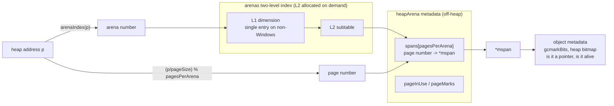
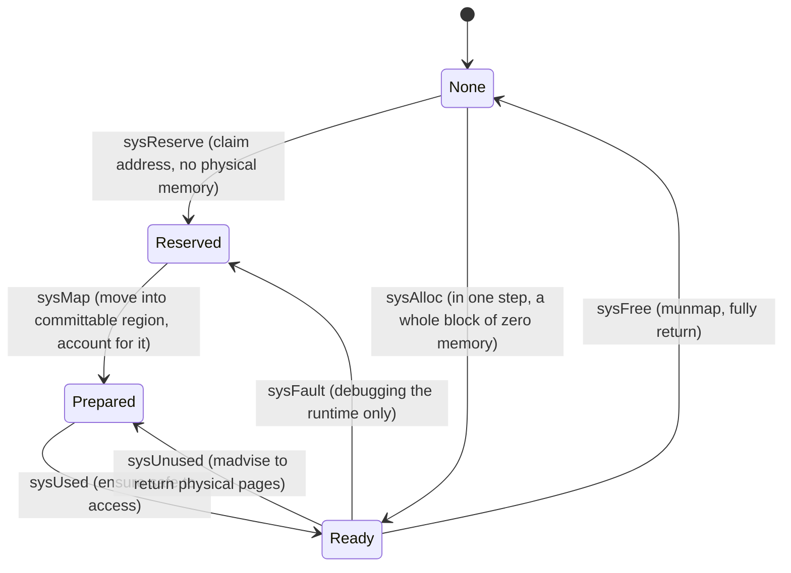

# 12.3 Initialization

[12.2](./component.md) broke the allocator down into a few parts: mcache, mcentral, mheap, and arena. But that was a
static picture. These parts do not fall into place on their own; they must be set up once, at the very start of the
program. This section answers the question: when `main` has not yet run and the first `new` has not yet happened, what
infrastructure does the runtime lay down for the allocator.

Understanding initialization is not a matter of paraphrasing `mallocinit` line by line. It is a matter of seeing two
facts that it establishes once and never changes again. First, **how the address space is organized into arenas**, which
decides how the runtime, given any heap address, looks up "which span it belongs to, whether it holds a pointer, and
whether it is still alive"; this is the bedrock on which garbage collection ([13](../ch13gc)) works. Second, **that
"reserving an address" and "committing physical memory" are two different things**, which explains why the virtual memory
(VIRT) of a Go process is often far larger than its resident memory (RES), and why this is not a leak.

The allocator is one of the first subsystems to finish initializing, alongside the execution stack, called as
`mallocinit` from the scheduler's bootstrap phase ([3.5](../../part1overview/ch03life/boot.md)).

## 12.3.1 mallocinit: laying the foundation at startup

`mallocinit` does three kinds of work: a batch of self-checks on constants (arena sizes, bitmap word counts, and the
physical page size, all computed at compile time, must be self-consistent), initialization of the global heap `mheap_`,
and seeding a set of "arena growth hints" for the 64-bit address space. A trimmed sketch follows:

```go
func mallocinit() {
	// 1. Self-check: compile-time constants must be self-consistent. For example the heap bitmap word
	//    count must be a power of 2 (modular addressing relies on it), and the physical page size must
	//    fall in [minPhysPageSize, maxPhysPageSize] and be a power of 2.
	if heapArenaBitmapWords&(heapArenaBitmapWords-1) != 0 {
		throw("heapArenaBitmapWords not a power of 2")
	}
	if physPageSize == 0 {
		throw("failed to get system page size")
	}
	// ... more checks on physHugePageSize and size class boundaries

	// 2. Initialize the global heap, and allocate the first mcache for the bootstrap thread.
	mheap_.init()
	mcache0 = allocmcache()

	// 3. On 64-bit machines, seed arena growth hints starting from the middle of the address space.
	if goarch.PtrSize == 8 {
		for i := 0x7f; i >= 0; i-- {
			var p uintptr
			switch {
			case GOARCH == "arm64" && GOOS == "darwin":
				p = uintptr(i)<<40 | uintptrMask&(0x0013<<28)
			default:
				p = uintptr(i)<<40 | uintptrMask&(0x00c0<<32)
			}
			hint := (*arenaHint)(mheap_.arenaHintAlloc.alloc())
			hint.addr = p
			hint.next, mheap_.arenaHints = mheap_.arenaHints, hint
		}
	}
}
```

That string of self-checks is not ceremony. Many of the allocator's fast paths address by bit manipulation, on the
premise that these sizes are exactly powers of 2 and divide one another evenly. If some port or size change breaks the
premise, rather than let the program produce a baffling out-of-bounds error at runtime, it is better to `throw` on the
spot at startup. This is a stylistic habit of runtime code: write invariants that "should always hold" as startup-time
assertions, and catch errors at the earliest possible point.

The "growth hints" `arenaHints` in the third step deserve a few more words. Go does not ask the operating system for the
whole heap at startup. Instead it records a string of addresses meaning "in the future I would like to start growing the
heap from here." By default it starts from `0x00c0...` (on little-endian machines this shows up in memory as `c0 00`,
`c1 00`, ..., recognizable at a glance when debugging), spreading out from the middle of the address space, which makes
it easy to extend the heap into a single contiguous region without colliding with other mappings. Actually asking the
operating system for an address waits until the first heap growth ([12.7](./pagealloc.md)).

`mheap_.init` then initializes, one by one, the `fixalloc` ([12.2](./component.md)) for the various fixed-size metadata
in the heap: mspan, mcache, and the various kinds of special records each have their own fixed-size allocator. One detail
here is worth pointing out:

```go
func (h *mheap) init() {
	h.spanalloc.init(unsafe.Sizeof(mspan{}), recordspan, unsafe.Pointer(h), &memstats.mspan_sys)
	h.cachealloc.init(unsafe.Sizeof(mcache{}), nil, nil, &memstats.mcache_sys)
	h.arenaHintAlloc.init(unsafe.Sizeof(arenaHint{}), nil, nil, &memstats.other_sys)
	// ... and a dozen more fixalloc for special records

	// Do not zero mspan: the background sweeper inspects a span concurrently with "allocating a span",
	// so a span's sweepgen must survive across release and reallocation, lest the background sweeper
	// wrongly CAS it away from 0. Since mspan holds no heap pointers, not zeroing is safe.
	h.spanalloc.zero = false

	for i := range h.central {
		h.central[i].mcentral.init(spanClass(i))
	}
}
```

`h.spanalloc.zero = false` is one piece of evidence, surfacing as early as initialization, of the symbiosis between the
allocator and the GC ([12.2](./component.md)): when an mspan's memory is reclaimed and reallocated, it is not zeroed, so
that the `sweepgen` sweep-generation field survives across "release, reallocate" and the background sweeper does not
mistake a span that is in fact being reused for one that can be reclaimed. A switch that looks like it merely "saves a
memclr" is backed by a concurrency contract between the sweeper and the allocator.

## 12.3.2 arena: organizing the address space

The heap is not one solid block; it is assembled from many fixed-size **arenas**. On 64-bit Linux each arena is 64MB
(`heapArenaBytes = 1 << logHeapArenaBytes`, `logHeapArenaBytes = 26`), and the heap always requests addresses from the
operating system at arena granularity, aligned to arena boundaries. Why slice it into arenas, rather than treat the heap
as one unstructured stretch of contiguous memory? Because the runtime needs the ability to **look up metadata from any
address in $O(1)$**, and aligned, fixed-size chunking degrades that lookup into a few shifts and table reads.

Given a heap address `p`, the runtime first converts it into an arena number, then uses that number to index a two-level
table `arenas`:

```go
type mheap struct {
	// ...
	// The address space is organized by arena; arenas is a two-level index from arena number to
	// heapArena metadata. On 64-bit non-Windows, arenaL1Bits == 0, so the L1 dimension has only one
	// entry and the structure effectively degrades to a single-level table.
	arenas [1 << arenaL1Bits]*[1 << arenaL2Bits]*heapArena
}

// Compute the arena number from a heap address (on amd64, first subtract arenaBaseOffset to fold away
// the sign-bit range).
func arenaIndex(p uintptr) arenaIdx {
	return arenaIdx((p - arenaBaseOffset) / heapArenaBytes)
}
```

Why **two** levels rather than one? If a flat array covered the entire 64-bit addressable heap range
(`heapAddrBits = 48`), the pointer table alone would take up a substantial amount of memory, while the vast majority of
entries would stay empty forever. Two levels (`arenas[L1][L2]`) let the L2 subtables be **allocated on demand**: only
when an arena is actually mapped does its corresponding L2 subtable get created. On 64-bit non-Windows platforms,
`arenaL1Bits = 0`, the L1 dimension degrades to a single entry, and the index is effectively single-level; Windows
enables L1 only because its address space layout differs. This, again, is an engineering choice to "save memory for the
uncommon case."

Each arena has one `heapArena` of metadata, stored outside the heap. It is where the answers to "look up" live:

```go
// heapArena: the metadata for one arena, stored outside the Go heap, indexed via mheap_.arenas (sketch)
type heapArena struct {
	// The "page number -> *mspan" mapping within this arena. Every page of an allocated span points to
	// that span. Used to look up, from any address, which span it belongs to.
	spans [pagesPerArena]*mspan

	// Which spans are in mSpanInUse; indexed by page number, using only the bit for each span's first
	// page.
	pageInUse [pagesPerArena / 8]uint8
	// Which spans hold objects marked as live. The sweeper uses it to quickly find whole spans that can
	// be freed.
	pageMarks [pagesPerArena / 8]uint8

	// The first-byte watermark in this arena that has not yet been used and is therefore still zero.
	// Used to decide whether an allocation needs zeroing.
	zeroedBase uintptr
}
```

The `spans` array is the first link in the lookup chain: given an address `p`, first obtain the arena via `arenaIndex`,
then obtain the page number via `(p / pageSize) % pagesPerArena`, and look it up in `spans` to get the `*mspan`. Once the
span is in hand, "is `p` a pointer" and "is `p` alive" can be asked further from the span's metadata (`gcmarkBits` in
[12.2](./component.md), and the heap bitmap for small objects). This chain, "address -> arena -> span -> object
metadata", is the foundation that lets garbage collection make a scanning decision about a pointer in $O(1)$
([13](../ch13gc)). Drawn as an index diagram, the split into two segments is plain to see: the high bits select the
arena, the low bits select the page.



> On where pointer bitmaps are stored, Go made an important change starting in Go 1.22. Earlier each arena had a single
> bitmap covering the whole arena; now the pointer/scalar information for most small objects is instead **stored inline
> with the object or in the span header** (`heapBitsInSpan`, the span's malloc header), falling back to a separate bitmap
> only when necessary. This moved metadata from "spread evenly across the address space" to "stored close to the actual
> object", improving locality. This book returns to this thread in [13](../ch13gc) when it covers scanning. The reader
> need only remember: what the arena layer provides is **a fast lookup from address to span**, while the exact landing
> place of pointer information evolves across versions.

## 12.3.3 Reserve and commit: why VIRT far exceeds RES

Having carved out the concept of an arena, there is still a practical question to answer: how does the runtime obtain
from the operating system the memory backing those arenas. There is a set of actions here that are easy to confuse but
must be kept apart. **Reserving address space** (reserve) and **committing physical memory** (commit) are two different
things. Reserving merely declares to the operating system that "this stretch of virtual address is mine"; it consumes no
physical pages and is nearly free. Only just before some stretch of address is actually written to for the first time
does the runtime commit it, letting the operating system allocate physical pages for it.

The runtime abstracts a memory region into four states, and all OS-level operations transition between these four states
(see `runtime/mem.go`):



- **None**: the default state, neither reserved nor mapped; accessing it faults.
- **Reserved**: the address belongs to the runtime, but accessing it triggers a page fault, and **it does not count
  toward the process's memory footprint**.
- **Prepared**: reserved, intended not to be backed by physical memory (the operating system may implement this lazily),
  and can transition into Ready efficiently; the result of accessing it at this point is undefined.
- **Ready**: safe to access.

In theory the three states None, Reserved, and Ready suffice to cover all platforms; Prepared is an extra state added for
performance. Its value is clearest on POSIX systems: Reserved is typically a private anonymous `mmap` with `PROT_NONE`,
and transitioning into Ready would normally require changing the permission to `PROT_READ|PROT_WRITE`. Prepared's
"undefined" gives the runtime room: with `MADV_FREE` it can drop Ready back to Prepared. So the permission bits are set
just once early on, and from then on the runtime can tell the operating system at any time "feel free to take these
pages", without repeatedly changing permissions.

This abstraction, brought down to Linux, is a few thin wrappers over `mmap`/`madvise` (`runtime/mem_linux.go`):

```go
// Reserve: claim the address, but PROT_NONE makes it inaccessible, so it consumes no physical memory.
func sysReserveOS(v unsafe.Pointer, n uintptr, name string) unsafe.Pointer {
	p, err := mmap(v, n, _PROT_NONE, _MAP_ANON|_MAP_PRIVATE, -1, 0)
	if err != 0 {
		return nil
	}
	return p
}

// Commit: change the reserved address to read-write; only then will the OS allocate physical pages on demand.
func sysMapOS(v unsafe.Pointer, n uintptr, name string) {
	p, err := mmap(v, n, _PROT_READ|_PROT_WRITE, _MAP_ANON|_MAP_FIXED|_MAP_PRIVATE, -1, 0)
	if err == _ENOMEM {
		throw("runtime: out of memory")
	}
	// ...
}

// Return: MADV_FREE tells the kernel these physical pages may be reclaimed; the address is still mine.
func sysUnusedOS(v unsafe.Pointer, n uintptr) {
	// Prefer MADV_FREE; if unsupported fall back to MADV_DONTNEED, and if still unsupported, remap.
	madvise(v, n, _MADV_FREE)
}
```

The correspondence between the seven cross-platform primitives and the four states is: `sysReserve` claims the address
(None to Reserved), `sysMap` moves it into the committable region (Reserved to Prepared), `sysUsed` ensures it is usable
(Prepared to Ready), `sysUnused` returns physical pages (Ready to Prepared), `sysFree` fully `munmap`s (Ready to None),
`sysFault` sets it to fault unconditionally (Ready to Reserved, for debugging only), and `sysAlloc` is the shortcut that
gets a whole block of zero memory in one step (None to Ready). The cross-platform layer (`mem.go`) only does memory
accounting; the actual system calls land in each OS's `*OS` implementation.

It should be noted that where "commit" lands differs across platforms. On systems that support overcommit, such as Linux,
after `sysMap` changes the permission to read-write, the physical pages are filled in by the kernel through **lazy page
faulting** at first access, and `sysUsed` (Prepared to Ready) is nearly a no-op. On systems with explicit commit and hard
quotas, such as Windows, `sysUsed` is the step that actually commits physical memory to the operating system. The four-
state abstraction adds a Prepared state precisely so that both kinds of platform can share the same upper-layer logic.

Now the practical question from the opening can be answered. A Go process's VIRT is often several GB or even hundreds of
GB, far exceeding the RES it actually occupies, because the runtime **reserves** large stretches of arena address space
(Reserved/Prepared) but **commits** physical memory (Ready) only for pages that have actually been written. Reserving
does not count toward the physical footprint, so this is not a leak, but the normal expression of the "claim addresses
cheaply, pay for physical pages on demand" strategy described above. Likewise, when the heap shrinks, the runtime uses
`sysUnused` (`MADV_FREE`) to return physical pages to the kernel, while the address stays reserved. This is also why a
drop in RES sometimes lags behind the heap's actual shrinkage: `MADV_FREE` lets the kernel "reclaim when it gets around
to it", and the pages are not actually returned until memory grows tight.

## 12.3.4 After initialization: the infrastructure in place

When `mallocinit` returns, the skeleton of the allocator has taken shape, even though at this moment not a single arena
in the heap has actually been committed. The following are in place:

- The **page allocator** `mheap_.pages` ([12.7](./pagealloc.md)) is initialized, ready to answer "which stretch of
  contiguous pages is free" at the first heap growth.
- **One mcentral per size class** (the `h.central` array) is in place, each serving one `spanClass`, waiting for an
  mcache to come exchange a span ([12.2](./component.md)).
- The **arena two-level index** `arenas` has its skeleton built (the L2 subtables not yet allocated), and `arenaHints`
  has seeded a string of growth hints.
- The **first mcache** (`mcache0`) has been carved by `allocmcache` from non-GC memory via `fixalloc`, hanging for now on
  the bootstrap thread. It will be handed off to some P in `procresize`
  ([9.3](../../part3concurrency/ch09sched/mpg.md)), and from then on the mcache's lifetime is bound to a P, not to an M.

In other words, initialization establishes the "containers and indexes", not the "contents". The commit of the first
arena and the carving of the first span are both deferred until the first allocation actually happens
([12.4](./largealloc.md)–[12.6](./tinyalloc.md)). This arrangement of "build the lookup structures first, load the
contents lazily" is the same idea reused at different levels: the arena two-level table allocating L2 on demand, and the
address being reserved while physical memory is committed on demand. Put off the expensive action as much as possible,
and pay the cost only when it is known to be necessary.

## Further reading

1. The Go Authors. *runtime/malloc.go* (`mallocinit`, arena constants, `arenaHints` and
   `arenaIndex`). https://github.com/golang/go/blob/master/src/runtime/malloc.go
2. The Go Authors. *runtime/mheap.go* (`mheap.init`, `heapArena`, the `arenas` two-level index,
   `spans` lookup). https://github.com/golang/go/blob/master/src/runtime/mheap.go
3. The Go Authors. *runtime/mem.go* (the None/Reserved/Prepared/Ready four-state abstraction and the seven `sys*`
   primitives). https://github.com/golang/go/blob/master/src/runtime/mem.go
4. The Go Authors. *runtime/mem_linux.go* (the implementation of `sysReserve`/`sysMap`/
   `sysUnused` and others over `mmap`/`madvise`). https://github.com/golang/go/blob/master/src/runtime/mem_linux.go
5. The Go Authors. *runtime/mbitmap.go* (`heapBitsInSpan`, `writeHeapBitsSmall`,
   `gc.MinSizeForMallocHeader`, `span.heapBits()`, the implementation that, starting in Go 1.22, moved the pointer bitmap
   from per-arena to inline/span-header storage).
   https://github.com/golang/go/blob/master/src/runtime/mbitmap.go
6. This book: [3.5 Scheduler Initialization](../../part1overview/ch03life/boot.md), [12.2 Components](./component.md),
   [12.7 Page Allocator](./pagealloc.md), [13 Garbage Collection](../ch13gc).
