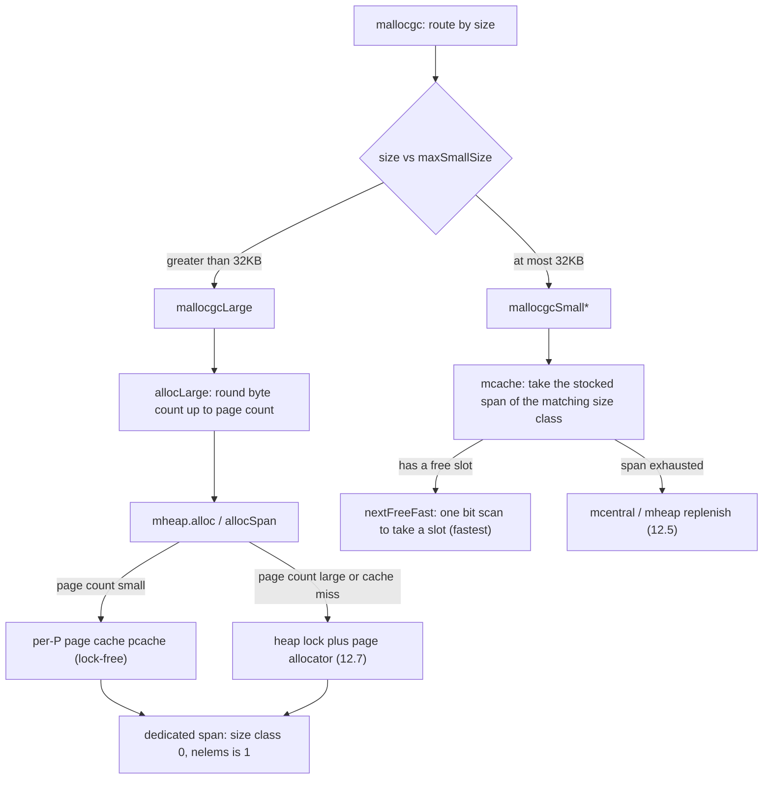

# 12.4 Large Object Allocation

The allocation hierarchy of [12.2](./component.md) was built for objects that are "small and frequent": a per-P mcache, a mcentral shared by size class, and a global mheap. These three cache layers collapse the vast majority of allocations into a handful of lock-free bit operations. But this delicate machine carries an implicit premise, that the object is small enough to fit into a size class. Once an object exceeds `maxSmallSize` (32768 bytes in go1.26, that is 32KB), it no longer fits into any size class slot, and the whole replenishment chain loses its meaning for it.

A large object takes a different road: it skips the mcache and mcentral and **requests a contiguous stretch of memory directly from the mheap by the page**, building a span for it alone. In terms of code this road is far shorter than the one for small objects, but short does not mean cheap. This section makes clear why it was designed to "bypass the cache", how exactly the road is walked, and what bypassing the cache costs in engineering terms.

## 12.4.1 Why Large Objects Do Not Enter the Cache

A cache pays off because of two assumptions: that the cached thing is **reused frequently**, and that its **size is uniform** enough to be stocked by class in advance. Small objects satisfy both, so the mcache keeps a span on hand for each size class, hits often, and amortizes down to nearly free. Large objects satisfy neither.

They are infrequent. Allocations above 32KB in a program are orders of magnitude fewer than small ones, and most are large buffers, large slices, or the backing arrays of large hash tables. Maintaining a per-P cache for infrequent objects means stocking goods that sit idle most of the time while the hit rate fails to rise, so the cache becomes pure memory waste.

Their sizes are scattered. Small objects are grouped into 68 size classes because sizes in that range are dense enough that the waste of quantizing to fixed tiers stays bounded (about 12.5% in the worst case, see [12.1](./basic.md)). Large object sizes span from 32KB to hundreds of MB. If we still stocked by size class, the number of classes would explode, and each class would rarely be reused even once. Rather than caching by class, it is better to take them one at a time, cutting the actual number of pages on demand.

This is the trade-off the layered allocator holds to throughout: **polish the hot path to the extreme, keep the cold path simple**. Small objects are the hot path, worth trading three cache layers and bitmaps for speed; large objects are the cold path, where the extra cache logic saves little time but adds memory and complexity out of nowhere. So go1.26 simply opens a separate entry for them, `mallocgcLarge`, which `mallocgc` routes to by size alongside the small-object `mallocgcSmall*` and the tiny-object `mallocgcTiny` (see [12.5](./smallalloc.md)). Each runs its own code, none dragging on the others.

## 12.4.2 Asking the Heap for Pages Directly

The trunk of large object allocation is very short. `mallocgcLarge` takes the mcache only to borrow its statistics and sampling fields; the real work of obtaining a span is handed to `mcache.allocLarge`. The latter does two things: it rounds the byte count up to a page count, then asks the mheap for that many pages:

```go
// mcache.allocLarge: build a dedicated span for one large object (sketch)
func (c *mcache) allocLarge(size uintptr, noscan bool) *mspan {
    // round the byte count up to a page count (page size is 8KB in go1.26)
    npages := size >> gc.PageShift
    if size&pageMask != 0 {
        npages++
    }
    // pre-deduct sweep credit: before allocating n pages, help sweep and reclaim n pages, to curb disorderly heap growth
    deductSweepCredit(npages*pageSize, npages)

    // size class 0 marks a "large object span"; noscan means the object holds no pointers
    spc := makeSpanClass(0, noscan)
    s := mheap_.alloc(npages, spc) // request pages from the global heap
    if s == nil {
        throw("out of memory")
    }
    // ... update largeAlloc statistics, advance heapLive, attach the span to the sweep list ...
    s.limit = s.base() + size // tighten limit down to where the object actually ends
    return s
}
```

Note the 0 in `makeSpanClass(0, noscan)`. Size class 0 is a reserved tier, dedicated to marking "this span holds only one large object". In a small-object span, `elemsize` is the fixed slot size looked up from the size class, and one span is cut into dozens or hundreds of equal slots; in a size class 0 span, `elemsize` equals the entire byte count of the span, `nelems` is 1, and the whole run of contiguous pages is a single object. Back in `mallocgcLarge`, once the span is obtained, all it takes is `freeindex = 1` and `allocCount = 1` to declare this sole slot occupied, and the object's address is the span's base address:

```go
span := c.allocLarge(size, typ == nil || !typ.Pointers())
span.freeindex = 1
span.allocCount = 1
span.largeType = nil          // do not let GC scan yet; wait until memory is zeroed and the type is written, then publish
size = span.elemsize
x := unsafe.Pointer(span.base())
```

The `mheap.alloc` that asks the heap for pages pushes the work to `allocSpan`, run on the system stack, because it may need to hold the heap lock, and while holding it we cannot trigger a stack growth that would request heap memory again. Inside `allocSpan`, contiguous pages are obtained along one of two paths:

```go
// mheap.allocSpan: obtain npages contiguous pages and assemble a span (sketch, omitting sweep/alignment details)
func (h *mheap) allocSpan(npages uintptr, typ spanAllocType, spc spanClass) (s *mspan) {
    pp := getg().m.p.ptr()
    // when the page count is small, first try the per-P page cache (pcache); this path needs no heap lock
    if pp != nil && npages < pageCachePages/4 {
        base, scav = pp.pcache.alloc(npages)
        if base != 0 {
            s = h.tryAllocMSpan()
            if s != nil {
                goto HaveSpan   // page cache hit, lock-free throughout
            }
        }
    }
    // page cache not enough, or too many pages wanted: fall to the heap lock, ask the page allocator (see 12.7) for contiguous pages
    lock(&h.lock)
    base, scav = h.pages.alloc(npages)
    if base == 0 {
        if _, ok := h.grow(npages); !ok { // no room left in the heap, grow from the operating system (see 12.7)
            unlock(&h.lock); return nil
        }
        base, scav = h.pages.alloc(npages)
    }
    s = h.allocMSpanLocked()
    unlock(&h.lock)
HaveSpan:
    h.initSpan(s, typ, spc, base, npages, scav) // set state, elemsize, zeroing flags, bitmap
    return s
}
```

The question "which run of contiguous pages is free" is answered by the **page allocator** beneath the mheap. Its radix tree and bitmap lookup are the subject of [12.7](./pagealloc.md); here we treat it merely as an interface that "gives me n contiguous pages". When the page allocator too has no room, `grow` asks the operating system for a new arena, and this even colder road also belongs to [12.7](./pagealloc.md). This section stops at `h.pages.alloc(npages)` and stays focused on the large object segment.

## 12.4.3 The Cost of Bypassing the Cache

A large object saves the stocking overhead of the cache, but it also loses the fast path the cache brings. Let us go through what bypassing the cache costs, item by item.

**The synchronization cost is higher, but it is not "necessarily grabbing the global lock".** go1.26 leaves a buffer in `allocSpan`: when the page count is small (`npages < pageCachePages/4`, with `pageCachePages` being 64, so roughly fewer than 16 pages, corresponding to within about 128KB on platforms with 8KB pages), it first tries the per-P page cache `pcache`, and on a hit the whole path is lock-free. So large objects from 32KB to about 128KB often do not touch the heap lock at all. The real gap is not in the single word "lock", but in the fact that a large object **has no ready cached span to pick from**: the fast path for a small object is one bit scan to take a slot from a span already stocked in the mcache (`nextFreeFast`, see [12.5](./smallalloc.md)), whereas a large object must run the full `allocSpan` every time, pre-deducting sweep credit (`deductSweepCredit`), querying the page allocator for contiguous pages, and assembling and initializing a new span, with a fall to the heap lock when the page cache misses or the page count is too large. Even on a page cache hit, the constant factor of this road is far heavier than one bit scan.

**Page-level internal fragmentation.** A large object is rounded up by the page, each object occupies a whole number of pages, and the part of the final page that falls short is wasted outright. An object of 32769 bytes (just one byte past 32KB) rounds up to 5 pages, that is 40960 bytes, wasting nearly 8KB. This fragmentation does not have the 12.5% ceiling of small-object size class fragmentation; it depends on the remainder of the object size relative to the page size, and in the worst case approaches a whole page. For large objects that are allocated frequently and whose size lands just past a page boundary, this waste is worth keeping in mind when designing data structures.

**Strongly influences GC pacing.** A large object adds a large amount to the heap live size (heapLive) in one stroke. In `allocLarge`, `gcController.update` immediately counts these tens or hundreds of KB into heapLive, and GC is triggered precisely on the growth ratio of heapLive relative to the live size after the last marking (GOGC, see [13](../ch13gc)). So the end of `mallocgcLarge` tests the trigger condition once, and when necessary starts a round of GC right there:

```go
// at the tail of large object allocation: check whether GC should be triggered (mallocgcLarge)
if t := (gcTrigger{kind: gcTriggerHeap}); t.test() {
    gcStart(t)
}
```

Small object allocation also advances heapLive, but each increment is small and thinned out by the mcache; a large object has a big single increment, and one allocation of a few MB may single-handedly push the heap past the trigger line, immediately setting off a round of GC. In other words, a large object is not only slow to allocate; it also passes the cost on to the whole program by way of GC pacing.

**Reuse large buffers with `sync.Pool`.** Since large objects are expensive to allocate and strongly influence GC, for those large buffers that are short-lived and repeatedly requested and released (such as network read/write buffers or serialization buffers), the most economical approach is to keep them from passing through the allocator over and over, using the `sync.Pool` of [11.6](../../part3concurrency/ch11sync/pool.md) to store used large buffers for reuse. This is exactly the piece of caching that the application layer is left to supply itself after the allocator decides "not to build a cache for infrequent large objects": the runtime optimizes only the general small-object hot path, and leaves the specific large-object reuse pattern to be cached on demand by the user who understands it best.

## 12.4.4 Contrast with the Small Object Path

Placing the two roads side by side makes the design intent of large object allocation clear:



All the delicacy on the small object side, the size classes, the per-P cached span, the bitmaps and bit scans, the `gcmarkBits` that lives alongside the sweep, exists to squeeze the high-frequency path to its limit. The large object side is nearly its opposite: one object one span, one allocation one run of contiguous pages, no cache to hit and no slot to pick. This is not that the large object path is less careful, but that its care lies elsewhere: it chooses simplicity, because on this cold path simplicity is itself the correct design.

Viewed within the lineage, this division of labor where "large objects bypass the thread cache and go straight to the page heap" is just like the prototype tcmalloc (see [12.1](./basic.md)): tcmalloc likewise bypasses the thread cache for large objects and requests pages directly from the page heap; jemalloc splits allocation into three tiers, small / large / huge, and the huge tier also goes straight to the chunk level without entering the tcache. What Go adds on top of this general skeleton is still the layer that serves precise GC: a large object span likewise carries `gcmarkBits` and type information (`largeType`), and likewise must pass a publication barrier before being published, so that GC can scan this large block of memory correctly (see [13](../ch13gc)). Large object allocation walks a simple road, but it never walks out of Go's main line of "allocation and reclamation living together".

## Further Reading

1. The Go Authors. *runtime/malloc.go.* (`mallocgcLarge`, size routing, and GC triggering)
   https://github.com/golang/go/blob/master/src/runtime/malloc.go
2. The Go Authors. *runtime/mcache.go.* (`mcache.allocLarge`: rounding to pages, sweep credit, and statistics)
   https://github.com/golang/go/blob/master/src/runtime/mcache.go
3. The Go Authors. *runtime/mheap.go.* (`mheap.alloc`, `allocSpan`, page cache and heap lock paths)
   https://github.com/golang/go/blob/master/src/runtime/mheap.go
4. Sanjay Ghemawat, Paul Menage. *TCMalloc: Thread-Caching Malloc.*
   https://google.github.io/tcmalloc/design.html (large objects bypass the thread cache and go straight to the page heap)
5. This book, [12.5 Small Object Allocation](./smallalloc.md): the delicate small-object path for contrast.
6. This book, [12.7 Page Allocator](./pagealloc.md): how `h.pages.alloc` finds contiguous free pages and how `grow` grows from the operating system.
7. This book, [11.6 Pool](../../part3concurrency/ch11sync/pool.md) and [Chapter 13 Garbage Collector](../ch13gc): reusing large buffers, and how large objects influence GC pacing.
