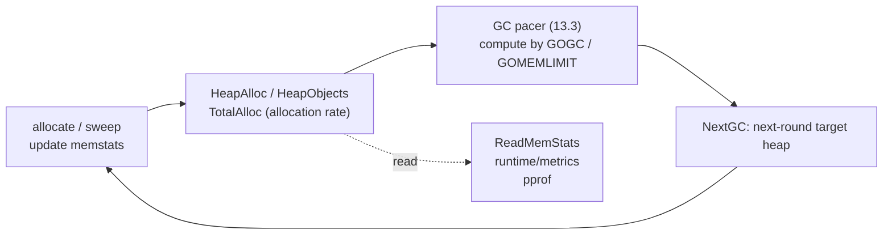

# 12.8 Memory Statistics

The allocator keeps books while it works. Every time it wholesales a stretch of address space from the operating system, carves out a span, or allocates or sweeps an object, the runtime accumulates the corresponding count into a set of global variables (`runtime.memstats`). These books are not a statistical report compiled after the fact; they are a running ledger written down in passing during allocation and reclamation. They serve two ends. Outwardly, they let users and monitoring systems see the memory shape of the process. Inwardly, both [the GC pacer (13.3)](../ch13gc/pacing.md) and [the soft memory limit `GOMEMLIMIT` (12.7)](./pagealloc.md) must read these books to decide "at what heap size should the next round of reclamation be triggered." In other words, the bookkeeping closes a feedback loop: allocation produces data, data drives decisions, and decisions in turn constrain allocation.

This section first makes clear the few most commonly misread fields in the ledger, then covers the two interfaces for reading them, and finally explains how this data drives the rhythm of GC and how to read it in pprof and in monitoring.

## 12.8.1 What Is in the Ledger: A Sketch of the Key Fields

`runtime.MemStats` is the snapshot structure exposed to the outside, with nearly thirty fields. Translating each one is pointless; what truly needs to be told apart are two parallel sequences. Below is a trimmed sketch, keeping only the fields relevant to "reading the memory shape," with comments explaining what each one measures:

```go
// runtime.MemStats (sketch): two parallel sequences + GC rhythm
type MemStats struct {
    // [memory actually in use: the Alloc / Inuse series]
    HeapAlloc    uint64 // bytes of live heap objects: includes those allocated but not yet swept by GC
    HeapInuse    uint64 // bytes of spans holding at least one object (includes internal fragmentation from size classes)
    HeapObjects  uint64 // number of live heap objects (= Mallocs - Frees)

    // [address space requested from the OS: the Sys series]
    Sys          uint64 // total virtual address space obtained from the OS, the sum of the XSys fields below
    HeapSys      uint64 // address space reserved for the heap (includes the reserved-but-uncommitted part, see 12.3)
    HeapIdle     uint64 // bytes of idle spans: no objects, can be returned to the OS or kept for reuse
    HeapReleased uint64 // physical memory already returned to the OS via madvise (still holds address space)

    // [GC rhythm]
    NextGC       uint64      // target heap size for the next GC round; the goal is HeapAlloc <= NextGC
    NumGC        uint32      // number of completed GC rounds
    PauseTotalNs uint64      // cumulative nanoseconds of STW pauses since program start
    PauseNs      [256]uint64 // STW pause durations for the most recent rounds (ring buffer)
}
```

Dividing the fields into two piles, "actually in use" and "address space," is the whole crux of reading memory statistics.

The first pile, `HeapAlloc`, `HeapInuse`, `HeapObjects`, measures the heap the program truly occupies at this moment. `HeapAlloc` is the byte count of live objects; note that it counts objects that are "already unreachable but not yet swept by GC" as live. Because sweeping proceeds [incrementally (13.5)](../ch13gc/sweep.md), `HeapAlloc` changes smoothly rather than in the sawtooth of a traditional STW collector. `HeapInuse` is slightly larger than `HeapAlloc`; the difference is the internal fragmentation left over after spans are carved by size class ([12.1](./basic.md)), and it gives an upper bound on fragmentation.

The second pile, `Sys` and its components `HeapSys`, `HeapIdle`, `HeapReleased`, measures the **virtual address space** requested from the operating system, not physical memory. This is exactly where misreading is most common. Go's heap reserves large contiguous stretches of address space from the OS at the granularity of an [arena (12.3)](./init.md); reserving merely claims the address and does not commit physical pages. Commit happens only when the memory is actually used, and when it is no longer needed the physical pages can be returned to the OS via `madvise(MADV_FREE/DONTNEED)`, while the address space is kept and never given back. A few relationships are worth remembering:

$$
\texttt{HeapIdle} - \texttt{HeapReleased} \approx \text{free physical memory the runtime keeps on hand, not yet returned to the OS}
$$

$$
\texttt{HeapInuse} - \texttt{HeapAlloc} \approx \text{memory already bound to some size class but not yet used (upper bound on fragmentation)}
$$

The conclusion is a single sentence: the `Sys` series (address space) being far larger than the `Alloc`/`Inuse` series (real occupation) is the norm, not a leak. The large `VIRT` you see in `top` is mostly just reserved-but-uncommitted address space; the "physical residency" you should really watch is closer to `Sys - HeapReleased`, or the `RSS` reported by the operating system. To judge whether there is a leak, look at whether `HeapAlloc` or `HeapObjects` rises monotonically over time, not at `VIRT`.

## 12.8.2 The Cost of Reading the Ledger: Why ReadMemStats Is Expensive

The traditional interface for reading these books from the outside is `runtime.ReadMemStats`:

```go
func ReadMemStats(m *MemStats) {
    _ = m.Alloc // do a nil check before switching stacks (issue 61158)
    stw := stopTheWorld(stwReadMemStats)
    systemstack(func() {
        readmemstats_m(m)
    })
    startTheWorld(stw)
}
```

The cost it must pay is written in the first line: `stopTheWorld`. Before reading, it must pause the entire world, flush every P's local mcache statistics back to the global state, copy `memstats` as a whole into the user's `MemStats`, and only then call `startTheWorld`. Why must this be STW? Because these books are scattered across each P's local cache; the allocation fast path ([12.5](./smallalloc.md)), to stay lock-free, updates only the local counts. To obtain a consistent global snapshot, all P's must stop, ensuring there is no concurrent allocation modifying the books.

The cost follows: `ReadMemStats` is a single global pause plus one large-structure copy, and the fields are a fixed whole set, all or nothing. If a monitoring system calls it every few seconds, it amounts to periodically injecting STW jitter into the program. In latency-sensitive services, this interface is not suitable for high-frequency sampling.

## 12.8.3 The Modern Interface: runtime/metrics

To resolve the threefold rigidity of "fixed fields + STW + all-or-nothing," Go 1.16 introduced [`runtime/metrics`](https://pkg.go.dev/runtime/metrics). It reshapes memory statistics from a hard-coded structure into an extensible "name-to-value" table. Each metric is named by a path with a unit, for example `/memory/classes/total:bytes`, `/gc/heap/live:bytes`, `/gc/pauses:seconds`. When reading, you declare only the few you care about, and the runtime fills only those:

```go
import "runtime/metrics"

// sample only the metrics I care about: live heap, heap goal, total address space, STW pause distribution
samples := []metrics.Sample{
    {Name: "/gc/heap/live:bytes"},         // live bytes marked by the last GC (drives pacing)
    {Name: "/gc/heap/goal:bytes"},         // target heap size for the next GC, corresponds to NextGC
    {Name: "/memory/classes/total:bytes"}, // total address space obtained from the OS, corresponds to Sys
    {Name: "/gc/pauses:seconds"},          // histogram of STW pause durations
}
metrics.Read(samples)

for _, s := range samples {
    switch s.Value.Kind() {
    case metrics.KindUint64:
        useUint(s.Name, s.Value.Uint64())
    case metrics.KindFloat64:
        useFloat(s.Name, s.Value.Float64())
    case metrics.KindFloat64Histogram:
        useHist(s.Name, s.Value.Float64Histogram()) // bucket boundaries + counts
    }
}
```

Relative to `ReadMemStats`, it is better in three places. First, it is selective: `metrics.Read` computes and fills only the `Sample`s you pass in, no longer "all or nothing," so sampling is lighter, and most metrics need no STW. Second, it is extensible: adding a metric is just adding a row to the table, and old code keeps running without change, whereas adding a field to `MemStats` requires changing the structure. Third, it can express distributions: the kind of a value is not limited to `uint64` and `float64`, there is also `KindFloat64Histogram`, so a quantity like "GC pause duration," which should really be viewed by quantile, can be obtained as a full histogram directly, whereas `MemStats.PauseNs` is only a 256-slot ring array from which you must compute quantiles yourself. The full set of available metrics is listed self-descriptively by `metrics.All()`, with names, units, kinds, and documentation.

The trade-off between the two interfaces can be set side by side:

| | `runtime.ReadMemStats` | `runtime/metrics` (1.16+) |
|---|---|---|
| Form | fixed structure, about 30 fields | name-to-value table, extensible |
| Collection | all at once, one STW | on demand, mostly no STW |
| Distribution | only a ring array (compute quantiles yourself) | native histogram |
| Evolution | adding a field changes the structure | adding a metric adds one row |
| Use | occasional one-off snapshot | high-frequency monitoring, preferred for new code |

New code should prefer `runtime/metrics`. `ReadMemStats` is still kept, its fields and semantics stable, suitable for writing one-off diagnostic scripts or reading those old fields that have no corresponding metric yet.

## 12.8.4 How the Ledger Drives Decisions

The real value of the bookkeeping lies not in "letting people see" but in "letting the runtime see for itself." The GC [pacer (13.3)](../ch13gc/pacing.md) is the largest consumer of these books. Its goal can be put in one sentence: let this round's allocation finish marking exactly before the heap grows to `NextGC`. `NextGC` is computed from the live amount marked in the previous round, $H_{\text{live}}$ (corresponding to `/gc/heap/live:bytes`), scaled by `GOGC`:

$$
\texttt{NextGC} = H_{\text{live}} \times \left(1 + \frac{\texttt{GOGC}}{100}\right)
$$

By default `GOGC=100`, so the next round of reclamation is triggered each time the heap grows by another full multiple of the previous round's live amount. The pacer also reads the allocation rate (obtained by differentiating cumulative counts like `Mallocs` and `TotalAlloc` over time) to decide when to start marking and how much CPU to give concurrent marking, so that the completion of marking and the growth of the heap "race" to a tie.

[The soft memory limit `GOMEMLIMIT` (12.7)](./pagealloc.md) is another consumer of the same books. When the actual occupation, something like `Sys - HeapReleased`, approaches the limit, the runtime proactively lowers the effective reclamation target and steps up returning idle physical pages to the OS (`/gc/gomemlimit:bytes` is the current limit), trading more frequent reclamation for staying within bounds. This path takes the tighter of the two constraints with `GOGC`, and together they determine `NextGC`.

So the loop closes: allocation writes down `HeapAlloc`, `HeapObjects`, `TotalAlloc`; the pacer reads them to compute `NextGC` and the marking rhythm; reclamation in turn rewrites these counts, and the next round sets its tempo from the new values. The bookkeeping is not a bystander; it is the sensor of the control system.



## 12.8.5 How to Read It in pprof and Monitoring

Down at the tooling level, this data has a few common entry points. The `/debug/pprof/heap` of `net/http/pprof` gives the heap profile (which piece of code allocated how much); its top `# runtime.MemStats` comment block prints exactly the fields above, and is the first glance for quickly judging the shape. On the command line, `GODEBUG=gctrace=1` prints one line per GC round, in which the CPU fraction is `GCCPUFraction` and the pause is the value of `PauseNs` for that round.

Monitoring systems, by contrast, should go through `runtime/metrics`: periodically `metrics.Read` a chosen few metrics and export them to a backend like Prometheus. The typical questions to answer and the corresponding metrics are a fixed few groups: whether there is a leak, watch whether `/gc/heap/objects:objects` rises monotonically; physical occupation, take `/memory/classes/total:bytes` minus `/memory/classes/heap/released:bytes`; whether GC is too frequent, watch the growth rate of `/gc/cycles/total:gc-cycles`; whether pauses exceed limits, watch the tail quantile of the `/gc/pauses:seconds` histogram. Plot these few as time series and the process's memory behavior is plain to see, without stopping the whole world for a single sample.

When reading these numbers, always carry that dividing line from 12.8.1: address space (the Sys series) is naturally on the large side, and what truly measures "how much memory the program ate" is the pile actually in use. Confusing the two is the most common, and most time-wasting, misjudgment in memory troubleshooting.

## Further Reading

1. The Go Authors. *Package runtime, type MemStats.*
   https://pkg.go.dev/runtime#MemStats (the authoritative semantics of each field, especially the state partition of the Heap series)
2. The Go Authors. *Package runtime/metrics.* https://pkg.go.dev/runtime/metrics
   (the extensible interface introduced in Go 1.16: `Sample`, `Value`, `All`, and all metric names and units)
3. The Go Authors. *runtime/mstats.go, runtime/metrics/description.go.*
   https://github.com/golang/go/tree/master/src/runtime (the STW implementation of `ReadMemStats` and bookkeeping details)
4. Michael Knyszek. *Proposal: API for unstable runtime metrics (runtime/metrics).* 2020.
   https://github.com/golang/go/issues/37112 (design motivation and trade-offs of the metrics interface)
5. The Go Authors. *A Guide to the Go Garbage Collector.*
   https://tip.golang.org/doc/gc-guide (how `GOGC`, `GOMEMLIMIT`, and the live heap determine GC rhythm)
6. This book: [13.3 Trigger Frequency and Its Pacing Algorithm](../ch13gc/pacing.md), [12.7 The Page Allocator and Memory Limit](./pagealloc.md), [12.3 Initialization and the Arena](./init.md).
7. This book: [Chapter 16 Tools and Observability](../../part5toolchain/ch16tools/readme.md) (hands-on use of pprof and metrics).
