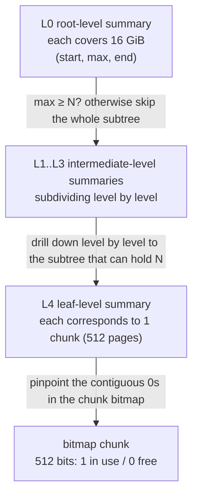

# 12.7 The Page Allocator

Beneath mheap ([12.2](./component.md)), the component that answers "which pages are free, which are in use" is the page allocator. It is the foundation of the entire allocator: when an mcentral runs out of spans it asks mheap for new pages, large objects ([12.4](./largealloc.md)) are requested directly by page, and every page a span occupies is ultimately carved out from here. The page allocator must also return pages that have stayed idle for a long time back to the operating system. These two responsibilities, one tied to the speed of allocation and the other to the resident memory of the process, are exactly the most enduring tension in Go's memory system.

This section first lays out the problem the page allocator has to solve, then looks at the early treap design and its weak spots, and then walks through the Go 1.14 rewrite that replaced it with a bitmap plus a radix tree, one of the cleanest examples of "swap the data structure, swap the performance." Finally we look at two mechanisms that live alongside it: the per-P page cache, and scavenging, which returns memory to the operating system, together with `GOMEMLIMIT`, that soft ceiling.

## 12.7.1 The Problem: Quickly Find a Run of Contiguous Free Pages

The core problem the page allocator has to answer is just one sentence: in the enormous heap address space, quickly find a run of contiguous free pages long enough. "Contiguous" is a hard constraint, since a span occupies several physically adjacent pages ([12.2](./component.md)) and cannot be cobbled together from scattered pieces. Around this one sentence, there are several more requirements that must be met at the same time:

- Both allocation and freeing have to be fast, and freed pages have to be reusable by later allocations;
- Multiple P's request pages concurrently, so the data structure must not be locked dead by a single global lock;
- The memory overhead of the metadata itself must be kept under control, since the heap can be very large (on 64-bit, the address space is measured in TiB).

Picture the heap as an extremely long paper tape, with each page a cell on the tape. Allocation is "find a run of empty cells long enough and color them black," and freeing is "color a stretch back to white." The whole difficulty lies in the conjunction of two words, "long enough contiguous" and "fast": checking whether a single cell is free is easy, the hard part is knowing "is there a run of $N$ empty cells from here on" without scanning cell by cell.

## 12.7.2 The Early Treap and Its Weak Spots

Before Go 1.14, the page allocator organized free page intervals with a treap, using the start address of an interval as the key of a binary search tree and a random priority to maintain heap order, thereby staying balanced in expectation. Each node is a run of contiguous free pages. Finding a free interval of length $N$, splitting the interval after allocation, and merging adjacent intervals after freeing were all done through the tree structure, with an expected complexity of $O(\log n)$ per operation, where $n$ is the number of free intervals.

This design was workable, but under large heaps and high concurrency it exposed three weak spots. First, $O(\log n)$ looks fine, but the larger the tree, the heavier the constant, since every lookup has to descend several levels from the root. Second, a treap is a dynamic structure linked by pointers, and every level descended is one round of possibly cache-missing pointer chasing; on modern CPUs the cost of a single LLC miss is worth a hundred-odd arithmetic instructions, and the tree's random memory layout means the cache can barely help. Third, and most fatal, the whole tree is protected by a single global lock, so any P requesting or freeing a page must first grab this lock, and as the core count grows, lock contention directly becomes the throughput bottleneck. In other words, the treap's problem is not in the asymptotic order of its algorithmic complexity, but in its memory access pattern and concurrency model, which do not fit multicore hardware.

## 12.7.3 The Go 1.14 Rewrite: Bitmap plus Radix Tree

Go 1.14 replaced the page allocator wholesale, switching to a bitmap plus a radix tree of summaries. This rewrite came from Michael Knyszek's proposal 35112, and its goal was precisely the three weak spots of the previous section.

### The Bitmap: One Bit per Page

At the bottom is a bitmap covering the entire heap address space, with each page corresponding to one bit, by convention `1` meaning in use and `0` meaning free. A page is 8 KiB, so "find a run of contiguous free pages" reduces to "find a run of contiguous 0s in the bitmap." The bitmap is sharded by chunk, and each chunk manages `pallocChunkPages = 1 << 9 = 512` bits, that is, 512 pages, 4 MiB of memory (smaller on Wasm). Alongside the chunk there is an equally long `scavenged` bitmap recording which free pages have already been returned to the operating system, used by scavenging ([12.7.5](#1275-returning-memory-to-the-operating-system)):

```go
// pallocData: the two bitmaps of one chunk (sketch, see mpallocbits.go)
type pallocData struct {
    pallocBits           // 512 bits: 1 in use, 0 free
    scavenged  pageBits  // 512 bits: 1 means this free page has been returned to the OS
}
```

The benefits of the bitmap are immediate: it is a contiguous stretch of memory, cache-friendly to scan; sharded by chunk, so both locking and returning can land at chunk granularity, no longer needing to lock the whole structure. But the bitmap alone is not enough, since on a large heap the bitmap itself is tens to hundreds of MiB, and finding a run of contiguous 0s by scanning bit by bit from the start is still too slow. The real speedup comes from the summary tree layered on top of the bitmap.

### Summaries: Compress a Stretch of Bitmap into Three Numbers

For any region of the bitmap, regarding "contiguous free pages" we really only need three numbers: how many free pages run from the start (`start`), how long the longest run of contiguous free pages inside the region is (`max`), and how many free pages run at the end (`end`). These three numbers are the summary of this region. Go packs them into an 8-byte `pallocSum`:

```go
// pallocSum: pack the three numbers (start, max, end) into 8 bytes (sketch, see mpagealloc.go)
type pallocSum uint64

func packPallocSum(start, max, end uint) pallocSum { /* bit-shift concatenation, each of the three takes 21 bits */ }
func (p pallocSum) start() uint { /* ... */ }
func (p pallocSum) max()   uint { /* key: the longest contiguous free run in this region */ }
func (p pallocSum) end()   uint { /* ... */ }
```

`max` is the most important field during lookup: to find a free run of length $N$, as long as some region's `max < N`, the whole region can be skipped without looking inside it. `start` and `end` serve another case: the contiguous run needed straddles exactly the boundary of two adjacent regions, and the `end` of the former plus the `start` of the latter adds up to $N$, which is also a candidate. The three numbers together let us judge, without drilling down into the bitmap, whether a region "can hold $N$, and roughly where to put it."

### The Radix Tree: Let the Search Skip Subtrees That Cannot Fit

The summaries are organized by level into a radix tree. At the leaf level each summary corresponds to one chunk (512 pages); going up, each level has one summary that captures the merged result of several summaries on the level below. On 64-bit platforms this tree has 5 levels, with each summary at the root level covering 16 GiB of address space, subdividing level by level down to one chunk at the leaf. The merge rule is intuitive: concatenate the `(start, max, end)` of adjacent summaries, and the new `max` takes the maximum of "the max of each segment itself" and "the end+start spliced across the boundary of two adjacent segments."



When looking up $N$ pages, walk top-down from the root level: at the current level scan a short stretch of adjacent summaries, skip every subtree with `max < N` wholesale, enter the first subtree that can hold $N$ and keep drilling down to the leaf level, then in that chunk's bitmap use bit operations to pinpoint the run of contiguous 0s. This is an address-ordered first-fit: it always returns the lowest address that satisfies the condition, packing the heap toward low addresses as much as possible.

A constant that looks arbitrary but is actually carefully chosen: the branching at each level uses `summaryLevelBits = 3` bits, that is, each level looks at $2^3 = 8$ adjacent summaries at a time. The reason for choosing 3 is that $8 \times 8 = 64$ bytes, exactly one cache line, so each level drilled down touches only one cache line. There is another memory-saving trick: this tree does not use dynamically allocated pointer nodes, but instead one large array per level, with the "parent-child relationship" expressed implicitly by index shifts (the children of node $i$ are the 8 starting at $i \ll 3$). So traversing the summary tree has no pointer chasing at all, only index arithmetic on contiguous arrays, which is precisely the targeted response to the treap's second weak spot.

### Allocation and Freeing: Incremental Maintenance of Summaries

After allocation fixes the address, set the corresponding bit in the bitmap to `1`, then walk up the radix tree recomputing the affected summaries level by level (`pageAlloc.update`). Freeing is its mirror: clear the corresponding bit in the bitmap to `0`, and likewise walk up updating the summaries, with adjacent free runs naturally "merging" in the recomputation of `max` and the boundary `start`/`end`, without the explicit node merge and rebalance of the treap. Since summaries are only updated along the single root-to-leaf path that was changed, the number of summaries touched by one allocation or freeing is also constant. A companion small optimization is `searchAddr`: it records the water line of "all pages below this address are already allocated, not worth searching again," moving down when freeing to a lower address, so that the next lookup can in most cases start from a position close to the answer, instead of walking again from the root every time.

### Complexity and Cost

The tree height is constant (always 5 on 64-bit), and each level only scans one cache-line's width of summaries, so the number of cache lines touched by one lookup has a constant upper bound, and the actual behavior is close to amortized $O(1)$, and extremely cache-friendly. Here we must be honest: in the worst case, if every level has to scan back and forth across 8 summaries, or the needed interval frequently straddles boundaries, it may still take a few extra steps, so strictly speaking it is not true $O(1)$, but relative to the treap's $O(\log n)$ with its random pointer layout, both the constant and the cache behavior are an order-of-magnitude improvement. The cost is real too: the summary arrays are reserved for the entire address space, and on 64-bit a fairly large virtual address space is reserved (reserved only, committed on demand, not immediately occupying physical memory), which is a trade of address space for lookup speed. Putting it alongside the trie of [11.7](../../part3concurrency/ch11sync/map.md) and the quad-heap of [9.10](../../part3concurrency/ch09sched/timer.md), they are all the same kind of example of "choosing the right data structure brings a qualitative change."

## 12.7.4 The Per-P Page Cache: A Lock-Free Fast Path

Although the radix tree's lookup is fast, it still has to hold `mheapLock`. To move this lock too off the hottest path, Go 1.14 also introduced a per-P page cache `pageCache`. It caches a small region of 64 pages, using a 64-bit integer as the bitmap, and when allocating a single page or a handful of pages it does bit operations directly on this integer, lock-free throughout:

```go
// pageCache: one per P, a lock-free fast path caching 64 pages (sketch, see mpagecache.go)
type pageCache struct {
    base  uintptr // the first address of this 64-page region
    cache uint64  // bitmap: 1 means this page is free (note: opposite of the global bitmap)
    scav  uint64  // bitmap: 1 means this page has been returned to the OS
}

func (c *pageCache) alloc(npages uintptr) (uintptr, uintptr) {
    if c.cache == 0 {
        return 0, 0 // cache is empty, fall back to the locking p.alloc
    }
    if npages == 1 {
        i := uintptr(sys.TrailingZeros64(c.cache)) // find the lowest free bit
        c.cache &^= 1 << i                          // mark in use
        return c.base + i*pageSize, /* scav byte count */ 0
    }
    return c.allocN(npages) // multiple pages: find contiguous 1s within the 64 bits
}
```

Only when the cache is empty does it hold the lock and call `allocToCache` to grab a region of 64 pages from the radix tree to refill. This is the same "shard per P, keep the lock behind the cold path" maneuver as mcache ([12.2](./component.md)) for small objects, `sync.Pool` ([11.6](../../part3concurrency/ch11sync/pool.md)) for temporary objects, and the scheduler's local run queue ([9.2](../../part3concurrency/ch09sched/steal.md)) for goroutines, which recurs again and again in the Go runtime. Note that in `cache` a `1` means free, the opposite of the global bitmap's convention, which makes "find a free page" degenerate into a single `TrailingZeros64`, exactly the same technique as `allocCache` in mspan.

## 12.7.5 Returning Memory to the Operating System

The other half of the page allocator's duty is to return long-idle pages to the operating system, a process called scavenging. Go does not return pages immediately when they become free: both returning and re-requesting trap into the kernel, and frequent round trips are costly, and a page just returned that is needed again triggers a page fault, which actually slows down allocation. So the strategy is restrained and gradual.

The action of returning falls on `sysUnused`, which is platform-dependent: on Linux it defaults to `madvise(MADV_FREE)`, telling the kernel "I no longer want the contents of these pages, you may reclaim the physical pages at any time when memory is tight," which is cheaper than `MADV_DONTNEED` (no immediate page fault), and can be switched back to the latter when necessary with `GODEBUG=madvdontneed=1`. The returned pages are set in the chunk's `scavenged` bitmap, and if they are later allocated out again, physical pages are re-provided by the kernel on demand.

Scavenging comes in two paths. One is the background scavenger: a resident goroutine `bgscavenge`, with a soft ceiling of taking only about 1% (`scavengePercent`) of mutator time, normally parked, and once woken it returns pages gradually from high addresses to low, sleeping for a while according to the workload after returning a batch, so as to avoid competing with the program for CPU. Its waking and throttling are connected to the background monitoring line of `sysmon` ([9.8](../../part3concurrency/ch09sched/sysmon.md)). The other is the synchronous scavenger at allocation time: when an allocation would break through the memory ceiling, or the heap has to grow, it returns some pages on the spot, because "the heap has to grow" itself means existing fragments cannot hold it, so it is a good moment to return fragments elsewhere along the way.

The scavenger's goal is to make the process's resident memory (the estimated RSS value) approach a target. How this target is set depends on whether a soft memory ceiling is set, see the next section.

## 12.7.6 The Soft Memory Ceiling GOMEMLIMIT

Without `GOMEMLIMIT`, the scavenger's return target floats with the GC's heap goal, and additionally keeps about `retainExtraPercent = 10%` of margin as a buffer: keeping a bit more memory unreturned for allocation saves some page-fault overhead. This is a reuse-leaning compromise between "hold the memory and reuse it faster" and "return it to the system and save more."

`GOMEMLIMIT` was introduced by Knyszek's proposal 48409 (landed in Go 1.19, carrying on the evolution of mechanisms such as `debug.FreeOSMemory` from Go 1.16 onward), giving the runtime a soft memory ceiling. Once a ceiling is set, the scavenger's target changes to watching "committed memory" (`memstats.mappedReady`) approach the ceiling, and reverses the direction of the buffer: the target is pressed to about `reduceExtraPercent = 5%` below the ceiling, and the closer to the ceiling the harder it returns, lest it actually overshoot. It is "soft" in that it does not enforce by refusing allocation, but by more aggressive GC and scavenging to press memory back down, so setting it too low makes the program fall into continuous GC, with CPU eaten up, a "GC thrashing," so the official advice is to leave a margin and tune it together with `GOGC`.

The value of `GOMEMLIMIT` is to fill the blind spot of the previous GC, which "only recognized the relative growth of the live heap (`GOGC`), not absolute memory": when a container has a fixed memory quota, you can set a soft ceiling slightly below the quota, letting the runtime proactively keep memory within the quota, instead of waiting to be killed by the OOM Killer. The return strategy evolving all the way from "gradual return at a fixed ratio" to "drivable by an absolute ceiling" is precisely a microcosm of Go's continuous tuning between memory footprint and allocation speed, a tension that runs through the entire memory system, and that will also converge with the pacing of GC in [13 Garbage Collection](../ch13gc).

## Further Reading

1. Michael Knyszek. *Proposal: Scalable page allocator.* (The Go 1.14 page allocator rewrite, bitmap + radix tree)
   https://go.googlesource.com/proposal/+/master/design/35112-scaling-the-page-allocator.md
2. The Go Authors. *runtime/mpagealloc.go.* (pageAlloc, pallocSum, radix tree lookup find)
   https://github.com/golang/go/blob/master/src/runtime/mpagealloc.go
3. The Go Authors. *runtime/mpagecache.go, mpallocbits.go.* (per-P page cache, chunk bitmap pallocData)
   https://github.com/golang/go/blob/master/src/runtime/mpagecache.go
4. The Go Authors. *runtime/mgcscavenge.go.* (background and synchronous scavenger, derivation of the return target)
   https://github.com/golang/go/blob/master/src/runtime/mgcscavenge.go
5. Michael Knyszek. *Proposal: Soft memory limit.* (`GOMEMLIMIT`, Go 1.19)
   https://go.googlesource.com/proposal/+/master/design/48409-soft-memory-limit.md
6. The Go Authors. *A Guide to the Go Garbage Collector.* (the interplay and tuning of `GOGC` and `GOMEMLIMIT`)
   https://go.dev/doc/gc-guide
7. This book [12.2 Components](./component.md), [9.8 System Monitoring](../../part3concurrency/ch09sched/sysmon.md),
   [13 Garbage Collection](../ch13gc).
