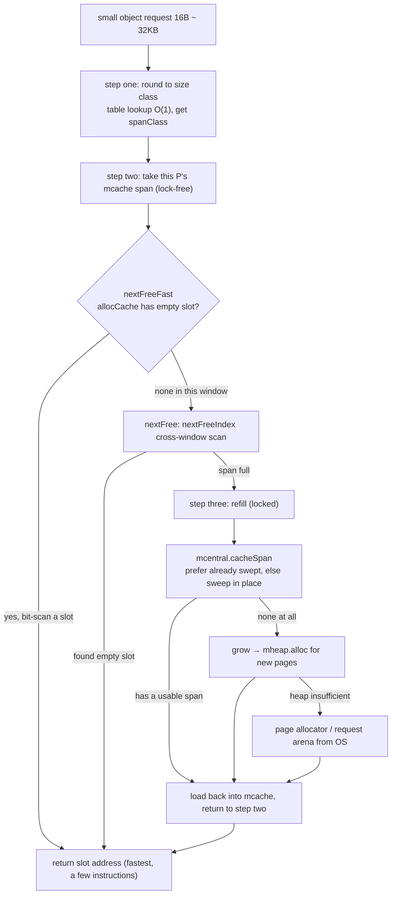

# 12.5 Small Object Allocation

Small objects are those whose size falls between 16B and 32KB (in go1.26, `maxSmallSize = 32768`). They are the most common kind of allocation in a Go program: a struct, the backing array of a modest slice, the result of a string concatenation, the vast majority land in this range. The path the allocator designs for them is the main stage of the mcache → mcentral → mheap hierarchy from [12.2](./component.md), and it is where the whole allocator's "lock-free fast path" design ([12.1](./basic.md)) makes good on its performance promise.

This section reads a single small-object allocation as three steps: first **round the requested size up to a size class**, then **take a slot lock-free from the current P's mcache**, and only when that fails fall into the **locked refill** slow path. By the end we will see that, in the common case, allocating a small object is no more than "look up a table once, scan some bits once, nudge a cursor once," and the slow path only backstops this fast path.

## 12.5.1 Step One: Round the Size Up to a Size Class

The allocator does not manage a separate kind of memory block for "exactly 37 bytes." It divides the size space from 16B to 32KB into 68 **size classes** ([12.1](./basic.md)), each corresponding to a fixed object size (8, 16, 24, 32, 48, and so on up to 32768), and when allocating it rounds the request up to the nearest size class. To do this in $O(1)$, it relies on two precomputed lookup tables (computed by `mksizeclasses.go`):

```go
// Map the requested size to a size class, then take that class's actual object size (sketch)
var sizeclass uint8
if size <= gc.SmallSizeMax-8 {           // SmallSizeMax = 1024
    sizeclass = gc.SizeToSizeClass8[divRoundUp(size, gc.SmallSizeDiv)]   // step 8
} else {
    sizeclass = gc.SizeToSizeClass128[divRoundUp(size-gc.SmallSizeMax, gc.LargeSizeDiv)] // step 128
}
size = uintptr(gc.SizeClassToSize[sizeclass]) // the real allocation size after rounding
spc := makeSpanClass(sizeclass, noscan)       // size class + whether it holds pointers = spanClass
```

Why two tables? Size classes are packed densely in the small range and sparsely in the large range (below 1024 in 8-byte steps, above it in 128-byte steps). Using two tables with different steps (`SmallSizeDiv = 8`, `LargeSizeDiv = 128`) compresses the mapping into two array index reads, avoiding any loop or division. `divRoundUp` is also just a multiply-add, never reaching a true division instruction.

Rounding inevitably introduces **internal fragmentation**: a request for 33 bytes lands in the 48-byte size class, wasting 15 bytes. The size class tiers are carefully tuned, with the goal of keeping the worst-case waste (`max waste`) within an acceptable bound. The largest tier in the table is class 67: object and span are both 32768 bytes, taking a full page each, wasting 12.5%. That 12.5% is not a coincidence but an upper bound the tier design deliberately holds: denser size classes mean smaller fragmentation but more metadata and more span kinds, and this is the compromise the allocator strikes between "save memory" and "fewer kinds."

That last line, `makeSpanClass`, is worth a mention: the size class is doubled again to distinguish **with pointers** from **without pointers** (noscan), two kinds of `spanClass`. The latter's spans need not be scanned by the GC ([13](../ch13gc)), and storing them separately lets sweep and mark skip whole stretches of pointer-free memory. So the mcache is indexed by `spanClass` rather than `sizeclass`: 68 size classes correspond to 136 spanClasses.

## 12.5.2 Step Two: Take a Slot Lock-Free from the mcache

With `spc` in hand, the allocator directly takes the mspan cached for this spanClass in the current P's mcache, and plucks an empty slot from it. Because each P has its own mcache and at any instant it is held by only one M ([12.2](./component.md)), this step **needs no lock at all**:

```go
span := c.alloc[spc]       // take the span this P has cached for this size class
v := nextFreeFast(span)    // find the next empty slot within the span: one bit scan
if v == 0 {
    v, span, checkGCTrigger = c.nextFree(spc) // local span exhausted, fall into the slow path
}
```

The fastest step hides inside `nextFreeFast`. Each mspan uses an `allocCache` (a `uint64`) to cache the occupancy of the 64 slots near `freeindex`, and stores the **inverted** bitmap (empty slot is 1). So "find the next empty slot" degenerates into "find the lowest 1 bit," which a single `TrailingZeros64` instruction (count trailing zeros) can locate:

```go
// Find the next free slot within the span: one bit operation, lock-free (sketch)
func nextFreeFast(s *mspan) gclinkptr {
    theBit := sys.TrailingZeros64(s.allocCache) // find the lowest free bit in allocCache
    if theBit < 64 {
        result := s.freeindex + uint16(theBit)
        if result < s.nelems {
            freeidx := result + 1
            if freeidx%64 == 0 && freeidx != s.nelems {
                return 0 // crossed the boundary of the current 64-bit window, let the slow path refresh the cache
            }
            s.allocCache >>= uint(theBit + 1) // advance the cache, shifting out the allocated bit
            s.freeindex = freeidx             // advance the scan cursor
            s.allocCount++
            return gclinkptr(uintptr(result)*s.elemsize + s.base()) // slot address = base + index×slot size
        }
    }
    return 0 // allocCache is all 0: no empty slot in this window, must take the slow path
}
```

The whole fast path is just these few instructions: one bit scan, one shift, one multiply-add for the address, all lock-free, never descending into the function call stack. Returning 0 happens in only two situations: the current 64-bit window has been scanned through (`theBit == 64` or crossing the window boundary), or the span really is full. Both are handed to the slow path, which takes care of refreshing `allocCache` or swapping in a new span. `nextFreeFast` does not refresh the cache and does not cross windows, precisely to keep it as short as possible, so that the hottest path has not a single superfluous move.

## 12.5.3 Step Three: Slow-Path Refill

When `nextFreeFast` returns 0, we enter `nextFree`. It first does a "complete" scan with `nextFreeIndex`; this version crosses the 64-bit window and, as needed, calls `refillAllocCache` to reload the next segment of `allocBits` into `allocCache`, so it can find the slots `nextFreeFast` skipped over. Only when the scan reaches `s.nelems` (the span really is full) is an actual refill required:

```go
func (c *mcache) nextFree(spc spanClass) (v gclinkptr, s *mspan, checkGCTrigger bool) {
    s = c.alloc[spc]
    freeIndex := s.nextFreeIndex() // complete cross-window scan, refreshes allocCache as needed
    if freeIndex == s.nelems {      // the span really is full
        c.refill(spc)               // return the full span to mcentral, swap in one with empty slots
        checkGCTrigger = true       // a refill was triggered, also check whether GC should start
        s = c.alloc[spc]
        freeIndex = s.nextFreeIndex()
    }
    v = gclinkptr(uintptr(freeIndex)*s.elemsize + s.base())
    s.allocCount++
    return
}
```

`refill` is the first link in the refill chain: it hands the now-full span back to the mcentral for the corresponding size class (`uncacheSpan`), then takes a new span with empty slots from there (`cacheSpan`) and loads it back into `c.alloc[spc]`. Accessing the mcentral here is **locked**; go1.26 also flushes a batch of statistics along the way (used slot count, `heapLive`, tiny count), and marks the new span's `sweepgen` as "cached" to keep it from being snatched by the asynchronous sweeper while it is cached.

The mcentral layer is the meeting point of allocation and sweeping ([13.5](../ch13gc/sweep.md)). The order in which `cacheSpan` takes a span reflects the "bucket by sweep generation" design ([12.2](./component.md)):

```go
// Ask mcentral for a span with empty slots (sketch, trace and statistics omitted)
func (c *mcentral) cacheSpan() *mspan {
    deductSweepCredit(spanBytes, 0) // the "sweep as much as you allocate" quota mechanism

    sg := mheap_.sweepgen
    if s = c.partialSwept(sg).pop(); s != nil { // 1. preferred: already swept, has empty slots
        goto havespan
    }
    // 2. next: unswept but possibly has empty slots, sweep in place then use (spanBudget caps at 100 tries)
    for ; spanBudget >= 0; spanBudget-- {
        s = c.partialUnswept(sg).pop()
        if s == nil { break }
        if s, ok := sl.tryAcquire(s); ok {
            s.sweep(true)             // sweep in place, turning dead objects' slots back into usable ones
            goto havespan
        }
    }
    // 3. next still: scan unswept full spans, sweep, and use if a slot frees up (likewise, omitted)
    // 4. none of the above: ask mheap for new pages to carve out a span
    s = c.grow()

havespan:
    // refresh allocCache with allocBits at freeindex, adjust alignment, hand to mcache
    s.refillAllocCache(s.freeindex / 8)
    s.allocCache >>= s.freeindex % 64
    return s
}
```

`deductSweepCredit` is the execution point of **lazy sweeping** ([13.5](../ch13gc/sweep.md)): after the GC mark phase ends, the runtime does not immediately sweep every span, but apportions the sweeping across subsequent allocations, where whoever allocates helps sweep a little, avoiding one stop-the-world-style big sweep. So the slow path of small object allocation is not just "grab a block of memory"; it also advances garbage collection along the way.

At the end of the refill chain is `grow`: when the mcentral has no usable span at all, it requests pages from the global mheap and carves them into a new span of equal-sized slots. This step in turn pulls in the page allocator ([12.7](./pagealloc.md)) and even requesting an arena from the operating system ([12.3](./init.md)), the most expensive and rarest hit, sharing `mheap.alloc` with large object allocation ([12.4](./largealloc.md)):

```go
func (c *mcentral) grow() *mspan {
    npages := uintptr(gc.SizeClassToNPages[c.spanclass.sizeclass()])
    s := mheap_.alloc(npages, c.spanclass) // ask the global heap for npages pages
    if s == nil {
        return nil
    }
    s.initHeapBits() // initialize this span's GC bitmap
    return s
}
```

## 12.5.4 Inside a Span: Finding a Slot with the Free Bitmap

The core action that recurs across the three-step path is "find the next empty slot within a span." This is driven entirely by two sets of bitmaps, and understanding it ties the whole path together.

Each mspan maintains two layers of bitmap ([12.2](./component.md)). The lower layer is `allocBits`, a `*gcBits`, where each bit corresponds to one slot and records whether it is allocated. The upper layer is `allocCache`, a `uint64`, which caches the 64 bits of `allocBits` starting at `freeindex` after **inverting** them (empty slot is 1), letting the bit scan use `TrailingZeros64` directly. `refillAllocCache` is responsible for loading the next segment from `allocBits` when `freeindex` crosses a 64-bit window:

```go
// Refresh allocCache with the next segment (8 bytes) of allocBits, inverting so empty slots are 1 (sketch)
func (s *mspan) refillAllocCache(whichByte uint16) {
    bytes := (*[8]uint8)(unsafe.Pointer(s.allocBits.bytep(uintptr(whichByte))))
    aCache := uint64(0)
    aCache |= uint64(bytes[0])
    aCache |= uint64(bytes[1]) << (1 * 8)
    // ... assemble byte by byte to fill 8 bytes = 64 bits ...
    aCache |= uint64(bytes[7]) << (7 * 8)
    s.allocCache = ^aCache // invert: a 0 (empty) in allocBits becomes a 1 in allocCache
}
```

`freeindex` is the cursor of this mechanism: the scan only moves forward from `freeindex`, never looking back at the slots before it. This brings "find an empty slot" down from traversing the whole span to "do bit operations within a sliding 64-bit window," the key to amortized $O(1)$. The cost is that slots before `freeindex` that were freed in this round will not be reused until the next round of GC sweep resets `freeindex`.

So when do the 1s in `allocBits` turn back into 0, making slots usable again? The answer lies in sweeping ([13.5](../ch13gc/sweep.md)). The GC mark phase records live objects in `gcmarkBits`; when sweeping, the runtime does not clear the `allocBits` of dead objects one by one, but instead **points `allocBits` directly at `gcmarkBits`**, then allocates a freshly zeroed new bitmap for `gcmarkBits`. With one pointer swap, the slots of all dead objects collectively turn back into allocatable, "sweep-free." This is precisely the **symbiotic** interface between allocator and GC that [12.1](./basic.md) describes: allocation reads `allocBits`, reclamation writes `gcmarkBits`, the two joined by a single pointer swap, and the allocation path need not know at all whether a slot was "never used" or "died last round and was reclaimed."

## 12.5.5 Why This Design Is Fast, and What It Means for Performance

Taking the three steps together, a small object allocation that lands on the fast path costs: one size-class table lookup ($O(1)$), one `TrailingZeros64` bit scan, one shift, one address computation, all lock-free. Three design choices together produce this "nearly free" common case:

- **Size classes turn locating into a table lookup**: fixed tiers degenerate both "how much to allocate" and "which span to take from" into array indices, requiring no search.
- **Per-P mcaches eliminate contention**: the fast path touches no shared state, multi-core concurrent allocation does not block one another, at the cost of each P holding its own cache, and objects cannot be reused directly between Ps (they must be relayed through mcentral). This is the same "layer to reduce contention" move as the scheduler's local run queues ([9.2](../../part3concurrency/ch09sched/steal.md)) and `sync.Pool`'s per-P sharding ([11.6](../../part3concurrency/ch11sync/pool.md)).
- **Bitmaps turn taking a slot into bit operations**: `allocBits` + `allocCache` + `freeindex` compress "find an empty slot" into one bit-scan instruction, and join with the GC's sweep through a pointer swap, so reclamation costs allocation almost nothing.

The further down we go, the greater the synchronization cost and the lower the hit frequency: mcache is lock-free, mcentral locks and sweeps along the way, mheap moves the page allocator, and below that come system calls. The whole point of the layered cache is to make the hottest path a few lock-free bit operations and hold the expensive locks and system calls behind ever colder layers.

This conclusion has a direct corollary for those writing Go programs: **a single small object allocation is already so fast it can almost be ignored; the real cost is in the "number" of allocations and the pressure they put on the GC**. Every object that escapes to the heap must ultimately be marked and swept; the more and the more often you allocate, the greater the GC's workload and the more frequently it triggers. So the leverage point for optimizing memory is rarely "make a single allocation faster," but **to allocate less**: keeping objects on the stack through escape analysis ([15.5](../../part5toolchain/ch15compile/escape.md)) so they never enter the heap at all, or reusing objects with `sync.Pool` ([11.6](../../part3concurrency/ch11sync/pool.md)) to thin "allocate + reclaim" down to "lend out + return." The allocator has already done its own part to the limit; the rest of the savings are in the caller's hands.

At this point the small object's "from near to far" refill path can be drawn in full, and it is exactly the performance of the refill chain from [12.1](./basic.md):



In the diagram, the lower a branch sits the colder it is: the vast majority of allocations return at the very `nextFreeFast` step, the links after `refill` trigger only when the local span is exhausted, and `grow` and system calls are rarer still. Together with tiny object allocation ([12.6](./tinyalloc.md)) and large object allocation ([12.4](./largealloc.md)), this forms the three main paths of the Go allocator facing requests of different sizes.

## Further Reading

1. The Go Authors. *runtime/malloc.go (`mallocgcSmallNoscan` / `mallocgcSmallScanNoHeader` /
   `nextFreeFast` / `mcache.nextFree`).* go1.26.
   https://github.com/golang/go/blob/master/src/runtime/malloc.go
2. The Go Authors. *runtime/mcache.go (`refill`), mcentral.go (`cacheSpan` / `grow`).* go1.26.
   https://github.com/golang/go/blob/master/src/runtime/mcache.go
3. The Go Authors. *runtime/mbitmap.go (`nextFreeIndex` / `refillAllocCache`, the bit scan of allocBits
   and allocCache).* go1.26.
   https://github.com/golang/go/blob/master/src/runtime/mbitmap.go
4. The Go Authors. *internal/runtime/gc/sizeclasses.go (the 68 size classes, `SizeToSizeClass8/128`,
   worst-case 12.5% waste).* go1.26.
   https://github.com/golang/go/blob/master/src/internal/runtime/gc/sizeclasses.go
5. Sanjay Ghemawat, Paul Menage. *TCMalloc: Thread-Caching Malloc.*
   https://google.github.io/tcmalloc/design.html (the prototype idea of size classes + thread cache)
6. This book [12.2 Components](./component.md), [12.6 Tiny Object Allocation](./tinyalloc.md),
   [13.5 Sweeping and Bitmaps](../ch13gc/sweep.md) (the swap of allocBits ← gcmarkBits).
7. This book [15.5 Escape Analysis](../../part5toolchain/ch15compile/escape.md),
   [11.6 sync.Pool](../../part3concurrency/ch11sync/pool.md) (two ways to reduce the number of allocations).
