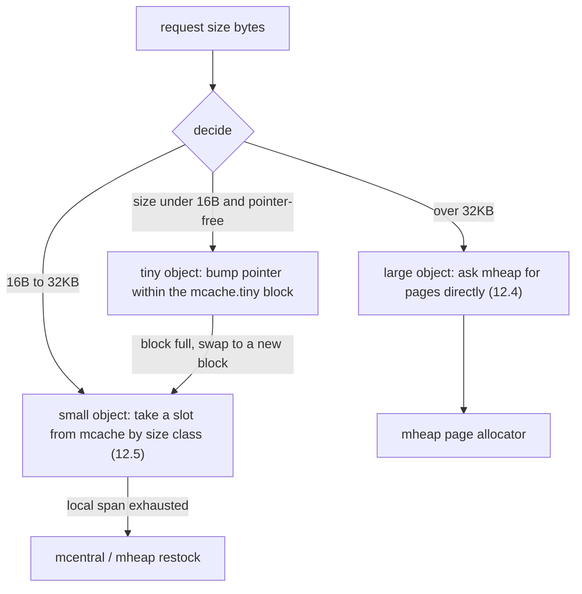

# 12.6 Tiny Object Allocation

The previous two sections walked through the two ends of the allocator. Large objects ([12.4](./largealloc.md)) bypass the cache and ask the mheap for memory by the page directly; small objects ([12.5](./smallalloc.md)) pull an equal-sized slot from the per-P mcache according to their size class. This section fills in the last and least conspicuous category of object, the **tiny object**: those smaller than 16 bytes and free of pointers. They are extremely numerous and individually tiny, so if each were also given a slot by size class, the waste would be astonishing. Go sets up a dedicated path for them, packing multiple tiny objects **into the same block**, and trades one simple "bump pointer" technique for sizable memory savings.

## 12.6.1 The Problem: Stuffing a `bool` into a 16-byte Slot

Recall the cost of small object allocation. Size classes are discrete: to allocate $n$ bytes, the actual space taken is "the nearest size class no smaller than $n$" ([12.1](./basic.md)). The smallest few size classes are 8, 16, and 24 bytes. So a 1-byte `bool` that escapes to the heap takes up a full 8-byte slot, wasting $7/8$; a 5-byte string fragment likewise occupies 8 bytes. For a single allocation, this internal fragmentation is of no consequence; but tiny objects are surprisingly common in real programs:

- short fragments produced when concatenating or slicing `[]byte` and `string`;
- scalar temporaries that escape to the heap, such as boxing a small integer into an `interface{}`;
- small variables forced onto the heap by taking the address in `for range`, by closure capture, and similar situations.

Each of these objects is under 8 bytes, yet each takes a slot of its own. Summed up, the waste is no longer a rounding error. If several tiny objects could be **packed side by side into one slot**, sharing the same stretch of memory, the saving would be immediate. This is exactly what the tiny object allocator does.

## 12.6.2 The Tiny Object Allocator: One Block, One Offset

The technique itself is plain. The mcache reserves two fields for tiny objects ([12.2](./component.md)): `tiny`, the start address of the 16-byte block currently being filled, and `tinyoffset`, the offset within the block already used.

```go
type mcache struct {
    tiny       uintptr // start address of the current tiny block (a stretch of 16B memory)
    tinyoffset uintptr // offset of the next available position within the block
    // ... remaining fields in 12.2
}
```

A single tiny allocation is just **a bump of the pointer** in the current block: align from `tinyoffset`, carve out `size` bytes, and push the offset forward. If the current block cannot hold it, ask for a new 16-byte block. A trimmed sketch (`mallocgcTiny` in `runtime/malloc.go`):

```go
// tiny allocation: bump the pointer in the current 16B block, swap blocks if it won't fit (sketch)
off := c.tinyoffset
// conservatively align the offset by the required alignment: let each object in the block land on a natural boundary
if size&7 == 0 {
    off = alignUp(off, 8)
} else if size&3 == 0 {
    off = alignUp(off, 4)
} else if size&1 == 0 {
    off = alignUp(off, 2)
}

if off+size <= maxTinySize && c.tiny != 0 { // maxTinySize = 16
    // the current block fits: carve a piece, advance the offset, return immediately (fastest path, no zeroing)
    x := unsafe.Pointer(c.tiny + off)
    c.tinyoffset = off + size
    c.tinyAllocs++
    return x
}

// the current block doesn't fit: ask the small-object mechanism for a new 16B noscan slot
span := c.alloc[tinySpanClass]
v := nextFreeFast(span)
if v == 0 {
    v, span, _ = c.nextFree(tinySpanClass)
}
x := unsafe.Pointer(v)
(*[2]uint64)(x)[0] = 0 // zero the whole block in one shot
(*[2]uint64)(x)[1] = 0
// between the new block and the old one, keep the one with more remaining space as the "current block"
if size < c.tinyoffset || c.tiny == 0 {
    c.tiny = uintptr(x)
    c.tinyoffset = size
}
```

A few points deserve highlighting.

**Alignment is conservative.** The offset is rounded up to the alignment inferred from the object's size: multiples of 8 align to 8, multiples of 4 to 4, and so on. The runtime does not know what type this memory will be treated as, so it can only give an alignment by size that will not go wrong, letting every object in the block land on its natural boundary. The cost is that a few bytes of alignment hole may be left in the block, but this is the only safe choice when the type is unknown (on 32-bit platforms a 12-byte object must additionally align to 8, lest its first 64-bit word fault under atomic access; see go.dev/issue/37262).

**The new block comes from the small-object mechanism.** Swapping blocks is nothing special: it goes to `c.alloc[tinySpanClass]` to take a size-class-2 (16-byte) slot marked noscan, first doing a `nextFreeFast` bit scan, and if that comes up empty, taking the slow `nextFree` path to restock. In other words, the tiny object allocator is **built on top of the small object allocator**: the small-object mechanism delivers an ordinary 16-byte slot, and the tiny object allocator then chops it up and reuses it. The value of `tinySpanClass` confirms this; it is `tinySizeClass<<1 | 1`, that is, size class 2 plus the noscan flag bit.

**When "swapping blocks", keep the emptier one.** The condition `size < c.tinyoffset` reads as: the new block uses up `size` and has `16-size` left, the old block has `16-tinyoffset` left; when `size < tinyoffset` the new block has more left, so it is made the current block, otherwise the old block stays in use. This small heuristic keeps subsequent allocations bumping in the block with "more remaining space", raising the success rate of packing. The displaced old block is not lost; it still belongs to that span, it is just no longer the mcache's "current block".

**The timing of zeroing changed, but the semantics did not.** When a new block is taken, those two `uint64` writes **zero the whole 16-byte block in one shot**; from then on each bump in the block only advances the offset forward, never reusing an already-carved region. So every tiny object receives already-zeroed memory, the zeroing is simply done in bulk when the block is taken rather than per object. This serves the same purpose as "zero on demand" in small object allocation, saving the cost of doing a separate `memclr` for each tiny allocation.

## 12.6.3 Why It Must Be Pointer-Free

The tiny object allocator accepts only **noscan** (pointer-free) objects. This is not an optimization but a precondition for correctness.

A block holds several logical objects side by side, but the garbage collector ([13](../ch13gc)) sees **the whole block as one allocation unit**: whether the block is live depends on whether any pointer still points to anywhere inside the block; as long as one sub-object is reachable, the whole block will not be collected ([13.5](../ch13gc/sweep.md)). This brings two constraints. First, GC scanning works at the granularity of a span slot, and if some sub-object in the block contained pointers, the scanner could not cleanly tell, within a "many objects sharing one slot" layout, which words are pointers and from where to keep tracing; limiting tiny objects to pure scalar data lets the scanner skip this slot wholesale, keeping the GC logic simple. Second, multiple sub-objects share a life and death, which means that as long as one is still alive, the rest stay parked in memory even if already dead. If these "free-riding" dead objects were allowed to hold pointers, the objects they pointed to would be kept alive along with them, and the waste would amplify uncontrollably down the pointer chain. Limiting to scalar data fences the waste firmly within "at most one block".

Precisely because a block's life and death are whole, an object obtained from the tiny object allocator **cannot be explicitly freed**, nor can a finalizer be set on it directly; the runtime keeps special handling in `SetFinalizer` for pointers that may come from a tiny block, allowing a finalizer to be set on some byte within the block (see [13](../ch13gc) and `runtime/mfinal.go`).

## 12.6.4 Why 16 Bytes: The Trade-off Between Packing and Waste

The block size `maxTinySize` is tunable, currently set to 16 bytes. Behind this number is a set of clear quantitative trade-offs, and it is the most worthwhile point to ponder in this design.

Let the block size be $B$. The worst case is: a block packs in several sub-objects, then all but one die, but that one stays alive, so the whole block cannot be collected. At this point the truly useful memory can be as low as one minimal sub-object, and the waste approaches the whole block. Taking the minimal sub-object toward $0$ and the sum of sub-objects toward $B$, relative to the small-object scheme (where each tiny object would have taken its own size-class slot), the worst-case amplification is about

$$
W_{\text{worst}}(B) \approx \frac{B}{B/2} = 2 \quad (B = 16)
$$

that is, at worst about twice the memory. The source code states this trade-off plainly: at $B=8$ there is almost no waste, but the chances to pack things together are also fewer; at $B=32$ the packing chances are greater, but the worst-case waste rises to about fourfold; and no matter how large the block, the **best-case** saving is about 8-fold (multiple tiny objects that would each have taken a slot now share one block). 16 bytes is the compromise between "packing enough" and "at worst only doubling".

The gains are real. The runtime comments give a set of measurements: on a JSON benchmark, the tiny object allocator cut allocation count by about $12\%$ and heap volume by about $20\%$. Considering that it serves only the narrow category of "pointer-free objects smaller than 16 bytes", such an overall gain is exactly what shows how prevalent this kind of object is under real workloads.

## 12.6.5 Three Paths: The Allocator Teaching by Aptitude

At this point the allocator has a tailored path for each of three kinds of object, and together they are the design principle of [12.1](./basic.md) put into practice:



The three paths are not on equal footing. Large and small objects guard the two ends of the memory-size scale; the tiny object **parasitizes** the small object path, for when it swaps blocks it asks for nothing more than an ordinary 16-byte noscan slot, only that before delivering it to the user, `tiny`/`tinyoffset` first chop this slot into several reused pieces. The order of the decision also tracks hotness: the vast majority of allocations are small and tiny objects, taking the lock-free fast path of the mcache; large objects are rare and expensive, falling to the locked mheap. Making the hottest tiny objects into a few pointer bumps, and leaving the coldest large objects to system calls, this teaching by aptitude of "allocating different techniques by the object's size and lifetime" is the distillation of all the allocator's ingenuity.

Two engineering details are worth mentioning; they do not change the main line above. First, under `sizeSpecializedMallocEnabled` the newer runtime generates specialized allocation functions for each size (`mallocgcTinySC2` and the like), dispatching directly by size to spare branches, with logic consistent with the `mallocgcTiny` described in this section. Second, to fix a security problem (go.dev/issue/76356), allocations marked "secret" bypass the tiny object allocator and are forced to be zeroed separately, avoiding the residue of sensitive data sharing a block with other objects. These are patches applied on the same design; the trunk remains "one block, one offset".

## Further Reading

1. The Go Authors. *runtime/malloc.go* (`mallocgcTiny`, `maxTinySize`, alignment and block-swap logic, the JSON benchmark measurements). https://github.com/golang/go/blob/master/src/runtime/malloc.go
2. The Go Authors. *runtime/mcache.go* (the `tiny`/`tinyoffset` fields and `tinySpanClass`). https://github.com/golang/go/blob/master/src/runtime/mcache.go
3. The Go Authors. *runtime/mheap.go* (`tinySpanClass = tinySizeClass<<1 | 1`, `makeSpanClass`). https://github.com/golang/go/blob/master/src/runtime/mheap.go
4. Go issues 37262 and 76356 (the 12-byte alignment fix and the secret-allocation bypass of the tiny object allocator). https://go.dev/issue/37262 , https://go.dev/issue/76356
5. This book, [12.4 Large Object Allocation](./largealloc.md) and [12.5 Small Object Allocation](./smallalloc.md) (the two ends the tiny object path parasitizes upon).
6. This book, [12.2 Components](./component.md) (mcache, span, size class) and [13 Garbage Collection](../ch13gc) (the whole-block liveness, scanning, and sweeping).
