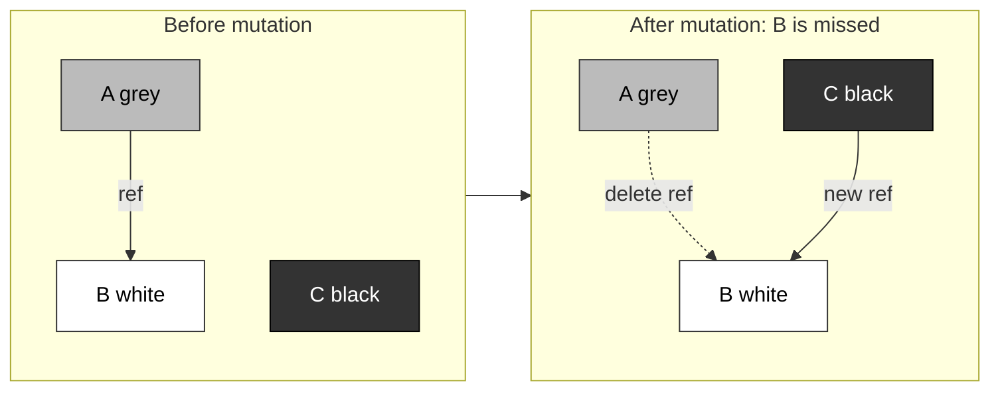
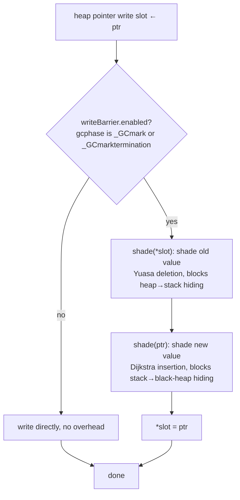

# 13.2 Write Barrier Techniques

[13.1](./basic.md) sketched the tricolor abstraction and the outline of concurrent collection: the collector recolors objects from white to grey and from grey to black, driving a "grey wavefront" that advances monotonically across the object graph, and wherever the wavefront has passed is confirmed live. If the mutator (the user-space code) were to halt while the wavefront advances, the abstraction would be self-consistent and would converge correctly. The trouble is precisely that the mutator does not halt. The fundamental difficulty of concurrent collection is this: the collector traces the object graph while the mutator rewrites it, and the two hold conflicting accounts of one and the same graph.

What this section sets out to answer is: why does a single pointer write by the mutator not cause the collector to miss marking a live object? The answer is the **write barrier**: a small piece of code that the compiler inserts at heap pointer writes, letting the mutator tell the collector "which edge I just changed." We first make clear why concurrent graph mutation can cause a missed mark ([13.2.1](#1321-why-concurrent-graph-mutation-causes-missed-marks)), from which the two tricolor invariants follow ([13.2.2](#1322-the-two-tricolor-invariants)); then we look at the two barrier families that plug the leak ([13.2.3](#1323-two-barrier-families-dijkstra-insertion-and-yuasa-deletion)); and finally we arrive at the hybrid write barrier that Go has used since 1.8 ([13.2.4](#1324-gos-hybrid-write-barrier)), understanding why it eliminates the costly stack rescan at mark termination in a single stroke.

We should first clear up a common confusion of names. The "write barrier" of this section is a mutator barrier in the garbage-collection sense, a piece of **software** logic, and it is a different thing from the memory barrier at the CPU level that prevents reordering of memory accesses (the memory barrier, see [11.9](../../part3concurrency/ch11sync/mem.md)). The two have exactly one point of contact: to guarantee its own correctness on multicore hardware, Go's write barrier implementation does rely on one memory-ordering constraint, a point we defer to [13.2.4](#1324-gos-hybrid-write-barrier).

## 13.2.1 Why Concurrent Graph Mutation Causes Missed Marks

Consider an instant when the collector is halfway through scanning. Let a grey object $A$ point to a white object $B$, and suppose the mutator concurrently does two things: it makes an already-blackened object $C$ point to $B$, and it erases the reference from $A$ to $B$. Now $B$ hangs only beneath the black object $C$. The collector regards black objects as finished and never revisits them, and the grey entry leading to $B$ has been erased, so $B$ vanishes from the wavefront and is eventually reclaimed as garbage by mistake.



Taking this instant apart, the missed mark holds only when two things happen **simultaneously**. [Wilson, 1992] makes this precise as two conditions:

- Condition one: the mutator makes some black object reference a white object (in the example above, $C \to B$);
- Condition two: a path leading to that white object, starting from a grey object and not yet traversed by the collector, is destroyed by the mutator (in the example above, $A \to B$ is deleted).

Break either one and the missed mark cannot happen: if condition one fails to hold, then the white object always hangs only beneath grey objects, and the wavefront will eventually reach it; if condition two fails to hold, then even when the white object has been written into a black object, an untraversed path from a grey object still reaches it. The two barrier families ([13.2.3](#1323-two-barrier-families-dijkstra-insertion-and-yuasa-deletion)) are exactly what seal off these two paths, one each.

There is also a role here that is often overlooked: the color of the mutator itself. Treating the collector as the object being affected and the mutator as the behavior exerting the influence, we can color the mutator too. A **black mutator** is one whose roots (chiefly the goroutine stack) have been scanned and will not be scanned again by the collector; a **grey mutator** is one whose stack has not been scanned, or has been scanned but still needs a rescan. The color of the mutator directly determines whether collection can wrap up: as long as a grey mutator still exists, the collector must rescan its roots before finishing, and during the rescan the mutator may again insert new non-black references into the roots, and so on, round after round. In the worst case the collector can obtain a clean root snapshot only by halting every mutator thread (that is, STW). This is exactly the price pre-1.8 Go paid, and it is the very thing this section ultimately sets out to eliminate.

Related to the stack there is one more choice: what color to give a newly allocated object. Coloring it white avoids needlessly carrying new objects over into the next cycle; but a black mutator has finished scanning and will no longer be touched by the collector, so once it allocates a white object and tucks it away on its stack, a missed mark follows directly. To keep implementation complexity to a minimum, **coloring every newly allocated object black** is generally safe, and Go takes this approach. This choice will mesh exactly with the hybrid barrier discussed below.

## 13.2.2 The Two Tricolor Invariants

Translating the two conditions of the previous section into constraints on the object graph yields two invariants of differing strength.

The **strong tricolor invariant**: there is no pointer from a black object to a white object. This directly forbids condition one. Everything behind the wavefront (the black region) is "untainted ground," and the collector may safely never look back.

The **weak tricolor invariant**: a black object may point to a white object, but that white object must **simultaneously** have a reachable path that starts from some grey object and has not yet been traversed. This amounts to permitting condition one to occur, yet forbidding condition two by "keeping one grey entry."

Strong invariant:

$$
\nexists\, b \in \text{black},\ w \in \text{white}:\ b \to w
$$

Weak invariant:

$$
\forall\, w \in \text{white referenced by some black}:\ \exists\ \text{an untraversed path reaching}\ w\ \text{from some grey}
$$

The strong invariant is the more demanding constraint, while the weak invariant gives the implementation more room to maneuver: **so long as an untraversed path to the white object remains, a black object is permitted to point to a white object.** The dividing line between the two barrier families is, at bottom, which of these invariants each one maintains.

## 13.2.3 Two Barrier Families: Dijkstra Insertion and Yuasa Deletion

Since the missed mark is composed of two things, "black points to white" and "the grey path is cut," the methods for plugging it likewise split into two families, corresponding exactly to two objects that can be watched within a single pointer write: the new pointer `ptr` being written, and the old value `*slot` being overwritten. [Pirinen, 1998] reduces the basic actions a barrier may perform to three: shade a white object grey to widen the wavefront, scan an object and blacken it to advance the wavefront, and revert a black object to grey to retreat the wavefront. Both barrier families use the first action (`shade`, which colors a still-white object grey and enqueues it for scanning); they differ only in which object they shade.

The **Dijkstra insertion barrier**, also known as the incremental update barrier [Wilson, 1992], watches the new pointer being written, telling the collector about the "insertion" act, and maintains the strong tricolor invariant. Its core is this: whenever a pointer is written into an object, regardless of whether it will later be deleted, shade the pointee grey first [Dijkstra et al., 1978].

```go
// Dijkstra insertion barrier: shade the newly written pointer
func DijkstraWritePointer(slot *unsafe.Pointer, ptr unsafe.Pointer) {
    shade(ptr)
    *slot = ptr
}
```

`shade(ptr)` conservatively assumes that the object containing `*slot` may already be black, so it shades `ptr` grey first, ensuring it cannot remain white after the write, sealing condition one directly. There are two costs. First, the conservatively shaded objects may include garbage that should have been reclaimed, which now has to wait until the next cycle to be cleared (floating garbage). Second, setting a barrier on every pointer write is costly, and writes to the stack are especially frequent. The pre-1.8 compromise in Go is to **set no barrier on stack writes**, instead marking a stack that has seen a write as "permanently grey" (permagrey). This is exactly what creates a grey mutator, and the price is that these stacks must be rescanned, under STW, during mark termination. This rescan is the principal source of pause time in pre-1.8 Go, and it is the very ailment the hybrid barrier removes.

The **Yuasa deletion barrier**, also known as the snapshot-at-the-beginning barrier, watches the old value being overwritten and maintains the weak tricolor invariant. Its idea is this: before the mutator deletes a pointer, shade the old target that is about to be lost [Yuasa, 1990], as if taking a snapshot of the object graph before the mutation; whatever was live in the snapshot is not reclaimed this cycle.

```go
// Yuasa deletion barrier: shade the overwritten old value
func YuasaWritePointer(slot *unsafe.Pointer, ptr unsafe.Pointer) {
    shade(*slot)
    *slot = ptr
}
```

`shade(*slot)` shades the old target grey before overwriting it, so this write always leaves behind a "grey-to-grey" or "grey-to-white" path, and condition two has no way to hold. The merit of the Yuasa barrier is that, when collection ends, all white objects can be reclaimed precisely with no rescan; the cost is that it intercepts the write to make the wavefront retreat, which produces redundant scanning, and being based on a starting snapshot it means that objects which become unreachable during the cycle must wait until the next cycle to be reclaimed.

## 13.2.4 Go's Hybrid Write Barrier

Each barrier family can plug only one missed-mark path, so each has a spot where STW is unavoidable: if the Dijkstra barrier lets stack writes through, it incurs a stack rescan at mark termination; the Yuasa barrier requires a snapshot of all roots when collection begins, and at that moment the mutator must likewise halt. Go combined the two in 1.8, obtaining the **hybrid write barrier** [Clements & Hudson, 2016], which resolves this dilemma and has been used ever since. The comment at the top of `runtime/mbarrier.go` writes it as the following pseudo-code:

```go
// Hybrid write barrier (algorithmic form in mbarrier.go)
func writePointer(slot *unsafe.Pointer, ptr unsafe.Pointer) {
    shade(*slot)              // Yuasa deletion part: shade the overwritten old value
    if current_stack_is_grey {
        shade(ptr)            // Dijkstra insertion part: needed only when this goroutine's stack is still grey
    }
    *slot = ptr
}
```

The two `shade` calls each seal off one path by which the mutator can "hide" an object, and the comment puts the matter very clearly:

- `shade(*slot)` (the deletion part) prevents the mutator from moving "the only pointer to some object" off the heap onto its own stack to hide it: the moment it tries to pluck this pointer out of the heap, the old target is shaded grey first;
- `shade(ptr)` (the insertion part) prevents the mutator from stuffing such a sole pointer from the stack into a black object in the heap to hide it: the moment it tries to load the pointer into a black object, the loaded object is shaded grey first.

The key is that condition: `shade(ptr)` **is needed only when this goroutine's stack is still grey.** Because hiding an object from the stack into the heap presupposes that it is already hidden on the stack; and a stack that has just finished being scanned holds only objects already shaded grey, hides nothing further, and together with `shade(*slot)` it is also prevented from newly hiding a pointer on its own stack. This is the linchpin of the hybrid barrier: **once a stack has been scanned and blackened a single time, it stays black forever and never needs a rescan.** The collector scans and blackens each goroutine stack at the start of marking (this step can run concurrently with the mutator and needs no global STW), and thereafter the stacks face no risk of a rescan. The mark-termination stack rescan that dominated pause time in pre-1.8 and required STW is thereby removed entirely. Go 1.8's pause times consequently dropped into the sub-millisecond range, which is the most tangible reward of the hybrid barrier. It also meshes exactly with "color newly allocated objects black" ([13.2.1](#1321-why-concurrent-graph-mutation-causes-missed-marks)): black stacks and black new objects are what keep the black region self-consistent throughout.

The cost is that the expense of the write barrier is "spread out": pre-1.8 concentrated the overhead into that one STW rescan at mark termination, whereas the hybrid barrier breaks it into a **constant** cost at each heap pointer write. This is a textbook trade of throughput for latency, exchanging one unpredictable long pause for predictable small outlays scattered across the whole run of the program.



Two gaps between the "pseudo-code" and the "real implementation" are worth pointing out; they are precisely the subtle parts of this mechanism.

First, that `if current_stack_is_grey` condition in the comment is **dropped** in Go's actual assembly implementation `gcWriteBarrier`: whether the stack is black or grey, `ptr` is always shaded. The reason is memory ordering. For the barrier's read of "the color of the object containing slot" to be mutually visible with the mutator's write, a costly memory barrier would have to be inserted between the write and the read; on hardware such as 386/amd64 that allows "a read to pass an earlier write," omitting it would let both the mutator and the collector observe stale color bits. After weighing it, the Go team would rather shade `ptr` one extra time unconditionally than pay the cost of a memory barrier for this condition. This is a trade-off made to sidestep the hardware memory model, and it is the "sole point of contact between the software write barrier and the CPU memory barrier" mentioned at the start of this section.

Second, the barrier takes effect only on **heap** pointer writes, and only while marking is open. The compiler omits the barrier on writes to the current stack frame on the stack (the "no barrier on stack writes" mentioned in [13.2.1](#1321-why-concurrent-graph-mutation-causes-missed-marks)); writes to global variables, however, do get the barrier, so that the global region need not be rescanned at mark termination. The switch is controlled by `writeBarrier.enabled`, which is set when `gcphase` enters `_GCmark` or `_GCmarktermination` and cleared as soon as collection ends, so pointer writes outside the marking period carry zero overhead. The barrier code itself is not hand-written by the mutator but inserted automatically by the compiler before every heap pointer write ([3.2](../../part1overview/ch03life/compile.md)).

Unconditional double shading also brings one direct consequence: the coloring cost doubles, the compiler has more code to insert, and the binary grows. For this Go 1.10 and 1.11 introduced a **batched write barrier buffer** (see `runtime/mwbbuf.go`): the barrier fast path does not color immediately but only pushes the pointers to be shaded into a per-P private buffer (`wbBuf`, capacity 512), flushing them in one go to the collector's work queue when the buffer fills or a GC state transition occurs. The fast path is written in assembly and leaves the general-purpose registers untouched, sparing the overhead of a regular function call and pressing the constant cost of each write down another notch.

Placed in its lineage, the hybrid barrier is not a Go original. The comment notes that it is equivalent to the double write barrier used by IBM's real-time Java Metronome; there the collector is incremental rather than concurrent, but it faces the same problem of safely mutating the graph within strict time bounds. This line of thought connects with the concurrent marking described in [13.1](./basic.md) and the mark termination of [13.6](./termination.md): the weak tricolor invariant the write barrier guarantees is exactly the precondition for marking to run concurrently with the mutator without missing marks.

## 13.2.5 Summary

The write barrier of concurrent collection comes down, in the end, to a piece of logic inserted at pointer writes to maintain the tricolor invariant. Early Go took the more easily implemented Dijkstra insertion barrier, and to preserve the strong invariant it had no choice but to leave stacks for an STW rescan at mark termination, a rescan that dominated the pause of the day. From 1.8 on it switched to the hybrid barrier composed of Dijkstra insertion and Yuasa deletion, weakening the strong invariant into the weak invariant in exchange for the property "scan the stack once, black ever after, never rescanned," thereby erasing that concentrated STW and pressing the pause into the sub-millisecond range. The cost is a constant overhead at each heap pointer write, in turn thinned out by the batched buffer. A gain in performance never comes for free; this time it comes from re-situating one unpredictable long pause as predictable small outlays scattered throughout the run.

## Further Reading

1. Austin Clements, Rick Hudson. *Eliminate STW stack re-scanning (Hybrid write barrier).*
   Go proposal, golang/go#17503, 2016.
   https://github.com/golang/proposal/blob/master/design/17503-eliminate-rescan.md
   (The design and correctness proof of the hybrid barrier, the primary source for the main thread of this section.)
2. Taiichi Yuasa. *Real-time garbage collection on general-purpose machines.*
   Journal of Systems and Software, 11(3):181-198, 1990.
   DOI: [10.1016/0164-1212(90)90084-Y](https://doi.org/10.1016/0164-1212(90)90084-Y)
   (The original paper on the deletion barrier / snapshot-at-the-beginning.)
3. Edsger W. Dijkstra, Leslie Lamport, A. J. Martin, C. S. Scholten, E. F. M. Steffens.
   *On-the-Fly Garbage Collection: An Exercise in Cooperation.*
   Communications of the ACM, 21(11):966-975, 1978.
   DOI: [10.1145/359642.359655](https://doi.org/10.1145/359642.359655)
   (The foundational work on the insertion barrier and tricolor marking.)
4. Paul R. Wilson. *Uniprocessor Garbage Collection Techniques.*
   Proc. International Workshop on Memory Management (IWMM), LNCS 637, 1992.
   (The survey of the two missed-mark conditions, the strong / weak tricolor invariants, incremental update, and snapshot-at-the-beginning.)
5. Pekka P. Pirinen. *Barrier Techniques for Incremental Tracing.*
   Proc. International Symposium on Memory Management (ISMM), 1998.
   DOI: [10.1145/286860.286863](https://doi.org/10.1145/286860.286863)
   (The classification framework of basic barrier actions.)
6. The Go Authors. *runtime/mbarrier.go, runtime/mwbbuf.go, runtime/mgc.go.*
   https://github.com/golang/go/tree/master/src/runtime
   (The hybrid barrier implementation, the batched buffer, and the `writeBarrier.enabled` / `gcphase` gating.)
7. This book: [13.1 The Basic Idea of Garbage Collection](./basic.md), [13.6 The Mark Termination Phase](./termination.md),
   [11.9 The Memory Consistency Model](../../part3concurrency/ch11sync/mem.md).
