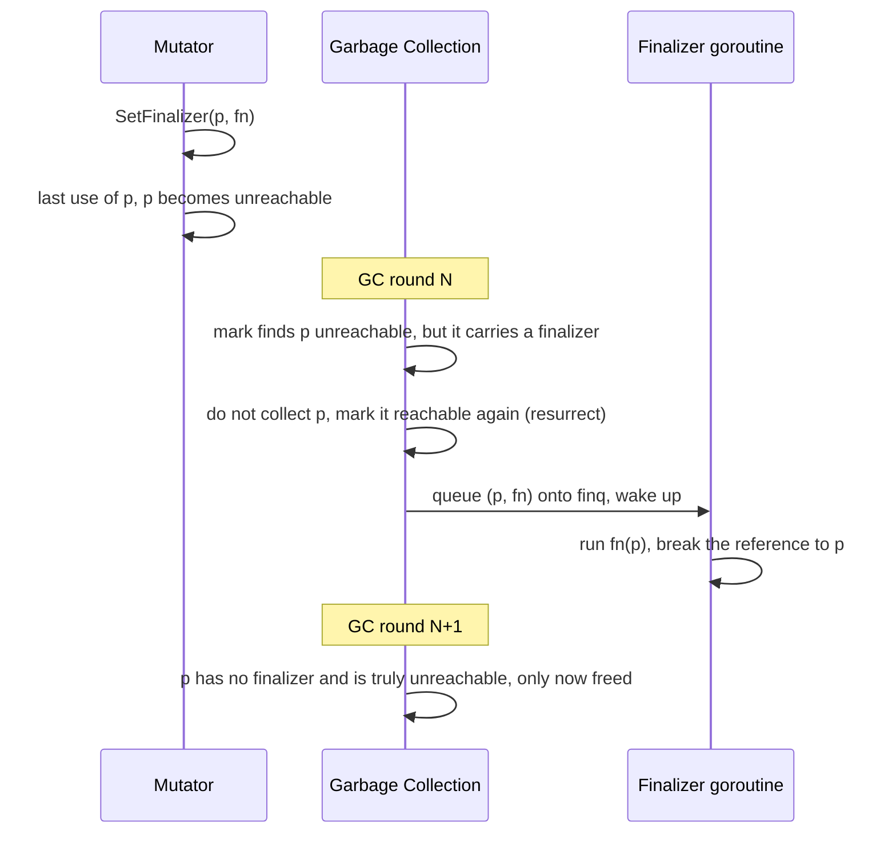

# 13.10 Finalizers

The usual storyline of garbage collection ends at [sweeping (13.5)](./sweep.md): marking finds the live objects, and sweeping returns the slots of dead objects to the allocator. But there is a class of object that wants to say one last word before it dies. It wraps a non-memory resource, a file descriptor, an mmap region, a handle allocated on the C side, and when the Go-side wrapper object becomes unreachable, the underlying resource ought to be released along with it. Garbage collection only understands memory, though, and has no idea that a descriptor needs to be `close`d. The finalizer is the hook designed for exactly this gap: you register a function for an object, and when garbage collection decides the object is unreachable, the runtime does not free it immediately but first calls that function.

This is a tempting yet dangerous mechanism. It is tempting because it looks like a C++ destructor, able to hang "resource release" automatically onto "object death". It is dangerous because in Go an object's death is decided by garbage collection, and the timing is unpredictable, so any release that "must happen" cannot be entrusted to it. This section first explains the mechanics of `runtime.SetFinalizer`, then points out its traps one by one, and finally introduces `runtime.AddCleanup`, the safer alternative introduced in Go 1.24, along with a simple rule for choosing between them.

## 13.10.1 The Mechanics of SetFinalizer

Registering a finalizer takes only one line:

```go
type File struct{ fd int }

p := &File{fd: openSomeFd()}
runtime.SetFinalizer(p, func(p *File) {
    syscall.Close(p.fd)
})
```

`SetFinalizer(obj, fn)` requires `obj` to be a pointer to a heap-allocated object obtained from `new`, from taking the address of a composite literal, or from taking the address of a local variable; `fn` is a function that takes a single argument (of a type assignable from `obj`). The runtime records this relationship in a **special** record on the mspan the object lives in ([12.2](../ch12alloc/component.md) covered mspan metadata), rather than stuffing it into the object itself. `SetFinalizer(obj, nil)` cancels the registration.

What is genuinely interesting is how garbage collection behaves once it sees this special. After the mark phase ([13.4](./mark.md)) has scanned the roots and the live objects, an object that is no longer reachable would normally be swept; but if it carries a finalizer, the runtime does not free it, and instead does three things: it detaches this finalizer special, **marks the object reachable again**, and then queues the pair `(object, finalizer function)` onto a global queue `finq`. This step of "marking reachable again" is the key, and it means the object was not collected this round but was instead resurrected once.

After being queued, a dedicated goroutine takes the entries out and runs them one by one. The main loop of this goroutine (called `runFinalizers` in the runtime, historically `runfinq`) looks roughly like this:

```go
// Main loop of the dedicated finalizer goroutine (sketch, compare runtime/mfinal.go)
func runFinalizers() {
    for {
        lock(&finlock)
        fb := finq        // take the whole pending queue
        finq = nil
        if fb == nil {     // queue empty, suspend, wait for the next GC to wake us
            gopark(finalizercommit, ..., waitReasonFinalizerWait, ...)
            continue
        }
        unlock(&finlock)
        for ; fb != nil; fb = fb.next {
            for i := fb.cnt; i > 0; i-- {
                f := &fb.fin[i-1]
                // lay the object pointer into the call frame, reflectively call the finalizer f.fn(obj)
                reflectcall(nil, unsafe.Pointer(f.fn), frame, ...)
                f.fn, f.arg, f.ot = nil, nil, nil  // immediately break the heap references
            }
        }
    }
}
```

This goroutine is lazily created by `createfing` and only starts the first time a finalizer is registered; the rest of the time it stays suspended in `gopark`, woken by garbage collection after each round puts something into `finq`. **All finalizers run serially on this one goroutine**, so a long-running finalizer holds up everyone behind it, and long tasks should spawn another goroutine from inside the finalizer.

### Living One Extra Round: Resurrection and a Second Collection

Stringing the timeline above together, an object carrying a finalizer must cross two rounds of garbage collection on its way from unreachable to actually freed:



Why must it be resurrected? Because the finalizer function needs the object as an argument, the memory `p` points to must be valid while `fn(p)` runs, and cannot be collected before the call. The cost is that this block of memory is not freed in round $N$, and must wait until round $N+1$ of garbage collection confirms it has neither a finalizer nor any reachability, before it is returned. In other words, **an object with a finalizer occupies memory for at least one extra full GC cycle**. A long chain built out of finalizers releases one link per round, and collection is noticeably slowed.

## 13.10.2 The Traps: Why It Cannot Be Used for Release That Must Happen

The mechanism reads as elegant, but every bit of elegance corresponds to a usage trap. Laying them out together explains why the official Go documentation positions it as "generally only suitable for releasing non-memory resources in long-running programs", rather than as a general-purpose destruction mechanism.

**The timing is uncertain, and it may never run at all.** A finalizer is scheduled only at "some arbitrary moment" after the object becomes unreachable. When garbage collection happens depends on allocation pressure and `GOGC`, and if the program stops allocating memory, the next GC round may be slow to arrive. More importantly, **on process exit the runtime does not guarantee that queued finalizers will finish running**. So counting on a finalizer to `flush` the buffer of a `bufio.Writer` is wrong: when the program exits, the buffer very likely never gets flushed.

**Collection is deferred.** As described in the previous section, the object lives at least one extra round. For memory-sensitive programs, or programs where many short-lived objects all carry finalizers, this delay accumulates into appreciable heap bloat.

**Resurrection.** While a finalizer runs the object is reachable, and if the finalizer function stores this object's pointer into some global variable or into another structure that is still alive, the object is genuinely revived, and the next round of garbage collection will not collect it. Worse, a finalizer is cleared once it has run, so the resurrected object will no longer have a finalizer, and its second death triggers no cleanup at all. This kind of "self-resurrection" is almost always a bug, yet there is no compile-time means to catch it.

**For mutually referencing objects, finalization order is undefined.** The documentation is explicit: if A points to B, both have finalizers and both are unreachable, the runtime follows dependency order and only runs A's finalizer first, and B's finalizer gets its chance only after A is released. But if A and B **reference each other and form a cycle**, no order satisfies the dependencies, and so this cycle may be neither collected nor have its finalizers ever run. Depending on the cleanup order among multiple finalized objects is unreliable.

**The delicate dance with KeepAlive.** Because a finalizer may run immediately after the object is "last mentioned", the following code, which looks correct, hides a race:

```go
p := &File{fd: fd}
runtime.SetFinalizer(p, func(p *File) { syscall.Close(p.fd) })
var buf [64]byte
n, err := syscall.Read(p.fd, buf[:])
// here p is no longer mentioned, may already be unreachable, the finalizer may already have Closed p.fd on another goroutine!
// syscall.Read may therefore read a closed, or even already-reused, fd.
runtime.KeepAlive(p) // use KeepAlive to extend p's lifetime to this line
```

The implementation of `runtime.KeepAlive(x)` is nearly a no-op, and its entire effect is to manufacture one "use" of `x`, forcing the compiler to extend `x`'s lifetime interval to this line, thereby guaranteeing the finalizer will not fire before it. The very fact that `KeepAlive` is needed shows that the finalizer has turned what should be a simple resource lifecycle into a concurrency problem requiring careful reasoning.

These traps reduce to one sentence: **finalizers cannot be used for release that must happen**. Wherever correctness depends on "the resource is definitely released", files, locks, connections, you should use an [explicit `defer` (6.2)](../../part2lang/ch06func/defer.md) to release at a definite moment. A finalizer is at most a safety net: in case the caller forgot to `Close`, it provides a backstop at some uncertain point in the future, avoiding a permanent descriptor leak, and nothing more.

## 13.10.3 The Go 1.24 Alternative: AddCleanup

The several traps of `SetFinalizer` all trace back to one design point: "the finalizer function receives the object itself directly". Precisely because the argument is the object, the object must be resurrected, self-resurrection becomes possible, and `KeepAlive` is needed to hold the lifetime interval. `runtime.AddCleanup`, introduced in Go 1.24, takes a different approach, decoupling "the data the cleanup action needs" from "the object being watched":

```go
func AddCleanup[T, S any](ptr *T, cleanup func(S), arg S) Cleanup
```

`ptr` is the object being watched, `cleanup` is the cleanup function, and `arg` is the argument the cleanup function receives when it runs. **The cleanup function receives `arg`, not `ptr`.** Re-registering the file example above with it:

```go
type File struct{ fd int }

p := &File{fd: openSomeFd()}
// the cleanup function only gets fd (arg), never touches p (ptr)
cleanup := runtime.AddCleanup(p, func(fd int) {
    syscall.Close(fd)
}, p.fd)

// if the resource was closed normally, you can proactively cancel the cleanup to avoid a future double trigger
// cleanup.Stop()
```

This seemingly tiny change of signature dissolves the earlier traps one by one:

- **No resurrection.** The cleanup function never touches `ptr`, so running cleanup does not require marking the object reachable again, the object can be collected normally in the very round it becomes unreachable, and no longer occupies an extra full round. Naturally there is no "self-resurrection" bug either, because the function simply does not hold a pointer to the object to store away. `AddCleanup` also panics outright when `arg == ptr`, blocking at the source the misuse of "the cleanup argument dragging the object back to reachability".
- **An object can carry multiple cleanups.** `SetFinalizer` errors on repeated registration for the same object (an object can have only one finalizer); `AddCleanup` allows attaching any number of cleanups on the same pointer, and even on different pointers within the same allocation.
- **They can run concurrently, without blocking one another.** Finalizers all run serially on one goroutine, where a single slow finalizer drags down the whole show; cleanups, by contrast, can run concurrently, and a long task will not stall other cleanups.
- **They can be cancelled.** `AddCleanup` returns a `Cleanup` handle, and if the resource was already released through the normal path, calling `cleanup.Stop()` cancels this registration, avoiding a future double release. `SetFinalizer` can only clear clumsily via `SetFinalizer(obj, nil)`.
- **Clearer semantics.** The generic signature `[T, S]` writes out "the type of the watched object" and "the type of the cleanup argument" separately, which is both type-safe and clearer in intent than `SetFinalizer`'s use of `any` plus a runtime reflective check of the argument type.

Bear in mind that `AddCleanup` dissolves the group of traps that come from "coupling with the object", but it **does not and cannot** change the non-deterministic nature of garbage collection: the cleanup function likewise runs only at some arbitrary moment after the object becomes unreachable, likewise is not guaranteed to run before the program exits, and zero-sized objects, micro-objects batched together, and objects allocated during package-level variable initialization may likewise never get their turn. Its positioning is therefore the same as the finalizer's, still a safety net rather than a guarantee. It is merely a **safer, harder-to-misuse** safety net. For an object that carries both a finalizer and a cleanup, the cleanup runs only after the finalizer has finished and the object has become unreachable again.

The official documentation therefore states plainly in the `SetFinalizer` docs: **new code should prefer `AddCleanup`**.

## 13.10.4 Design Philosophy: Determinism Goes to defer, the Safety Net Goes to Cleanup

This section converges to one actionable rule:

> **Deterministic cleanup uses explicit `defer`; finalizers and cleanups serve only as a last safety net.**

The test is simple, ask "is this release allowed not to happen". For a file handle, a lock, a database connection, a buffer that needs flushing, the answer is "it must happen", so use `defer` ([6.2](../../part2lang/ch06func/defer.md)) to pin the release to a definite position in the control flow, with correctness guaranteed by the language, independent of garbage collection. Only when you want to backstop the accident of "the caller may forget to release", to prevent a permanent resource leak, do you reach for the safety net, and you should prefer `AddCleanup`, falling back to `SetFinalizer` only when maintaining old code or needing compatibility with Go before 1.24.

Behind this rule lies Go's consistent trade-off: **it refuses to secretly bind resource lifetime to memory lifetime**. C++ uses RAII to fuse the two, gaining deterministic destruction timing; Go chose a garbage-collected memory model, where the timing of memory release is inherently non-deterministic, and so it did not take the path of "let destruction follow GC", which would infect resource management with that non-determinism, but instead handed resource release back to the programmer to control explicitly with `defer`, leaving only finalizers and cleanups as a backstop. Once you understand this, you will no longer ask "why does Go have no destructor", because Go deliberately does not want one: in a GC language, the finalizer disguised as a destructor brings far more trouble than the one line of `defer` it saves.

## Further Reading

1. The Go Authors. *runtime.SetFinalizer.* Go standard library documentation.
   https://pkg.go.dev/runtime#SetFinalizer (the authoritative account of timing, resurrection, dependency order, and the KeepAlive dance)
2. The Go Authors. *runtime.AddCleanup and runtime.Cleanup.* Go standard library documentation.
   https://pkg.go.dev/runtime#AddCleanup
3. The Go Authors. *Go 1.24 Release Notes: the new `runtime.AddCleanup` function.*
   https://go.dev/doc/go1.24#new-runtimeaddcleanup-function
4. The Go Authors. *runtime/mfinal.go* (`SetFinalizer`, `runFinalizers`, `createfing`,
   `KeepAlive`). https://github.com/golang/go/blob/master/src/runtime/mfinal.go
5. The Go Authors. *runtime/mcleanup.go* (`AddCleanup`, `Cleanup.Stop`, handling of special records).
   https://github.com/golang/go/blob/master/src/runtime/mcleanup.go
6. Russ Cox et al. *proposal: runtime: add AddCleanup, deprecate SetFinalizer* (issue #67535).
   https://github.com/golang/go/issues/67535 (the design motivation for AddCleanup and discussion of SetFinalizer's flaws)
7. This book: [6.2 defer](../../part2lang/ch06func/defer.md),
   [12.2 Allocator Components](../ch12alloc/component.md), [13.5 Sweeping](./sweep.md).
