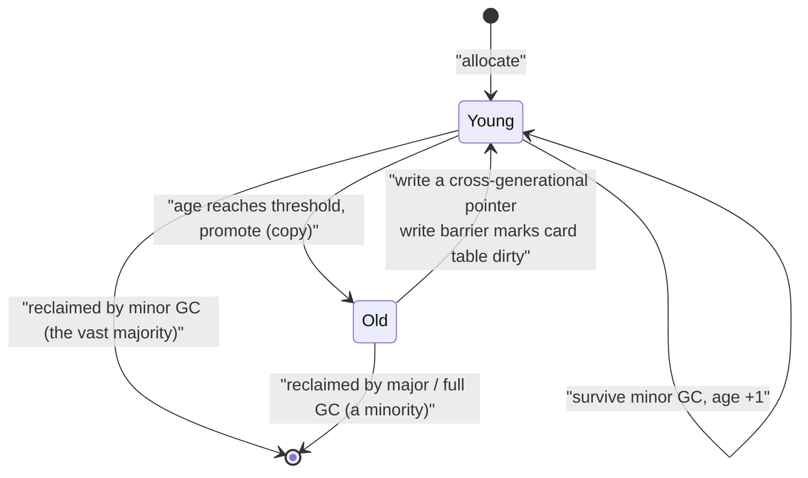

# 13.8 The Generational Hypothesis and Generational Collection

People who have studied the JVM or .NET often ask a pointed question: why does Go **not do generational GC**? Generational collection is standard equipment in the GCs of mainstream managed runtimes such as Java and .NET, treated as the key to efficient collection, almost to the point of becoming the common sense of "this is how a modern GC ought to be." Go pointedly does not adopt it. This section explains the idea of generational collection, its power, and Go's reasons for not taking this road. The answer here deserves care: it is not that "the Go team did not think of it," but that the Go team **actually implemented a non-moving generational GC, measured its performance, and in the end gave it up**. This is a case that powerfully illustrates "there is no design that fits all circumstances."

## 13.8.1 The Mechanism of the Generational Hypothesis and Generational Collection

Generational GC is built on an observation that experience has confirmed again and again, called the **generational hypothesis**: **most objects "die young,"** ceasing to be referenced not long after they are allocated. It has a strong and a weak version, and what engineering relies on is the weak version, namely "the death rate of young objects is far higher than that of old objects." Lieberman and Hewitt (1983) and Ungar (1984) seized on exactly this regularity to design the earliest generational collectors.

Since new objects mostly die quickly, objects are partitioned by "age" into generations: the **young generation** holds newly allocated objects, and the **old generation** holds objects that have survived several rounds of collection and are deemed to have "found their footing." Collection comes in two tiers:

- **minor GC**: scans only the young generation. Because the garbage is almost all here, and the young generation is usually small, a single scan is extremely fast. Most collections are minor GCs.
- **major GC / full GC**: only occasionally scans the whole heap, dealing with those objects that die only after surviving into the old generation.

Concentrating the collection work on the "small and garbage-dense" young generation is the source of generational GC's power. Some notation will quantify this: let the survival rate of the young generation be $s_y$ and that of the old generation be $s_o$; the generational hypothesis says $s_y \ll s_o$. The scan cost of one minor GC is proportional to the number of **surviving** objects in the young generation (mark-copy collectors touch only live objects), about $s_y \cdot N_y$; the garbage it reclaims is about $(1 - s_y) \cdot N_y$. The smaller $s_y$ is, the higher the reclamation yield per unit of scan cost, which is the entire reason why "frequent, cheap minor GCs" are a good deal.

There is no free lunch in this world. Scanning only the young generation has one hole: **old-generation objects may hold pointers into young-generation objects.** If a minor GC treats only the roots (the stack and global variables) as scan starting points, it will miss young-generation objects that are "referenced only by some old-generation object," misjudging live objects as garbage. The remedy is to treat these **cross-generational pointers** as roots too. But scanning the whole old generation to find cross-generational pointers takes us back to a full GC, which is not worth it. So a generational collector must **record at all times "which old-generation objects have written pointers into the young generation"**, and this relies on a **write barrier** (see [13.2](./barrier.md)) paired with a **remembered set**. The most common remembered-set implementation is the **card table**: the heap is cut into "cards" of a fixed size (such as 512 bytes), and when an old-generation object is overwritten, the write barrier only marks the card it lives in as "dirty"; during the minor GC scan, only the objects in dirty cards need to be re-examined to look for cross-generational pointers.

```text
// The core logic of the generational write barrier (pseudocode): record "old -> new" cross-generational pointers
func writeBarrier(slot *Pointer, ptr Pointer) {
    *slot = ptr
    if inOldGen(slot) && inYoungGen(ptr) {   // only cross-generational writes need recording
        card := cardOf(slot)
        cardTable[card] = DIRTY              // mark the containing "card" dirty, O(1)
    }
}

// The scan roots of a minor GC = the real roots + the cross-generational pointers in dirty cards
func minorGC() {
    roots := stackAndGlobalRoots()
    for card := range cardTable {
        if card == DIRTY {
            roots = append(roots, scanCardForYoungPtrs(card)...)
        }
    }
    collectYoungGen(roots)   // touch only the young generation, copy survivors, promote old objects
}
```

Drawing out the lifetime of an object makes the flow of the generational structure clear at a glance:



The key designs of generational collection now emerge: generations, the minor/major two tiers, the write barrier plus remembered set, and **copying and promoting** survivors from the young generation into the old generation. This last point is especially worth remembering: efficient generational collectors are almost all **moving** collectors, with the young generation using copying collection, which both conveniently compacts away fragmentation and naturally implements age advancement through "survive and you are promoted." This point will become the crux of why Go is not generational below.

## 13.8.2 How Others Do It: the JVM and .NET

Seen at the industrial scene, generational collection takes on a fairly uniform shape. The **HotSpot JVM** divides the heap into three layers, Eden, two Survivor spaces (S0/S1), and Old: new objects are born in Eden, and a minor GC (which HotSpot calls a young GC) copies the survivors from Eden and one Survivor space into the other Survivor space; after surviving several rounds (controlled by `MaxTenuringThreshold`) they are promoted to Old; cross-generational pointers are recorded by a card table. The **.NET CLR** has three generations, gen0, gen1, and gen2: gen0 is collected most frequently, the collection of gen0/gen1 (an ephemeral collection) is cheap, and only gen2 is a full GC; it likewise uses a card table plus a write barrier to maintain "old points to new." The two differ in detail, but their skeletons agree: small and frequent young-generation collection + a remembered set maintained by a write barrier + promotion of survivors.

The reason these runtimes lean on generational collection has to do with their language models. In Java almost everything that is not a primitive type is a heap object, and the temporary objects produced by `new` are everywhere; the generational hypothesis holds very fully on their heaps, and making the young generation cheap to harvest yields enormous benefit. This is precisely the key to understanding "why Go is different."

## 13.8.3 Why Go Is Not Generational

To this day Go uses **non-generational** concurrent mark-and-sweep ([13.1](./basic.md)). This is not an oversight: in "Getting to Go," Rick Hudson recounted that the team **implemented a non-moving generational GC**, the idea being that since they would give up neither latency nor non-moving collection, they could only build a non-moving generational collector, and when they measured it in the end it did not pay off, so they abandoned it. The reason is the combined force of three trade-offs.

**First, escape analysis has already done the generational hypothesis's job.** Go's compiler escape analysis ([15.5](../../part5toolchain/ch15compile/escape.md)) allocates a great many "short-lived" objects directly on the **stack**; they disappear automatically when the function returns, never entering the heap and never troubling the GC. Hudson's exact words were: "It is not that the generational hypothesis does not hold for Go, but that young objects are born on the stack and die on the stack." So of the "quickly dying young objects" in the generational hypothesis, many in Go have already been absorbed by stack allocation. The objects left for the heap GC no longer have such a strong "die young" character, and the yield that young-generation harvesting can squeeze out is therefore greatly diminished. Consider a concrete example:

```go
package main

func sum(n int) int {
	p := new(int) // looks like a heap new, but escape analysis judges it does not escape
	for i := 0; i < n; i++ {
		*p += i
	}
	return *p
}

func main() { println(sum(10)) }
```

```text
$ go build -gcflags='-m' escape.go
./escape.go:3:6: can inline sum
./escape.go:11:6: can inline main
./escape.go:11:26: inlining call to sum
./escape.go:4:10: new(int) does not escape
```

The `new(int)`, a thing that should have been a "typical young-generation object," is judged `does not escape` at compile time, lands on the stack, and the GC never sees it in its life. In other languages it is exactly this kind of object that holds up the benefit of generational collection.

**Second, non-moving collection makes generations awkward.** As the previous section said, efficient generational collection almost always relies on **copying/moving** the young generation, advancing age naturally through "survive and you are promoted." Go's collector is **non-moving** mark-and-sweep ([13.5](./sweep.md)), a fundamental choice made to be friendly to pointer stability, interior pointers, and cgo. Without moving objects, you either give up all the benefits of a copying young generation, or force in moving; the former leaves little yield, the latter shakes the foundation of the whole design. The team's prototype was exactly a "non-moving generational" one, and the conclusion was that the **write barrier in it, though fast, was still not fast enough and was hard to optimize**.

**Third, the existing scheme already meets Go's goals.** Go's concurrent mark-and-sweep plus the hybrid write barrier ([13.2](./barrier.md)) has already pushed pauses down to the sub-millisecond level. There is an often-overlooked point here: the biggest benefit of generational GC is that it "smears" the cost of the write barrier across the mutator's everyday running, thereby **cutting away that long STW of a full GC**. But Go's concurrent collection **has no such long STW to begin with**. In other words, generations mainly optimize **throughput** (reducing the total amount of marking) rather than the latency Go cares about most, and Go had long since solved the latency problem separately with concurrency.

Hudson did a calculation for this judgment, and it is worth writing as a small cost model. Let the total amount of live objects be $L$, and let the heap trigger threshold (the expansion factor controlled by the reciprocal of the ratio of live objects to heap size) make each GC cycle trigger collection after $H$ bytes have been allocated. Writing the total allocation over a period of time as $A$, the number of GC cycles is about $A / H$, and the marking cost of each cycle is proportional to the amount of live objects $L$, so the **cumulative marking cost** per unit of allocation is

$$
C_{\text{mark}} \;\propto\; \frac{(A / H)\cdot L}{A} \;=\; \frac{L}{H}.
$$

It **falls inversely** as the heap $H$ grows: double the heap, halve the number of GC cycles, and the cumulative marking cost halves with it. The write barrier's cost is different; it is amortized over every pointer write and is a **constant** $C_{\text{wb}}$ independent of heap size. A comparison of the two makes it clear: as long as you are willing to give a little more memory to stretch $H$ larger, the marking cost can be pressed below the write-barrier cost, whereas the write barrier that generations keep permanently on to cut full GCs has a cost that cannot be smeared away. So Go chose the path of "betting that RAM is cheaper than CPU," preferring to spend a bit more CPU on concurrent marking and to amortize the marking cost by enlarging the heap ([13.3 Pacing](./pacing.md)), rather than carrying an always-on generational write barrier.

## 13.8.4 The Lessons of the Trade-off, and the Unfinished Business

Go is not generational, not because it does not understand generations, but because **under its overall design the cost-effectiveness of generations is not high enough**: escape analysis eats away one end of the benefit, non-moving collection raises one end of the cost, and the low latency it cares about most was long ago solved from the other end by concurrent collection. This is a superb example: **a technique held sacred elsewhere (the JVM/.NET) is not necessarily worth it once you change the context (stack allocation + non-moving + latency first).** It reminds us that in evaluating any "best practice" we must first look at whether the premises it stands on are still present.

This is not a final verdict. Over the years the Go team has kept exploring in the direction of "improving collection locality," which shares a common underlying concern with generations: making the collector touch more of "the part of the objects it should touch" and do less wasted work. The Green Tea GC of go1.25/1.26 ([13.11](./history.md)) is a new attempt in this direction; it optimizes the memory-access locality of the marking phase rather than introducing a generational structure, and can be seen as Go's other answer to "the problem generations try to solve." The next section looks at another road Go seriously tried, yet likewise abandoned in the end: request-oriented collection based on the "request hypothesis" ([13.9](./roc.md)). Putting the two roads side by side reveals the consistent yardstick the Go team uses when evaluating aggressive GC designs: first ask whether it is compatible with the two iron rules of latency-first and non-moving.

## Further Reading

1. Henry Lieberman, Carl Hewitt. "A real-time garbage collector based on the lifetimes of
   objects." *Communications of the ACM* 26(6), 1983. https://doi.org/10.1145/358141.358147
   (one of the earliest sources of the idea of generational collection).
2. David Ungar. "Generation Scavenging: A non-disruptive high performance storage
   reclamation algorithm." *SDE 1984*. https://doi.org/10.1145/800020.808261
   ("Generation Scavenging," the founding work of generational GC).
3. Rick Hudson. *Getting to Go: The Journey of Go's GC.* ISMM 2018 keynote.
   https://go.dev/blog/ismmkeynote (Go's first-hand account of implementing and abandoning a non-moving generational GC).
4. The Go Authors. *Issue #20373: why not generational and compacting GC.*
   https://github.com/golang/go/issues/20373 (the official discussion of escape analysis, concurrency, and latency being independent of generation size).
5. The Go Authors. *A Guide to the Go Garbage Collector.* https://go.dev/doc/gc-guide
   (the design description of the current non-moving concurrent mark-and-sweep collector).
6. Richard Jones, Antony Hosking, Eliot Moss. *The Garbage Collection Handbook: The Art of
   Automatic Memory Management.* 2nd ed., CRC Press, 2023.
   https://doi.org/10.1201/9781003276142 (a systematic treatment of remembered sets, card tables, and generational collection mechanisms).
7. This book's [13.9 The Request Hypothesis and Request-Oriented Collection](./roc.md), [13.11 Past, Present, and Future](./history.md), [15.5 Escape Analysis](../../part5toolchain/ch15compile/escape.md).
