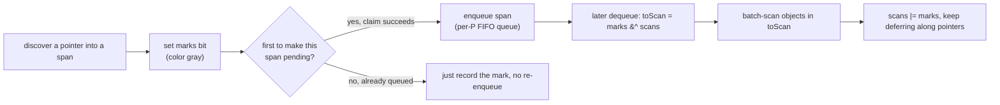
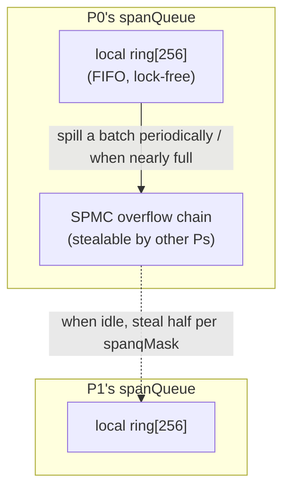

# 13.11 Green Tea: Locality-Aware Marking

The previous sections framed marking as a matter of being "correct and timely": the write barrier ([13.2](./barrier.md))
guarantees nothing live is missed, and mark assist ([13.4](./mark.md)) guarantees marking keeps up with allocation. Yet
neither touches another account in marking's ledger: **how fast marking actually runs**. On today's multi-core, large-heap
machines, the bottleneck of marking often lies neither in the algorithm's correctness nor in the CPU's raw compute, but in
the **memory wall**: the processor spends most of its time not computing but waiting for one cache miss after another to
return. Green Tea goes straight at that account.

Green Tea is the new marking algorithm introduced in go1.25, **on by default** since go1.26 (it is a baseline experiment;
`GOEXPERIMENT=nogreenteagc` turns it off and falls back to the old marker), with the implementation concentrated in
`runtime/mgcmark_greenteagc.go`. It does not change the tri-color abstraction, and it introduces no new barrier; it only
rearranges the **order** in which the marker traverses objects, turning memory access from random back into sequential.
This section takes it apart: the locality problem it sets out to solve, the core idea of deferring the scan, the two bitmaps
inlined into the span, the claiming and stealing of spans, and finally the two scan paths (dense and sparse) it lands on.

## 13.11.1 The Problem: Marking Is a Cache Disaster

Return to classic tri-color marking ([13.1](./basic.md)): take an object off the gray queue, scan every pointer inside it,
color the white objects it points to gray and enqueue them, and repeat until the queue is empty. This is a **graph
traversal** with the object as its unit, and the graph's edges are decided by the program's reference relationships, which
have nothing to do with where the objects physically sit on the heap. So the marker's memory accesses are nearly random:
after scanning the object in hand, the next one to touch may lie on another span several megabytes away, and its pointer
bitmap metadata may be in a third place.

This "chasing pointers all over memory" access pattern is close to the worst case for a modern CPU:

- **Low cache hit rate.** Two consecutive accesses rarely fall on the same cache line, so the vast majority of pointer
  dereferences have to wait for a main-memory read, with latency on the order of hundreds of clock cycles.
- **The prefetcher fails.** Hardware prefetch relies on a predictable access stride, and pointer chasing has no stride to
  speak of; the prefetcher simply cannot guess the next address.
- **Metadata cost is never amortized.** Each scanned object separately fetches its pointer bitmap, size class, and so on,
  and these scattered small reads are themselves a string of cache misses.

The consequence is that mark throughput **struggles to scale linearly with core count**: adding cores merely lets more cores
wait on memory together. This is the single largest remaining cost of the marking phase after go1.5 pushed the pause into
sub-millisecond ([13.4](./mark.md)), and it is the bone Green Tea sets out to chew. Note that the dimension it targets
differs from the abandoned generational and ROC schemes ([13.8](./generational.md), [13.9](./roc.md)): those two roads try
to scan *fewer* objects by leaning on objects' **temporal** structure (age, request lifetime), at the cost of a long-running
write barrier; Green Tea tries to scan the *same* number of objects *faster* by leaning on objects' **spatial** structure
(objects on the same span are physically adjacent), without touching the barrier.

## 13.11.2 The Core Idea: Defer the Scan, Batch by Span

Green Tea's core idea fits in one sentence: **defer the scan, gather the objects pointing into the same span, and scan them
all at once**.

Classic marking is "discover one, scan one." Green Tea splits that step in two. When it discovers a pointer into some span,
it first only **records a note** on that span (sets a mark bit) and enqueues the span as a whole; the actual scan is deferred
to later, and when the span's turn comes, it scans **all at once** every pending object that accumulated on it in the
meantime.

Why does this go faster? Because the allocator long ago grouped like objects together by span and by size class
([12.2](../ch12alloc/component.md)): objects on the same span are already **adjacent end to end** in memory. Gathering them
into a batch and scanning sequentially turns the earlier random access back into sequential access, the cache lines are fully
used, the prefetcher can guess again, and that span-level metadata (pointer bitmap, size class) is **amortized across a whole
batch** of objects, fetched only once. The longer it waits, the more pending objects pile up on a span before it is scanned,
and the better this amortization pays off.

To do "batching" without losing **precision** (no re-scanning, no missed scanning), Green Tea keeps **two bitmaps** on each
span:

- `marks`: the mark bits. Set when a pointer to an object is discovered for the **first** time, with the same meaning as
  "coloring gray" in classic marking.
- `scans`: the scanned bits. Records which objects have **already been scanned**, with the same meaning as "coloring black."

When a span's turn comes, it merges and diffs the two bitmaps:

$$
\textit{toScan} = \textit{marks} \setminus \textit{scans}, \qquad \textit{scans}' = \textit{marks} \cup \textit{scans}
$$

The difference `marks &^ scans` (marked but not yet scanned) is exactly the set of objects to scan this round; after scanning,
the union is written back into `scans`. This way, even if multiple workers repeatedly enqueue the same span, each object is
scanned exactly once: by the time the span comes up a second time, its mark bit is already in `scans`, and the difference no
longer contains it. The tri-color invariant ([13.1](./basic.md)) is fully preserved, with precision intact.



## 13.11.3 Inlining the Bitmaps Into the Span

Where the two bitmaps live is itself a careful design point. Green Tea inlines them **directly at the tail of the span
itself**, packing them together with all the state needed to scan an object into a 128-byte structure, `spanInlineMarkBits`:

```go
// runtime/mgcmark_greenteagc.go (sketch)
// mark bits inlined at the tail of a span (one 8 KiB page); 128 bytes, 128-byte aligned
type spanInlineMarkBits struct {
    scans [63]uint8         // scanned bits: each byte covers 8 objects, ~504 in total
    owned spanScanOwnership // scan ownership: for concurrently claiming this span (next subsection)
    marks [63]uint8         // mark bits: set when a pointer is first discovered
    class spanClass         // the span's size class, used directly while scanning
}

// the bitmaps sit at span base + one page - 128 bytes, computable from the base, no mspan lookup
func spanInlineMarkBitsFromBase(base uintptr) *spanInlineMarkBits {
    return (*spanInlineMarkBits)(unsafe.Pointer(base + gc.PageSize - unsafe.Sizeof(spanInlineMarkBits{})))
}
```

"Inline" is the key word. In classic marking, `scanObject` must first look up the `mspan` an object's address belongs to,
then fetch the size class and `gcmarkBits` off that `mspan`, and those steps are themselves several cache misses pointing
elsewhere. Green Tea moves everything needed to scan a span (the two bitmaps, the size class, the ownership field) into these
128 bytes at the span's tail, so scanning locates it in one step from the span base, sparing the indirection through `mspan`.
This structure is a power of two and 128-byte aligned, which also makes it convenient to clear and read/write in bulk later
with wide SIMD instructions.

What flows through the queue is not a raw pointer but an `objptr` that packs the **span base** and the **object index** into
the same machine word. A span is a single, page-aligned page, so the low 13 bits of its base (`PageShift = 13`) are always
zero, exactly enough to hold the index; the object index is at most around 504, comfortably within 13 bits:

```go
type objptr uintptr // high bits are the span base (page-aligned), low 13 bits the object index within the span

func makeObjPtr(spanBase uintptr, objIndex uint16) objptr {
    return objptr(spanBase | uintptr(objIndex)) // base's low bits are always 0, so OR the index right in
}
```

## 13.11.4 Claiming and Enqueueing: An Ownership Handshake plus a Per-P Stealable Span Queue

Putting a span into a queue raises two concurrency questions: the same span may be discovered by several workers at almost
the same time, so **who is responsible for enqueueing it**? And once enqueued, **how do multiple workers share the load**
evenly?

The first question is solved by a lightweight **ownership handshake**. `spanInlineMarkBits.owned` is a tri-state field
recording whether the span is currently "claimed" by some worker for scanning, and roughly how many mark bits have been set
since it was last enqueued:

```go
const (
    spanScanUnowned  spanScanOwnership = 0 // unclaimed
    spanScanOneMark                    = 1 // only one mark bit has been set since enqueue
    spanScanManyMark                   = 2 // possibly several mark bits set
)
```

On discovering a pointer into a span, `tryDeferToSpanScan` first sets the object's mark bit with one atomic operation; if it
is the one that makes this span pending for the **first** time, it tries to `tryAcquire` the claim and enqueue the span. The
`OneMark` / `ManyMark` distinction here is a **fast-path** optimization: if a span's ownership is still `OneMark` when it is
dequeued, only the single mark bit that triggered the enqueue has been set since, so scanning need not run the "merge + diff"
of the previous subsection at all and can just scan that one object; only when several mark bits have accumulated
(`ManyMark`) does it run the full `spanSetScans` merge. Sparsely hit spans therefore cost almost nothing.

```go
// on discovering a pointer, defer it to batch scanning on its span (trimmed to the trunk)
func tryDeferToSpanScan(p uintptr, gcw *gcWork) bool {
    // ... locate the span and object index q, objIndex from p ...
    if atomic.Load8(&q.marks[idx])&mask != 0 {
        return true // already marked, nothing to do
    }
    atomic.Or8(&q.marks[idx], mask) // set the mark bit (color gray)

    if q.class.noscan() {           // noscan objects have no pointers; set the bit, account it, never enqueue
        gcw.bytesMarked += ...
        return true
    }
    if q.tryAcquire() {             // claim succeeds: I am responsible for enqueueing this span
        gcw.spanq.put(makeObjPtr(base, objIndex))
    }
    return true
}
```

The second question is solved by a structure you have met several times in this book: **a stealable queue per P**. The
scheduler's run queue ([9.2](../../part3concurrency/ch09sched/steal.md)), the allocator's mcache
([12.2](../ch12alloc/component.md)), and classic marking's `gcWork` ([13.4](./mark.md)) are all this pattern, and Green Tea's
`spanQueue` is no exception. It consists of a P-private fixed-size ring buffer (`ring [256]objptr`) plus an overflow chain
(SPMC, single-producer multi-consumer): the owning P enqueues and dequeues through the local ring lock-free, and when the
ring is about to fill or periodically, it **spills** a batch of spans onto the shared chain so other Ps can steal; an idle
worker, through `tryStealSpan`, consults a `spanqMask` bitmap to find a P that still has spans and steals half off its chain.



There is one choice here **deliberately opposite** to classic marking: classic `gcWork`'s object buffer uses **LIFO**
(last-in-first-out, roughly depth-first, good for staying cache-hot along one reference chain), whereas the span queue uses
**FIFO** (first-in-first-out). The reason is Green Tea's whole reason for being: let a span **linger a little longer** in the
queue, and by the time it is dequeued it will have accumulated more pending objects, making the batch scan more worthwhile.
Experience shows FIFO clearly beats LIFO at this. The same "per-P buffer plus stealing" skeleton flips its in/out policy
precisely because the goal changed from "preserve reference-chain locality" to "maximize accumulation per span."

## 13.11.5 Scanning a Span: Dense SIMD versus Sparse Per-Object

After a span is dequeued, the actual scan happens in `scanSpan`. Setting aside the `OneMark` fast path of the previous
subsection, the general case first does the merge-and-diff to obtain this round's `toScan` set and the count of objects to
scan, `objsMarked`, then **chooses one of two paths by density**:

```go
// scanSpan's density split (trimmed to the trunk)
objsMarked := spanSetScans(spanBase, nelems, imb, &toScan) // merge marks/scans, compute toScan
if objsMarked == 0 {
    return
}
if !scan.HasFastScanSpanPacked() || objsMarked < int(nelems/8) {
    // sparse: fewer than 1/8 of objects to scan, or no SIMD support -- visit only the marked objects
    scanObjectsSmall(spanBase, elemsize, nelems, gcw, &toScan)
    return
}
// dense: enough objects to scan and SIMD available -- sweep the whole span with a vectorized path
nptrs := scan.ScanSpanPacked(unsafe.Pointer(spanBase), &gcw.ptrBuf[0],
    &toScan, uintptr(spanclass.sizeclass()), spanPtrMaskUnsafe(spanBase))
```

The two paths are the best answers under two densities:

- **Dense path** `ScanSpanPacked`. When enough objects on a span are marked (reaching `nelems/8` or above) and the platform
  supports SIMD, hopping object by object is actually worse than **sweeping the entire span as one contiguous stretch of
  memory**. With the help of the `toScan` bitmap and the span's pointer mask `spanPtrMask`, it uses vector instructions to
  filter pointers out of a batch of words in parallel and writes the already-dereferenced pointers straight into
  `gcw.ptrBuf`. On amd64 this path has an AVX-512 implementation (`ScanSpanPackedAVX512`) that literally "tears through heap
  memory in batches."
- **Sparse path** `scanObjectsSmall`. When only a handful of objects are marked, sweeping the whole page is wasteful, so it
  falls back to **iterating only the objects set in `toScan`**, fetching each one's pointer bits with `extractHeapBitsSmall`
  and then dereferencing. It still stays within a single span and actively `Prefetch`es addresses before using them, so even
  the sparse path has far better locality than the classic full-heap pointer chase.

On either path, the new pointers scanned out are not recursively scanned right away; they go through `tryDeferToSpanScan`
again and are deferred back to their own spans ([13.11.2](#13112-the-core-idea-defer-the-scan-batch-by-span)), so the whole
object graph is steamrolled at the "batch by span" rhythm throughout. The `nelems/8` threshold is an engineering compromise:
it draws a line between "enjoy the SIMD sweep's throughput when dense" and "avoid the sweep's waste when sparse."

## 13.11.6 Who Takes the Green Tea Path, and Who Does Not

Green Tea does not take over all objects; it focuses on **the class most sensitive to locality**: small objects. Whether a
span uses inline mark bits, and thus takes the span-queue path, is decided by `gcUsesSpanInlineMarkBits`:

```go
//go:nosplit
func gcUsesSpanInlineMarkBits(size uintptr) bool {
    // small enough that the pointer bitmap inlines into the span (<= 512 bytes, no separate header), and at least 16 bytes
    return heapBitsInSpan(size) && size >= 16
}
```

In other words, small objects between 16 and 512 bytes on a single-page span take the Green Tea path. That is exactly the most
numerous bucket, the one most likely to drag the marker into random access. Larger objects (those with a separate allocation
header, those spanning multiple pages) keep taking the classic `scanObject`, sliced into oblets by `maxObletBytes` (128 KiB)
for parallelism ([13.4](./mark.md)); and `noscan` small objects, having no pointers inside, need not be scanned at all,
`tryDeferToSpanScan` sets a mark bit, accounts a few bytes, and returns immediately, never enqueueing.

So within the same marking round, three classes of object each take their own optimal path:

| Object | Path | Why |
| --- | --- | --- |
| Small (16-512 B, with pointers) | span queue + batch scan | most numerous, worst random access, largest locality gain |
| `noscan` small | set mark bit only, no scan, no enqueue | no pointers, scanning is pure waste |
| Large / multi-page span | classic `scanObject` + oblets | a single object is already large, with sequential access and parallel slicing of its own |

## 13.11.7 Design Trade-offs, Lineage, and Future

Placing Green Tea back into the collector's evolutionary lineage ([13.12](./history.md)), it springs from the **same
intuition** as the abandoned generational and ROC schemes: exploit some structural regularity of objects to speed up
collection. The whole difference lies in "which regularity" and "where the cost falls." Generational collection exploits
object age and ROC exploits request boundaries; both are **temporal** structure, and both must keep a write barrier running
for the long term to maintain the assumption, at the cost of cache misses (the "write barrier gate" summarized in
[13.9](./roc.md)). Green Tea exploits **spatial** locality: objects on the same span are physically adjacent. It changes only
the **order** in which the marker traverses, introduces no new barrier, and thus cleanly sidesteps the very gate that tripped
up the first two. The same intuition, this time, found the entry point that does not have to pay the barrier cost.

Green Tea and the allocator are a pair of **symbiotic** evolutions. Batch scanning is worthwhile precisely because the
allocator groups like objects together by span and by size class (the "allocator and GC are one body" thread of
[12.1](../ch12alloc/basic.md)); its optimization for small-object-dense workloads also echoes the allocator's own continuing
evolution ([12.9](../ch12alloc/history.md)). The source comments point further down the road: once scanning is fully
organized by size class, the dense path's SIMD can be specialized further still, pushing mark throughput up another step.

More to the point, Green Tea still serves the theme that has run from go1.5 to today: let collection disturb user code as
little as possible. In the early years this theme showed up as "shorten the pause" ([13.4](./mark.md),
[13.6](./termination.md)); once the pause entered sub-millisecond, the remaining cost shifted to "is that 25% of background
CPU in the marking phase being spent well." Green Tea no longer trims the pause; it trims **the clock cycles behind that 25%
that are actually wasted waiting on memory**, letting mark throughput scale better with core count and heap size. The ruler
has not changed; it has only measured a new dimension. How it walked step by step from the go1.25 experiment to the go1.26
default reads more clearly placed on the timeline of the next section ([13.12](./history.md)).

## Further Reading

1. The Go Authors. *runtime: green tea garbage collector, issue #73581.*
   https://github.com/golang/go/issues/73581 (Green Tea's design motivation, benchmarks, and the discussion of enabling it by default)
2. The Go Authors. *runtime/mgcmark_greenteagc.go.*
   https://github.com/golang/go/blob/master/src/runtime/mgcmark_greenteagc.go
   (the implementation of `spanInlineMarkBits`, `spanQueue`, and `scanSpan`)
3. The Go Authors. *internal/runtime/gc/scan.* `ScanSpanPacked` and its AVX-512 specialization.
   https://github.com/golang/go/tree/master/src/internal/runtime/gc/scan
4. Richard L. Hudson. *Getting to Go: The Journey of Go's Garbage Collector.* ISMM 2018 keynote / The Go Blog, 2018.
   https://go.dev/blog/ismmkeynote (the design stance of concurrent marking that Green Tea continues)
5. This book: [13.1 Basic Ideas](./basic.md), [13.4 Scanning, Marking, and Mark Assist](./mark.md),
   [13.8 The Generational Hypothesis and Generational Collection](./generational.md),
   [13.9 The Request Hypothesis and Request-Oriented Collection](./roc.md),
   [13.12 Past, Present, and Future](./history.md), [12.2 Components](../ch12alloc/component.md).
