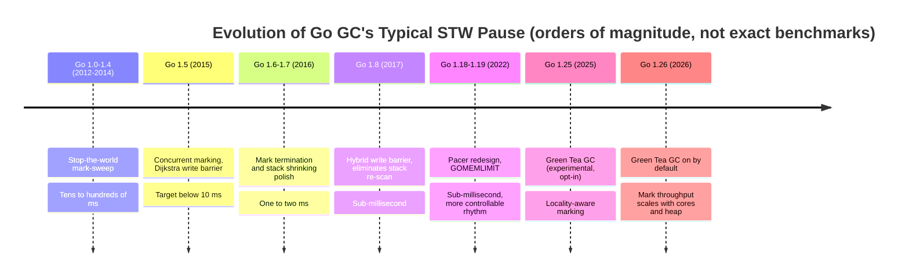

# 13.12 Past, Present, and Future

Having read the previous ten sections, the reader now holds the present state of each part of Go's garbage collector: tri-color marking ([13.1](./basic.md)),
the hybrid write barrier ([13.2](./barrier.md)), the pacer ([13.3](./pacing.md)), and sweeping and reclamation ([13.5](./sweep.md)).
This section takes a different angle: it places these parts back on a timeline and watches how, step by step, they grew into their present shape.

The evolution of the collector reads like a curve that converges steadily in one direction. From Go 1.0 to today, pause times have dropped by roughly two
orders of magnitude, and along the way one constant theme runs through it all: every change serves the goal of completing collection without disturbing user code.
Once that theme is understood, the many schemes below, both those adopted and those abandoned, can all be measured against the same ruler.

## 13.12.1 Schemes That Were Adopted: From Hundreds of Milliseconds to Sub-Millisecond

### Go 1.0 to 1.4: Naive Stop-the-World Mark-Sweep

The earliest collector was textbook mark-sweep, and the entire process stopped the world (STW):
once collection began, all user goroutines halted, the collector walked through "mark the live, sweep the dead" on a single thread or a few threads,
and then let user code continue. Go 1.3 made the sweep phase run in parallel with marking (several collector threads working at once),
shortening total duration, but user code was still suspended for the whole stretch.

The cost of this design is written plainly in the pause time: the larger the heap, the more objects to scan, and the longer the STW. Measured pauses fell in the tens to
hundreds of milliseconds. For a web service in the middle of handling requests, this meant that tail latency could at any moment be dragged into a hundred-millisecond spike
by a single collection. This pain point set the theme for the decade that followed.

### Go 1.5 (2015): Concurrent Marking, the Turn Toward Low Latency

Go 1.5 was the watershed. This rewrite, led by Richard Hudson, made the marking phase run **concurrently** with user code:
the collector marks while user goroutines run, allocate, and rewrite pointers all at the same time. To avoid missing live objects when pointers are
rewritten concurrently, it introduced a Dijkstra-style write barrier ([13.2](./barrier.md)). The publicly stated goal of this rewrite
was to push STW below 10 milliseconds, and the blog post and the ISMM 2018 talk repeatedly stressed one position: it is worth sacrificing a little throughput and
peak memory in exchange for predictable low latency. This was a deliberate ordering of values, not merely a performance optimization.

### Go 1.6, 1.7: Pushing the Milliseconds Down Further

After concurrent marking landed, the remaining STW concentrated at the two ends of the collection cycle. Go 1.6 turned the collector into a state machine and improved the
implementation of the mark termination phase; Go 1.7 let stack shrinking proceed independently of STW, bringing pauses down from 1.5's
single-digit milliseconds further to within one or two milliseconds. These two versions held no startling algorithmic changes; what they did was polish the concurrent framework
laid down by 1.5, point by point, until it was clean.

### Go 1.8 (2017): The Hybrid Write Barrier, Crossing Into Sub-Millisecond

The last mountain standing in the way of lower pauses after 1.5 was the **stack re-scan**. The Dijkstra write barrier intercepts only pointer writes on the heap,
not writes on the stack, so the collector could not guarantee that a stack already scanned black would not later point to a white object. It could only re-scan every stack
at mark termination, and this step had to be done under STW. Measured re-scanning ate up 10 to 100 milliseconds, exactly the threshold that the sub-millisecond goal
could not get past.

Go 1.8 introduced the **hybrid write barrier** ([13.2](./barrier.md)), which merged the Dijkstra barrier with the
Yuasa deletion barrier so that once a stack was scanned black it never had to be scanned again. This change directly eliminated STW stack re-scanning and brought typical pauses
into the **sub-millisecond** range. From then on, in the latency budget of most applications, "GC pause" was no longer an overhead that needed its own
line item.

### Go 1.18 and 1.19: The Pacer Redesign and the Soft Memory Limit

After sub-millisecond, the focus shifted from "how long the pause is" to "whether collection is triggered intelligently." Go 1.18 redesigned the pacer
([13.3](./pacing.md)), replacing the previously patched-together accumulating logic with a cleaner proportional-integral model, so that the collection rhythm
stays steadier even when the heap grows irregularly. Go 1.19 introduced `GOMEMLIMIT`, giving the runtime a **soft memory limit**:
below it, the collector can slow its rhythm and let a little more garbage accumulate to save CPU; as it approaches the limit, the collector automatically tightens, avoiding a needless OOM.
This works in concert with the return strategy of the page allocator and the scavenger ([12.7](../ch12alloc/pagealloc.md)), turning the trade-off among
latency, throughput, and memory from hard-coded constants into a goal the user can declare.

### A Pause Curve That Dropped About a Hundredfold

Connecting the versions above, pause time traces a clear downward curve, and it has stayed **transparent** to user code throughout: apart from
setting an environment variable, the application source needs not a single line changed, and the pause shortens generation by generation.

The design stance behind this curve can be condensed into one sentence: performance gains never come for free. Go traded the small throughput overhead brought by the write barrier
for predictable pauses; with the knob exposed by `GOMEMLIMIT`, it handed the trade-off among the three back to the person who understands the business needs best.

## 13.12.2 Schemes That Were Abandoned: Two Roads That Did Not Go Through

Not every attempt made it into a release. Two schemes that were seriously explored and ultimately abandoned confirm, from the opposite side, the theme drawn above.

The first is **concurrent stack re-scanning**. Before 1.8, the team also considered not introducing a new barrier, but instead making the STW stack re-scan run concurrently.
This road was far more complex in engineering terms than the hybrid write barrier, and even if it had been built, the re-scan itself would still exist. The hybrid write barrier removed
the re-scan phase by the root in one stroke, simplifying the collector's state machine as a side benefit, and so the concurrent re-scan scheme was dropped.

The second is the **request-oriented collector** (ROC, [13.9](./roc.md)) and **traditional generational collection**
([13.8](./generational.md)). ROC assumes that "objects private to a request can be reclaimed in a single batch when the request ends," and generational collection assumes
that "most objects die young." Both assumptions match intuition, but on Go both failed at the same place: to keep the assumption correct, the
write barrier had to stay on for the long term, bringing expensive cache misses. And Go's stack allocation means many "young objects" never enter the heap at all and have already died
on the stack, which cuts down the benefit the generational assumption could squeeze out. With cost exceeding benefit, neither entered a release.

The lesson these two abandonments left is concrete: in Go, any scheme that hopes to speed up collection by "exploiting some structural regularity of objects" must first
clear the gate of "write barrier overhead." This sets up the protagonist of the next section.

## 13.12.3 Present and Future: Green Tea GC

After sub-millisecond, the pause was no longer the main battlefield, and the remaining cost shifted to whether that 25% of background CPU spent in the marking phase
was being spent well. The new marking algorithm **Green Tea**, brought by Go 1.25, targets exactly the dimension none of the previous versions addressed head-on:
the **cache locality** of the marking phase. It was offered in 1.25 as an experimental feature behind `GOEXPERIMENT=greenteagc` (opt-in), and from 1.26 it is
**on by default** (turn it off with `GOEXPERIMENT=nogreenteagc`).

Its core idea can be stated in one sentence: **defer the scan, gather objects by span, and scan them together**, turning the classic tri-color marker's
"chasing pointers all over memory" random access back into sequential access within a single span, so the cache and prefetch work again.

Placed back into the thread of this section, Green Tea shares one lineage with the abandoned ROC and generational collection of the previous subsection: all of them want to
**exploit a structural regularity** of objects to speed up collection. The difference is only which regularity, and where the cost falls. ROC exploits request boundaries
and generational collection exploits object age, both **temporal** structure, and both must keep a write barrier running for the long term to maintain the assumption, at the cost
of cache misses (the "write barrier gate" summarized in [13.9](./roc.md)). Green Tea exploits **spatial** locality (objects on the same span are physically adjacent); it changes
only the **order** in which the marker traverses, introduces no new barrier, and so cleanly sidesteps the very gate that tripped up the first two. This time, the same
"exploit structure" intuition finally found the entry point that does not have to pay the barrier cost.

Its two inlined bitmaps, the span ownership handshake, the per-P stealable FIFO span queue, and the two scan paths (dense SIMD and sparse per-object) are laid out in full in
[13.11 Green Tea: Locality-Aware Marking](./greentea.md) of this chapter, and are not repeated here. The point is this: whatever form it ultimately takes, it still serves the theme
that has run from Go 1.5 to today, letting collection disturb user code as little as possible. In the early years this theme showed up as "shorten the pause"; today it shows up as
"let mark throughput scale with core count and heap size, while not handing the latency back." The ruler has not changed; it has only measured a new dimension.

## Further Reading

1. Richard L. Hudson. *Getting to Go: The Journey of Go's Garbage Collector.* ISMM 2018 keynote / The Go Blog, 2018.
   https://go.dev/blog/ismmkeynote (a first-hand account of the 1.5 turn to concurrent collection and the low-latency stance)
2. The Go Authors. *A Guide to the Go Garbage Collector.*
   https://tip.golang.org/doc/gc-guide (the official guide to the pacer, `GOMEMLIMIT`, and the latency/throughput/memory trade-off)
3. Austin Clements. *Proposal: Concurrent Garbage Collector Pacing (Go 1.5).* design doc.
   https://golang.org/s/go15gcpacing
4. Austin Clements, Rick Hudson. *Eliminate STW stack re-scanning (hybrid write barrier, Go 1.8), issue #17503.*
   https://github.com/golang/go/issues/17503
5. The Go Authors. *Soft memory limit (`GOMEMLIMIT`), Go 1.19 release notes.*
   https://go.dev/doc/go1.19#runtime
6. The Go Authors. *runtime: green tea garbage collector, issue #73581.*
   https://github.com/golang/go/issues/73581 (Green Tea's design motivation and benchmarks)
7. The Go Authors. *runtime/mgcmark_greenteagc.go.*
   https://github.com/golang/go/blob/master/src/runtime/mgcmark_greenteagc.go (the implementation of `GOEXPERIMENT=greenteagc`)
