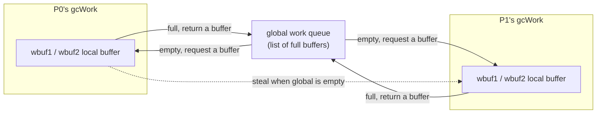

# 13.4 Scan Marking and Mark Assist

Marking is the main body of GC's work: starting from the roots (global variables, each goroutine's stack, registers),
it follows pointers and blackens every reachable object (the tricolor abstraction of [13.1](./basic.md)). A naive
implementation would stop the whole world and walk the object graph single-threaded, which is exactly where early Go's
unbearable pauses came from. After go1.5, marking was reshaped into a form where two things hold at once: it advances
**concurrently with the user program**, and when the user allocates too fast it can **amortize the cost** onto the
allocator itself. This section answers three questions: how marking unfolds in parallel without the workers stepping on
each other; how, when scanning an object, we know which of its fields are pointers; and what guarantees that marking
will never be left permanently behind while the user allocates and marking chases.

## 13.4.1 Who Does the Marking: Background Workers and the 25% Budget

The main force of marking is a group of background goroutines, `gcBgMarkWorker`. The runtime prepares one for each P,
but does not let them spin at full speed and seize CPU. Instead it pins the entire mark phase's CPU budget at
**25% of GOMAXPROCS**:

```go
// runtime/mgcpacer.go (sketch)
const gcBackgroundUtilization = 0.25 // fixed CPU utilization target for background GC during the mark phase
```

Why a fixed fraction rather than "do as much as we can"? This is a core covenant of the pacer ([13.3](./pacing.md)):
nail GC's erosion of throughput at a predictable level, and leave the remaining 75% to the user program. The number 25%
is itself an engineering compromise: higher hurts throughput, lower lets marking fall behind allocation (the gap, when
marking falls behind, is then filled by the mark assist discussed below).

When the fixed budget is mapped onto concrete workers, it computes how many "dedicated" workers are needed from
`GOMAXPROCS × 0.25`, with the remainder made up by one "odd-job" worker. This gives three working modes:

```go
// the three background mark worker modes (runtime)
gcMarkWorkerDedicatedMode  // dedicated: holds a P exclusively for the whole mark phase, not preempted
gcMarkWorkerFractionalMode // fractional: makes up the fractional part of the 25% budget, yields when its quota is hit
gcMarkWorkerIdleMode       // idle: marks opportunistically when a P has no user goroutine to run
```

For example, when `GOMAXPROCS = 8`, $8 \times 0.25 = 2$, so there are 2 dedicated workers each holding a P; if
$5 \times 0.25 = 1.25$, then there is 1 dedicated worker plus one fractional worker making up the $0.25$. The dedicated
worker is not preempted by the scheduler during marking; the fractional worker voluntarily yields once it reaches the
`fractionalUtilizationGoal` ratio; the idle worker is woken only when some P cannot find user work to do, opportunistically
through `findRunnable` ([9.4 The Scheduling Loop](../../part3concurrency/ch09sched/schedule.md)). Together the three hold the
average at 25% while wasting no spare compute.

## 13.4.2 The Gray Queue: gcWork's Layering and Stealing

Marking is naturally suited to parallelism: different workers scan different regions of the object graph, independent of
each other. The difficulty is not parallelism itself but how to let multiple workers efficiently **share one to-do list of
gray objects** without contending for the same lock day in and day out. Go's answer is a structure you have already met
twice in this book: per-P local buffers + a global queue + stealing. The scheduler's run queue
([9.2](../../part3concurrency/ch09sched/steal.md)) is built this way, the allocator's mcache and mcentral
([12.2](../ch12alloc/component.md)) are built this way, and marking's `gcWork` is built this way too.

```go
// gcWork: a per-P local buffer of gray objects (sketch)
type gcWork struct {
    // Two work buffers form a double buffer stack with "hysteresis".
    // wbuf1 is the buffer currently pushed to / popped from; wbuf2 is the next one to be dropped.
    // Keeping a whole buffer of slack lets the cost of "requesting from / returning a buffer to
    // the global queue" be amortized over at least one buffer's worth of work, reducing contention
    // on the global queue.
    wbuf1, wbuf2 *workbuf

    bytesMarked  uint64 // bytes this gcWork has blackened, rolled up into work.bytesMarked
    heapScanWork int64  // heap scan work this gcWork has done, fed to the pacer and assist credit
}
```

A worker's main loop is "take a gray object, scan it, gray and enqueue the newly discovered white objects, and turn
itself black," repeated until the queue is empty. When taking a gray object, it first reaches into the local buffer
(lock-free); when the local buffer is empty it goes to the global queue; only when the global queue is also empty does
it go **steal** another P's buffer. This loop is `gcDrain`:

```go
// gcDrain: "drain" the gray object queue (trimmed to the trunk)
func gcDrain(gcw *gcWork, flags gcDrainFlags) {
    // ... first handle root marking tasks (markroot): scan global variables, each goroutine's stack ...

    // then the main loop of heap marking
    for !(gp.preempt && (preemptible || ...)) {
        if work.full == 0 {
            gcw.balance() // the local buffer has grown too full, share some back to global so others have work
        }
        // take an object to scan: local fast get -> local slow get -> steal
        b := gcw.tryGetObjFast()
        if b == 0 {
            b = gcw.tryGetObj() // if needed, request a buffer from the global queue
        }
        if b == 0 {
            break // truly no work, exit
        }
        scanObject(b, gcw) // scan, following pointers to gray and enqueue white objects

        // once a batch has accumulated, flush the scan credit to the pacer for mark assist to draw on (see 13.4.4)
        if gcw.heapScanWork >= gcCreditSlack {
            gcController.heapScanWork.Add(gcw.heapScanWork)
            ...
            gcw.heapScanWork = 0
        }
    }
}
```

The "hysteresis" of the double buffer (`wbuf1` / `wbuf2`) is the key bit of craftsmanship here: if it went to the global
queue to swap every time it emptied a buffer, and returned every time it filled one, the global queue would be read and
written at high frequency. Keeping a whole buffer of slack means it only requests a new one from global when it empties
two buffers in a row, and only returns one when it fills two in a row, pushing the global queue's access frequency down by
an order of magnitude. This is the same line of thinking as mcache's "bulk restock" from mcentral: amortize the expensive
shared access over a batch of local operations.



By go1.25/1.26, marking grew one more layer of "scan-by-span" optimization (Green Tea GC, an experimental feature on by
default): besides the per-object gray queue, `gcWork` also maintains a pending **span queue** (`spanq`), which groups
multiple objects to scan within the same span into one batch scan, improving memory-access locality in scenarios dense
with small objects. Structurally it is an extension of the queue machinery above; the semantics of gray objects do not
change. This section narrates the classic "per-object gray queue," which is enough to understand the skeleton of marking;
span scanning is a performance evolution on top of it.

## 13.4.3 Scanning One Object: How Do We Know Where the Pointers Are

For `scanObject` to advance along pointers, the prerequisite is knowing **which fields in the object are pointers**.
Otherwise it has nothing to advance along, and it might mistake an integer that happens to look like a heap address for a
pointer, wrongly "marking" a swath of object graph that does not exist. Go is a **precise** GC: it has exact metadata for
the pointerness of every word and does not rely on conservative guessing.

This metadata is exactly the redemption of what [12.1](../ch12alloc/basic.md) called "the allocator and GC are symbiotic":
when an object is allocated, the runtime records its pointer layout according to its type, and marking takes it straight
to use. Since go1.22, the way this layout is stored was refactored once. Earlier, each heap arena had a pointer bitmap
covering the whole heap (one bit per word); go1.22 changed it to place the pointer information closer to the object itself:

```go
// runtime/mbitmap.go (sketch): decide where the pointer bitmap lives
// Small objects: the ptr/scalar bitmap is stored directly at the end of the span, addressable by word.
func heapBitsInSpan(userSize uintptr) bool { ... }

// Large objects: an allocation header is placed in the object's first word,
// pointing to the type descriptor; on scanning, the full pointer layout is read from there.
```

So scanning splits into two cases: for objects small enough, the bitmap is at the tail of the span they belong to, and
the bit is read by word offset; for larger objects, the first word is an "allocation header" pointing to the type
descriptor ([4.1](../../part2lang/ch04type/type.md)), and the scanner follows it to obtain the type's complete pointer
bitmap. Either way, once `scanObject` has the bitmap, what it does is the same:

```text
// the trunk logic of scanObject (pseudocode)
for each word w of the object:
    if the bitmap marks w as a pointer:
        p := *w
        if p points to some white heap object obj:
            gray obj and enqueue into gcw   // the object to scan in the next round
            gcw.bytesMarked += size of obj
```

Scanning the stack uses another set of metadata. The layout of a heap object is derived by the runtime from its type,
but the layout of a stack frame varies with the function and with the program counter position, so the pointer
information is generated by the **compiler**: each function has, at each of its safe points ([13.7](./safe.md)), a
**stack frame pointer map** (stack map) indicating which slots on the stack at that point are live pointers. A worker
scanning a goroutine's stack looks up, based on which safe point the goroutine is currently stopped at, the corresponding
stack map, and grays the objects pointed to by the live pointers according to the map. Putting these two together (the
heap's type bitmap and the stack's stack map), marking can precisely traverse the entire object graph starting from the
roots.

Precision has a cost: the compiler must generate and store a stack map for each function, and the runtime must maintain a
pointer bitmap for each type, both of which are space and compile-time overhead. What it buys is a GC that will neither
miss a live object nor "pin" a large swath of garbage on the heap by misjudging an integer as a pointer, the latter being
exactly the pain that conservative GC (such as some early C/C++ collectors) cannot fully cure.

## 13.4.4 Mark Assist: Whoever Allocates, Helps

Concurrent marking has an unavoidable hazard ([13.3](./pacing.md) already touched on it): marking is running, and so is
the user allocating. The worker blackens steadily at its 25% budget, but if the user goroutine allocates fiercely enough,
newborn white objects appear faster than the worker can blacken them, and the heap fills up before marking completes. The
fixed 25% budget cannot rein in a program that allocates especially aggressively.

**Mark assist** is the backstop set up for this: during the mark phase, every goroutine, when it allocates memory, must
first **pay off the marking debt it has run up**. The runtime keeps an "assist credit" `gcAssistBytes` for each goroutine,
deducted on allocation; once it goes negative (in debt), the goroutine must, before it can keep allocating, personally do
a stretch of marking work proportional to the debt:

```go
// gcAssistAlloc: check and repay marking debt on allocation (trimmed to the trunk)
func gcAssistAlloc(gp *g) {
    // convert "bytes owed" into "scan work owed" by the exchange rate the pacer gives
    assistWorkPerByte := gcController.assistWorkPerByte.Load()
    debtBytes  := -gp.gcAssistBytes
    scanWork   := int64(assistWorkPerByte * float64(debtBytes))

    // first "borrow" some from the scan credit the background workers have accumulated; if we can borrow it, we need not do it ourselves
    if bgScanCredit := gcController.bgScanCredit.Load(); bgScanCredit > 0 {
        stolen := min(bgScanCredit, scanWork)
        gcController.bgScanCredit.Add(-stolen)
        scanWork -= stolen
    }
    if scanWork == 0 {
        return // the debt is offset by credit, keep allocating
    }
    // not enough credit: personally do scanWork units of marking, and only after that is allocation allowed
    gcDrainN(&getg().m.p.ptr().gcw, scanWork)
}
```

There are two layers of design here. The first is that **exchange rate** `assistWorkPerByte`, computed in real time by the
pacer ([13.3](./pacing.md)); in essence it is "how much scan work must be repaid per byte allocated, so that marking
finishes on time." The more is allocated, and the closer to the mark goal, the heavier the debt per byte. The second is
`bgScanCredit`: each time the background worker scans a batch, it records the over-fulfilled amount of work as "credit"
and deposits it into a global account (see the flush of credit at the end of `gcDrain` in 13.4.2), and the allocator draws
on this credit first; only when the credit runs dry is it truly conscripted into marking. So a lightly-allocating
goroutine almost never marks personally (its debt is repaid by the workers' credit), and only a goroutine allocating
faster than marking gets pulled down to work.

The effect is to forcibly bind "allocation rate" to "marking rate": the more fiercely you allocate, the more marking you
are penalized into doing, and the speed of allocation is therefore dragged down by the marking debt you yourself created,
so marking can never be shaken off. This also explains a commonly observed phenomenon: during GC marking, an
allocation-intensive business goroutine sees latency spikes, because it is being conscripted to repay GC's debt.

Putting it back in a global view, mark assist and the write barrier ([13.2](./barrier.md)) are exactly a complementary
pair of mechanisms:

| Mechanism | What it guarantees | How it guarantees it |
| --- | --- | --- |
| Write barrier | **Correctness**: concurrent marking does not miss a live object | record when the user changes a pointer, maintaining the tricolor invariant |
| Mark assist | **Timeliness**: marking finishes before the heap fills up | the allocator repays marking work by its debt, binding allocation and marking rates |

The write barrier governs "marking correctly," mark assist governs "finishing marking," and without either, "concurrent
marking with almost no pause" does not stand. Understanding this pair is to understand why Go's GC can squeeze pauses down
to sub-millisecond, yet still pays about 25% of background CPU plus occasional allocation latency. The gain in performance
never comes for free; the price of low latency is spread across exactly these two places. When marking runs until there
are no more gray objects, it enters mark termination and the subsequent sweep ([13.5](./sweep.md)), returning this round's
dead object slots to the allocator.

## 13.4.5 Design Trade-offs, Evolution, and Lineage

- **Fixed 25% background budget + mark assist backstop**: nailing GC's erosion of throughput into a predictable constant
  is the most fundamental shift of go1.5's concurrent GC over the early STW marking. The cost is that an aggressively
  allocating program gets dragged down by assist, throughput further eaten into, which is exactly why the pacer
  ([13.3](./pacing.md)) must carefully calibrate `GOGC` and the trigger timing.
- **gcWork's per-P buffer + double-buffer hysteresis + stealing**: the same "layered contention reduction" isomorphic to
  the scheduler's run queue ([9.2](../../part3concurrency/ch09sched/steal.md)) and the allocator's mcache
  ([12.2](../ch12alloc/component.md)). This move appears again and again in the Go runtime; it is the general solution for
  high-concurrency data structures.
- **Evolution of precise-scan metadata**: from the early per-arena whole-heap pointer bitmap, to go1.22 collecting the
  pointer layout into the span's tail and the object's first-word "allocation header," with the aim of improving
  memory-access locality and shrinking metadata footprint; go1.25/1.26's Green Tea GC adds one more layer of batch
  scanning by span, further optimizing scenarios dense with small objects.

Placed in the lineage, "concurrent tricolor marking + write barrier + mark assist" is not Go's invention: concurrent
marking traces back to the foundational work of Dijkstra and others in 1978, and low-latency concurrent collectors beyond
generational ones (such as Java's G1, ZGC, Shenandoah) take a similar concurrent-marking route. Go's trade-offs are
distinct: no generations, trading non-moving for implementation simplicity and predictable low pause, and putting the
engineering effort into the feedback control of pacing and assist that "keeps marking always able to catch up with
allocation." This main line, and the layer of metadata born for precise GC in [12 Memory Allocation](../ch12alloc),
formally converge at this step of marking.

## Further Reading

1. Rick Hudson. *Getting to Go: The Journey of Go's Garbage Collector.* ISMM 2018 keynote.
   https://go.dev/blog/ismmkeynote (a first-person account of the design of concurrent marking, write barrier, and mark assist)
2. The Go Authors. *runtime/mgcmark.go.* `gcDrain`, `scanObject`, `gcAssistAlloc`, `gcDrainN`.
   https://github.com/golang/go/blob/master/src/runtime/mgcmark.go
3. The Go Authors. *runtime/mgcwork.go.* `gcWork`, `workbuf`, and the double-buffer steal queue.
   https://github.com/golang/go/blob/master/src/runtime/mgcwork.go
4. The Go Authors. *runtime/mgcpacer.go.* `gcBackgroundUtilization`, assist credit, and the exchange rate.
   https://github.com/golang/go/blob/master/src/runtime/mgcpacer.go
5. The Go Authors. *A Guide to the Go Garbage Collector.* https://go.dev/doc/gc-guide
6. E. W. Dijkstra, L. Lamport, A. J. Martin, et al. *On-the-Fly Garbage Collection: An Exercise in
   Cooperation.* CACM, 1978. (the theoretical foundation of concurrent tricolor marking)
7. This book's [13.2 Write Barrier](./barrier.md), [13.3 Pacing Algorithm](./pacing.md), [13.7 Safe Point Analysis](./safe.md),
   [12.1 Allocator Design Principles](../ch12alloc/basic.md).
