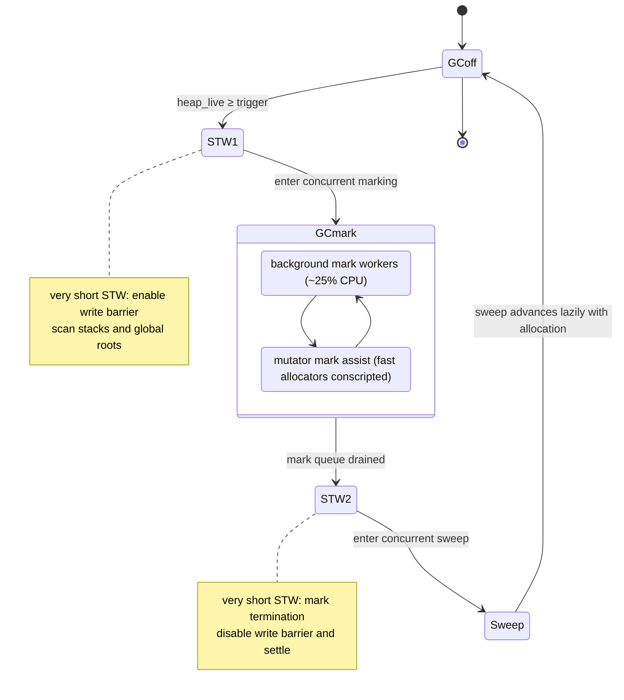
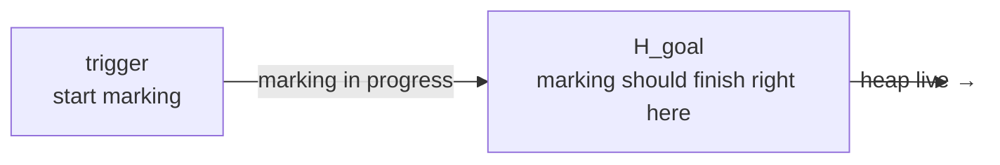

# 13.3 Trigger Frequency and the Pacing Algorithm

[13.2](./barrier.md) explained how the write barrier lets concurrent marking coexist with the mutator, guaranteeing that "we can keep allocating even while collection is under way." That leaves a question of timing: when should the next round of GC start? Too late, and the heap has already grown to an unacceptable size; too early, and frequent collection burns CPU for nothing. The answer comes from the **pacer**, introduced in Go 1.5 and redesigned in 1.18. This section first lays out the full timeline of a GC cycle, then makes clear what kind of feedback controller the pacer is: it must finish marking before the heap reaches its goal, all while the mutator keeps allocating.

## 13.3.1 The Timeline of a GC Cycle

Taking a GC cycle apart, it moves among three phases, `_GCoff`, `_GCmark`, and `_GCmarktermination`, with two very short stop-the-world (STW) windows wedged between them:



The arc of a full cycle goes like this: the live bytes on the heap, `heap_live`, grow up to the trigger line `trigger` computed by the pacer; the first STW window enables the write barrier and scans the roots (goroutine stacks and global variables), then releases the world and enters concurrent marking. During the mark phase, background workers take up about 25% of `GOMAXPROCS` to keep marking, and goroutines that allocate too quickly are also conscripted into mark assist ([13.3.5](#1335-mark-assist)). Once the mark queue is drained, the cycle enters the second STW window for mark termination, disabling the write barrier and settling this cycle's statistics, then transitions into concurrent sweeping, whose work is amortized lazily over subsequent allocations ([13.5](./sweep.md)). Both STW windows are squeezed down to the sub-millisecond range, and the vast majority of collection work runs concurrently with the mutator. This is exactly the shape of Go's low-latency GC.

The pacer has only one decision to make, but it affects everything: **where to set the trigger line `trigger`**. Set it low, and marking finishes comfortably, but work starts before the heap has grown much, so GC is too frequent. Set it high, and collection starts only as the goal approaches, marking cannot keep up, and the heap overshoots the goal. The sections below cover, in turn, how the goal is set (GOGC, GOMEMLIMIT), how the trigger line is computed (the feedback controller), and what catches us if the computation comes out wrong (mark assist).

## 13.3.2 GOGC: The Knob That Trades Memory for CPU

The pacer's target heap size is given by the environment variable `GOGC` (or `runtime/debug.SetGCPercent`), whose semantics are a growth rate: let the heap that survives the end of the previous mark be $H_m$ and `GOGC` be $p$; then this cycle's target heap size is

$$
H_{goal} = H_m \left( 1 + \frac{p}{100} \right)
$$

The default is `GOGC=100`, meaning the target is twice the previous cycle's live amount: the heap doubles before one round collects. `GOGC=200` allows growth to three times, so GC is rarer but resident memory is larger; `GOGC=50` keeps the heap at 1.5 times, saving memory but running GC more often. It is at heart a **knob that trades memory for CPU**: turn it up to save CPU at the cost of memory, turn it down to save memory at the cost of CPU; there is no free direction. `GOGC=off` switches off heap-growth-based triggering entirely.

More precisely, since 1.18 the target accounts not only for the heap but also for the size of the roots, scaling them along with the live heap by $p/100$:

$$
H_{goal} = H_m + (H_m + S_{stack} + S_{globals}) \cdot \frac{p}{100}
$$

where $S_{stack}$ and $S_{globals}$ are the bytes of stack and global variables scanned in the previous cycle. The roots are counted in because the total marking workload is proportional to "live heap + roots." The old version, which counted only the heap, would skew the pace when the roots were large. This is one of the biases corrected by the 1.18 redesign (see [13.3.7](#1337-evolution-from-the-15-original-to-the-18-redesign)).

## 13.3.3 GOMEMLIMIT: A Soft Cap for Container Quotas

`GOGC` only governs the growth rate; it sets no absolute upper bound. For a service whose resident live amount is already large, `GOGC=100` will double the peak heap, which in a memory-constrained container is enough to trigger an OOM. Go 1.19 introduced `GOMEMLIMIT` (`debug.SetMemoryLimit`) for this, a **soft memory limit**: after computing the `GOGC`-based target, the pacer computes a second target based on the limit and takes the smaller of the two.

The soft-limit algorithm is not as simple as "GC once the heap reaches the limit," because the limit constrains all memory mapped by the runtime, whereas the heap target concerns only the heap. The runtime must subtract the non-heap overhead from the limit (stacks, metadata, idle but un-returned pages, and so on); what remains is the budget available to the heap, and it reserves a slice of headroom (at least 1 MiB, or 3% of the budget) to avoid riding the edge:

$$
H_{goal}^{limit} = \text{memoryLimit} - \text{nonHeapOverhead} - \text{headroom}
$$

The typical use of `GOMEMLIMIT` is to set it to some fraction of the container quota (say 90%) while keeping `GOGC=100`: under normal conditions the pace follows `GOGC`, and as the limit approaches the pacer automatically tightens, running GC more densely to hold the heap down, the equivalent of an insurance policy on memory. But it is a "soft" limit, and that is deliberate: if the live amount itself genuinely exceeds the limit, the runtime will not endlessly squeeze CPU to maintain an impossible target (that would only fall into GC thrashing); instead it allows the breach and hands the OOM decision back to operations. Setting `GOGC=off` together with `GOMEMLIMIT` yields a pure limit-driven mode that collects only as the limit approaches.

## 13.3.4 The Pacer: A Feedback Controller

With the goal $H_{goal}$ fixed, the difficulty lies in the trigger line. GC is not instantaneous: from trigger to the completion of marking takes time, and during that time the mutator keeps allocating and the heap keeps climbing. If we wait until `heap_live` touches $H_{goal}$ to start, the heap will have long overshot the goal by the time marking ends. So the trigger line must be set **early**, leaving the "lead" that marking needs:



How much lead is needed depends on a race between two things: how much remains to scan (the remaining scan work) and how fast the mutator grows (the allocation rate). The pacer builds this into a feedback controller: it estimates the ratio of "the throughput of background marking at 25% CPU" to "the mutator's allocation rate measured in CPU time," and from that ratio works backward to a trigger heap size, such that marking finishes exactly at the instant the heap touches the goal, with no mark assist needed at any point. In other words, **the controller's ideal state is GC CPU usage steady at 25% with zero assist**.

Before the 1.18 redesign, this was a soft controller with a history term, correcting the next cycle's trigger rate from "the deviation between the previous cycle's goal and the actual heap" cycle by cycle, with empirical bounds like 0.95 and 0.6 baked into the formula along with several state variables, behavior that was hard to analyze. After 1.18, it was replaced by a direct **proportional controller**: each cycle recomputes the trigger line from the current scan throughput and allocation rate, no longer carrying a long history of state. Below is a trimmed sketch keeping only the control-related fields:

```go
// gcControllerState: the pacer's state (sketch, keeping the control-related fields)
type gcControllerState struct {
    gcPercent   atomic.Int32 // GOGC: target growth rate
    memoryLimit atomic.Int64 // GOMEMLIMIT: soft memory limit

    heapMarked uint64        // live heap H_m at the end of the previous mark
    heapLive   atomic.Uint64 // current live bytes from GC's view; marking starts when it reaches the trigger

    gcPercentHeapGoal atomic.Uint64 // this cycle's target heap H_goal computed from GOGC
    triggered         uint64        // the heap size at the actual trigger this cycle (valid only during marking)

    // feedback core: the cons/mark ratio, i.e. "mutator allocation rate / GC scan throughput,"
    // both measured in CPU time. Updated by endCycle at each mark termination, used to back out the next cycle's trigger line
    consMark float64

    heapScanWork atomic.Int64 // heap scan work completed this cycle (bytes)
    bgScanCredit atomic.Int64 // extra scan credit done by background marking, drawable by assist
}
```

The controller computes `consMark` and `commit`s at each mark termination, and from it re-fixes the next cycle's goal and trigger line; while marking is in progress it continually calls `revise`, adjusting the assist ratio according to real-time progress. The trigger line is clamped to a reasonable range: the lower bound must leave room for concurrent sweeping to grow into (sweeping happens during the heap growth from `heapLive` to the trigger line), and the upper bound must not exceed the goal, lest the assist ratio shoot to infinity. Here `consMark` (consumption/mark) is precisely the realization of the "ratio of allocation rate to scan throughput" from [13.3.4](#1334-the-pacer-a-feedback-controller): once it is estimated accurately, the trigger line can be computed correctly.

Why does such a proportional controller converge? Here is an intuitive argument. Let the cons/mark ratio observed in the previous cycle be $r$ (allocation rate over scan throughput; a larger $r$ means the mutator is relatively more aggressive); from this the controller sets the trigger line at a distance $\Delta = (H_{goal} - \text{trigger})$ from the goal, such that in the time it takes the mutator to allocate $\Delta$ bytes, background marking exactly finishes scanning all live objects. If the mutator runs faster this cycle than last, the actual heap will slightly overshoot the expectation that the trigger line corresponds to, assist is triggered, and in the next cycle's `commit` the controller observes the deviation, raises its estimate of $r$ accordingly, and moves the trigger line forward to leave more lead; if it runs slower, the line moves back. As long as the mutator's behavior does not swing violently every cycle, this negative feedback pulls the system toward the fixed point of "assist tending to zero, CPU usage tending to 25%." The reason 1.18 could use such a simple form is precisely that it defines the goal and the inputs cleanly enough (heap + roots, rates measured in CPU time) that the deviation has a clear meaning.

Looking at other runtimes, the approaches to pacing make different trade-offs. The JVM's G1 collector takes the "pause-time goal" route: the user specifies a desired upper bound on pauses, and the collector picks the number of regions to collect each time accordingly (incremental collection). Go does the reverse: it fixes a heap-growth goal and lets pauses fall naturally into the sub-millisecond range, leaving the throughput-versus-latency trade-off to `GOGC`. These two paths reflect different priorities: G1 prioritizes predictable pauses, Go prioritizes a simple, controllable upper bound on memory and extremely low pauses.

## 13.3.5 Mutator Assist (mark assist)

However accurate the controller, it is only an estimate. The mutator's allocation rate may suddenly spike, mark throughput may fall short of expectation because the roots are large, and once the trigger line is computed wrong, marking risks failing to keep up with allocation and the heap overshooting the goal. Go uses a feedback mechanism as a backstop: **whoever allocates fast gets conscripted into marking**, and this is mark assist. Here we treat it only from the pacing perspective, how it closes the feedback loop; the concrete implementation details of debt and scanning working together are left to [13.4](./mark.md).

The mechanism is an account of scan credit. Whenever a goroutine allocates memory, it takes on a "scan debt" in proportion to the assist ratio: the more it allocates, the more scan work it owes. It must repay this debt with "marking work done by its own hand," and until the debt is paid off it is not allowed to keep allocating (it is parked and turned to marking instead). The assist ratio is maintained by the controller, proportional to "the distance from goal to trigger / the remaining scan work"; the closer the heap is to the goal and the more work remains, the higher the ratio, and the harder the mutator is conscripted. Marking that the background workers do beyond their share is stored as a public credit, which the mutator can draw on first, so that not everyone is penalized into labor.

What is elegant about this mechanism is that it **hard-binds the allocation rate to the marking rate**: the faster the mutator allocates, the more it is pulled into marking, so allocation is naturally rate-limited and marking gains extra hands. It forms the pacer's negative-feedback loop: when the trigger line is estimated accurately, assist almost never happens and GC stays at the ideal point of 25% CPU; when it is estimated wrong, assist automatically piles on to drag the heap back within the goal. The cost is that fast-allocating goroutines have to work for GC, paying extra latency. This is a deliberate trade-off: rather than let the heap run away and ultimately be forced into STW or OOM, it makes the code that produces the most garbage bear the collection cost, distributing the pressure back to its source.

## 13.3.6 Seeing the Pacing With Your Own Eyes: gctrace

The pacer's work need not stay in formulas; the runtime prints the rhythm of every cycle directly via `GODEBUG=gctrace=1`. Run a program that allocates continuously and you will see lines of this form:

```
gc 1 @0.001s 3%: 0.016+0.23+0.019 ms clock, ... 4->5->1 MB, 5 MB goal, 12 P
```

Mapping each field to this section's concepts: `gc 1` is the first cycle; `@0.001s` is the time from program start to this moment; `3%` is the cumulative CPU taken by GC, which can be compared against the 25% mark target (far below it means the background workers were sufficient under this cycle's load and assist was barely triggered). The three `clock` times correspond respectively to the STW at the start of marking, concurrent marking, and the STW at mark termination, the two STW windows both in the microsecond to sub-millisecond range. The most telling part is `4->5->1 MB, 5 MB goal`: the heap was 4 MB at the **start** of marking (that is the trigger line), grew to 5 MB at the **end** of marking (that 1 MB is exactly the lead the controller reserves, allocated by the mutator during the concurrent phase), and this cycle's live amount is 1 MB; while `5 MB goal` is this cycle's target heap $H_{goal}$. The actual peak of 5 MB lands exactly on the goal, so the trigger line's lead was computed accurately and the mutator did not overshoot. To look further into the controller's internal inputs and outputs ($H_m$, $h_t$, the various CPU utilizations, and so on), add `GODEBUG=gcpacertrace=1` on top. This set of output is the most direct window for validating intuitions about pacing.

## 13.3.7 Evolution: From the 1.5 Original to the 1.18 Redesign

The shape of the pacer has been adjusted several times across versions:

- **Go 1.5**: The first pacer was introduced together with the concurrent GC (Clements's go15gcpacing design document). It was a soft controller with a history term, comprising a scan-work estimator, assist scheduling, a trigger-rate controller, and several other parts, approaching the 25% CPU target through cycle-by-cycle feedback.
- **Go 1.10 / 1.14**: Empirical bounds were added to the trigger rate (upper bound $0.95\rho$, lower bound $0.6$) to ease instability under extreme allocation rates, but this also made the behavior harder to explain.
- **Go 1.18**: Knyszek led a redesign (proposal 44167). It was switched to a simpler, analyzable proportional controller; the scan amount of the roots (stacks, global variables) was formally counted into the goal and pace, correcting the old version's bias in large-root scenarios; and it paved the way for the `GOMEMLIMIT` of 1.19 that followed.
- **Go 1.19**: `GOMEMLIMIT`, the soft memory limit, was introduced. Beyond the `GOGC` target the pacer computes a second, limit-based target and takes the smaller, letting the GC pace respond to a container's memory quota.

One throughline runs through it all: from a hard-to-analyze multi-state soft controller toward a proportional controller that is "clear in its goal, explicable, and able to respond to external constraints." This also echoes a consistent leaning in the runtime's evolution: first make it run correctly, then make it amenable to reasoning.

## Further Reading

1. Austin Clements. *Go 1.5 concurrent garbage collector pacing.* 2015.
   https://golang.org/s/go15gcpacing (the design document for the original pacer, defining the target growth rate and the assist model)
2. Michael Knyszek. *GC Pacer Redesign.* Go proposal 44167, 2021.
   https://github.com/golang/proposal/blob/master/design/44167-gc-pacer-redesign.md
   (the 1.18 proportional-controller redesign, with the derivation that counts roots into the pace)
3. Michael Knyszek. *Soft memory limit.* Go proposal 48409, 2022.
   https://github.com/golang/proposal/blob/master/design/48409-soft-memory-limit.md
   (the design of `GOMEMLIMIT` and the soft-limit semantics). For its earlier origins see Brad Fitzpatrick. *runtime: mechanism
   for monitoring heap size.* Go issue #16843, 2016. https://github.com/golang/go/issues/16843
   and Austin Clements. *runtime/debug: add SetMaxHeap API.* CL 46751, 2017.
   https://go-review.googlesource.com/c/go/+/46751 (the two earliest attempts at soft/hard heap-limit semantics)
4. The Go Authors. *A Guide to the Go Garbage Collector.*
   https://go.dev/doc/gc-guide (the official guide to GOGC, GOMEMLIMIT, and pacing intuition)
5. The Go Authors. *runtime/mgcpacer.go.*
   https://github.com/golang/go/blob/master/src/runtime/mgcpacer.go
   (the implementation of `gcControllerState`, `commit`, `revise`, `trigger`, `heapGoalInternal`)
6. The Go Authors. *Package runtime/debug: SetGCPercent, SetMemoryLimit.*
   https://pkg.go.dev/runtime/debug
7. David Detlefs, Christine Flood, Steve Heller, Tony Printezis. *Garbage-First Garbage
   Collection.* ISMM 2004. https://dl.acm.org/doi/10.1145/1029873.1029879
   (the JVM G1's pause-time-goal pacing, contrasted with Go's heap-growth-goal pacing)
8. This book: [13.2 Write Barrier Techniques](./barrier.md), [13.4 Scanning, Marking, and Mark Assist](./mark.md),
   [13.5 Sweeping and Bitmaps](./sweep.md).
