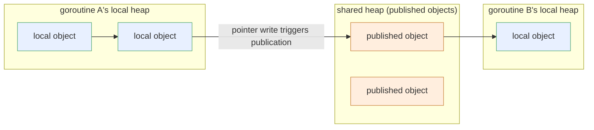

# 13.9 The Request Hypothesis and the Request-Oriented Collector

[13.8](./generational.md) explained why Go did not adopt the generational hypothesis. The reader may go on to ask: did Go ever try a different "object lifetime hypothesis"? It did. This section is about an experiment the Go team took seriously and ultimately abandoned, the Request-Oriented Collector (ROC). We discuss it not because it made it into Go, but because an abandoned design often reveals where the constraints lie better than a successful one. ROC is like a proof done wrong: the spot where it goes wrong marks exactly the boundary in Go's GC design space that cannot be crossed.

## 13.9.1 The Request Hypothesis

Server programs have a strong structural feature: work is done in units of requests. A request comes in, a batch of objects is allocated to handle it, and once the request finishes, the vast majority of that batch should be dead. In 2016, Rick Hudson and Austin Clements turned this observation into the request hypothesis:

> Objects created by a request tend to die together when that request finishes being processed.

This is not the same thing as the generational hypothesis ([13.8](./generational.md)). The generational hypothesis says "young objects die easily," a statistical regularity about age; the request hypothesis says "objects of the same request live and die together," a structural regularity about ownership. For server programs the latter fits reality better and is also more powerful: it does not merely say that some batch of objects will die, it specifies when they die and that they die in a batch. The typical goroutine in the cloud has exactly this shape: receive a message, deserialize it, compute once, serialize, drop the result back into a channel or socket, then exit.

```go
// One goroutine per request: most allocated objects die when the goroutine exits
func handle(conn net.Conn) {
	req := decode(conn)        // these intermediate objects
	result := compute(req)     // are almost all active only within this goroutine
	conn.Write(encode(result)) // and become garbage once the function returns
}
```

If we could exploit this regularity, reclamation could degrade from "global scan to find garbage" into "when a request finishes, hand its batch of objects back wholesale," which is both fast and avoids stopping the whole program for a global GC. Only one question remains: how do we know which objects "belong only to this request"?

## 13.9.2 The ROC Design: Local Objects and Published Objects

The core of ROC is to split heap objects into two classes. An object is local from the moment it is allocated, reachable only by the goroutine that created it; once it is written into a location that another goroutine can see (a global variable, an object on the shared heap, a message sent over a channel), it becomes published. This local / published division is the entire pivot of ROC:

- When a goroutine reaches the end of its life, the objects it created that were never published must, at that moment, be unreachable: no other goroutine can reference them. So there is no need to scan, no need to wait for the next round of global GC; we can reclaim the whole batch directly. In implementation, ROC makes this an extremely light action: when a goroutine exits, it rewinds the sweep pointer back to where it began, and the objects in that span that have no mark bit set are freed in place.
- Published objects are left to the regular global concurrent mark-sweep ([13.3](./mark.md)-[13.5](./sweep.md)) to handle: they may be referenced by any goroutine, and only global reachability can decide whether they live or die.



This design is beautiful. When a request finishes, its memory is handed back cleanly, most reclamation work never even enters the view of the global GC, and both throughput and scalability should improve as a result. It shares the same intuition as Erlang/BEAM's per-process heap: reclaim at the granularity of a "unit of work," and release the whole unit as soon as it finishes. The difference is that the Erlang language itself forbids a shared mutable heap; processes can only pass copied messages, so "this object belongs only to this process" holds for free at the language level. Go allows goroutines to share mutable objects, so this premise is no longer free and must be verified by the runtime at execution time. The entire cost of ROC comes out of this verification.

Widening the view a little, ROC belongs to a larger family: local collection (local / thread-local collection). This line of thinking has a long history in the literature: the early "ML region inference," the per-thread minor heap plus shared major heap that Doligez and Leroy designed for Concurrent Caml Light, and later the thread-local allocation buffer (TLAB) and various escape optimizations on the JVM are all the same attempt: give each execution unit a chunk of memory that belongs only to it, reclaim the whole unit cheaply when it finishes, and squeeze the burden of global reclamation down to "the small set of objects that are truly shared." The watershed of their success or failure almost always falls on the same question: deciding "whether an object has been shared," at what moment and at what cost. Erlang moves the cost forward into language semantics (no sharing, message copying), the ML family hands it to the static inference of types and regions, and ROC chose dynamic decision at execution time. Of the three paths, dynamic decision is the most precise but also the most expensive, because it must keep paying for that precision on every write.

## 13.9.3 The Cost of Verifying "Unpublished": The Write Barrier Tax

To maintain the local / published division, ROC must mark an object as published the moment it is shared out. And an object becomes shared during a pointer write: the pointer to a local object is written into a published object (or a global variable). So ROC needs a write barrier ([13.2](./barrier.md)) that performs a check on every pointer write. The cost of this barrier has two layers:

```go
// The logic of the ROC write barrier (schematic): every pointer write must pass this gate
func rocWriteBarrier(slot *unsafe.Pointer, ptr unsafe.Pointer) {
	if isPublished(slot) && isLocal(ptr) {
		// A local object is being written into a published location: it is about to "be published"
		publish(ptr) // not just marking ptr itself...
	}
	*slot = ptr
}

// publish must be recursive: every local object reachable from ptr must be published too
func publish(p unsafe.Pointer) {
	for _, q := range pointersFrom(p) {
		if isLocal(q) {
			markPublished(q)
			publish(q) // transitive closure, may walk a large swath of the object graph
		}
	}
}
```

The first layer is a constant overhead: this check is always on, weighing on the highest-frequency operation in the program, the pointer write. Whether or not a given write actually causes a publication, every write must first pass this judgment. The second layer is the transitive closure at publication time: once some local object is judged to need publishing, every local object reachable from it must be published along with it, which is a transitive traversal along the pointer graph that, in Hudson's words, "causes many cache misses."

To see why this tax is so heavy, it helps to do a rough dimensional estimate. Suppose the program executes $W$ pointer writes during one collection cycle and reclaims $R$ bytes of memory; the net gain of ROC is roughly

$$
\text{gain} \;\approx\; \underbrace{c_{\text{free}}\cdot R}_{\text{reclamation work saved}} \;-\; \underbrace{c_{\text{wb}}\cdot W}_{\text{write barrier constant tax}} \;-\; \underbrace{c_{\text{pub}}\cdot P}_{\text{transitive traversal at publication}}
$$

where $c_{\text{wb}}$ is the cost of the few extra judgment instructions added to each write, and $P$ is the number of objects published transitively. The problem is that $W$ is almost always huge: the pointer write is one of the densest operations in a program, so the term $c_{\text{wb}}\cdot W$, even with an extremely low unit price, multiplies out into a permanent recurring cost, deducted for nothing and independent of the reclamation gain $c_{\text{free}}\cdot R$. The gain turns positive only when the program "writes little and dies a lot," and real programs, especially pointer-intensive ones, fall far short of that condition.

Stacking these two layers together, the write barrier becomes a heavy tax. The Go team's measured conclusion matches this estimate: on end-to-end RPC benchmarks that lean toward little sharing, ROC did indeed scale well ($R$ large and $W/R$ small, so the gain term dominates); but as soon as it moved to pointer-write-intensive programs ($W$ exploding), the overhead drowned out the gain. The most glaring case was the compiler itself as a benchmark, which slowed down by thirty to forty percent, even fifty percent or more. Go takes pride in its compilation speed, and a regression like this was unacceptable. The overall verdict Hudson gave in his ISMM keynote was that these numbers were "uniformly bad," and that with the test machines of the time having only 4 to 12 hardware threads, no amount of scalability could fill the hole left by this write barrier tax. The conclusion was a sentence that settled the matter: ROC was a losing proposition.

Here we should draw clear a line that is easy to confuse. ROC deciding at execution time "whether this object has been published," and the compiler's escape analysis ([13.8](./generational.md), [15 Compiler](../../part5toolchain/ch15compile)) deciding at compile time "whether this object will escape," are answering similar questions, but they are two mechanisms at different moments and by different means. Escape analysis is static, fixed once at compilation, with zero runtime cost, but it can only handle conservatively the cases it can prove; ROC's publication decision is dynamic, able to capture precisely the real sharing at runtime, at the cost of spreading the cost across every pointer write. The root cause of ROC's failure is precisely that the runtime price tag of this dynamic precision is too high.

## 13.9.4 The Hard Constraint the Failure Drew

ROC did not make it into Go, but this failure was valuable: it confirmed a hard constraint of Go's GC design:

> Any scheme that tries to trade a heavier write barrier for reclamation efficiency must first pass the "write barrier overhead" test, and this test is extremely strict, because the write barrier weighs on the highest-frequency operation (the pointer write), and its constant cost gets multiplied by a vast number of writes.

This constraint conversely confirms why Go's current hybrid write barrier ([13.2](./barrier.md)) is so penny-pinching about keeping its own overhead down: the mix of the two barriers, Dijkstra's and Yuasa's, and the trade-off of dropping the stack rescan are all the result of repeated weighing on the same cost line. The hybrid write barrier was accepted precisely because it compressed the extra action on the write path down to the order of "one or two branchless instructions"; ROC wanting to stuff "publication decision plus transitive publication" into the write barrier amounts to piling more onto this already taut cost line, and so it snaps. From another angle, this also explains why the "cross-generational pointer remembered set" required by generational collection in the previous section ([13.8](./generational.md)) is equally unwelcome in Go: like ROC, it relies on the write barrier to record a class of pointer writes at execution time, and that is exactly the place Go is least willing to pay for. Two cases of "this path is blocked" hit the same wall. An abandoned experiment thus draws the boundary of the design space: it tells those who come after that the path of "taking a shortcut via a structural hypothesis about object lifetime" will be blocked in Go by write barrier cost, unless you can find a way to exploit the same structure that does not require paying on the write path.

The spirit of ROC, exploiting request and locality structure to improve reclamation, did not vanish along with it. The Green Tea GC ([13.11](./history.md)) of go1.25/1.26 set out again from a related but different angle: instead of verifying "who belongs to whom," it improves the memory locality of marking and sweeping, organizing scans to run more along the grain of caches and huge pages, and thereby recovers part of the "locality" dividend without touching the write barrier. This is the normal state of engineering evolution: when a path is blocked by cost, switch to an angle that does not have to pay at that tollbooth, and approach the same goal anew.

## Further Reading

1. Rick Hudson, Austin Clements. *Request Oriented Collector (ROC) Algorithm.* 2016.
   Design document (short link `golang.org/s/gctoc`):
   https://docs.google.com/document/d/1gCsFxXamW8RRvOe5hECz98Ftk-tcRRJcDFANj2VwCB0/view
   (local / published objects, the publishing write barrier, and the original design of wholesale reclamation on goroutine exit).
2. Rick Hudson. *Getting to Go: The Journey of Go's GC.* ISMM 2018 keynote.
   https://go.dev/blog/ismmkeynote (a firsthand account of ROC's experimental results, the write barrier tax, and the reasons for abandoning it).
3. Joe Armstrong. *Making reliable distributed systems in the presence of software errors.*
   PhD thesis, KTH, 2003. (Erlang/BEAM's per-process heap and copy-message semantics, a language-level counterpart to the request hypothesis).
4. Damien Doligez, Xavier Leroy. *A concurrent, generational garbage collector for a
   multithreaded implementation of ML.* POPL 1993. https://doi.org/10.1145/158511.158611
   (the precedent of local collection with a per-thread minor heap plus shared major heap, a design intuition sharing the same origin as ROC).
5. David Chase et al. *runtime: ROC write barrier implementation and discussion.*
   https://github.com/golang/go/issues (code and benchmark discussion of the ROC experimental branch).
6. This book, [13.2 Write Barrier Techniques](./barrier.md), [13.8 The Generational Hypothesis and Generational Collection](./generational.md), [13.11 Past, Present, and Future](./history.md).
