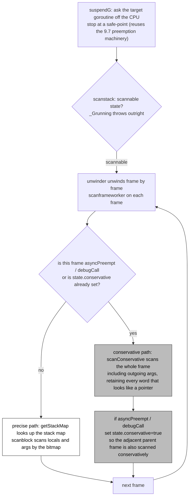

# 13.7 Safe-Point Analysis

The marking phase ([13.4](./mark.md)) must scan a goroutine's stack, find every pointer on the stack that points into the heap, and add them to the grey queue as GC roots. This sounds straightforward, but it hides a premise that is easy to overlook: **is a given machine word on the stack actually a pointer?** A 64-bit word might be a heap address, or it might be an integer that happens to fall within the range of heap addresses, a half-disassembled floating-point value, or a garbage value that has not been written yet. If we mistake a non-pointer for a pointer, we needlessly hold onto a block of memory that should have been reclaimed; if we miss a pointer and treat it as an integer, we reclaim an object that is still in use, and the latter is fatal memory corruption.

To tell the two apart, the runtime needs a precise statement of "at this moment, which positions on the stack hold pointers." This statement does not exist at all times: the pointer / non-pointer ownership of registers and stack slots keeps changing as instructions execute one by one. The compiler only generates a snapshot at certain **program points**, and these points are the **safe-points**. To scan the stack precisely, GC must first stop the target goroutine at a safe-point. The concept of a safe-point was already covered systematically in the preemption section of scheduling ([9.7](../../part3concurrency/ch09sched/preemption.md)), from the angle of "when may a goroutine be interrupted"; this section fills in the other half of its meaning from GC's angle: **a safe-point is one of those instants at which the pointer information on the stack is precisely readable**. These two halves are really the same thing, and the end of this section will let them merge.

## 13.7.1 Stack maps: recording the pointer layout at each safe-point at compile time

The compiler generates several **stack maps** (also called pointer bitmaps) for each function. A stack map is a bit vector (`bitvector`) in which bit $i$ being 1 means "the $i$-th word-sized slot in the stack frame currently holds a pointer." The stack layout of the same function differs across program points, so the compiler records one stack map for each safe-point, and uses a `PCDATA` table to map "the program counter PC" to "which stack map this PC corresponds to." When the runtime scans a given frame, it looks up the table with the PC the frame is about to return to, and obtains that frame's current pointer layout.

The runtime's entry point for reading a stack map is `getStackMap`. For one frame it returns three things: the pointer bitmap of locals, the pointer bitmap of arguments, and the **stack objects** recorded within that frame:

```go
// getStackMap: look up this frame's pointer layout using the frame's return PC (sketch)
func (frame *stkframe) getStackMap(debug bool) (locals, args bitvector, objs []stackObjectRecord) {
    targetpc := frame.continpc // the PC this frame will return to
    f := frame.fn

    // step back to the CALL instruction before looking up: the safe-point records the layout at the call site
    targetpc--
    pcdata := pcdatavalue(f, abi.PCDATA_StackMapIndex, targetpc)

    // locals bitmap: pull this function's stack-map table out of funcdata, index into it by pcdata
    stkmap := (*stackmap)(funcdata(f, abi.FUNCDATA_LocalsPointerMaps))
    locals = stackmapdata(stkmap, pcdata)

    // args bitmap: another table FUNCDATA_ArgsPointerMaps, indexed by the same pcdata
    // ...
    return
}
```

Two details are worth pointing out. First, `targetpc--`: the lookup uses not the return address itself but a step back onto the `CALL` instruction. The reason is that an interrupted frame is always stopped at the position "having called some lower function and waiting for it to return," and the compiler records the stack layout precisely at the call site, so the lookup must align to the call site rather than to the instruction after the call. Second, the pointer information comes from two kinds of sources: `FUNCDATA_LocalsPointerMaps` governs locals, `FUNCDATA_ArgsPointerMaps` governs the argument area, and both take one bitmap each using the same `pcdata` index.

Once the bitmap is in hand, scanning a frame is just "hand the slots marked 1 in the bitmap to `scanblock` as pointers":

```go
// the precise path of scanframeworker (sketch): scan one frame by its stack map
func scanframeworker(frame *stkframe, state *stackScanState, gcw *gcWork) {
    locals, args, objs := frame.getStackMap(false)

    if locals.n > 0 {          // locals area, scanned precisely by the locals bitmap
        size := uintptr(locals.n) * goarch.PtrSize
        scanblock(frame.varp-size, size, locals.bytedata, gcw, state)
    }
    if args.n > 0 {            // argument area, scanned precisely by the args bitmap
        scanblock(frame.argp, uintptr(args.n)*goarch.PtrSize, args.bytedata, gcw, state)
    }
    // stack objects (large locals whose address is taken and may be referenced by pointers)
    // are registered separately and scanned later by reachability
    // ...
}
```

The `locals.bytedata` that `scanblock` receives is exactly that bitmap: it walks this stretch of memory word by word, dereferences only the words the bitmap marks 1, and greys the heap object they point to. Words the bitmap does not mark, no matter how much their value looks like an address, are never touched. **This is what precise means**: a pointer is recognized as a pointer because the compiler declared at compile time that it is a pointer, not because the runtime guessed from the value.

## 13.7.2 The stack can only be scanned at a safe-point

A stack map is valid only at a safe-point. The instruction sequence of a function contains many "intermediate states": register allocation parks a pointer into some slot and then moves it out on the next instruction; or a large struct assignment is half written. These instants have no corresponding stack map, and forcing a read there reads a stale or missing bitmap. So GC cannot scan the stack of a running goroutine at an arbitrary moment; it must first stop that goroutine at a safe-point.

`scanstack` writes this constraint as an assertion: the first thing it does on entry is check the target goroutine's status, and if it is still `_Grunning` (executing on some P), it `throw`s outright:

```go
// scanstack: scan the stack of an already-stopped goroutine (sketch)
func scanstack(gp *g, gcw *gcWork) int64 {
    switch readgstatus(gp) &^ _Gscan {
    case _Grunning:
        // a running goroutine cannot be scanned; its stack map may not be valid right now
        throw("scanstack: goroutine not stopped")
    case _Grunnable, _Gsyscall, _Gwaiting, _Gleaked:
        // in these states the goroutine has stopped at a safe-point and can be scanned
    }

    // unwind frame by frame, scanning each frame precisely by its stack map
    var u unwinder
    for u.init(gp, 0); u.valid(); u.next() {
        scanframeworker(&u.frame, &state, gcw)
    }
    // additionally scan the defer chain, panic records, stack objects, and other stack-reachable pointers
    // ...
}
```

"Stopping at a safe-point" is itself accomplished by the preemption mechanism. When GC needs to scan some goroutine's stack, it calls `suspendG` to ask it off the CPU and stop it at a safe-point; after scanning it calls `resumeG` to put it back. Inside, `suspendG` follows exactly the cooperative / asynchronous preemption flow described in [9.7](../../part3concurrency/ch09sched/preemption.md). In other words, stack scanning is not a separate capability that GC builds for itself; it **reuses the scheduler's full machinery for stopping a goroutine**.

## 13.7.3 GC and preemption merge

Connecting the previous two sections makes the merging of GC and scheduling at safe-points clear: **both need to "stop a goroutine at a safe-point," using the same machinery, only with different purposes.**

- The scheduler stops a goroutine in order to **preempt** it: yield the CPU to others, to guarantee fairness and low latency ([9.7](../../part3concurrency/ch09sched/preemption.md)).
- GC stops a goroutine in order to **scan its stack**: when marking begins, blacken this goroutine's stack in one pass (under the hybrid write barrier, scanned once at the start and never rescanned afterward, [13.2](./barrier.md)), and hand the root pointers on the stack to the marking queue.

This line of merging is clearest in the origin story of Go 1.14's asynchronous preemption. Before that, Go had only **cooperative** safe-points: the compiler inserted preemption checks at every function call (and at loop back-edges and similar positions), and a goroutine only looks at "have I been asked to stop" when it runs to one of these points. For the vast majority of code this is fine, because function calls are frequent enough. But one class of pathological code breaks through it: a tight compute loop that contains no function call at all:

```go
func spin() {
    for i := 0; i < 1e18; i++ {
        // pure computation, no function call and no loop back-edge check
    }
}
```

A loop like this has no cooperative safe-point, and the preemption signal has nowhere to land. In the cooperative era this drags down two things at once: the scheduler cannot preempt it (other goroutines starve), and GC cannot stop it at a safe-point to scan its stack (the marking phase stalls and cannot advance to completion). This is exactly the projection onto the GC side of the TTSP (time-to-safepoint) problem discussed repeatedly in [9.7](../../part3concurrency/ch09sched/preemption.md).

Go 1.14's **asynchronous preemption** offers a way out: the runtime sends a signal to the target thread (`SIGURG` on Unix-like systems), and the signal handler stops the goroutine at an arbitrary instruction boundary. This way even the `spin` loop above can be stopped. But a cost comes with it: the position where the signal stops the goroutine is **almost certainly not** a safe-point at which the compiler recorded a stack map. This frame has no valid stack map, so how do we scan it?

## 13.7.4 Conservative scanning: the fallback when there is no stack map

For the frame stopped by asynchronous preemption, the runtime falls back to **conservative scanning**. Conservative scanning gives up "knowing precisely which words are pointers" and instead treats **every word in this stretch of memory that looks like a heap pointer as a pointer**: as long as some word's value falls within the address range of an allocated span, the corresponding object is retained. The other branch of `scanframeworker` does exactly this:

```go
func scanframeworker(frame *stkframe, state *stackScanState, gcw *gcWork) {
    isAsyncPreempt := frame.fn.valid() && frame.fn.funcID == abi.FuncID_asyncPreempt
    isDebugCall := frame.fn.valid() && frame.fn.funcID == abi.FuncID_debugCallV2

    if state.conservative || isAsyncPreempt || isDebugCall {
        // no trustworthy stack map, scan the whole frame conservatively: even the outgoing-args area,
        // because we may have stopped right in the middle of "setting up a call"
        if size := frame.varp - frame.sp; size > 0 {
            scanConservative(frame.sp, size, nil, gcw, state)
        }
        if n := frame.argBytes(); n != 0 {
            scanConservative(frame.argp, n, nil, gcw, state)
        }
        if isAsyncPreempt || isDebugCall {
            // the async-preempt frame holds the saved registers of the interrupted parent frame,
            // so the parent frame must be scanned conservatively too
            state.conservative = true
        }
        return
    }

    // otherwise take the precise path from 13.7.1
    locals, args, objs := frame.getStackMap(false)
    // ...
}
```

There are two engineering subtleties here. First, conservative scanning also scans the **outgoing-args area**, because the signal may have stopped exactly in the middle of "the caller is writing arguments into the outgoing-args slots but has not actually jumped into the callee yet," and at that moment the pointers in the outgoing-args slots are not in any precise bitmap and can only be caught by conservative scanning. Second, asynchronous preemption uses a special `asyncPreempt` stub frame to carry the register context at the point of interruption, so not only must this frame be scanned conservatively, the **immediately adjacent parent frame** (the user frame that was actually interrupted) must be scanned conservatively too, hence `state.conservative` is set and passed down. A goroutine stopped by asynchronous preemption is also marked `gp.asyncSafePoint = true`, and stack scanning uses this to handle the saved extended register state conservatively along with the rest.

Conservative scanning is a **safe but imprecise** fallback. It is safe: it never misses a pointer, because "anything that looks like a pointer is a pointer," so it never erroneously reclaims a live object. It is imprecise: it may misjudge an integer that happens to look like an address as a pointer, thereby holding onto a block or two of memory that should have been reclaimed. The cost is deliberately pushed to the minimum: only the one or two frames hit by asynchronous preemption use conservative scanning, while the rest of the goroutine's stack (the lower frames, which have normal stack maps) still takes the precise path; and an object retained conservatively is therefore **non-movable** (moving requires knowing exactly which words are pointers before they can be rewritten). This hybrid strategy of "precise for the vast majority, conservative fallback for the occasional frame" is the balance Go strikes between "being able to stop any tight loop" and "staying as precise as possible" (see issue [#24543](https://github.com/golang/go/issues/24543) for the design discussion of conservatively scanning inner frames).

Connecting the whole stack-scanning path, from being stopped by preemption to choosing a path frame by frame, looks like the figure below. Note that the `asyncPreempt` stub frame sets `state.conservative` and passes it to the **parent frame**, so the frame actually interrupted by the signal also falls into conservative scanning; this is implicit in the code:



## 13.7.5 The trade-offs and lineage of precise GC

We can now answer a fundamental question: why does Go have the compiler and runtime jointly maintain this whole infrastructure of stack maps and safe-points? Because it wants to do **precise GC**. Placing the precise and conservative routes side by side makes the trade-off clear.

**Conservative GC** (such as the classic Boehm-Demers-Weiser collector) needs no cooperation from the compiler at all: it treats every word that looks like a pointer in the stack, registers, and heap as a pointer. The advantage is that it can be bolted onto almost any language (including C) and requires no compile-time type information. The drawbacks are two. One is that **false pointers** cause memory leaks: an integer whose value happens to equal some object's address will hold onto that object and the entire subgraph it points to, which can be severe when pointers are dense and address space is tight. The other is that **objects cannot be moved**: since pointer and integer cannot be told apart, it dares not rewrite any word, so it gives up advanced reclamation strategies that need to move objects, such as compaction and generational copying.

**Precise GC** (Go's choice) requires the compiler to generate a stack map for every safe-point and a heap pointer bitmap for every type, and the runtime distinguishes pointer from non-pointer accurately on that basis. The cost is the complexity of the compiler and runtime, plus the binary size that stack maps add. What it buys is: no leaks from false pointers, so reclamation is more thorough; and because the exact location of every pointer is known, **the door is left open for future moving collection**. Go's GC to this day does not move heap objects, but it does move the **stack**: when `copystack` grows or shrinks the stack it must rewrite every pointer on the stack one by one onto the new stack, relying on exactly the same stack maps ([14 Stack Management](../ch14stack/readme.md)). One could say that the infrastructure of precise GC already redeems its value daily in the matter of "moving the stack."

Placing this line into the lineage: precise GC is another expression of "deep cooperation between the compiler and the runtime" ([3.2](../../part1overview/ch03life/compile.md)): GC is not a standalone library that can be bolted onto any language, it and the compiler share a convention about "where the pointers are." This cooperation is a cost, and also a backbone: precisely because the runtime knows exactly where every pointer is, Go has room to keep refactoring its collector (from tricolor marking to the hybrid write barrier, and on toward new directions such as Green Tea, see [13.1](./basic.md) and [13 Overview](./readme.md)) without worrying that touching the object layout breaks correctness. Precision is the premise that lets all of this optimization proceed safely.

## Further reading

1. This book, [9.7 Cooperation and Preemption](../../part3concurrency/ch09sched/preemption.md): the full mechanism of safe-points, TTSP, and cooperative and asynchronous preemption, which this section's stack scanning reuses.
2. The Go Authors. *runtime: scanstack / scanframeworker / getStackMap.*
   https://github.com/golang/go/blob/master/src/runtime/mgcmark.go and
   https://github.com/golang/go/blob/master/src/runtime/stkframe.go (stack-map reading and precise / conservative scanning).
3. The Go Authors. *runtime: suspendG / isAsyncSafePoint.*
   https://github.com/golang/go/blob/master/src/runtime/preempt.go (stopping a goroutine at a safe-point).
4. Richard Jones, Antony Hosking, Eliot Moss. *The Garbage Collection Handbook*, 2nd ed., 2023.
   (precise vs conservative GC, pointer identification and movability).
5. Hans-J. Boehm, Mark Weiser. *Garbage Collection in an Uncooperative Environment.*
   Software: Practice and Experience, 1988. (the classic representative of conservative GC).
6. The Go Authors. *runtime: conservative inner-frame scanning for async preemption.*
   https://github.com/golang/go/issues/24543 (the design for conservatively scanning inner frames at asynchronous preemption).
7. This book, [13.2 Write Barriers](./barrier.md), [13.4 Marking](./mark.md), [12.2 Components](../ch12alloc/component.md)
   (stack maps together with the mspan / arena pointer bitmaps support precise scanning).
