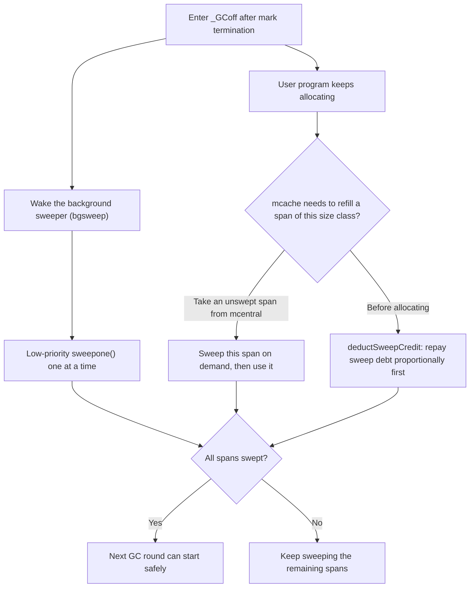

# 13.5 Sweeping and Bitmaps

Once marking ([13.4](./mark.md)) finishes, any object still white is unreachable garbage. Reclaiming the
memory it occupies and handing it back to the allocator is the last step of collection: **sweeping**. If we
followed the textbook recipe of "walk the heap and free dead objects one by one," the cost of sweeping would
be proportional to the number of dead objects, and on a heap with millions of objects that is no small bill.
Go's sweep sidesteps that bill. Three of its design points are worth making clear: sweeping is done by
**flipping a bitmap** rather than processing objects one at a time; it runs **concurrently** with the user
program and **lazily** spreads its cost across the allocation path; and it **does not move objects**, so it
accepts fragmentation and forgoes compaction. None of these three is accidental. Each corresponds to a
definite engineering trade-off, and this section unpacks them one by one.

## 13.5.1 Sweeping Is a Bitmap Flip

The efficiency of reclamation has its roots in the allocator's data structures. Section
[12.2](../ch12alloc/component.md) explained that every span is sliced into equal-sized slots of one size
class, and is paired with two bitmaps:

- `allocBits`: which slots are **allocated**, used by the allocation path to find free slots.
- `gcmarkBits`: which slots were set during this round of marking, that is, which are **live**, written by
  the mark phase.

To sweep a span, the core action is surprisingly short: treat the mark bitmap **directly** as the new
allocation bitmap.

```go
// The core of mspan.sweep (src/runtime/mgcsweep.go, sketch)
func (s *mspan) sweep(preserve bool) bool {
    // ...special records such as finalizer / weak / profile have already been handled above...

    nalloc := uint16(s.countAlloc()) // number of set slots in gcmarkBits = number of live objects
    s.allocCount = nalloc
    s.freeindex = 0                  // reset the allocation cursor, next scan starts from the top

    // The three key lines: the mark bitmap becomes the allocation bitmap
    s.allocBits = s.gcmarkBits           // live slots stay "in use", unmarked ones are now "free"
    s.gcmarkBits = newMarkBits(s.nelems) // prepare a cleared mark bitmap for the next GC round
    s.refillAllocCache(0)                // rebuild the allocCache bit-scan cache (see 12.2)

    // ...decide where the span goes based on the live count, see 13.5.3...
}
```

After the flip, a marked slot is still 1 in the new `allocBits` and continues to count as "in use"; an
unmarked slot is 0 in the new bitmap and becomes "free," to be overwritten directly by the next allocation.
Dead objects neither have to be found nor cleared one by one. The source comment puts this state precisely: a
slot that is unmarked and not yet reallocated is "analogous to being on a freelist." That is what the
"sweep-free" in this section's framing means: dead objects need no explicit "cleanup" action; their slots are
simply reinterpreted as allocatable in the instant the bitmap flips.

Working out the cost shows where the saving comes from. Freeing object by object is $O(n_{\text{dead}})$; the
bitmap flip compresses the sweep of one span into a constant number of pointer assignments plus a single
`countAlloc`, independent of how many objects are dead. Sweeping one span costs $O(1)$ pointer operations
plus $O(n_{\text{slots}}/64)$ bit counting (`countAlloc` counts the 1 bits per 64-bit word). Once again the
regularity of size classes degrades reclamation into a bit operation, the same technique seen from the other
side when the allocation path uses `allocCache` to bit-scan for free slots
([12.2](../ch12alloc/component.md)). The allocator and the collector share this pair of bitmaps, which is the
most concrete instance of what [12.1](../ch12alloc/basic.md) called "allocation and GC living in symbiosis."

There is a detail here that is easy to overlook and worth one sentence. The new allocation bitmap comes from
the mark bitmap, so what about slots that were already allocated but went **unmarked** this round? The source
comment explains it clearly: if a slot's `allocBits` index is greater than or equal to `freeindex` and it is
unmarked, then it "has not been allocated since the previous GC," so it was empty to begin with, and remains
empty after the flip, requiring no special handling. In other words, the bitmap flip correctly handles both
"objects that died this round" and "slots that were already empty last round"; in the new bitmap both fall
under "free," treated alike.

Sweeping is not only the bitmap flip. Before the flip, `sweep` must first handle the **special records**
attached to dead objects: finalizers (`runtime.SetFinalizer`), weak handles, and heap profile samples. If an
object about to be freed has registered a finalizer, the sweep **re-marks it as live**
(`setMarkedNonAtomic`) and queues the finalizer for execution. This is the origin of "an object with a
finalizer is reclaimed one round later": the finalizer must run when the object is "about to die," and for it
to run, the object itself has to live one more round, only truly freed at the next sweep. Weak handles are
cleared before finalization, aligning with the semantics of the `weak` package. These are the semantic
details, beyond the bitmap flip, that sweeping must look after, but they do not change the trunk: the body of
sweeping is still an $O(1)$ change of ownership of the bitmap.

## 13.5.2 Concurrent and Lazy

Sweeping runs **concurrently** with the user program. After mark termination, the GC enters the `_GCoff`
phase, the write barrier is turned off, and a background sweeper (`bgsweep`) is woken to advance slowly at
ordinary Goroutine priority, taking no STW time at all (for the cadence see [13.3](./pacing.md)). But relying
on the background sweeper alone would set up a race between sweeping and the next round of allocation: what if
allocation runs too fast and claims spans that have not been swept yet?

Go's answer is to make sweeping **lazy** and **on demand**. It does not sweep every span the moment marking
ends; instead it breaks the sweep apart and spreads it across the allocation path: when some P's mcache needs
to refill a span for a given size class, if the span it takes from the mcentral is not yet swept
(distinguished by `sweepgen` sweep generation, see [12.2](../ch12alloc/component.md)), it **sweeps it in
passing and then uses it**. "Allocate and sweep a little": whoever is about to use a span sweeps it clean
first. The background sweeper is only a backstop, advancing the remaining spans that the allocation path did
not happen to sweep, ensuring they are all swept before the next GC round begins.

"On demand" alone is not enough; we also need "on time." Imagine the heap holds a large number of spans
waiting to be swept while the program allocates only sporadically, and the background sweeper runs slowly:
then when the next GC round triggers, sweeping is not finished, and two GC rounds overlap. To prevent this the
runtime introduces **proportional sweeping**: based on the size of the live heap from the previous round, it
estimates "for every byte allocated, how many pages should be swept," storing it in `sweepPagesPerByte`;
before allocating a large object or refilling a span, `deductSweepCredit` "repays the debt" according to this
ratio, and if sweep progress lags behind allocation progress, it sweeps a few more spans on the spot to catch
up.

```go
// Repay the sweep debt before allocating, to keep sweep progress in step with allocation progress (sketch)
func deductSweepCredit(spanBytes uintptr, callerSweepPages uintptr) {
    if mheap_.sweepPagesPerByte == 0 {
        return // proportional sweeping is complete or disabled
    }
    // Target: the bytes already allocated should correspond to this many pages already swept
    pagesTarget := int64(mheap_.sweepPagesPerByte*float64(newHeapLive)) - int64(callerSweepPages)
    // If sweeping lags behind allocation, sweep a few more spans on the spot to repay the debt
    for pagesTarget > int64(mheap_.pagesSwept.Load()-sweptBasis) {
        if sweepone() == ^uintptr(0) {
            mheap_.sweepPagesPerByte = 0 // everything swept, proportional sweeping ends
            break
        }
        // ...
    }
}
```

This mechanism spreads the total cost of sweeping, in proportion, onto "the rate of producing garbage": the
harder the program allocates and the more there is to sweep, the more the allocation path takes on from the
background. It reflects the Go runtime's consistent approach of "spreading concentrated cost thin over the
everyday path," much like mark assist (mutator assist, where a Goroutine allocating quickly helps with
marking, [13.4](./mark.md)) and the write barrier spreading reachability maintenance over each pointer write
([13.2](./barrier.md)). All three face the same problem: how to keep the progress of collection always
catching up with the rate at which the user program creates work, without leaning on long pauses.



The correctness of concurrent sweeping rests on `sweepgen` (the sweep generation), a global counter. It
encodes "what sweep state this span is in right now" as the difference between the span's `sweepgen` and the
heap's `mheap_.sweepgen`. Each GC round increments the heap's sweep generation by 2, so:

```text
Let sg = mheap_.sweepgen (+2 per GC round)
  s.sweepgen == sg       swept this round, ready to use directly
  s.sweepgen == sg-2     still to be swept this round
  s.sweepgen == sg-1     currently held by some sweeper (the intermediate state, after claim, before done)
```

The background sweeper and some P's allocation path may eye the same unswept span at once, both wanting to
sweep it. The runtime uses one atomic CAS to change `sg-2` into `sg-1` to **claim** the span
(`sweepLocker.tryAcquire`): whoever wins the CAS is responsible for sweeping it, and the other, seeing
`sg-1`, knows someone is sweeping and simply skips it; once done it atomically sets the span to `sg`. This
guarantees a span is swept only once per round, and that a span obtained by the allocation path is
necessarily in the "swept" state. Encoding a small three-state machine into the parity and difference of a
counter is a technique that recurs throughout concurrent runtimes, and it pairs with mcentral's use of
`[2]spanSet` bucketed by sweep generation ([12.2](../ch12alloc/component.md)): bucketing uses the sweep
generation to decide which set a span goes into, and claiming uses the sweep generation to decide who sweeps.

## 13.5.3 Where a Span Goes and "Why Not Compact Fragmentation"

Once a span is swept, where it goes depends on how many live objects remain in it, which is exactly the part
omitted at the end of the previous section's `mspan.sweep`:

```go
// End of mspan.sweep: decide where the span goes based on the live count (sketch)
switch {
case nalloc == 0:
    // The whole span has not a single live object: return the pages to the heap as a unit
    mheap_.freeSpan(s)            // return to the page allocator, counted into reclaimCredit
case nalloc == s.nelems:
    // Full, no free slots: hang back onto mcentral's "swept, full" set
    mheap_.central[spc].mcentral.fullSwept(sweepgen).push(s)
default:
    // Partly empty: hang back onto mcentral's "swept, has free slots" set, for new objects of the same size class to fill
    mheap_.central[spc].mcentral.partialSwept(sweepgen).push(s)
}
```

If `countAlloc` comes out as **zero**, the whole span has not a single live object, so it is returned to the
layer above as a unit: the pages go back to mheap's page allocator ([12.7](../ch12alloc/pagealloc.md)),
counted into `reclaimCredit`, and those pages can then be re-sliced into spans of **any** size class, or even
returned to the operating system by the scavenger. This is the only chance a span ever has to step out of its
original size class: an empty span goes back to the heap, and its size-class membership is dissolved along
with it. If live objects remain, the span can only stay in its original size class and hang back onto
mcentral's swept set depending on whether it still has free slots (note it is the "swept" `spanSet`, echoing
the sweep-generation bucketing of 13.5.2), for new objects of the same size class to fill the slots that have
opened up.

Here we touch the cost that mark-sweep GC cannot avoid: **fragmentation**. Go's GC **does not move objects**
([13.1](./basic.md)). A free slot vacated by a dead object inside a span can only be filled by a new object of
the **same size class**; if the whole span is not entirely empty, it still cannot be returned as a unit, and
those free slots are "dead weight occupying the span." In theory, **compaction**, which moves live objects
together to free up contiguous space, could eliminate this fragmentation, but Go deliberately chooses not to.
There are two reasons.

First, compaction has to **move objects**, and moving means finding and updating every pointer that points at
the moved object. In a language with `unsafe` and **cgo**, this is almost a dead end: external C code may hold
raw pointers into the Go heap, which the runtime cannot enumerate, let alone rewrite, and moving would
invalidate those pointers. What non-moving collection buys is precisely the guarantee that **a pointer's
address stays constant over the object's lifetime**, something cgo, `unsafe.Pointer`, and code that uses a Go
pointer as a map key all depend on.

Second, the benefit of compaction is held down inherently by size-class allocation. tcmalloc-style size-class
allocation confines fragmentation to the controllable range of "free slots within the same size class" (worst
internal fragmentation about 12.5%, [12.2](../ch12alloc/component.md)), unlike general-purpose malloc, which
can produce holes of arbitrary size. Since fragmentation is already bounded, the marginal benefit of
compaction is not enough to offset its complexity and its damage to pointer stability.

So this is a clear-cut trade-off: **forgo compaction in exchange for pointer stability and a simpler
implementation, and use size classes to keep the cost of fragmentation within an acceptable range.**
Performance never comes for free: Go buys "coexistence with cgo" and "concurrent collection without moving
objects" with "tolerating bounded fragmentation." Laying the two paths side by side makes the contour of the
trade-off clear:

| Dimension | Non-moving (mark-sweep, Go) | Moving (mark-compact / copying, most JVM collectors) |
| --- | --- | --- |
| Allocation speed | Take a free slot (bit scan), fairly fast | Pointer bump (bump pointer), fastest |
| Fragmentation | Present, but confined by size classes to "same-class free slots" | Almost none (contiguous after compaction) |
| Pointer stability | Address constant, cgo / `unsafe` safe | Address changes, all pointers must be updated precisely |
| Implementation complexity | Lower, no moving or forwarding needed | Higher, needs object forwarding, read barriers, or STW relocation |
| With cgo raw pointers | Naturally compatible | Naturally in conflict |

Others have given different answers: generational copying GC (such as most JVM collectors) trades moving and
compaction for the extreme speed of bump-pointer allocation and near-zero fragmentation, at the cost of
having to precisely enumerate and update all pointers, and being naturally at odds with cgo-style raw
pointers. Standing in the position of "a systems programming language that must interoperate with C," Go can
hardly give up pointer stability as a constraint, so non-moving is almost a choice forced by requirements
rather than a performance oversight. The two paths have no rank order; they merely place the complexity in
different places.

The matter of fragmentation is not yet closed. The **Green Tea GC** ([13.11](./greentea.md)), introduced in go1.25
and on by default since go1.26, explores exactly the direction of "organizing scanning and reclamation at span/page
granularity to improve memory locality": it is not about introducing object movement, but about rearranging
the granularity of scanning and reclamation so that cache and TLB behavior become friendlier. The design of
sweeping and reclamation is still evolving; this section describes the stable form of go1.26, not the end of
the road.

## Further Reading

1. The Go Authors. *runtime/mgcsweep.go (the `gcmarkBits`->`allocBits` flip in `mspan.sweep`,
   `sweepone`, `bgsweep`, and `deductSweepCredit` proportional sweeping).*
   https://github.com/golang/go/blob/master/src/runtime/mgcsweep.go
   The original design of bitmap allocation and sweep-free allocation appears in Austin Clements. *Proposal:
   Dense mark bits and sweep-free allocation.* Go issue #12800, 2015 (go1.6 replaced the free list with
   direct bitmap allocation).
   https://github.com/golang/go/issues/12800
2. The Go Authors. *runtime/mcentral.go (the `[2]spanSet` bucketed by `sweepgen` and on-demand sweeping).*
   https://github.com/golang/go/blob/master/src/runtime/mcentral.go
3. Rick Hudson. *Getting to Go: The Journey of Go's Garbage Collector.* ISMM 2018 Keynote.
   https://go.dev/blog/ismmkeynote
4. Austin Clements, Rick Hudson. *Proposal: Concurrent garbage collection (the design of concurrent sweeping
   and sweepgen).* https://go.googlesource.com/proposal/+/master/design/17503-eliminate-rescan.md
5. Richard Jones, Antony Hosking, Eliot Moss. *The Garbage Collection Handbook: The Art of Automatic Memory
   Management.* 2nd ed., CRC Press, 2023 (Chapter 2 "Mark-Sweep" and Chapter 3 on the trade-off of
   "mark-compact / moving vs non-moving").
6. Sanjay Ghemawat, Paul Menage. *TCMalloc: Thread-Caching Malloc.*
   https://google.github.io/tcmalloc/design.html (how size classes confine fragmentation to a controllable
   range).
7. This book: [12.1 Design Principles](../ch12alloc/basic.md), [12.2 Components](../ch12alloc/component.md),
   [13.1 Basic Ideas](./basic.md), [13.4 Marking](./mark.md), [13.12 Past, Present, and Future](./history.md).
