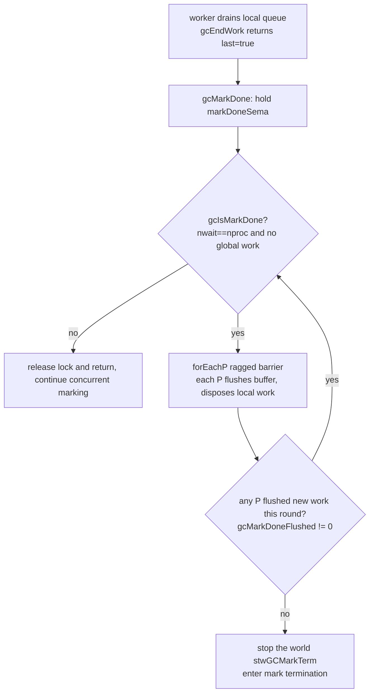
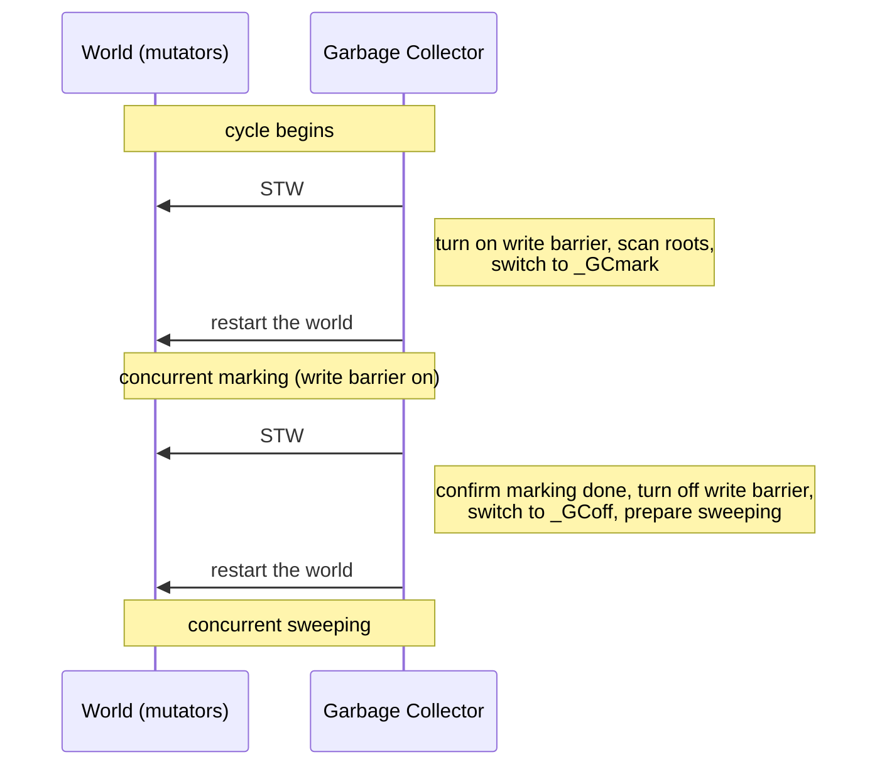

# 13.6 Mark Termination Phase

Concurrent marking ([13.4](./mark.md)) carries one nontrivial closing problem: how to **decide that marking is complete**. In a single-threaded, stop-the-world collector this problem is trivial, the marking thread drains the grey queue and marking is over. But in a concurrent world, "my local queue is empty" never means "there are no grey objects anywhere globally." The instant a worker goroutine drains its own queue, a mutator on another P may happen to execute a pointer write, the write barrier ([13.2](./barrier.md)) then greys a new object and stuffs it into that P's local cache. Deciding termination is, in essence, confirming a **global property** in a system that has no global lock and whose work is scattered across each P's local cache: the grey set is empty, and no further grey objects will be produced.

This section answers three things: how the termination-detection algorithm concludes that marking is complete without any global coordination (`gcMarkDone`); what the brief STW that is still required for this purpose (`_GCmarktermination`) does, and why it can be kept very short; and why a cycle always retains two short STWs at its head and tail, why the runtime chooses to press the **amount of work** in each STW down to something independent of heap and stack size, rather than chasing literal zero pause.

## 13.6.1 Why "Marking Complete" Is Hard to Decide Under Concurrency

Picture the marking work as a pool of grey objects, scattered across each P's local `gcWork` cache and a handful of global work buffers. Worker goroutines keep pulling grey objects from the pool, scanning them, greying the newly discovered pointers and tossing them back into the pool, until the pool is empty. The difficulty is that the judgment "the pool is empty" is itself distributed: no thread can, without stopping the whole world, glimpse in an instant that every P's local cache is empty.

More awkward still is the existence of the write barrier. As long as a mutator is still running and the write barrier is still on, a single `*p = q` pointer write can conjure a new grey object out of thin air. So the termination condition is not the static "the pool is empty right now," but the dynamic "the pool is empty, and no in-flight, not-yet-observed work can fill it again." The runtime characterizes the first half with two counters:

```go
// A fast criterion for whether marking is done (sketch, runtime/mgc.go)
func gcIsMarkDone() bool {
    // all nproc mark workers are waiting, and there is no markable work available globally
    return work.nwait == work.nproc && !gcMarkWorkAvailable()
}
```

`gcIsMarkDone` is only a necessary condition, not a sufficient one. What it sees is a snapshot of "this instant," and it cannot rule out that some P's local cache still holds work that has not been flushed to the global pool and is therefore invisible to everyone else. To promote the necessary condition into a sufficient one, we need a **global barrier** that forces every P to shake out its local cache and make it visible to all, then re-checks.

## 13.6.2 Distributed Termination Detection: `gcMarkDone` and the Ragged Barrier

Historically Go 1.5 used two sub-phases, Mark1 and Mark2, to approximate termination: during Mark2 it disabled every P's local mark cache and forced "immediate blackening," so as to reduce the chance of entering mark termination prematurely. The cost was that local caches (whose very existence was meant to reduce contention) were turned off, hurting performance, and because it detected only the work bottleneck, the algorithm could still wander into Mark2 early in the cycle. Austin Clements and Rick Hudson, in issue #11970, replaced Mark2 with a race-free distributed termination algorithm, and this is today's `gcMarkDone`.

Its core is a **ragged barrier**: `forEachP` lets each P run a callback at its own GC safe point, rather than stopping all Ps together on a single line. The callback has each P flush its write-barrier buffer, `dispose` its local work cache into the global queue, and report whether it "flushed out new work." `forEachP` semantically acts as a global memory barrier: when it returns, every P has passed at least one safe point, and local state has become globally visible.

```go
// Skeleton of distributed termination detection (sketch, runtime/mgc.go)
func gcMarkDone() {
    semacquire(&work.markDoneSema) // only one thread may run the barrier at a time
top:
    // Re-check under the transaction lock: we must confirm the global queue is empty
    // before running the ragged barrier, otherwise a P could still take global work afterward
    if !(gcphase == _GCmark && gcIsMarkDone()) {
        semrelease(&work.markDoneSema)
        return
    }
    semacquire(&worldsema)

    // Ragged barrier: make each P flush its local cache at a safe point, and collect "did it flush new work"
    gcMarkDoneFlushed = 0
    forEachP(waitReasonGCMarkTermination, func(pp *p) {
        wbBufFlush1(pp)   // flush the write-barrier buffer, may add work to gcWork
        pp.gcw.dispose()  // hand the local work cache back to global, may set flushedWork
        if pp.gcw.flushedWork {
            atomic.Xadd(&gcMarkDoneFlushed, 1)
            pp.gcw.flushedWork = false
        }
    })

    if gcMarkDoneFlushed != 0 {
        // The barrier shook out new grey objects, there may still be work. Return worldsema, retry a round
        semrelease(&worldsema)
        goto top
    }
    // At this point: no global work, no local work, and this round of the barrier had no P flush new work
    // therefore the grey set is empty and no more objects will be greyed. We can enter mark termination
    // ... stop the world, call gcMarkTermination ...
}
```

The correctness of the algorithm can be sketched as follows. **Proposition: if in some round of `forEachP` held under `markDoneSema` every P reports `flushedWork == false`, then the grey set is empty and will not be refilled afterward.** The argument has two steps. First, before entering the barrier we already confirmed under the transaction lock that the global queue is empty (`gcIsMarkDone`), and the barrier makes every P flush its local cache clean, so when the barrier ends all known work is exhausted; if any work were still flushed out, some P must report `flushedWork`, contradicting the premise. Second, greying can only originate from the write barrier; this round of the barrier has flushed every P's write-barrier buffer clean and made it visible, and if there is no new grey afterward, a fixed point has been reached. The `goto top` retry is precisely there for the fixed point: as long as some P still shakes out work, scan one more round, until some round is completely quiet. There is no global lock serializing all workers here, which is why we call it "race-free."



After entering STW there is one more patch for leaks. In the window between the barrier and the stopping of the world, the GC's own writes (the write barrier is still on at this moment) may leave behind a few scraps of work. `gcMarkDone` therefore does another round of `wbBufFlush1` per P after stopping the world, and if it finds some P's `gcw` non-empty, it restarts concurrent marking (this is exactly the situation recorded in issue #27993). Such residue is "inelegant" from an engineering standpoint, but it shows that between termination judgment and write-barrier shutdown there must be a globally consistent instant to close the books.

## 13.6.3 The Second Short STW: What `_GCmarktermination` Does

Once termination detection passes, the runtime enters this cycle's second and final short STW, calling `gcMarkTermination`. Under stop-the-world, in a fixed order, it completes a few closing steps that cannot be done safely concurrently:

```go
// The closing of mark termination (sketch, runtime/mgc.go)
func gcMarkTermination(stw worldStop) {
    setGCPhase(_GCmarktermination)   // the write barrier is still on at this moment
    gcMark(startTime)                // confirm marking is done, handle checkmark and other residue
    setGCPhase(_GCoff)               // marking ends, turn off the write barrier
    gcSweep(work.mode)               // switch to the sweep phase, set all spans to "to be swept"
    // ... restart the world ...
    gcControllerCommit()             // update the pacer with this cycle's data, set the threshold for the next cycle
}
```

`setGCPhase` is the key switch here, whether the write barrier is on or off is decided by `gcphase`:

```go
// Phase switching also decides the write-barrier switch (sketch, runtime/mgc.go)
func setGCPhase(x uint32) {
    atomic.Store(&gcphase, x)
    // the write barrier is on only in the two phases of concurrent marking and mark termination
    writeBarrier.enabled = gcphase == _GCmark || gcphase == _GCmarktermination
}
```

Reading these steps together, the duty of this STW is: **confirm that marking is indeed complete** (`gcMark` re-checks under `_GCmarktermination`, with the write barrier still on to catch the GC's own pointer writes); then **flip the phase to `_GCoff` and turn off the write barrier**; **set the stage for concurrent sweeping** (`gcSweep` marks all spans as to-be-swept, kicking off the "sweep-free" bitmap swap of [13.5](./sweep.md)); and finally **settle the pacer statistics** (`gcControllerCommit` uses this cycle's actual mark amount to update the trigger threshold, [13.3](./pacing.md)). Once the world restarts, newly allocated objects are white, and sweeping proceeds in the background concurrently with user code.

The reason this STW is short lies at the root in the hybrid write barrier of [13.2](./barrier.md). Before Go 1.8, with the Dijkstra insertion barrier, concurrent marking had to **rescan all goroutine stacks** when it ended, because writes on the stack did not go through the write barrier and could miss live objects, and since the total stack size grows with the program, the cost of this rescan swelled along with it, the pause time was tied to stack size. The hybrid write barrier (Yuasa deletion barrier plus Dijkstra insertion barrier) guarantees that "once a stack is scanned and blackened, it need not be scanned again," so at mark termination there is no longer any need to rescan stacks. This STW therefore degenerates into a few constant-order closing steps: flip the phase, turn off the barrier, set the span bits, settle the statistics. The pause time is thus largely independent of heap and stack size, which is the key leap that presses STW from $O(\text{heap}+\text{stack})$ down to nearly $O(1)$.

## 13.6.4 Why the Two Short STWs at Head and Tail Are Always Retained

The reader may ask: since both marking and sweeping are already concurrent, why does a cycle still keep two STWs? They sit at the head and tail of the cycle:



The first STW (`stwGCSweepTerm`, [13.4](./mark.md)) **sets up the defenses** at the start of the cycle: turns on the write barrier, switches gcphase to `_GCmark`, scans the root set. The second (`stwGCMarkTerm`) **closes the books** at the end of the cycle: confirms marking is complete, turns off the write barrier, switches to `_GCoff`. Each needs a **globally consistent instant** across all Ps: turning the write barrier on and off must let all mutators see it at the same logical moment, otherwise there would be a window where some Ps have the barrier on and some do not, leading to missed or wrong marks. Such a "globally consistent instant" cannot be cheaply pieced together from per-P local operations, and stopping the world is the most direct implementation under the current system.

Behind this is a clear engineering trade-off. The goal the Go team chose is not literal zero pause, but **pressing the amount of work in each STW down to a constant level independent of heap and stack size**. In "Getting to Go" Hudson set the goal at STW no more than about $500\,\mu s$, and in practice it is often far below this. The cost is that the cycle still has two unavoidable synchronization points; the benefit is that the pause time no longer worsens as the program's heap and stack grow, which for latency-sensitive services is far more valuable than "fewer but uncontrollable" pauses. Performance gains never come for free, what is paid here is two constant-order STWs and the extra overhead of the hybrid write barrier, in exchange for predictable latency decoupled from scale.

Continuing to shrink or even eliminate these two STWs is the same direction at the frontier of garbage collection. HotSpot's ZGC (JEP 376) has already achieved **concurrent stack processing**, moving root scanning out of STW as well ([9.7](../../part3concurrency/ch09sched/preemption.md)); Go's evolution pushes in the same direction, and the hybrid write barrier's elimination of stack rescanning is only one step, the later ideas of further concurrentizing root scanning and phase switching can be found in [13.11](./history.md)'s account of past, present, and future. The two short STWs are not the endpoint, but the steady state under the current engineering trade-off.

## Further Reading

1. Austin Clements, Rick Hudson. *Proposal: Eliminate STW stack re-scanning (Hybrid Write Barrier).*
   Go issue #17503, 2016. https://github.com/golang/go/issues/17503
   (the hybrid write barrier eliminates stack rescanning, the root cause of mark termination becoming short)
2. Austin Clements, Rick Hudson. *Concurrent mark termination (replace Mark2 with a race-free
   distributed termination algorithm).* Go issue #11970, 2016.
   https://github.com/golang/go/issues/11970 (the design origin of `gcMarkDone`). The follow-up work that
   fully removed Mark2 and simplified mark termination into a one-time confirmation is in Austin Clements.
   *Proposal: Simplify mark termination and eliminate mark 2.* Go issue #26903, 2018 (landed in go1.12).
   https://github.com/golang/go/issues/26903
3. The Go Authors. *runtime/mgc.go: `gcMarkDone`, `gcMarkTermination`, `gcIsMarkDone`, `setGCPhase`.*
   https://github.com/golang/go/blob/master/src/runtime/mgc.go (go1.26 implementation)
4. The Go Authors. *runtime/proc.go: `forEachP` (ragged barrier).*
   https://github.com/golang/go/blob/master/src/runtime/proc.go
5. Rick Hudson. *Getting to Go: The Journey of Go's Garbage Collector.* ISMM 2018 keynote.
   https://go.dev/blog/ismmkeynote (a first-hand account of the STW goal and the evolution of concurrent GC)
6. Go issue #27993: *runtime: mark termination sometimes leaves work behind.*
   https://github.com/golang/go/issues/27993 (the situation where residual work after entering mark termination requires restarting marking)
7. This book's [13.2 Write Barrier Techniques](./barrier.md), [13.3 The Pace of GC](./pacing.md),
   [13.4 Scan Marking and Mark Assist](./mark.md), [13.5 Sweeping and Bitmaps](./sweep.md),
   [13.11 Past, Present, and Future](./history.md).
