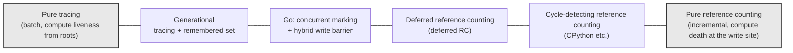
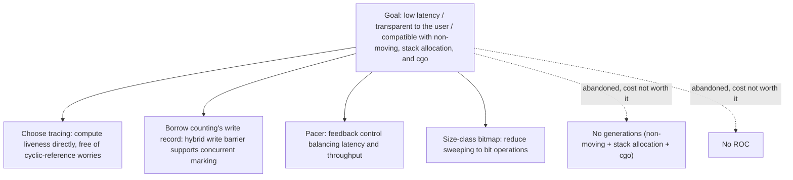

# 13.12 A Unified Theory of Garbage Collection

Having read through this chapter, we have seen Go's concurrent mark-and-sweep, its hybrid write barrier, and its pacer, and we have set them against other schools of thought such as the generational hypothesis and request-oriented collection. The algorithms come in many flavors, and by this point the reader may have a question building up: beyond the fact that they all "do garbage collection," is there a common thread that places them inside a single framework?

There is. In their 2004 paper *A Unified Theory of Garbage Collection*, Bacon, Cheng, and Rajan give a surprising answer: the two camps that people habitually treat as opposites, **tracing** and **reference counting**, are mathematically two ways of writing the same thing, they are **dual** to each other; and every collector found in practice is some blend between these two ends. Closing the chapter with this theory lets us rise from "having memorized a handful of algorithms" to "seeing the structure of the algorithm space," which is exactly what a closing theoretical section should do.

## 13.12.1 Two Camps and the Gap in Each

Let us first set out the two ends clearly.

**Tracing** starts from the root set (stack, registers, global variables) and walks the object graph along pointers step by step, marking everything reachable as live; whatever is left unmarked after the walk is garbage. Go uses exactly this kind ([13.1](./basic.md)). Its advantage is that it handles cyclic references for free: a ring of objects that point at one another but is referenced by no one from outside simply cannot be reached from the roots, and so is judged dead. Its cost is that collection has to happen in batches: only after one full traversal completes do we know who the garbage is, hence the existence of "pauses," and hence the whole set of concurrent marking and write barrier mechanisms earlier in this chapter that exist to cut those pauses down.

**Reference counting** gives each object a counter recording how many pointers point to it. Each pointer assignment increments the count of the newly pointed-to object and decrements the count of the previously pointed-to object; when a count reaches zero, the object is reclaimed at once. Its advantage is that reclamation is **timely and amortized**: memory is returned the instant the last reference disappears, and the pause is scattered into each pointer write. Its cost is exactly the opposite of tracing's: it **cannot handle cyclic references**, the objects in a ring keep one another's counts above one, none of them ever reaches zero, and so they leak.

Each camp has a gap, and the locations of the two gaps are exactly complementary. This "exact complementarity" is no coincidence; it is the projection, onto the engineering surface, of the duality relation in the next section.

## 13.12.2 Tracing and Counting Are Dual

The heart of the unified theory is to characterize both algorithms with the same fixed point equation, where the two are merely two directions of solving for the same solution.

Think of the objects in memory as a directed graph. Let the object set be $V$, and let the multiset of directed edges formed by pointers be $E$ (a multiset, because one object can have several fields pointing at the same target). We assume conservatively that every object reachable from the roots may be used in the future and is therefore not reclaimable. Let the root set be $R$. For each object $v \in V$, define its reference count $\rho(v)$ as: the number of references from the roots, plus the number of references from other **live** objects. This is a recursive definition, written as a fixed point equation:

$$
\rho(v) = \bigl|[\, v : v \in R \,]\bigr| \;+\; \bigl|[\,(w, v) : (w, v) \in E \,\wedge\, \rho(w) > 0 \,]\bigr|
$$

The square brackets take the multiset, and the vertical bars take its cardinality. Read it as: the count of $v$ equals "the number of times a root references it directly" plus "the number of times every object $w$ with $\rho(w) > 0$ references it via an edge $(w, v)$." Notice that $\rho$ appears again on the right side, so this is a recursive equation, and its solution is a fixed point. The key point is this: **this equation has multiple fixed points, and tracing and reference counting each solve for one of them.**

- **Tracing solves for the least fixed point.** Starting from $\rho \equiv 0$, it first makes the count of root-reachable objects positive, then propagates "positive" outward along edges layer by layer until nothing changes. In the end, the objects with $\rho(v) > 0$ are exactly those reachable from the roots, that is, the live set. It **computes liveness directly and obtains death indirectly** (the remaining objects with $\rho(v) = 0$ are garbage). The whole process is a series of "additions" starting from the roots: continually counting in newly discovered reachable objects.

- **Reference counting solves for a different fixed point.** It starts from the solution that satisfies the equation in the program's initial state, and on each pointer write it **maintains that solution incrementally**: adding an edge increments the target, removing an edge decrements the target, and reaching zero triggers reclamation, recursively continuing to decrement the objects it pointed to. It **computes death directly** (reaching zero means dead) and **maintains liveness indirectly** (a positive count means retained). The whole process is "additions and subtractions" scattered across the individual pointer operations.

Writing the two directions side by side as pseudo-code makes the duality clearer. The two programs solve for the same $\rho$; the only difference is "when to compute" and "in which direction to approach":

```
// Tracing: compute the least fixed point in a batch. One GC cycle runs once, doing additions from the roots
func tracing():
    for v in V: ρ[v] = 0          // start from all zeros
    worklist = roots()            // roots directly contribute positive counts
    for v in worklist: ρ[v] += 1
    while worklist not empty:      // propagate "positive" outward along edges
        w = worklist.pop()
        for (w, v) in edges(w):
            if ρ[v] == 0: worklist.push(v)
            ρ[v] += 1
    // after convergence, ρ[v] > 0 is live; ρ[v] == 0 is garbage (obtained indirectly)

// Reference counting: maintain the same ρ incrementally. Amortized at each pointer write
func write(slot, newptr):          // *slot = newptr
    ρ[newptr] += 1                  // new edge: addition
    ρ[*slot]  -= 1                  // old edge: subtraction
    if ρ[*slot] == 0:              // reaching zero means dead (obtained directly)
        for (old, v) in edges(*slot): write(&..., nil)  // recursive decrement
        free(*slot)
    *slot = newptr
```

Every line of the two pieces of code touches the same $\rho$. Tracing computes its least solution in a batch, from the roots, bottom-up; reference counting maintains it incrementally, in place, at the write site. This is the duality: **tracing accumulates liveness, counting tracks death; one does additions, the other does additions and subtractions; one is concentrated at the moment of reclamation, the other is amortized over the moment of referencing.**

And the cyclic-reference gap finds its explanation here too. The fixed point that counting maintains incrementally is not the least fixed point. An isolated ring of objects, where each object in the ring is pointed at by another object in the ring, keeps its counts self-consistently parked at positive values, forming an "inflated" solution to the equation; the counting `write` never gets to see them reach zero, and so they leak. Tracing, because each cycle recomputes the least solution from the roots, finds that the ring has no root support, so $\rho$ never settles on a positive value and it is naturally judged dead. The difference in how the two algorithms handle rings comes down, in the end, to which fixed point of the equation each one solves for.

This section is the densest theoretical point in the chapter. If the reader carries away only one sentence, let it be this: **tracing and counting are not two opposing camps, but two directions of solving the same reference counting equation.**

## 13.12.3 Every Collector Is a Hybrid

The duality is not merely theoretically elegant; it gives us a map. Among the collectors found in practice, almost none is a pure version of either end. They all fall somewhere between the two, drawing on the techniques of both sides as needed. The paper makes this point thoroughly, and the following examples are all ones we have met in this chapter:

- **Generational GC** ([13.8](./generational.md)). It collects the young generation with tracing-based copying collection, yet for cross-generational references from the old generation to the young it maintains a **remembered set**. A remembered set is essentially "noting it down" at the pointer write site, which is precisely an action on the counting side. So generational GC is a hybrid that is "tracing as the main approach, locally borrowing the write record of counting."

- **Reference counting with cycle detection.** Pure counting misses rings, so industrial implementations (such as CPython) add a **tracing-based cycle detector** that runs periodically, dedicated to cleaning up those rings of objects whose counts are inflated. This is a hybrid that is "counting as the main approach, with an added tracing subroutine to fill its gap."

- **Go's concurrent marking + hybrid write barrier** ([13.2](./barrier.md)). The skeleton is tracing (concurrent marking from the roots), but to avoid missing marks while the mutator and the collector run concurrently, it **inserts a write barrier at the pointer write site**, recording the overwritten or newly written pointer into the marking work queue. This action of "noting it down at the point where a reference changes" is just like reference counting's increments and decrements at assignment. Go is therefore a hybrid too: a tracing liveness judgment overlaid with the write timing of counting.

Looking at these three examples side by side reveals a regularity: **pure algorithms are almost unusable in engineering, and the usable ones are all hybrids.** This is where the value of the unified theory lies: it makes these "hybrids" no longer a set of disjoint engineering patches, but different recipes mixed from the same equation under different trade-offs. The figure below draws the algorithm space as a spectrum:



The two ends of the spectrum are the pure algorithms, and everything in the middle is a hybrid. Where a collector falls on the spectrum depends on its choices along four dimensions, and the two ends are mirror images of each other on these four dimensions:

| Dimension | Pure tracing | Pure reference counting |
| --- | --- | --- |
| Latency | Collects in batches, with inherent pauses; cutting pauses requires extra mechanisms such as concurrent marking | Reclamation amortized over each write, pauses scattered, but recursive freeing can still produce instantaneous spikes |
| Throughput | Scans the whole heap once at collection time, low per-unit reclamation cost | Each pointer write pays an increment or decrement, a steady-state overhead continuously borne by the mutator |
| Memory | Liveness can be packed into a bitmap, with no extra field on the object itself; but heap slack is needed to defer reclamation | One count field per object; reclamation is timely, heap slack is small |
| Complexity | Needs root scanning, write barriers, concurrency safety | Write barriers are simple, but cyclic references force the addition of a tracing-based cycle detector |

These four dimensions pull against one another, and no single point can dominate them all at once. The way to read this table is not "which is better," but "for a given goal, which end of the spectrum to lean toward": to scatter pauses as much as possible while tolerating steady-state overhead, lean toward the counting end; to push the mutator overhead as low as possible while tolerating batch pauses (then thinning them with concurrency), lean toward the tracing end. Go's choice is exactly what the next section will revisit.

## 13.12.4 Revisiting Go Through the Unified Lens

Looking at Go again with this map in hand, the first eleven sections of this chapter come together as a whole, rather than remaining a string of isolated mechanisms.

Go stands at the **tracing** end, and behind this choice lies a whole set of mutually supporting reasons. It computes liveness directly and obtains garbage indirectly, so it **has no cyclic-reference problem for free**: the object rings, doubly linked lists, and trees with parent pointers that a Go program casually constructs need no special handling from the collector. It gives up the "timely reclamation" benefit of counting, and in exchange it need not pay the steady-state overhead of an increment or decrement on every pointer write, nor maintain an extra cycle detector.

But pure tracing has pauses, while Go's design goal is **low latency, transparent to the user**. So it borrows from the counting end the technique of "recording at the point where a reference changes," turning it into the **hybrid write barrier** ([13.2](./barrier.md)), so that marking can proceed concurrently with the mutator without missing marks. This is exactly the hybrid that the unified theory describes: using tracing's liveness judgment as the skeleton, and embedding counting's write timing as the safety net for concurrency.

Next comes tuning this concurrent mechanism to an operating point that "neither blows up memory nor steals all the CPU." Go uses the **pacer** ([13.3](./pacing.md)), a feedback controller, which, based on the previous cycle's marking rate and allocation rate, predicts when the next cycle should start marking, keeping heap growth stable near a target ratio. Finally there is making the other half of collection (sweeping) as cheap as possible: Go encodes liveness information into the **size-class bitmap** ([13.5](./sweep.md)), so that sweeping a span degenerates into a few bit operations, with almost no need to process object by object.

As for the recipes it did **not** choose, those can also be explained within the same framework. It did not adopt **generational GC** ([13.8](./generational.md)): the generational dividend comes from moving copying collection, but Go is a non-moving collector, it also supports stack allocation and escape analysis, and it must interoperate with cgo (object addresses cannot be moved around). In its context the cost of moving is too high, and the gain from the generational hypothesis does not outweigh the implementation complexity. Nor did it adopt a more aggressive experimental scheme like **request-oriented collection** ([13.9](./roc.md)). Each "did not choose" is the same conclusion computed under the same set of constraints.



There is no silver bullet for garbage collection. What the unified theory offers is not some "optimal algorithm," but a plainer and more useful statement: **every GC lives in the tension between tracing and counting, and in the multidimensional trade-off among latency, throughput, memory, and complexity, and every concrete collector is one particular blend mixed in a particular ratio for a particular set of goals.** Go's GC is the cup mixed for the set of goals "low latency, transparent to the user, compatible with its stack allocation and non-moving design."

By this point, all the concrete mechanisms in this chapter have a place to belong: write barriers, pacing, bitmap sweeping, concurrent marking are not a pile of ingenious yet unrelated tricks, but the consistent unfolding of the same set of constraints across different layers. This is also one of the things this book has wanted to convey from the start: **to understand a system is to understand the whole set of self-consistent choices it makes under its constraints.**

## Further Reading

1. David F. Bacon, Perry Cheng, V. T. Rajan. *A Unified Theory of Garbage Collection.*
   OOPSLA 2004, *ACM SIGPLAN Notices* 39(10): 50-68.
   https://doi.org/10.1145/1028976.1028982 (the source of this section: the duality and fixed point formulation)
2. Richard Jones, Antony Hosking, Eliot Moss. *The Garbage Collection Handbook: The Art of
   Automatic Memory Management.* 2nd ed., CRC Press, 2023.
   (an authoritative survey of tracing, counting, and various hybrid algorithms)
3. George E. Collins. *A Method for Overlapping and Erasure of Lists.*
   *Communications of the ACM* 3(12): 655-657, 1960. https://doi.org/10.1145/367487.367501
   (the earliest proposal of reference counting collection)
4. John McCarthy. *Recursive Functions of Symbolic Expressions and Their Computation by
   Machine, Part I.* *Communications of the ACM* 3(4): 184-195, 1960.
   https://doi.org/10.1145/367177.367199 (the earliest proposal of mark-and-sweep tracing collection)
5. Rick Hudson. *Getting to Go: The Journey of Go's GC.* ISMM 2018 keynote.
   https://go.dev/blog/ismmkeynote (Go's own account of choosing tracing-based concurrent collection)
6. L. Peter Deutsch, Daniel G. Bobrow. *An Efficient, Incremental, Automatic Garbage
   Collector.* *Communications of the ACM* 19(9): 522-526, 1976.
   https://doi.org/10.1145/360336.360345 (deferred reference counting: a classic hybrid where counting moves toward tracing)
7. This book: [13.1 The Basic Idea of Garbage Collection](./basic.md), [13.2 Write Barrier Techniques](./barrier.md),
   [13.8 The Generational Hypothesis and Generational Collection](./generational.md), [13.9 The Request Hypothesis and Request-Oriented Collection](./roc.md).
