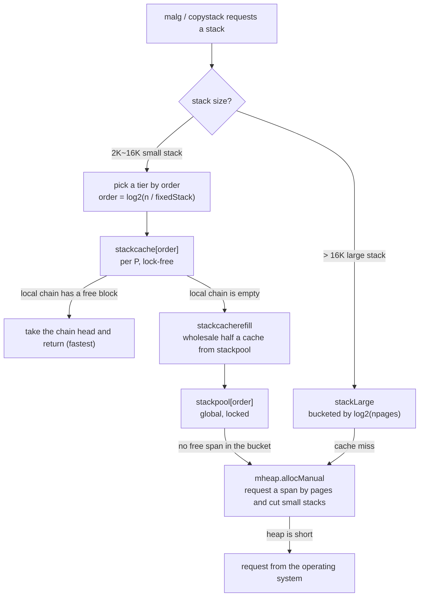

# 14.2 Stack Allocation and Caching

[14.1](./design.md) located the execution stack as a contiguous range of memory `[lo, hi)`: it is managed by the runtime and ultimately lives on the heap, so the moment a Goroutine starts, someone has to carve out this range of addresses for it. The questions follow immediately: who carves it? how large? and once Goroutines are created and destroyed over and over, if these two- or three-kilobyte chunks of memory had to be requested directly from the operating system or the global heap every time, the cost of locks and system calls would crush the scheduler at once.

The answer is that the stack has its own allocator. It is not the same code as [the chapter 12 memory allocator](../ch12alloc), yet it follows almost the same blueprint: **per-P lock-free caches up front, a lock-guarded global warehouse behind them, and the heap and operating system at the bottom**. Readers who have gone through [12.2](../ch12alloc/component.md) will find that this layer is little more than transplanting the moves of mcache / mcentral / mheap onto the stack. This section first makes clear what this parallel structure looks like, then explains why it has to be kept separate from object allocation, and how it connects to garbage collection.

## 14.2.1 Why the Stack Needs Its Own Allocator

Handing the stack to the general-purpose object allocator looks at first like the easy path, but the stack has three properties that differ from ordinary objects, forcing the runtime to build a separate one.

First, **sizes are highly regular**. Go's stack has a minimum of 2KB (`stackMin = 2048`), and each resize doubles by a power of two ([14.3](./grow.md)), so the vast majority of stacks come in only a few sizes: 2K / 4K / 8K / 16K. Regular sizes naturally suit a free list ([12.2.1](../ch12alloc/component.md)) bucketed by size, and even the lookup into a size-class table is unnecessary: a single shift computes which bucket to go to.

Second, **the lifecycle and reclamation method are special**. Unlike ordinary objects, the stack is not referenced through a pointer graph and kept alive by marking; its liveness is bound to the corresponding Goroutine. Stack memory is marked with the `mSpanManual` state (manually managed), takes no part in GC mark-and-sweep, and is instead returned explicitly by the runtime when the stack shrinks or the Goroutine dies ([14.5](./shrink.md)). Only by keeping this kind of "manually managed" memory apart from "automatically reclaimed" object memory does the reclamation logic stay clean.

Third, **allocation is extremely frequent and happens on the system stack**. `stackalloc` must run on the scheduling stack (g0), because it absolutely cannot itself trigger stack growth, or it would deadlock (runtime issue 1547). This constraint demands that the allocation path be short, non-reentrant, and certainly not given to taking locks on the hot path.

Taken together, these three lead to one conclusion: give the stack a dedicated allocator with fixed sizes, bypassing GC, lock-free on the hot path. Its shape is isomorphic to the object allocator.

## 14.2.2 Three Layers: stackcache, stackpool, stackLarge

Small stacks (2K / 4K / 8K / 16K) travel a three-layer restocking chain, and each layer can be pointed out in the code below.

**The first layer is the per-P `stackcache`, the lock-free fast path**. It hangs right off the mcache, sharing the same per-P cache with object allocation ([12.2.3](../ch12alloc/component.md)):

```go
// The mcache carries a stack cache alongside, one per P (sketch)
type mcache struct {
    // ... object-allocation fields (alloc, tiny, etc.) are in 12.2.3
    stackcache [_NumStackOrders]stackfreelist // one free list per order
}

// The local free-stack chain for a given order
type stackfreelist struct {
    list gclinkptr // free stacks strung into a free list (the block header holds the next-block pointer)
    size uintptr   // number of free bytes on the chain
}
```

`_NumStackOrders` is 4 on 64-bit non-Windows platforms, corresponding to orders 0 through 3, that is, the four tiers 2K / 4K / 8K / 16K. Each tier has one free list, the block header is reused as a pointer to the next block, and both taking and returning are $O(1)$ pointer operations. Because at any instant each P is held by only one M, accessing the `stackcache` **requires no lock**, and this is exactly where the vast majority of stack allocations finish.

**The second layer is the global `stackpool`, the lock-guarded central warehouse**. When some tier's local cache runs empty, it wholesales from the `stackpool`:

```go
// Global free-stack pool, bucketed by order; each bucket has one lock and one mspan chain (sketch)
var stackpool [_NumStackOrders]struct {
    item stackpoolItem
    _    [...]byte // padding to a cache line, to avoid false sharing between different orders
}

type stackpoolItem struct {
    mu   mutex     // this bucket's lock
    span mSpanList // doubly linked list of mspans that still have free stack blocks
}
```

It corresponds to the mcentral in object allocation: **globally shared, locked per bucket**. Note the cache-line padding on the `stackpool` array, the same consideration as the padding of the `central` array in mheap, aligning the locks of different orders to different cache lines to avoid false sharing ([12.2.5](../ch12alloc/component.md)) when multiple cores operate on different tiers separately.

**The third layer is `mheap` and the large-stack pool `stackLarge`, the heap at the bottom**. When some tier of the `stackpool` runs empty, it requests a whole span of pages from mheap and cuts it into small stacks; large stacks bigger than 16K bypass the first two layers and go straight to `stackLarge`:

```go
// Global cache for large stacks, bucketed by log_2(npages) (sketch)
var stackLarge struct {
    lock mutex
    free [heapAddrBits - gc.PageShift]mSpanList
}
```

Placing the three layers side by side with their counterparts in the object allocator makes the structural isomorphism obvious at a glance:

| Stack allocator | Object allocator ([12.2](../ch12alloc/component.md)) | Synchronization cost | Hit frequency |
|---|---|---|---|
| `stackcache` (per P, hung off mcache) | `mcache` (per P) | lock-free | highest |
| `stackpool` (global, locked per order bucket) | `mcentral` (global, locked per size-class bucket) | locked | medium |
| `mheap` / `stackLarge` | `mheap` | lock plus possible system call | lowest |



## 14.2.3 stackalloc: Choosing Among the Three Layers

What strings the three layers above together is `stackalloc`. The only thing it really has to answer is: from which layer should this allocation be drawn? A trimmed sketch follows; the full definition is in `runtime/stack.go`:

```go
//go:systemstack
func stackalloc(n uint32) stack {
    thisg := getg()
    // Must run on g0 (the scheduling stack), or the allocation process itself might trigger stack growth and deadlock
    if thisg != thisg.m.g0 {
        throw("stackalloc not on scheduler stack")
    }

    var v unsafe.Pointer
    if n < fixedStack<<_NumStackOrders && n < _StackCacheSize {
        // Small stack: go through the per-P cache / global pool
        order := uint8(0)
        for n2 := n; n2 > fixedStack; n2 >>= 1 { // one shift computes the order
            order++
        }
        var x gclinkptr
        if stackNoCache != 0 || thisg.m.p == 0 || thisg.m.preemptoff != "" {
            // No P (during exitsyscall/procresize) or being preempted: skip the local cache, take straight from the global pool
            lock(&stackpool[order].item.mu)
            x = stackpoolalloc(order)
            unlock(&stackpool[order].item.mu)
        } else {
            c := thisg.m.p.ptr().mcache // the per-P stack cache, lock-free
            x = c.stackcache[order].list
            if x.ptr() == nil {         // local ran empty, wholesale from the global pool
                stackcacherefill(c, order)
                x = c.stackcache[order].list
            }
            c.stackcache[order].list = x.ptr().next
            c.stackcache[order].size -= uintptr(n)
        }
        v = unsafe.Pointer(x)
    } else {
        // Large stack: go through stackLarge / request a span straight from the heap
        npage := uintptr(n) >> gc.PageShift
        var s *mspan
        lock(&stackLarge.lock)
        if !stackLarge.free[stacklog2(npage)].isEmpty() {
            s = stackLarge.free[stacklog2(npage)].first
            stackLarge.free[stacklog2(npage)].remove(s)
        }
        unlock(&stackLarge.lock)
        if s == nil {
            s = mheap_.allocManual(npage, spanAllocStack) // marked as mSpanManual
            s.elemsize = uintptr(n)
        }
        v = unsafe.Pointer(s.base())
    }
    return stack{uintptr(v), uintptr(v) + uintptr(n)}
}
```

Two trade-offs are worth pointing out. The first is the branch `thisg.m.p == 0 || thisg.m.preemptoff != ""`: when the M temporarily has no P (in the middle of exiting a system call, or `procresize` adjusting the number of Ps), or is in the middle of preemption, the local cache is unavailable or untouchable (during GC it is concurrently emptied), so it falls back to locking the global pool directly to allocate. The lock-free fast path holds only in the normal state of "holding a P and not being preempted", exactly the same availability condition as the mcache. The second is that the order is computed with a single loop of shifts, rather than looking up a size-class table the way object allocation does; stack sizes are powers of two to begin with, so this step can be cheaper.

## 14.2.4 Restocking: stackcacherefill and stackpoolalloc

When the local cache runs empty, it does not restock just one block. `stackcacherefill` wholesales **half a cache's worth** of stack blocks from the global pool in one go, so as to avoid repeatedly locking and thrashing on the boundary of "just used up, just returned":

```go
//go:systemstack
func stackcacherefill(c *mcache, order uint8) {
    var list gclinkptr
    var size uintptr
    lock(&stackpool[order].item.mu)
    for size < _StackCacheSize/2 {       // wholesale until half full, then stop
        x := stackpoolalloc(order)
        x.ptr().next = list
        list = x
        size += fixedStack << order
    }
    unlock(&stackpool[order].item.mu)
    c.stackcache[order].list = list
    c.stackcache[order].size = size
}
```

`_StackCacheSize` is 32KB, so half full is 16KB. Buying in bulk and leaving half a tank of margin is the general technique by which a cache layer reduces the number of interactions with the layer below; object allocation's `refill`, and the scheduler stealing half the tasks from another P's local queue ([9.2](../../part3concurrency/ch09sched/steal.md)), all follow this idea. Correspondingly, on return `stackcacherelease` only sends the excess back to the global pool once the local exceeds half full, and the two thresholds, one above and one below, keep the water level of the local cache stable around half full.

The end of the wholesale path is `stackpoolalloc`. It takes a block from the head of some order's span list; when the list is empty, it requests a whole span of `_StackCacheSize` bytes from mheap, cuts it into equal-sized small stacks of `fixedStack << order`, strings them into a free list, and then hands them out:

```go
// Take one stack from the global pool; holds stackpool[order].item.mu (sketch)
func stackpoolalloc(order uint8) gclinkptr {
    list := &stackpool[order].item.span
    s := list.first
    if s == nil { // pool is empty, wholesale a whole span from mheap and cut equal-sized small stacks
        s = mheap_.allocManual(_StackCacheSize>>gc.PageShift, spanAllocStack)
        s.elemsize = fixedStack << order
        for i := uintptr(0); i < _StackCacheSize; i += s.elemsize {
            x := gclinkptr(s.base() + i)
            x.ptr().next = s.manualFreeList // string into a free list via the block header
            s.manualFreeList = x
        }
        list.insert(s)
    }
    x := s.manualFreeList
    s.manualFreeList = x.ptr().next
    s.allocCount++
    if s.manualFreeList.ptr() == nil { // every block in the span has been handed out
        list.remove(s)
    }
    return x
}
```

Note `allocManual(..., spanAllocStack)`: stack spans are always requested with `mheap.allocManual`, with the state set to `mSpanManual`. This is the "manual management" mentioned in [14.2.1](#1421-why-the-stack-needs-its-own-allocator); such spans do not enter the GC's object-scanning view (`spanOfHeap` returns nil for `mSpanManual`), and their reclamation is the responsibility of the stack-management code itself rather than of mark-and-sweep. The stack and objects share the same mheap and the same span machinery, yet on the matter of "who reclaims" they part ways entirely.

## 14.2.5 A Consistent Lineage of "Layering to Reduce Contention"

Looking back, this layer invented no new principle. It applies the restocking chain of [12.2](../ch12alloc/component.md), the per-P local queue of [9.2](../../part3concurrency/ch09sched/steal.md), and the per-P sharding of `sync.Pool` ([11.6](../../part3concurrency/ch11sync/pool.md)) to this particular kind of memory, the stack. The same move recurs throughout the Go runtime, and its core is always one sentence: **make the hottest path a lock-free operation, and hold locks and system calls back in the increasingly cold rear**.

Placed in the lineage, the archetype of this structure is still tcmalloc's three levels of thread-cache / central-list / page-heap ([12.1](../ch12alloc/basic.md)). The stack allocator is a specialization of it under the set of constraints "regular sizes, manual reclamation, must run on the system stack": it drops the size-class table lookup (stack sizes are powers of two) and drops GC marking (the stack is manually managed), in exchange for a shorter hot path. It shares the foundation of mheap with the object allocator, while each grows on top of it a cache layer suited to its own needs.

The cost, as usual, is there too. One `stackcache` per P means stack memory cannot be reused directly between Ps; it must be relayed through the global `stackpool`. The `_StackCacheSize/2` water line is an empirical threshold: set it high and memory is wasted, set it low and locking grows more frequent. Performance gains never come for free; they always come with a relocation of memory footprint and complexity. The next section ([14.3](./grow.md)) turns to what happens after this stretch of memory is used up: how the contiguous stack detects overflow, doubles in size, and then moves the whole stack to a new address ([14.4](./copy.md)).

## Further Reading

1. The Go Authors. *runtime/stack.go.* go1.26.4. (The authoritative definitions of `stackalloc`, `stackpool`, `stackLarge`,
   `stackcacherefill`, `stackpoolalloc`)
   https://github.com/golang/go/blob/go1.26.4/src/runtime/stack.go
2. The Go Authors. *runtime/mcache.go.* go1.26.4. (The `stackcache` field, the `stackfreelist` definition)
   https://github.com/golang/go/blob/go1.26.4/src/runtime/mcache.go
3. The Go Authors. *runtime/mheap.go.* go1.26.4. (`allocManual`, `mSpanManual`, `spanAllocStack`)
   https://github.com/golang/go/blob/go1.26.4/src/runtime/mheap.go
4. Sanjay Ghemawat, Paul Menage. *TCMalloc: Thread-Caching Malloc.*
   https://google.github.io/tcmalloc/design.html (The conceptual prototype of the three levels thread-cache / central-list / page-heap)
5. This book, [12.2 Memory Allocation Components](../ch12alloc/component.md), [12.1 Memory Allocation Design Principles](../ch12alloc/basic.md).
6. This book, [9.2 Work-Stealing Scheduling](../../part3concurrency/ch09sched/steal.md),
   [11.6 The Cache Pool sync.Pool](../../part3concurrency/ch11sync/pool.md).
7. This book, [14.1 The Design of Contiguous Stacks](./design.md), [14.3 Stack Growth](./grow.md),
   [14.4 Stack Copying and Pointer Adjustment](./copy.md), [14.5 Stack Shrinking and Evolution](./shrink.md).
