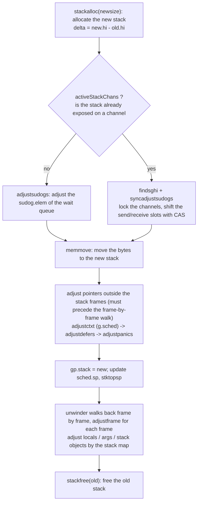

# 14.4 Stack Copying and Pointer Adjustment

The cost of contiguous stacks is concentrated in one place: when a goroutine's stack overflows, the runtime allocates a new stack twice the size, moves the entire old stack over, and then frees the old stack. The moving step looks like nothing more than a single `memmove`, copying the bytes of `[old.lo, old.hi)` into `[new.lo, new.hi)`. If it really were just copying bytes, a problem would arise: variables on the stack may hold pointers into the stack itself, for example a local variable that has taken the address of another local. After the bytes are moved verbatim to a new address, the values of these pointers are unchanged, still pointing at locations in the old stack, and the old stack is about to be reclaimed. The moment the copy finishes, they become dangling pointers.

So stack copying is not a `memmove` but a `memmove` plus a pass of **pointer adjustment**: after moving the bytes, the runtime must walk the new stack and add a fixed displacement $\delta = \mathrm{new.hi} - \mathrm{old.hi}$ to every pointer that originally pointed into the old stack's range, so that it points instead at the corresponding location in the new stack. The difficulty lies not in "how to add" but in "how to know which words are pointers." Words on the stack carry no type tag, and the runtime has no way to tell whether an 8-byte word is a pointer or merely an integer that happens to look like an address. The answer comes from the compiler: for every function, at every safe point ([13.7](../ch13gc/safe.md)), it generates a **stack map** that records, with a bitmap, precisely which slots in that function's stack frame are pointers. GC scanning of the stack relies on it, and pointer adjustment during stack copying relies on it too.

This section is about exactly that: how `copystack`, after the move, walks the new stack with the help of the stack maps, and adjusts correctly all the pointers that point into the old stack, together with those runtime structures that are not inside any stack frame yet still point at the stack (`gobuf`, `sudog`, `defer`, `panic`). By the end we will see that it is precisely this property, that "the stack can move," that in turn constrains the language: which pointers are allowed to point at the stack, and why escape analysis ([15.5](../../part5toolchain/ch15compile/escape.md)) must move an address held by an outside party onto the heap.

## 14.4.1 Why We Cannot Just memmove

Let us first state the problem plainly. Consider a piece of ordinary Go code:

```go
func f() {
	var x int
	p := &x      // p points to x in this stack frame
	g(p)         // pass the stack address downward
}
```

The value of `p` is the address of `x` on the stack, which falls inside the range `[old.lo, old.hi)`. When `g`, or a deeper call beneath it, triggers stack growth, the entire stack is moved to a new address and `x` moves with it, but the word that is `p` still holds the old address. Without correction, `p` points at memory that is about to be freed, or that will be reused by another goroutine's stack.

The correction algorithm itself is plain: for each **pointer slot** on the stack, take its value $v$, and if $\mathrm{old.lo} \le v < \mathrm{old.hi}$, rewrite it as $v + \delta$. `adjustpointer` is the implementation of exactly this one test:

```go
// adjustpointer: if *vpp falls inside the old stack range, shift it by delta to point into the new stack (sketch)
func adjustpointer(adjinfo *adjustinfo, vpp unsafe.Pointer) {
	pp := (*uintptr)(vpp)
	p := *pp
	if adjinfo.old.lo <= p && p < adjinfo.old.hi {
		*pp = p + adjinfo.delta // shift into the new stack
	}
}
```

`adjustinfo` gathers the three things this round of adjustment needs: the old stack range (used to decide "does it point into the old stack"), the displacement `delta`, and an `sghi` that we will explain later:

```go
type adjustinfo struct {
	old   stack    // old stack range [lo, hi), used to decide whether a pointer points into the old stack
	delta uintptr  // difference between new and old stack bases, new.hi - old.hi
	sghi  uintptr  // highest sudog.elem address on the stack, the boundary for concurrent send/receive
}
```

The genuinely hard part is "finding all the pointer slots." The whole stack is cut into a series of function-call frames, and the pointer layout of each frame has already been computed by the compiler at compile time, so the runtime only needs to follow the map. That map is the stack map.

## 14.4.2 Adjusting Frame by Frame with the Stack Map

After the `memmove`, `copystack` starts from the top of the stack and uses an `unwinder` to walk back one frame at a time, calling `adjustframe` for each frame (the full skeleton appears in 14.4.4). One point of version history is worth flagging here: early runtimes drove the traversal by passing the adjustment logic as a callback to `gentraceback`, while go1.26 switched to a standalone `unwinder` iterator, decoupling traversal from adjustment, though the "frame-by-frame callback" skeleton remains unchanged.

`adjustframe` handles a single frame. It asks the compiler for the three kinds of stack map for this frame, local variables (locals), arguments and return values (args), and stack objects, and adjusts each kind according to its bitmap:

```go
// adjust all the pointers within a single stack frame (sketch)
func adjustframe(frame *stkframe, adjinfo *adjustinfo) {
	if frame.continpc == 0 {
		return // dead frame (execution will never resume here), no adjustment needed
	}
	// if this frame saved the caller's frame pointer, adjust it first
	if frame.argp-frame.varp == 2*goarch.PtrSize {
		adjustpointer(adjinfo, unsafe.Pointer(frame.varp))
	}
	locals, args, objs := frame.getStackMap(true) // fetch the compiler-generated stack maps
	if locals.n > 0 { // local variable area, adjust by bitmap
		size := uintptr(locals.n) * goarch.PtrSize
		adjustpointers(unsafe.Pointer(frame.varp-size), &locals, adjinfo, frame.fn)
	}
	if args.n > 0 { // argument and return value area
		adjustpointers(unsafe.Pointer(frame.argp), &args, adjinfo, funcInfo{})
	}
	// stack objects: address-taken locals that may be referenced from several places, adjusted whether live or not
	// ... iterate over objs and adjust each according to its own pointer bitmap ...
}
```

`adjustpointers` is where the real work against the bitmap happens. It receives the starting address `scanp` of a region of memory and a bitmap `bv`, where bit $i$ of the bitmap being 1 means there is a pointer at offset $i$ words from `scanp`. It acts only on the set slots and leaves the integer slots untouched:

```go
// adjust the pointers in a region of memory starting at scanp, according to bitmap bv (sketch)
func adjustpointers(scanp unsafe.Pointer, bv *bitvector, adjinfo *adjustinfo, f funcInfo) {
	num := uintptr(bv.n)
	useCAS := uintptr(scanp) < adjinfo.sghi // this region may be touched by concurrent send/receive, see 14.4.4
	for i := uintptr(0); i < num; i += 8 {
		b := *(addb(bv.bytedata, i/8)) // take the pointer bits for 8 slots
		for b != 0 {
			j := uintptr(sys.TrailingZeros8(b)) // next pointer slot
			b &= b - 1
			pp := (*uintptr)(add(scanp, (i+j)*goarch.PtrSize))
			p := *pp
			if adjinfo.old.lo <= p && p < adjinfo.old.hi {
				if useCAS { // use CAS when racing with a concurrent writer
					atomic.Casp1(...)
				} else {
					*pp = p + adjinfo.delta
				}
			}
		}
	}
}
```

At this point all the pointers inside the stack frames are correct. But pointers on the stack are not hidden only inside stack frames.

## 14.4.3 Beyond the Stack Frame: Structures That Also Point at the Stack

There are several kinds of runtime structure that do not themselves live on the stack yet hold pointers into the stack. `memmove` does not touch them, and the frame-by-frame walk does not reach them either, so they must be adjusted explicitly, one by one, inside `copystack`.

The first kind is the goroutine's execution context `gobuf` (that is, `g.sched`, see [14.1](./readme.md) in this chapter). It holds `sp`, `bp`, and `ctxt`, of which `ctxt` and the frame pointer may point into the stack:

```go
func adjustctxt(gp *g, adjinfo *adjustinfo) {
	adjustpointer(adjinfo, unsafe.Pointer(&gp.sched.ctxt))
	adjustpointer(adjinfo, unsafe.Pointer(&gp.sched.bp)) // top frame pointer
}
```

The second kind is the `defer` and `panic` records. Each `defer` structure holds the function to be run `fn`, the stack pointer `sp` recorded at registration time, and `link` chaining to the next `defer`, all of which may fall on the stack:

```go
func adjustdefers(gp *g, adjinfo *adjustinfo) {
	adjustpointer(adjinfo, unsafe.Pointer(&gp._defer)) // list head
	for d := gp._defer; d != nil; d = d.link {
		adjustpointer(adjinfo, unsafe.Pointer(&d.fn))
		adjustpointer(adjinfo, unsafe.Pointer(&d.sp))
		adjustpointer(adjinfo, unsafe.Pointer(&d.link))
	}
}

func adjustpanics(gp *g, adjinfo *adjustinfo) {
	// the panic record itself is on the stack and was adjusted with its frame; here we only update the pointer in g that points to the list head
	adjustpointer(adjinfo, unsafe.Pointer(&gp._panic))
}
```

The third kind is the most subtle, the `sudog` that hangs on a channel while a goroutine is blocked on it ([10.3](../../part3concurrency/ch10chan/sendrecv.md)). When a goroutine blocks on `ch <- v` or `<-ch`, the runtime uses a `sudog` to hang it on the channel's wait queue, and `sudog.elem` points at the memory where the send/receive data lives, which is often on the blocked goroutine's own stack. Once the stack moves, `sudog.elem` must move with it:

```go
func adjustsudogs(gp *g, adjinfo *adjustinfo) {
	for s := gp.waiting; s != nil; s = s.waitlink {
		adjustpointer(adjinfo, unsafe.Pointer(&s.elem)) // elem may point into this stack (sketch)
	}
}
```

## 14.4.4 The Concurrency Boundary: _Gcopystack and sudog Synchronization

During the copy, this goroutine's stack is in an intermediate "half-moved" state, with some pointers already adjusted and others not yet. If a concurrent GC came to scan this stack at this moment, or another goroutine wrote data onto its stack through a channel, it would read, or corrupt, an inconsistent state. The runtime fences off this critical region with two gates.

For GC, the means is a state machine. Before calling `copystack`, `newstack` switches the goroutine from `_Grunning` to `_Gcopystack`, and switches it back after the copy finishes:

```go
// newstack fragment: set _Gcopystack during the copy to block concurrent GC scanning (sketch)
casgstatus(gp, _Grunning, _Gcopystack)
copystack(gp, newsize)
casgstatus(gp, _Gcopystack, _Grunning)
```

Before scanning a stack, the concurrent GC checks the goroutine's status, and on seeing `_Gcopystack` it knows the stack is being moved and leaves it alone.

For concurrent send/receive, the means is a lock plus CAS. Once the goroutine has hung itself on a channel's wait queue and released the channel lock (`activeStackChans` is true), another goroutine may at any time write a value into the send/receive slot on its stack. `copystack` cannot move recklessly at this point: it first uses `findsghi` to find the highest `sudog.elem` address on the stack and records it in `adjinfo.sghi`, then uses `syncadjustsudogs` to lock the relevant channels and synchronously adjust and move that region, switching to CAS to shift pointers in slots that may be written concurrently (this is the origin of `useCAS` in 14.4.2). This bit of care is only for the small piece of stack that holds the send/receive slots, so its cost is small, yet it blocks the race between "adjusting pointers" and "concurrently writing a slot."

Putting all of this together, the skeleton of `copystack` looks like this:

```go
// the full skeleton of moving a contiguous stack (sketch)
func copystack(gp *g, newsize uintptr) {
	old := gp.stack
	used := old.hi - gp.sched.sp
	new := stackalloc(uint32(newsize)) // allocate the new stack

	var adjinfo adjustinfo
	adjinfo.old = old
	adjinfo.delta = new.hi - old.hi // displacement

	ncopy := used
	if !gp.activeStackChans {       // the stack is not "exposed" on a channel, safe to adjust directly
		adjustsudogs(gp, &adjinfo)
	} else {                        // otherwise synchronize with concurrent send/receive, handle only the send/receive slots carefully
		adjinfo.sghi = findsghi(gp, old)
		ncopy -= syncadjustsudogs(gp, used, &adjinfo)
	}

	memmove(new.hi-ncopy, old.hi-ncopy, ncopy) // move the bytes

	adjustctxt(gp, &adjinfo)   // adjust the stack pointers in g.sched
	adjustdefers(gp, &adjinfo) // adjust the defer chain
	adjustpanics(gp, &adjinfo) // adjust the panic list head

	gp.stack = new             // swap the stack
	gp.sched.sp = new.hi - used
	gp.stktopsp += adjinfo.delta

	var u unwinder             // adjust the pointers on the new stack frame by frame
	for u.init(gp, 0); u.valid(); u.next() {
		adjustframe(&u.frame, &adjinfo)
	}

	stackfree(old)             // free the old stack
}
```

The ordering is deliberate. `adjustctxt`, `adjustdefers`, and `adjustpanics` must come before the frame-by-frame walk, because when the `unwinder` traces back the new stack it uses the pointers in `g.sched` and the defer chain, and they must be correct first in order to drive the traversal. Looking at the whole copy path in one place, "what is moved, what is adjusted, and in what order," gives the following diagram:




## 14.4.5 The Constraints of Copying Reshape the Language in Turn

Having come this far, we can answer a deeper question: why is it that in Go "only pointers allocated on the stack are allowed to point at the stack"?

Because the stack moves, and the only pointers that can be found and adjusted during the move are **those that the stack maps cover**, namely the pointers inside stack frames, plus those few kinds of structure that the runtime explicitly registers (`gobuf`, `sudog`, `defer`, `panic`). A pointer into some goroutine's stack, if it lives inside an object on the heap or is held by another goroutine's stack, is something `copystack` has no way of even knowing exists when it moves house, and so it cannot adjust it. Once the stack moves, that pointer dangles.

This is the root reason why escape analysis ([15.5](../../part5toolchain/ch15compile/escape.md)) must make certain determinations. When the compiler finds that the address of a local variable will be held by an outside party, typically as in:

```go
func newInt() *int {
	x := 0
	return &x // the address of x escapes this frame and is held by the caller
}
```

The address of `x` is to be returned to the caller and will be saved by a holder outside this frame. If `x` were placed on the stack, then once this stack later grows and moves house, the pointer in that outside holder's hand would become invalid, and the runtime would have no way to fix it on its behalf. So escape analysis can only conclude: allocate `x` on the heap. A heap object does not move with the stack, its address stays fixed for its lifetime, and the outside holder may rest easy.

In other words, the engineering constraint of contiguous stacks that "moving house must be able to adjust every pointer that points at it" propagates upward into a language-level allocation rule: **any value whose address will be held outside the stack must escape to the heap**. The movability of the stack buys the bargain of "shrinking and growing on demand, with no need to reserve a huge stack up front" ([14.1](./readme.md) in this chapter), and the cost is charged to the side of escape analysis and heap allocation. A performance bargain is never free; it always comes with complexity reseated somewhere else.

Placed in the lineage, this scheme of "moving the stack and adjusting the pointers" is not unique to Go. Runtimes with a moving GC, such as the JVM's copying collector and .NET's compacting GC, must likewise fix up all references that point at an object after it moves, and the technique is the same: "use precise type information to find the pointers, then shift them uniformly." Go's distinction is that it applies this machinery to the **stack**, and meshes it tightly with the compile-time decision of escape analysis, so that the two seemingly contradictory things, "the stack can move" and "pointers are always valid," can coexist.

## Further Reading

1. The Go Authors. *runtime/stack.go: copystack, adjustframe, adjustpointers, adjustsudogs,
   adjustdefers, adjustctxt.* https://github.com/golang/go/blob/master/src/runtime/stack.go
   (the primary implementation this section is based on, go1.26)
2. Keith Randall. *Contiguous stacks.* Go design document, 2013.
   https://go.dev/s/contigstacks
   (the design of contiguous stacks replacing segmented stacks, and the motivation for pointer adjustment during copying)
3. The Go Authors. *runtime/runtime2.go (the _Gcopystack status), runtime/mgcmark.go (stack scanning and shrinkstack).*
   https://github.com/golang/go/tree/master/src/runtime
4. The Go Authors. *cmd/compile: generation of stack maps (stack maps / liveness).*
   https://github.com/golang/go/tree/master/src/cmd/compile/internal/liveness
5. This book, [13.7 Safe Point Analysis](../ch13gc/safe.md): stack maps and safe points, the shared foundation of pointer adjustment and GC scanning.
6. This book, [15.5 Escape Analysis](../../part5toolchain/ch15compile/escape.md): how the movability of the stack constrains allocation decisions.
7. This book, [10.3 Send/Receive and Direct Passing](../../part3concurrency/ch10chan/sendrecv.md): sudog and the channel send/receive slots,
   explaining why `adjustsudogs` exists.
