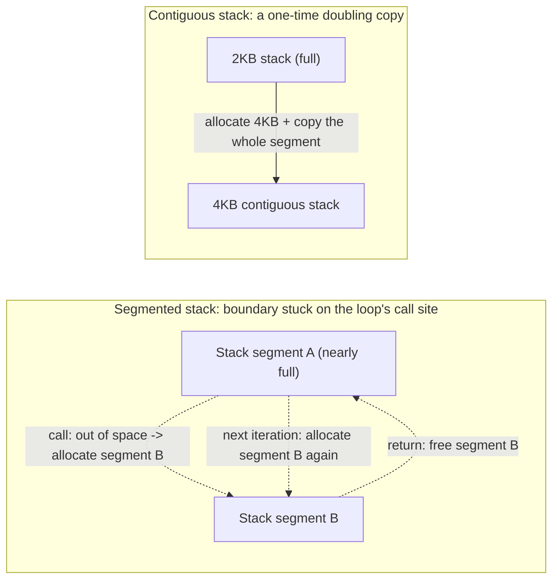
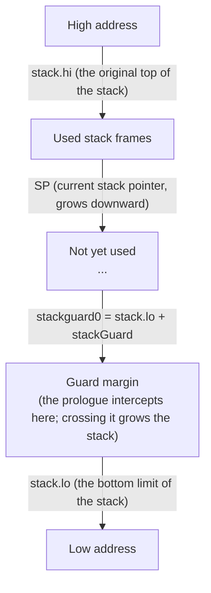

# 14.1 Design of Contiguous Stacks

Every goroutine carries an execution stack. It holds the local variables, arguments, and return addresses of function calls, and it is the physical medium that lets a program be "currently executing". In the C programs the reader is familiar with, this stack is provided by the operating system thread, its size fixed once at thread creation (`ulimit -s` defaults are often 8MB) and unchanged thereafter. Go took a different road: a goroutine's stack is not a thread stack but a segment of memory that the runtime allocates on the heap, manages itself, and can resize, starting at just 2KB.

This design choice is not a detail. It is the precondition for goroutines being "cheap enough to spawn by the thousands" ([9.3](../../part3concurrency/ch09sched/mpg.md)). This section first makes clear the form a stack takes inside the runtime: which fields describe it, how `stackguard0` guards the bottom of the stack in every function prologue. It then turns to history to see why Go switched from the segmented stacks of its early years to today's contiguous stacks, and what that switch bought and what it cost. The mechanisms of stack allocation, copying, and shrinking are left to the later sections of this chapter; here we discuss only design.

## 14.1.1 The Form of a Stack in the Runtime

A goroutine is described by a `g` object, and its first few fields are exactly what characterize the execution stack. The bounds of the stack are expressed by a pair of addresses, a half-open interval `[lo, hi)`, with no implicit metadata at either end:

```go
// stack describes a segment of stack memory; the bounds are exactly [lo, hi), with no implicit structure on either side (sketch)
type stack struct {
    lo uintptr // the low-address end of the stack (the stack grows toward lower addresses, so lo is the "bottom limit" of the stack)
    hi uintptr // the high-address end of the stack (the original top of the stack)
}
```

The stack grows toward lower addresses: when a function call pushes onto the stack, the stack pointer SP moves from the `hi` side toward `lo`. `lo` is therefore the lowest address this stack can reach, and crossing it is stack overflow.

The fields in `g` that relate directly to the stack are the following three:

```go
type g struct {
    // stack describes the actual stack memory: [stack.lo, stack.hi)
    stack       stack
    // stackguard0 is the stack pointer compared against in the Go stack-growth prologue.
    // Normally it equals stack.lo + stackGuard; when preempted it is rewritten to stackPreempt.
    stackguard0 uintptr
    // stackguard1 is the stack pointer compared against in the //go:systemstack prologue.
    // On the g0 and gsignal stacks it equals stack.lo + stackGuard;
    // on an ordinary goroutine stack it is ~0, so as to trigger morestackc (and crash).
    stackguard1 uintptr
    // ...
    sched       gobuf // the execution context: the register snapshot saved when scheduled off
    // ...
}
```

`stackguard0` is the pivot of this whole mechanism, and the next subsection is devoted to it. `stackguard1` is its counterpart on the system stack and the signal stack, with a use narrowed to the runtime's own C-call boundaries; an ordinary goroutine never touches it.

When a goroutine is scheduled off the CPU, "how far it had executed" must be recorded in full so it can later be restored exactly. That snapshot of context is `gobuf`:

```go
// gobuf saves the register context of a goroutine when it is scheduled off (sketch)
type gobuf struct {
    sp   uintptr        // stack pointer: after restoring, the stack continues from here
    pc   uintptr        // program counter: after restoring, execution continues from this instruction
    g    guintptr       // points back to the owning g
    ctxt unsafe.Pointer // closure context, treated as a root when GC scans the stack (see comment)
    lr   uintptr        // link register (ARM and similar architectures)
    bp   uintptr        // frame pointer (architectures with framepointer enabled)
}
```

`gobuf` is worth singling out because it is deeply bound to the movability of the stack. Once a stack is relocated ([14.5](./grow.md)), the `sp` saved inside it must be adjusted accordingly, or restoring execution would land on a piece of already-freed old memory. In other words, `stack`, `gobuf`, and stack copying are a set of mutually constraining designs; once their relationships are understood, the reason stack resizing later has to be so careful has its origin here. The comment on the `ctxt` field points out one subtlety: it may be a closure on the heap that GC must trace, but it also has to be read and written from assembly, where inserting write barriers is awkward, so the runtime treats it as a scan root.

## 14.1.2 stackguard0: A Single Line of Guard in the Prologue

A stack will get used up. A deeply recursive function, or one with large local variables, may exhaust the remaining stack space on some particular call. The runtime needs to intercept at the very moment of "about to go out of bounds" and swap the stack for a larger one. The problem is that this check has to happen on every function call, and its cost counts directly against every call in every Go program.

Go's approach is to compress the check into a few instructions in the function prologue, inserted automatically by the compiler at the start of every function not marked `//go:nosplit` ([2.2](../../part1overview/ch02asm/callconv.md)). In the most common small-frame case, the prologue is just one comparison plus one conditional jump, in pseudo-assembly:

```
// the stack check in a function prologue (small-frame case, pseudo-assembly)
CMP   SP, stackguard0        // is the current stack pointer already approaching the bottom-of-stack guard line?
JLS   morestack              // if SP <= stackguard0, jump to grow the stack (the rare path)
// ... normal entry into the function body ...
```

`stackguard0` is normally set to `stack.lo + stackGuard`, a margin of `stackGuard` above the true stack bottom `lo`. This margin is not waste: it has to hold a chain of `//go:nosplit` function calls (these functions perform no stack check, so their total frame must be guaranteed to fit within the guard region), one `stackSmall` frame, plus the `stackSystem` bytes each platform reserves for signal handling. In go1.26 these quantities are defined by `stackGuard = stackNosplit + stackSystem + abi.StackSmall`, and `stackMin = 2048` gives the 2KB minimum stack.

The elegance of this line of guard is that it is reused as the switch for preemption. When the scheduler wants to preempt a running goroutine ([9.7](../../part3concurrency/ch09sched/preemption.md)), it does not need a separate check; it merely rewrites the target's `stackguard0` to a special large value `stackPreempt` (`0xfffffade`). This value is larger than any real SP, so the comparison in the next function prologue is bound to "fail", control flow falls into `morestack` as usual, and `morestack` discovers there that this is in fact a preemption request and yields accordingly. One field, two meanings: in normal times it is the physical boundary at the bottom of the stack; under preemption it is a logical signal the scheduler has slipped in. Hanging preemption off the existing stack check spares the cost of adding another test on the hot path, a move that recurs throughout the Go runtime: making one cost that already has to be paid carry a second duty.

## 14.1.3 From Segmented Stacks to Contiguous Stacks

Since a stack starts with only 2KB, getting used up is the norm, and the crux is "how it grows once it is full". Go gave two different answers before and after version 1.3.

The early Go used segmented stacks. When the stack ran short, the runtime allocated a fresh segment of stack space elsewhere and used a linking structure to attach it after the old stack: logically one stack, physically several segments not contiguous with one another. When the function returned and retreated to the previous segment, the new stack was freed again. This mechanism borrowed from gccgo and earlier split-stack implementations, and its advantage was that growing the stack only touched the newly added segment, never the old data.

It had a fatal degenerate case, called the hot split. Imagine a tight loop with exactly one function call inside the loop body, where the space remaining in the current stack segment is just barely enough to hold that call's frame and a little more. Then on every iteration of the loop: at the call, space turns out to be insufficient, so a new stack segment is allocated; when the function returns, space is "enough" again, so the new segment is freed; the next iteration allocates again, frees again. The stack boundary sits exactly on the loop's call site, and alloc/free thrashes at the loop's high frequency. A loop that should be a hot path is dragged down by the repeated requesting and returning of stack segments, and this thrashing persists, never disappearing as long as the loop keeps running. Performance thus became hard to predict: for the same piece of code, a slight difference in stack-frame layout, whether or not it landed on the boundary, decided whether it ran fast or slow.

Go 1.3, led by Keith Randall, switched to contiguous stacks. The idea is plain to the point of seeming clumsy: when the stack runs short, rather than attach a new segment, allocate one whole new stack twice as large, copy all the contents of the old stack into it, and then free the old stack. The stack is therefore always one contiguous block of memory.



Contiguous stacks change the very shape of the cost. They require copying the entire stack over at once, and this copy is not cheap, especially when the stack is deep; the copy itself has difficulties too, in that local variables on the stack may hold pointers into the same stack, and after relocation these pointers must each be corrected, and the `sp` saved in `gobuf` likewise has to be updated, all of which is the subject of [14.5](./grow.md). But what it buys is this: growing the stack happens only once, when "a larger stack is genuinely needed", and afterward the stack settles down with no thrashing at all; the hot-split case that stalled segmented stacks is rooted out. Contiguous memory also improves cache locality as a side effect. The trade-off the Go 1.3 release notes give is this: trade a well-amortizable one-time copy cost for the continuous and unpredictable boundary thrashing of segmented stacks.



What is worth pointing out is that in the contest between segmented and contiguous there is no "free win". Segmented stacks are cheaper at the moment of growth (touching only the new segment); contiguous stacks are cheaper in steady state (no more thrashing). Go bet on the latter: in real programs the stack size often converges quickly to a stable value, growth is a one-time event happening only a handful of times, and making every crossing of the boundary a cheap operation is far worse than eliminating the boundary itself. This judgment has been borne out in practice, and contiguous stacks remain in use to this day.

## 14.1.4 A Small but Growable Stack, and How It Sustains Lightweight Concurrency

Back to the question we opened with: why a goroutine's stack should be designed this way. Put three things together, heap allocation, an initial 2KB, and on-demand doubling, and the answer becomes clear.

An OS thread stack is easily several MB and fixed, so spawning ten thousand threads means reserving tens of GB of stack address space, most of which goes unused. Goroutines do the opposite: each starts at just 2KB, so a hundred thousand of them amount to only a few hundred MB of initial footprint; only the few goroutines that genuinely hit deep recursion or large frames grow step by step through contiguous stacks, paying as they go. The stack is managed by the runtime on the heap rather than bound to a particular thread, which further lets a goroutine be scheduled to execute on different M's ([9.3](../../part3concurrency/ch09sched/mpg.md)), with the stack following the `g` and not locked to a thread.

This is exactly the confidence behind Go's choice of stackful coroutines over stackless schemes. A goroutine has a real, growable stack, so it can suspend and resume at any call depth, and writing concurrent code needs no coloring of functions as async and no manual management of continuations; ordinary synchronous-style code can run concurrently. What supports this programming model is precisely this section's design of "small, growable, runtime-managed" contiguous stacks. It trades the expensive, fixed OS stack for a cheap, elastic runtime stack, turning "thousands upon thousands of goroutines" from a slogan into an affordable engineering reality.

## Further Reading

1. Keith Randall. *Contiguous stacks.* Go design document, 2013.
   https://go.dev/s/contigstacks (the first-hand document on the contiguous-stack design: the hot-split problem, copying and pointer correction, performance data)
2. The Go Authors. *Go 1.3 Release Notes: Stack management.* 2014.
   https://go.dev/doc/go1.3#stacks (the official account of the switch from segmented stacks to contiguous stacks, and the elimination of the "hot spot")
3. The Go Authors. *runtime/stack.go.* (the constant definitions of `stackMin`, `stackGuard`, `stackNosplit`, and so on)
   https://github.com/golang/go/blob/master/src/runtime/stack.go
4. The Go Authors. *runtime/runtime2.go.* (the stack-related fields of `stack`, `gobuf`, `g`)
   https://github.com/golang/go/blob/master/src/runtime/runtime2.go
5. Ian Lance Taylor. *Split Stacks in GCC.* gccgo documentation.
   https://gcc.gnu.org/wiki/SplitStacks (the implementation origin and design trade-offs of segmented stacks)
6. This book's [9.3 The M/P/G Model](../../part3concurrency/ch09sched/mpg.md),
   [9.7 Cooperation and Preemption](../../part3concurrency/ch09sched/preemption.md),
   [2.2 Calling Conventions](../../part1overview/ch02asm/callconv.md).
7. This chapter's [14.5 Stack Resizing](./grow.md) (the details of stack copying, pointer correction, and `gobuf` updates).
