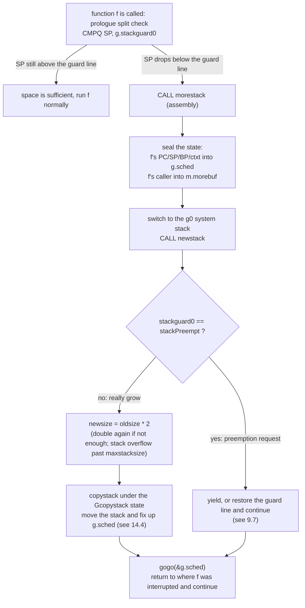

# 14.3 Stack Growth

[14.1](./readme.md) laid out the reasons Go chose contiguous stacks: a stack starts at just 2KB, and on overflow it swaps in a new stack twice as large and copies the entire old stack across. This section answers only one of the questions involved: how the runtime knows, at the "right moment," that a stack is about to fill up, and how it hands control all the way over to the code responsible for the growth. The details of the stack copy itself are left to [14.4](./copy.md).

The difficulty is that stack growth must happen at the instant the stack is about to overflow but has not yet truly overflowed, and what triggers it is precisely an ordinary function call. In other words, every entry into a function must first ask, "will my frame fit?", and only if it will not does it go grow the stack. This check cannot be hand-written by the programmer; the compiler plants it automatically at the start of every function, and this is the split check in the **function prologue**. The whole chain is: prologue check to `morestack` (assembly) to `newstack` (Go) to `copystack` to returning to the original spot to continue. Let us walk this chain end to end.

## 14.3.1 The Function Prologue: Every Call Asks First

Every Goroutine's `g` structure has a field `stackguard0`, the guard line marking "how far the stack may still be used" ([2.2](../../part1overview/ch02asm/callconv.md)). Under normal conditions it equals `stack.lo + stackGuard`, that is, the bottom of the stack raised by one guard region. What the function prologue does is compare the current stack pointer SP against this guard line: the stack grows toward lower addresses, and once SP drops below `stackguard0` it means the remaining space is not enough to hold the frame about to be pushed, so the stack must be grown first.

The compiler does not generate the same check for all functions. The larger the frame, the more the frame's own size must be folded into the comparison, so the check comes in three tiers (the constants `StackSmall = 128` and `StackBig = 4096` are in `internal/abi/stack.go`). Below is the pseudo-assembly for the prologue on amd64, corresponding to `stacksplit` in `cmd/internal/obj/x86/obj6.go`:

```asm
// Small frame, framesize <= StackSmall: compare SP directly against the guard line
    CMPQ    SP, stackguard0     // has SP dropped below the guard line?
    JHI     ok                  // SP is still above the guard line, it fits, skip
    CALL    runtime·morestack(SB)
ok:

// Medium frame, StackSmall < framesize <= StackBig: fold in the frame size
    LEAQ    -(framesize-StackSmall)(SP), AX
    CMPQ    AX, stackguard0
    JHI     ok
    CALL    runtime·morestack(SB)

// Large frame, framesize > StackBig: also guard against wraparound when SP is near 0,
// and explicitly check whether the guard line was set to a value like stackPreempt,
// deliberately larger than any real SP
```

The guard line is read as the memory operand `stackguard0`; its offset within `g` is exactly the third word (the first two words are `stack.lo` and `stack.hi`), so the assembly writes it at `2*PtrSize`; C functions compare against `stackguard1` (the fourth word) instead. Functions marked `//go:nosplit` do not get this check inserted, at the cost that their frame must squeeze into the `stackGuard - StackSmall` reserve region at the bottom of the stack, and the linker walks the call chains of all non-splitting functions to make sure this reserve is large enough.

There is a piece of design here that is easy to overlook: a small frame needs only one `CMPQ` plus one jump, and the vast majority of functions fall into this tier, so the split check is almost free on the fast path. The bother of folding the frame size into the comparison and guarding against wraparound is added only to the few large-frame functions. The cost of the check is "paid on every function call," so it has been pared down to the bone.

## 14.3.2 morestack: Move Onto g0 to Grow

When the prologue decides space is insufficient, it does `CALL runtime·morestack`. This is a stretch of assembly (`asm_amd64.s`), and it has to resolve an unavoidable tension: growth amounts to "copying this entire stack somewhere else," yet the copying logic itself must also run on some stack, and it absolutely must not run on the very user stack about to be moved away. The job of `morestack` is to first seal away the current execution state, then switch to the **g0 system stack** ([9.3](../../part3concurrency/ch09sched/mpg.md)) to run the real growth function `newstack`.

Sealing the state takes two steps. First, the state of the function f that triggered the growth (PC, SP, BP, ctxt) is written into `g.sched`, so that once growth finishes it can return precisely to the next instruction in f and continue. Second, the state of f's **caller** is recorded into `m.morebuf`, for `newstack` to unwind the stack when needed. It then confirms that execution is not currently on g0 or the signal stack (these two stacks are not allowed to grow, and hitting them is a direct crash), and finally switches to g0 and calls `newstack`:

```asm
TEXT runtime·morestack(SB),NOSPLIT|NOFRAME,$0-0
    get_tls(CX)
    MOVQ    g(CX), DI              // DI = g (the current user g)
    MOVQ    g_m(DI), BX            // BX = m

    // store f's execution state into g.sched, to restore from after growth
    MOVQ    0(SP), AX
    MOVQ    AX, (g_sched+gobuf_pc)(DI)   // f's PC
    LEAQ    8(SP), AX
    MOVQ    AX, (g_sched+gobuf_sp)(DI)   // f's SP
    MOVQ    BP, (g_sched+gobuf_bp)(DI)
    MOVQ    DX, (g_sched+gobuf_ctxt)(DI) // f's ctxt (closure context)

    // cannot grow the g0 / gsignal stack; if hit, crash
    MOVQ    m_g0(BX), SI
    CMPQ    DI, SI
    JNE     3(PC)
    CALL    runtime·badmorestackg0(SB)
    CALL    runtime·abort(SB)
    // ... (gsignal handled the same way, omitted)

    // set m.morebuf to f's caller state, for newstack to unwind
    MOVQ    8(SP), AX
    MOVQ    AX, (m_morebuf+gobuf_pc)(BX)
    LEAQ    16(SP), AX
    MOVQ    AX, (m_morebuf+gobuf_sp)(BX)
    MOVQ    DI, (m_morebuf+gobuf_g)(BX)

    // switch to the m.g0 stack and call newstack on it
    MOVQ    m_g0(BX), BX
    MOVQ    BX, g(CX)
    MOVQ    (g_sched+gobuf_sp)(BX), SP   // SP switched to the g0 stack
    MOVQ    $0, BP
    CALL    runtime·newstack(SB)
    CALL    runtime·abort(SB)            // newstack should not return; returning is a crash
```

Where does that `DX` (ctxt) come from? If the function in the prologue does not need a closure context, what it calls is not `morestack` but its thin wrapper `morestack_noctxt`: it zeroes ctxt and then jumps in, sparing the save of a meaningless register.

```asm
TEXT runtime·morestack_noctxt(SB),NOSPLIT,$0
    MOVL    $0, DX
    JMP     runtime·morestack(SB)
```

At this point the user g's state is fully sealed in `g.sched` and `m.morebuf`, execution is already standing on the g0 stack, and we can move that user stack with confidence.

## 14.3.3 newstack: Distinguish Preemption First, Then Talk About Growth

`newstack` (`runtime/stack.go`) runs on g0, but the object it handles is the sealed user g (`thisg.m.curg`). The first important thing it does is not to grow, but to **distinguish whether this entry really calls for growth at all**.

The reason is that `stackguard0` has been overloaded into a preemption channel. When the runtime wants to preempt some Goroutine ([9.7](../../part3concurrency/ch09sched/preemption.md)), it rewrites that Goroutine's `stackguard0` to `stackPreempt`, a sentinel value deliberately larger than any real SP (`0xfffffade`). This way, the Goroutine's next prologue check is bound to "fail," routing it into `morestack` and then into `newstack`. In other words, the prologue check, a path laid for stack growth, is borrowed as a synchronous safe point for cooperative preemption:

```go
func newstack() {
    thisg := getg()
    gp := thisg.m.curg          // the sealed user g

    // stackguard0 may be concurrently rewritten by another thread; read it once and use this value below
    stackguard0 := atomic.Loaduintptr(&gp.stackguard0)
    preempt := stackguard0 == stackPreempt

    if preempt {
        // this is a preemption request, not a real growth.
        // but if we currently hold a lock / are allocating / have preemption disabled, it is unwise to yield;
        // let it keep running and try again next time.
        if !canPreemptM(thisg.m) {
            gp.stackguard0 = gp.stack.lo + stackGuard  // restore the guard line
            gogo(&gp.sched)                            // go straight back and continue
        }
        // ... (if the conditions are met, yield here: gopreempt_m / preemptPark, see 9.7)
    }

    // reaching here means this is a real stack growth.
    oldsize := gp.stack.hi - gp.stack.lo
    newsize := oldsize * 2                        // double by default

    // if doubling still cannot hold the frame about to be entered, keep doubling until it fits
    if f := findfunc(gp.sched.pc); f.valid() {
        needed := uintptr(funcMaxSPDelta(f)) + stackGuard
        used := gp.stack.hi - gp.sched.sp
        for newsize-used < needed {
            newsize *= 2
        }
    }

    // exceeding the limit counts as runaway (most often infinite recursion); fatal exit
    if newsize > maxstacksize || newsize > maxstackceiling {
        print("runtime: goroutine stack exceeds ", maxstacksize, "-byte limit\n")
        throw("stack overflow")
    }

    // mark as Gcopystack so the concurrent GC does not scan this stack during the copy
    casgstatus(gp, _Grunning, _Gcopystack)
    copystack(gp, newsize)                        // the actual stack move, see 14.4
    casgstatus(gp, _Gcopystack, _Grunning)
    gogo(&gp.sched)                               // use g.sched to return to f and continue
}
```

A few points are worth calling out. Stack size **doubles by default** rather than growing linearly, in order to amortize growth into an amortized $O(1)$: for a stack that repeatedly triggers growth, the total copy cost is proportional to the final size, not to the square of the number of triggers. Above the doubling there is also a fallback of "if a single frame is itself larger than the doubled size, keep doubling," guaranteeing that the current frame at least fits.

`maxstacksize` is the guardrail against runaway. It is 1GB on 64-bit and 250MB on 32-bit (set by `runtime.main` in `runtime/proc.go`, with a temporary value of 1MB early in startup), and there is also `maxstackceiling = 2 * maxstacksize` as a hard ceiling. Infinite recursion is caught precisely by this: the recursion keeps triggering growth, the stack doubles all the way up, and when it hits the limit `throw("stack overflow")` crashes the program at once, rather than quietly eating up memory. This also explains why a stack overflow in Go is a fatal error rather than a recoverable panic: stack space has nowhere left to go, so recovery is out of the question.

The last two lines are the key to closing this chain. While `copystack` moves the old stack to the new one, it also updates the SP and other state in `g.sched` to point at the new stack ([14.4](./copy.md)), so `gogo(&gp.sched)` can jump back to where f was originally interrupted. As far as f is concerned, it knows nothing of all this; it merely feels that the ordinary function call returned as usual.

## 14.3.4 The Whole Chain

Putting the four steps together, a stack growth triggered by insufficient space runs to completion like this:



Nowhere in this chain is anything written explicitly by the programmer: the prologue is planted by the compiler, the state switch is done in assembly, the growth decision and preemption discrimination are borne by the runtime, while the function being grown believes from start to finish that it merely made an ordinary call. The cost of contiguous stacks, the `CMPQ` on every call and the whole-stack copy on growth, has been carefully amortized to the places that least affect the hot path. This is precisely the engineering implementation behind Go's promise that "stacks are cheap, and Goroutines can number in the thousands." The next section [14.4](./copy.md) enters `copystack` to see how it fixes up every pointer on the stack that points into the old stack while moving it, which is where contiguous stacks get truly thorny.

## Further Reading

1. The Go Authors. *runtime/stack.go: `newstack`, `maxstacksize`, stack growth comment block.*
   https://github.com/golang/go/blob/master/src/runtime/stack.go (growth decision, preemption discrimination, limit guardrail)
2. The Go Authors. *runtime/asm_amd64.s: `morestack`, `morestack_noctxt`.*
   https://github.com/golang/go/blob/master/src/runtime/asm_amd64.s (state sealing and switch to g0)
3. The Go Authors. *cmd/internal/obj/x86/obj6.go: `stacksplit`.*
   https://github.com/golang/go/blob/master/src/cmd/internal/obj/x86/obj6.go (the prologue split check inserted by the compiler)
4. The Go Authors. *internal/abi/stack.go: `StackSmall`, `StackBig`.*
   https://github.com/golang/go/blob/master/src/internal/abi/stack.go (the threshold constants for the three-tier check)
5. Brad Fitzpatrick et al. *Contiguous stacks design document.*
   https://docs.google.com/document/d/1wAaf1rYoM4S4gtnPh0zOlGzWtrZFQ5suE8qr2sD8uWQ (the design rationale for replacing segmented stacks with contiguous stacks)
6. This book, [2.2 Calling Conventions](../../part1overview/ch02asm/callconv.md) (the setup of stackguard0),
   [9.7 Cooperation and Preemption](../../part3concurrency/ch09sched/preemption.md) (stackPreempt borrowing the prologue check),
   [14.4 Stack Copying](./copy.md) (copystack and pointer fix-up).
