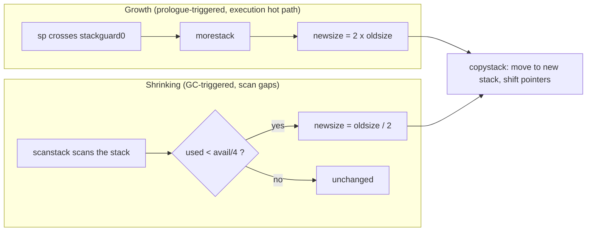

# 14.5 Stack Shrinking and Evolution

[14.4](./copy.md) was about the stack "growing up": when a function prologue finds the stack
nearly exhausted, the runtime copies the whole stack onto a larger block of memory, and the stack
pointer shifts along with it. This is a one-directional force driven by execution itself, and it
only ever makes the stack larger. Yet a goroutine's stack depth is not monotonic. A recursion may
descend very deep, then return layer by layer back to a shallow point; the stack it actually needs
has long since shrunk back, but the large stack expanded for that deep recursion is still held in
its name. With growth but no return, every goroutine's stack would eventually settle at its
historical deepest point. For a program that may hold millions of goroutines, this bill is
unbearable.

So the stack also "shrinks". Growth is triggered by the prologue and happens on the hot path of
execution; shrinking is handed to garbage collection, done as a side errand in the gaps of stack
scanning. The two forces, one pushing out and one pulling in, keep every goroutine's stack always
hugging its current true need. This section first looks at the timing and criteria of shrinking,
then makes clear why this "self-regulation" is the bedrock of lightweight concurrency, and finally
places it back in the coordinates of language evolution and cross-system comparison.

## 14.5.1 The Timing and Criteria of Shrinking

Shrinking cannot be done at any moment. Copying the stack requires rewriting all pointers on the
stack that point into the stack ([14.4](./copy.md)), which demands that the runtime have precise
pointer information for this goroutine's stack at that instant, and that no other execution flow be
treading on this stack. The most natural window that satisfies both at once is precisely when
garbage collection scans the stack: to mark live objects, GC must already stop each goroutine and
scan its stack frame by frame ([13.4](../ch13gc/mark.md), [13.7](../ch13gc/mark.md)). Since the
stack has already come to rest and the pointer map is already prepared, deciding whether to shrink
right after the scan is almost zero extra cost.

So `shrinkstack` is called by `scanstack`. The scan acts only after confirming the stack is safe
to shrink; if it is not safe at the moment, it records the intent in `gp.preemptShrink` and leaves
it to be done at the next synchronous safe point:

```go
// scanstack: GC scans some goroutine's stack (excerpt from runtime/mgcmark.go)
func scanstack(gp *g, gcw *gcWork) int64 {
    // ... tally the stack size to scan this time, for the adaptive estimate of the initial stack size ...
    if isShrinkStackSafe(gp) {
        shrinkstack(gp)         // outside the unsafe window, shrink along the way
    } else {
        gp.preemptShrink = true // otherwise defer to the next synchronous safe point
    }
    // ... continue scanning the stack frames, marking the pointers within ...
}
```

What counts as "safe"? `isShrinkStackSafe` rules out, one by one, several situations where the
stack must not be touched: the goroutine is stuck in a system call (`syscallsp != 0`, where the
system call may hold a bare pointer into the stack, and the innermost frame has no precise pointer
map); it is stopped at an async preemption safe point (likewise lacking a precise pointer map); it
is in the window where it "has called `gopark` to prepare to park on a channel, but
`activeStackChans` has not yet been set"; and a goroutine stopped at `_Gwaiting` to cooperate with
`suspendG`. If any one of these is hit, this round does not shrink.

The "deferral" lands on two or three fields of `g`. Recalling the sketch of `g` given in
[14.1](./grow.md), only these few items are relevant to shrinking:

```go
// g: fields relevant to stack shrinking (sketch)
type g struct {
    stack       stack   // the actual stack memory range [stack.lo, stack.hi)
    stackguard0 uintptr // the guard line the prologue checks; crossing it triggers growth (see 14.2)
    sched       gobuf   // the execution context, where sched.sp is the stack pointer, measuring actual usage
    preemptShrink bool  // this round's shrink was deferred, to be done at the next synchronous safe point
    // ...
}
```

`scanstack` sets `preemptShrink` to `true` inside an unsafe window, and does not discard the intent
to shrink. When the goroutine later enters `newstack` due to preemption or stack growth, that is a
synchronous safe point where the pointer map is precise, and the runtime checks this flag; if it is
true, it does a `shrinkstack` on the spot and clears it. In other words, shrinking never forces its
way into a dangerous moment; it is merely scheduled to the next naturally safe junction.

What truly decides whether to shrink, and by how much, is a very short piece of arithmetic inside
`shrinkstack`:

```go
// shrinkstack: halve gp's stack when necessary (excerpt from runtime/stack.go)
func shrinkstack(gp *g) {
    // ... preconditions: gp has come to rest, this round holds its stack, the current window is safe ...

    oldsize := gp.stack.hi - gp.stack.lo
    newsize := oldsize / 2
    // already at the minimum stack, do not shrink further
    if newsize < fixedStack {
        return
    }
    // shrink only when "actual usage is below 1/4 of the current stack"
    avail := gp.stack.hi - gp.stack.lo
    if used := gp.stack.hi - gp.sched.sp + stackNosplit; used >= avail/4 {
        return
    }

    copystack(gp, newsize)      // reuse the copy mechanism from 14.4, move to a smaller stack
}
```

The criteria can be read as two sentences. First, the target size is half the current one
(`newsize = oldsize / 2`), and not below the minimum stack `fixedStack` (on most platforms
$2\text{KB}$, obtained by rounding `stackMin = 2048` up to a power of $2$); a goroutine already on
the minimum stack never shrinks. Second, only when the actual usage `used` at this moment is below
$1/4$ of the whole stack `avail` does it act. Here `used` is measured from the stack top `hi` down
to the stack pointer `sp`, plus a margin of `stackNosplit`, to guarantee that the chain of
non-splittable (nosplit) functions still has somewhere to land after shrinking; `avail` is the size
of the whole allocation, `hi - lo`.

Why is the threshold set at $1/4$ rather than $1/2$? Because after shrinking to half, usage that was
previously "below $1/4$" becomes "below $1/2$", which falls right within the safe range of the new
stack, so a single shrink will not immediately approach the guard line again and have the next
prologue instantly trigger growth. The $1/4$ margin separates shrinking from growth, avoiding
repeated back-and-forth copying that thrashes at some critical depth. The check itself is just a few
subtractions and one comparison, riding on the tail of the GC scan, with negligible cost. The truly
expensive `copystack` happens only when the criteria pass and a move is indeed worthwhile.

## 14.5.2 Self-Regulation: Why a Million Goroutines Stay Light

Placing growth and shrinking side by side, one sees they are a pair of geometrically symmetric
forces:



Growth doubles the stack, shrinking halves it; both sides are geometric, and both share the same
`copystack` from [14.4](./copy.md). The consequence is that each goroutine's stack converges toward
its "current true need". As stack depth rises, doubling the capacity makes the number of expansions
logarithmic in depth; after the depth falls back, GC halves the idle large stack round after round,
until it hugs the $2\text{KB}$ minimum stack. No goroutine can hold for long onto a large stack it
has long stopped using.

This is exactly the key to "a million goroutines and still light". A new goroutine starts with only
a $2\text{KB}$ stack ([14.2](./grow.md)); the total starting stack of $10^6$ goroutines is about
$2\text{GB}$, but the vast majority of goroutines only dabble shallowly, with actual usage far below
this. The few goroutines that once recursed very deep will temporarily stretch the stack large, but
as soon as they return to a shallow point, the subsequent GC cycles will gradually reclaim the
excess. The total stack memory is therefore not anchored to the disastrous upper bound of "the sum
of all goroutines' historical deepest points", but floats near "the sum of each goroutine's true
need at this moment". Growth guarantees enough capacity, shrinking guarantees no waste, and together
they make the stack a self-regulating resource.

Geometric scaling also brings an amortized benefit along the way. Let the peak stack depth over some
stretch of execution be $S$, and the minimum stack be $S_0$. Growth doubles each time, so rising
from $S_0$ to $S$ takes at most $\lceil \log_2 (S/S_0) \rceil$ copies; shrinking halves each time,
so falling from $S$ back to $S_0$ also takes at most $\lceil \log_2 (S/S_0) \rceil$. Both ends are
logarithmic in stack depth, and the cost of a single copy is proportional to the stack size at the
time, so the bytes spent on copying over the whole lifetime are bounded by a constant multiple of
$S$, rather than accumulating linearly with the number of calls. The margin left by the $1/4$
threshold further guarantees that if the stack depth only oscillates slightly around some point, it
will not trigger the repeated copying of "one growth, one shrink". This is the echo, on the
shrinking side, of the hot split problem that contiguous stacks set out to solve when they replaced
segmented stacks ([14.5.3](#1453-evolution-and-cross-system-the-growable-stack-as-enabling-technology)).

The cost is not nil. Shrinking requires copying and pointer rewriting, which is real work; Go hides
it inside the stack scan GC must do anyway, letting the two things share one cost of "stopping and
walking the stack". This is a typical trade-off: using the pause already paid during GC to buy the
timely return of stack memory. The runtime also leaves the switch `GODEBUG=gcshrinkstackoff=1`, to
turn off shrinking entirely when investigating.

## 14.5.3 Evolution and Cross-System: The Growable Stack as Enabling Technology

Widening the view, the growable, shrinkable stack is not an ornament of Go but the precondition for
"stack-based lightweight concurrency" to hold. A tour through the different choices of various
systems makes this especially clear.

C/C++ with operating-system threads take a different road: each thread has a **fixed large stack**.
At thread creation it reserves a large segment of the virtual address space (on Linux determined by
`ulimit -s`, often defaulting to $8\text{MB}$), neither growing nor shrinking during its run. This
approach is simple, with zero runtime overhead, but the stack's size becomes a hard upper bound on
concurrency; even if each large stack occupies only the physical pages actually touched via lazy
page faults, the address-space reservation and the kernel overhead of the thread itself keep the
number of simultaneously live threads at the order of a few thousand. To open a million-level
concurrency, the fixed-large-stack road does not work.

Rust actually tried a Go-style growable stack early on. Its green threads once used **segmented
stacks**: the stack was a series of small segments strung together by a linked list, with another
segment attached when not enough. But segmented stacks have a famous "hot split" ailment: when a
call happens to occur just as one segment is nearly full, entering a sub-call has to newly allocate
a segment, and returning immediately frees it; if such a call lands in a tight loop, allocation and
deallocation thrash back and forth and drag down performance. In November 2013, before 1.0, Rust
formally abandoned segmented stacks, turning to large fixed thread stacks that rely on the operating
system's lazy mapping, and ultimately moved green threads out of the standard library altogether,
taking the road of **stackless coroutines** (stackless `async`/`.await`). The cost is the "function
coloring" problem ([9.3](../../part3concurrency/ch09sched/mpg.md)): `async` functions and ordinary
functions thereafter belong to two different worlds, calling has to cross `.await`, and the color
spreads along the call chain. This was a clear-eyed trade-off: Rust traded the trouble of coloring
for shedding all the complexity and uncertain overhead of runtime-managed stacks.

Java's direction, by contrast, converges with Go's. The virtual threads finalized with Java 21 in
2023 (JEP 444, Project Loom) also adopt growable, resizable stack-based coroutines: when a virtual
thread suspends, it stores the stack frames on the heap, and reloads them onto the carrier thread
when it resumes; in essence, like Go, it lets each lightweight execution body's stack scale on
demand, pushing concurrency from the thousands-level of thread count to the million level, without
introducing function coloring. Go and Loom reach the same destination by different roads, confirming
the same judgment: to do **stackful** lightweight concurrency, the growable stack is nearly an
unavoidable enabling technology.

| System | Stack model | Grows / Shrinks | Concurrency ceiling order | Coloring |
|------|--------|----------------|-------------|------|
| C/C++, OS threads | Fixed large stack (`ulimit -s`, 1~8MB) | No / No | $10^3$~$10^4$ | None (no coroutines) |
| Rust early green threads | Segmented stack | Grows (hot split) | High, but thrashing | None |
| Rust (post-1.0) | Large fixed thread stack + stackless `async` | No / No | $10^6$ (stackless) | Yes (async/await) |
| Java virtual threads (Loom) | Scalable stack-based coroutine | Grows / Resizable | $10^6$ | None |
| Go goroutine | Contiguous growable stack (starts at 2KB) | Grows (doubling) / Shrinks (halving) | $10^6$ | None |

Go itself also walked the detour of segmented stacks. Go 1.2 and earlier used exactly segmented
stacks, suffering the same hot split; Go 1.3, led by Keith Randall, changed to **contiguous
stacks**: the stack is no longer segmented, and on growth the whole stack is copied onto larger
contiguous memory. The key invariant supporting this switch comes from the compiler's escape
analysis: pointers to data on the stack are only ever passed down the call tree, so when copying the
stack the runtime can safely find and rewrite all in-stack pointers. The shrinking discussed in this
section is the natural other half of this contiguous-stack mechanism: since growth relies on
copying, shrinking is just one more copy in the opposite direction.

## Further Reading

1. Keith Randall. *Contiguous stacks*. Go design document, 2013-2014. https://docs.google.com/document/d/1wAaf1rYoM4S4gtnPh0zOlGzWtrZFQ5suE8qr2sD8uWQ/edit
2. The Go Authors. *Go 1.3 Release Notes: Stack management*. 2014. https://go.dev/doc/go1.3#stacks
3. The Go Authors. `runtime/stack.go`: `shrinkstack`, `isShrinkStackSafe`, `copystack` (go1.26.4). https://github.com/golang/go/blob/go1.26.4/src/runtime/stack.go
4. The Go Authors. `runtime/mgcmark.go`: `scanstack` (go1.26.4). https://github.com/golang/go/blob/go1.26.4/src/runtime/mgcmark.go
5. Brian Anderson. *Abandoning segmented stacks in Rust*. rust-dev mailing list, 2013-11-04. https://mail.mozilla.org/pipermail/rust-dev/2013-November/006314.html
6. Ron Pressler, Alan Bateman. *JEP 444: Virtual Threads*. OpenJDK, 2023 (Java 21). https://openjdk.org/jeps/444
7. Boats. *Futures and Segmented Stacks*. 2024. https://without.boats/blog/futures-and-segmented-stacks/
