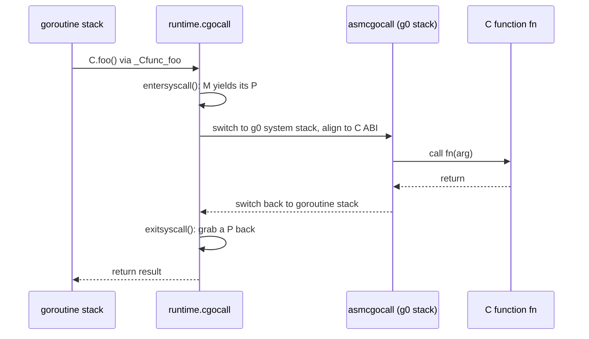

# 15.6 cgo

"cgo is not Go." This is the verdict Rob Pike handed down on cgo in a blog post. It names a thing that is easy to overlook: when you write `import "C"` in a Go source file and then write a single line of `C.foo()`, you have already stepped out of the world that the Go language drew for you and into another world, one made of C's ABI, C's stack, and C's memory model. cgo is the bridge between these two worlds. The bridge is useful, but crossing it costs a toll, and the toll is not cheap.

This section does not translate `runtime/cgocall.go` line by line. It answers three questions: why calling a C function from Go is one or two orders of magnitude more expensive than calling a Go function; what the runtime actually does for this one crossing; and where the rule "a Go pointer must not be held by C for long" comes from. Once you have read it, the weight of "cgo is not Go" becomes concrete.

## 15.6.1 The Gap Between Two Worlds

To understand the cost of cgo, we first need to see how different the two ends of the bridge are. Go and C go their own way on four fundamental things.

**The calling convention differs.** Go has its own register-based calling convention ([2.2](../../part1overview/ch02asm/callconv.md)). How arguments and return values are passed, how stack frames are laid out, which registers are saved by the caller, all of these are inconsistent with C's ABI on the platform. A cross-world call must first rearrange the arguments according to C's ABI and align the stack pointer to the boundary C requires.

**The stack differs.** A goroutine stack in Go is **growable** ([14](../../part4memory/ch14stack)). It starts at only a few KB and relies on the stack check the compiler inserts at function entry to copy and relocate the whole stack when needed. A C function knows nothing about this. It assumes it runs on a fixed, large enough system stack that will never be moved. Letting C code run on a small goroutine stack that may be moved at any moment would be catastrophic, so before crossing we must switch to the M's system stack `g0`, a stack that the operating system allocates and that neither grows nor relocates.

**Memory management differs.** Go has a precise garbage collector. It **moves** objects, **reclaims** objects that are no longer reachable, and relies on type information to scan every pointer. C's memory is managed by hand with `malloc`/`free`, completely opaque to the GC. The GC cannot scan memory held by C, and it cannot know that a Go object is being referenced by some piece of C code.

**The scheduler is blind.** Go's scheduler ([9](../../part3concurrency/ch09sched)) orchestrates concurrency across M, P, and G. It can preempt a goroutine, and it can unbind a blocked M from its P so that another M can take over the P. But once control is handed to C, the scheduler can no longer "see" this stretch of execution: it cannot preempt a thread running inside C, and it cannot have the Go stack on that thread scanned.

These four gaps together mean that a single cgo call is not a simple "jump to another function address" but a crossing that requires a **complete state transition**.

## 15.6.2 What a Single cgo Call Does

The compiler has paved the approach to the bridge for you. When you write `C.foo()`, the cgo tool generates a Go wrapper function `_Cfunc_foo`, which routes the call through `//go:linkname` to the runtime's `runtime.cgocall`, passing along the real C function entry address together with the argument frame. The runtime handles the rest of the crossing, centered on the pair `cgocall` and the assembly-written `asmcgocall`:

```go
// runtime/cgocall.go: calling C from Go (a trimmed sketch)
//go:nosplit
func cgocall(fn, arg unsafe.Pointer) int32 {
    mp := getg().m
    mp.ncgocall++ // accounting: cumulative cgo calls on this M

    // Declare entry into the "syscall" state: detach the current M from its P
    // in the accounting, so the scheduler can spin up another M to run other
    // goroutines, and so this call falls outside the $GOMAXPROCS count (see 9.5)
    entersyscall()

    mp.incgo = true
    mp.ncgo++ // mark: there is a C frame on this call stack right now

    // Switch to the g0 system stack, align to C's ABI, and actually call fn(arg)
    errno := asmcgocall(fn, arg)

    mp.incgo = false
    mp.ncgo--

    // Back in the Go world: block until we can resume running Go without
    // violating $GOMAXPROCS
    exitsyscall()

    // Prevent the GC from mistaking still-needed arguments for dead during the
    // "time rewind" window
    KeepAlive(fn)
    KeepAlive(arg)
    return errno
}
```

`asmcgocall` (in `asm_$GOARCH.s`) does the thing that Go cannot express in Go: it saves the current goroutine's stack pointer, switches the execution stack to `m.g0`, aligns the stack to C's ABI, calls `fn`, and after C returns switches the stack back to the original goroutine (`m.curg`) and restores the scene. It is deliberately written to not grow the stack and not allocate memory, because at this moment the M is, in the accounting, in the "in a syscall" state, and doing either of those two things is unsafe. Strung together, the whole path looks like this:



The reverse direction (C calling back into Go) follows the dual path `crosscall2` -> `_cgoexp_GoF` -> `cgocallback` -> `cgocallbackg`: it switches from the `g0` stack back to the real goroutine stack, has `exitsyscall` grab a P back, runs the Go callback to completion, and then `entersyscall` switches back. It does each of the steps above in reverse, which makes it more expensive. We will not unfold it here. The point is this: **the bridge can be crossed in both directions, but each direction pays one full transition fee**.

## 15.6.3 Why It Is Expensive

Once the steps above are spread out, the cost is plain. An ordinary Go function call, when fast, is just a `CALL` instruction plus a few pushes onto the stack. A cgo call must, at minimum: have `entersyscall` detach the M from its P and rewrite the scheduling state, save and switch the stack pointer, realign and rearrange the arguments according to C's ABI, make the call, after the return have `exitsyscall` compete for a P again (and block or spin if it cannot get one), and then restore the goroutine stack. Taken as a whole, the cost is usually **one or two orders of magnitude** that of a Go call. The exact numbers float with platform and load, but the gap in magnitude is structural and cannot be removed.

The cost is not limited to the fixed overhead of a single call. Two deeper costs come from the four gaps above:

- **A blocking C call ties up a whole thread.** The Go scheduler cannot see into C and cannot preempt a thread stuck inside C. If this C call blocks (for example, doing synchronous I/O or waiting on a lock), the M carrying it is pinned, and the scheduler can only create another M to take over its work on the P. A large number of concurrent blocking cgo calls will make the thread count balloon.
- **C memory is invisible to the GC.** The GC cannot scan into memory allocated on the C side, and it cannot move a Go object currently referenced by C. This constraint grows directly into the pointer rules of the next section.

From this we get the boundary of where cgo is appropriate: it suits **few, coarse-grained** calls, handing a complete piece of work over to the C side as a whole (one call does a lot), and it is **deeply unsuited** to being placed in a hot, fine-grained loop that crosses the boundary over and over. If you find yourself in a tight loop calling `C.something()` on every iteration, that is almost certainly the wrong place for the design: either move the loop to the C side and call it once as a whole, or do not use cgo at all.

## 15.6.4 The Engineering Cost: This Is the Whole of "is not Go"

Performance is only half the bill. Introducing cgo also takes away several of the most reassuring things in the Go toolchain. This part of the cost does not show up on a flame graph, yet it is with you every day.

Building a pure Go program needs only the Go toolchain itself; cgo requires a working **C compiler** on the target platform. This single requirement breaks several of Go's signature features in a chain. The default **static linking** is no longer a given (linking C libraries often pulls in dynamic dependencies); **cross-compilation** degrades from "set an environment variable" to "prepare a whole C cross-toolchain for the target platform"; builds get **slower**, because gcc/clang must be invoked additionally to compile the C side; and **deployment becomes complex**, since the binary may depend on a specific version of a shared library on the target machine. The deployment ease that Go originally bought with static, fast, cross-compilable builds, cgo hands all of it back.

So "cgo is not Go" is not just a reminder about performance. It says: the moment you `import "C"`, your project no longer fully enjoys the set of properties that the Go language, together with its toolchain, promised. The runtime is one or two orders of magnitude slower, and the build loses static and cross-compilation. That is the whole weight of the phrase.

## 15.6.5 The Pointer-Passing Rules

Of the four gaps, the one that says "the GC moves and reclaims objects" gives rise to the set of rules in cgo that is easiest to trip over and most worth committing to memory. They all stem from one fact: **Go objects are not managed by C, and the GC may move or reclaim them at any time**. The official `cmd/cgo` documentation defines the rules in fine detail; at their core are two sentences:

1. **C must not hold a Go pointer after the call returns**, unless that memory is pinned by a `runtime.Pinner`. A Go pointer passed in during the call is "implicitly pinned" and can be used safely; but once the C function returns, the GC regains its freedom to move or reclaim it, and the copy of the pointer stored on the C side becomes a dangling reference.
2. **The block of Go memory passed to C must not itself contain a pointer to unpinned Go memory.** For example, you may hand C a `*C.int` or a span of pointer-free Go memory, but you must not pass an entire struct that has a Go pointer embedded inside it.

Why these two and not others? Because the GC's precise scanning depends on type information, which holds only on the Go side. Once C has the pointer, any operation that "stores it into a C struct and dereferences it a while later" is unknowable to the GC, which therefore cannot update it in sync when it moves the object. The second rule is the recursive version of the first: even if the outer pointer you pass over behaves, as long as the memory it points to **hides** another Go pointer inside, that inner pointer is just as much held indirectly by C, and just as uncontrollable.

This set of rules is enforced dynamically at the call boundary by the runtime's **cgocheck**. The wrapper code that cgo generates inserts `cgoCheckPointer`, which recursively scans the argument before handing it to C; the moment it finds "a Go pointer pointing to an unpinned Go pointer" it `panic`s on the spot, turning a hidden GC-corruption problem into a crash you can see right away. The strength of the check can be tuned with `GODEBUG=cgocheck=...`.

When you really do need a block of memory whose **lifetime spans the call and is held by C for the long term**, the right move is not to fight the checker but to put the memory somewhere the GC cannot reach:

```go
// Anti-pattern: C holds a Go pointer after returning; the GC may move buf's
//               backing array, and C's copy of the pointer is left dangling
buf := make([]byte, 1024)
C.register_callback_buffer(unsafe.Pointer(&buf[0])) // dangerous

// Correct way one: allocate with C.malloc; this memory is outside the GC's
//                  view, can be held by C for the long term, free it
//                  explicitly with C.free when done
p := C.malloc(1024)
defer C.free(p)
C.register_callback_buffer(p)

// Correct way two: to hand a Go object to C for long-term reference, pass a
//                  "handle" rather than a raw pointer; use cgo.Handle to swap
//                  the object for an integer token, C stores the token, and
//                  the callback retrieves the object again via the token
h := cgo.NewHandle(myGoObject)
C.register_with_token(C.uintptr_t(h)) // the C side stores only this integer
// ... in the callback: v := h.Value(); call h.Delete() when done
```

`C.malloc` moves the memory out of the GC's jurisdiction, at the cost of you being responsible for `free` yourself, with Go's memory safety no longer holding on this block. `cgo.Handle` (introduced in Go 1.17) is more elegant: it does not expose the pointer to C but gives C an opaque integer token, while the Go side maintains the mapping from token to object. This lets C "reference for the long term" a Go object without violating any pointer rule. If all you need is to pin a block of Go memory during a single call to prevent the GC from moving it, `runtime.Pinner` (introduced in Go 1.21) is the lighter choice.

## 15.6.6 When to Use It, When to Route Around It

Let us gather the trade-offs of the preceding sections into a decision table:

| Scenario | Leaning | Reason |
|---|---|---|
| Reuse a mature, large C library (such as SQLite, libgit2, a video codec) | Use cgo | The cost of rewriting far outweighs the crossing overhead, and the calls are coarse-grained |
| Occasionally calling a system-level C API once | Use cgo | Calls are sparse, the fixed overhead can be amortized |
| A fine-grained loop in a performance hot spot | Route around it | The crossing overhead drowns the benefit; consider a pure Go rewrite or sinking the whole loop into C |
| Pursuing static linking, cross-platform cross-compilation, fast builds | Route around it | cgo takes away these three toolchain features (see [15.6.4](#1564-the-engineering-cost-this-is-the-whole-of-is-not-go)) |
| High concurrency where C calls may block | Be cautious | Each blocking call ties up a thread, and the thread count balloons easily |

A plain rule of thumb: **first ask whether you can avoid cgo**. Many capabilities in the Go ecosystem that were once implemented with C libraries now have mature pure Go alternatives (database drivers, compression, encryption, and image processing often have pure Go implementations), and using them preserves the properties of the entire toolchain. Only when the value of the C library is truly irreplaceable and the call pattern is naturally coarse-grained is the toll for crossing the bridge worth paying.

cgo, like escape analysis ([15.5](./escape.md)) and the pointer checker ([15.4](./unsafe.md)), is a controlled opening that the compiler and runtime collaborate to cut in Go's safety boundary. It sews the world of Go together with the world of C, and every stitch at the seam is a cost: of performance, of memory safety, of engineering. Only by understanding where these costs come from can you judge whether this opening is worth cutting, and how wide.

## Further Reading

1. The Go Authors. *Command cgo.* https://pkg.go.dev/cmd/cgo
   (The authoritative definition of cgo usage and the "Passing pointers" pointer-passing rules)
2. Andrew Gerrand. *C? Go? Cgo!* The Go Blog, 2011.
   https://go.dev/blog/cgo (An introduction to cgo and its design intent)
3. Rob Pike. *cgo is not Go.* https://dave.cheney.net/2016/01/18/cgo-is-not-go
   (A classic discussion and retelling of cgo's engineering cost)
4. The Go Authors. *runtime/cgocall.go.*
   https://github.com/golang/go/blob/master/src/runtime/cgocall.go
   (The implementation of `cgocall`/`asmcgocall`/`cgocallbackg` and cgocheck)
5. The Go Authors. *runtime.Pinner.* https://pkg.go.dev/runtime#Pinner
   and *runtime/cgo.Handle.* https://pkg.go.dev/runtime/cgo#Handle
   (The two supported techniques for holding a Go object for the long term)
6. This book, [2.2 Calling Conventions](../../part1overview/ch02asm/callconv.md),
   [9.5 Thread Management](../../part3concurrency/ch09sched/thread.md),
   [15.4 The Pointer Checker](./unsafe.md), [15.5 Escape Analysis](./escape.md).
