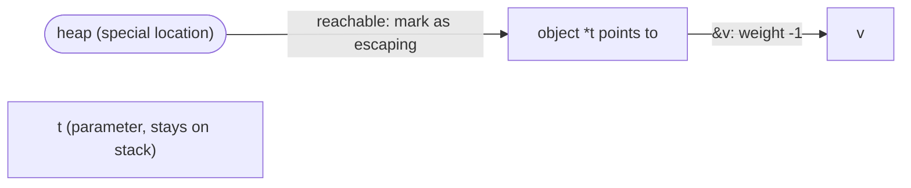

# 15.5 Escape Analysis

Go programmers never manually decide whether a variable lives on the stack or the heap; the compiler's **escape analysis** does it automatically. It is the unsung hero of Go's performance: keeping as many objects on the stack as possible greatly lightens the load on the garbage collector ([13 Garbage Collection](../../part4memory/ch13gc)). This section explains how it decides, how it is implemented, and why it matters.

## 15.5.1 Escape: Deciding Stack or Heap

The core question: should a variable be allocated on the **stack** (vanishing automatically when the function returns, at zero GC cost) or on the **heap** (with an indefinite lifetime, managed by the GC)? The criterion is **lifetime**: if a reference to a variable may still be used after the function returns, it cannot live on the stack (the stack frame is destroyed on return) and must **escape** to the heap. Escape analysis answers this question statically, deciding whether a variable's address can leave the scope of the function it lives in.

`go/cmd/compile/internal/escape` states this as two invariants that must be maintained: (1) a pointer to a stack object **must not be stored into the heap**; (2) a pointer to a stack object **must not outlive that object**, for example when the function that declared it has already returned and the stack frame is destroyed, or when the same stretch of stack space is reused across different iterations of a loop for logically distinct variables. If a variable's address could possibly violate either rule, it is judged to escape and is moved to a heap allocation.

The most direct way to observe this is `go build -gcflags=-m`, which makes the compiler print every escape decision. Feed it the following (add `-l` to turn off inlining, so the output focuses on escape itself):

```go
func ret() *int { x := 42; return &x } // return the address of a local variable
```

```
$ go build -gcflags='-m -l' demo.go
./demo.go:1:18: moved to heap: x
```

`x` started as an ordinary local variable, but its address is carried out of the function by `return`. The pointer the caller obtains must remain valid after `ret` returns, so `x` is moved to the heap. This is the most typical kind of escape: `return &x`.

## 15.5.2 Typical Escape Scenarios

Escape has only one root cause: an address leaks to somewhere that lives longer than the current function. But it wears several different faces in code, and each is worth recognizing.

The first kind: **the address is stored into a longer-lived structure**. Assigning a local variable's address to a field of an object with a longer lifetime lets that address live on with that object:

```go
type T struct{ p *int }

func store(t *T, v int) { t.p = &v } // the address of v is written into the object t points to
```

```
$ go build -gcflags='-m -l' demo.go
./demo.go:3:12: t does not escape
./demo.go:3:18: moved to heap: v
```

`t` itself is only read and written, never leaked, so it "does not escape" and can stay on the stack; but `v`'s address is written into `*t`, and `*t` may outlive `store`, so `v` escapes.

The second kind: **passed to an `interface{}` parameter** ([4.2](../../part2lang/ch04type/interface.md)). When a value is boxed into an interface, the compiler often cannot statically determine where the methods behind the interface will route this pointer, so by the conservative principle it can only let the value escape. The most common case is the `fmt.Print` family:

```go
fmt.Fprint(w, devnull{}, "hi")
```

```
./demo.go:10:20: devnull{} escapes to heap
./demo.go:10:24: "hi" escapes to heap
```

The boxed arguments "escape to heap". This also explains a phenomenon that puzzles beginners: a single innocent-looking `fmt` print can quietly push a value that could have stayed on the stack into the heap. A pointer flowing through the interface, an unanalyzable path, corresponds exactly to the interface dynamic dispatch discussed in [4.2](../../part2lang/ch04type/interface.md).

The third kind: **captured by a closure, where the closure itself is passed out** ([6.1](../../part2lang/ch06func/func.md)). A closure captures outer variables by reference, so if the closure escapes the function that declared it, the captured variables naturally have to escape with it:

```go
func counter() func() int {
	n := 0
	return func() int { n++; return n } // the closure is returned, and it holds n
}
```

```
./demo.go:3:2: moved to heap: n
./demo.go:3:9: func literal escapes to heap
```

The closure shows `func literal escapes to heap`, and the captured `n` is then `moved to heap`. If the closure were only called in place within the function and never passed out, `n` could still stay on the stack.

There is another kind tied to compile-time information: an allocation whose **size is unknown at compile time or too large** also escapes, because the stack frame size must be fixed at compile time and cannot hold an object whose size is only known at run time:

```go
buf := make([]byte, 64) // size known and not leaked: stays on the stack
s := make([]byte, n)    // n is only known at run time: escapes
```

```
./demo.go:1:13: make([]byte, 64) does not escape
./demo.go:2:11: make([]byte, n) escapes to heap
```

Conversely, a local variable used only within the function, whose address never leaks, is confidently left on the stack by the compiler. The entire basis for the decision is whether the address has a flow path leading to "somewhere that lives longer".

## 15.5.3 How It Works

Escape analysis is fundamentally a **static data-flow analysis** over the AST. For each function the compiler builds a directed weighted graph: the vertices are called **locations**, representing variables allocated by statements or expressions (including the implicit allocations from `new`, `make`, and composite literals); the edges represent assignments, flowing the value of one location to another.

The **weight** of an edge records how many layers of "address-of / dereference" this assignment passes through, expressed as the number of dereferences minus the number of address-of operations. The examples in the source are straightforward:

```
p = &q    // weight -1 (one address-of)
p = q     // weight  0
p = *q    // weight +1 (one dereference)
p = **q   // weight +2
```

Address-of can only be applied to an addressable expression, and `&x` itself is not addressable, so the weight never goes below $-1$. Once the graph is built, the compiler starts from the special "heap" location, traverses the edges, and looks for assignment paths that might violate the two invariants of §15.5.1: if a variable's address ultimately flows along the graph to somewhere that will outlive the current function (a return value, a global variable, an object stored into the heap, an escaping parameter, and so on), it is marked as needing heap allocation.

Take §15.5.2's `func store(t *T, v int) { t.p = &v }` as an example. The graph has three relevant locations: the parameter `t`, the parameter `v`, and the special "heap" location. The assignment `t.p = &v` connects an address-of edge (weight $-1$) between "the object `t` points to" and `v`; and `t`, as a parameter that may point to a heap object, is itself connected to "heap". Traversing the edges from "heap" can reach `v` by way of `t`, so `v`'s address is judged to flow to somewhere longer-lived and `v` is marked as escaping; `t` itself is only read and written, never leaking its own address, so it stays on the stack. Whether something is reachable from "heap" is precisely the criterion for escape:



To analyze across functions, the compiler summarizes a **parameter tag** for each function's parameters, recording where that parameter flows. The source expresses this with a compact `leaks` value, which for each parameter records the minimum number of dereference layers to each class of destination:

```go
// leaks: a summary of where a parameter flows (heap / mutated object / callee / the i-th return value) (sketch)
type leaks [8]uint8

func (l leaks) Heap() int      // minimum dereference layers to the heap, or -1 if none
func (l leaks) Result(i int) int // layers to the i-th return value
```

So a function that passes a pointer straight through gets tagged with "parameter flows to return value":

```go
func passthrough(p *int) *int { return p }
```

```
./demo.go:1:18: leaking param: p to result ~r0 level=0
```

`leaking param: p to result` is the human-readable version of this tag. Once a call site has the callee's tag, it can determine whether the argument will escape because of this call without diving back into the function body, which gives escape analysis cross-function precision while keeping a single-pass, linear cost.

The soul of this analysis is being **conservative**. When the compiler **cannot determine** whether a pointer escapes (typically when the pointer flows through an interface, or through an untagged indirect call), it always chooses "escape rather than not" and puts the object on the heap. The reason is asymmetric: putting it on the heap is always safe (the GC backs it up), while wrongly putting it on the stack leaves a **dangling pointer**: once the stack frame is destroyed, that address points to garbage. There is only one safe direction, and the analysis falls back toward it. The cost is precision: the coarser the analysis, the more objects that could have stayed on the stack are wrongly pushed into the heap; the finer the analysis, the more short-lived objects can safely remain on the stack. The evolution of escape analysis over the years has mostly been about grinding its precision a little higher without breaking conservatism.

## 15.5.4 Two Faces of the Same Constraint as Contiguous Stacks

Why must escape analysis be this strict? The answer lies in the implementation of the stack. Go's stack is a **contiguous stack** ([14.4](../../part4memory/ch14stack)): the stack grows and can be relocated as a whole to a new address, and when it moves the runtime walks and rewrites every pointer on the stack that points into the stack. This mechanism only works on one condition: that the address of a stack object is referenced only from within the stack, so the runtime knows where to find them and how to fix them. Once a stack address is held long-term by something external (a heap object, a global variable, another goroutine), then when the stack moves that external reference points to the wrong place, and the runtime has no way to know about it or correct it.

So contiguous stacks lay down an iron rule for escape analysis: **any address that will be held long-term by something external must escape to the heap**. Heap addresses are stable and do not move with the stack. Escape analysis and stack management are therefore two faces of the same constraint: the former screens out the objects that "will be held externally" at compile time and drives them into the heap, so that the latter can confidently relocate the remaining stack at run time. The two invariants of §15.5.1 are, in essence, the sufficient conditions for "making contiguous stacks work".

## 15.5.5 Why It Matters So Much

Escape analysis is the key to Go "enjoying the convenience of GC without being dragged down by it". It **digests a large number of short-lived objects** at compile time, so they never enter the heap and never trouble the GC. Stack objects disappear in batches when the function returns, and both allocation and reclamation cost approach zero; whereas every object that reaches the heap must be marked and swept by the GC. Keeping short-lived objects on the stack directly cuts the GC's workload.

This is exactly why [13.8](../../part4memory/ch13gc/generational.md) says "escape analysis weakens the gains from the generational hypothesis". The dividend of generational GC comes from "the vast majority of objects die young", but in Go many of these "die young" objects have already been kept on the stack and digested by escape analysis at compile time, never reaching the heap. By the time Go actually lands generational collection, a large share of the dividend it could otherwise extract has already been eaten in advance by escape analysis. This is a concrete example of two mechanisms influencing each other.

For programmers, escape analysis amounts to a real craft: **writing code that "keeps pointers from escaping" can significantly reduce GC pressure**. Common techniques include avoiding unnecessary returns of pointers, reusing buffers instead of allocating over and over (the `sync.Pool` of [11.6](../../part3concurrency/ch11sync/pool.md)), and being careful about the implicit escape caused by `interface{}` boxing. To check whether you got it right, use `-gcflags=-m` to verify each spot; it is the only reliable yardstick for this craft, better than any intuitive guess.

But there is no need to fret over it. Escape analysis does a good job most of the time, and twisting code into "never escapes" is often not worth it, sacrificing readability for what may be a single allocation that is not even on the hot path. The right order is measure first, then tune: only when the profiler ([16 Tools and Observability](../ch16tools)) points to allocation as a genuine bottleneck is it worth taking `-gcflags=-m` to optimize spot by spot ([16.5](../ch16tools)). A compiler analysis that lets programmers "barely think about stack versus heap, yet step in when needed" is another expression of Go's philosophy of "carefree by default, controllable when needed".

## Further Reading

1. The Go Authors. *cmd/compile/internal/escape (escape analysis implementation: data-flow graph, parameter tags, solving).*
   https://github.com/golang/go/tree/master/src/cmd/compile/internal/escape
2. The Go Authors. *Frequently Asked Questions: Is a variable allocated on the stack or the heap?*
   https://go.dev/doc/faq#stack_or_heap
3. The Go Authors. *cmd/compile/internal/escape/leaks.go (the definition of the parameter-flow tag `leaks`).*
   https://github.com/golang/go/blob/master/src/cmd/compile/internal/escape/leaks.go
4. This book, [13 Garbage Collection](../../part4memory/ch13gc) and
   [13.8 The Generational Hypothesis](../../part4memory/ch13gc/generational.md) (why escape analysis weakens the generational dividend).
5. This book, [14.4 Contiguous Stacks](../../part4memory/ch14stack) (the stack moves, so externally held addresses must escape).
6. This book, [15.3 The Optimizer](./optimize.md) (where escape analysis sits in the compilation pipeline) and
   [16.5 Performance Profiling](../ch16tools) (measure first, then tune).
