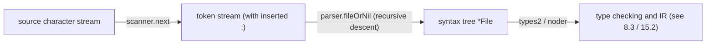

# 15.1 Lexing and Grammar

The first stop of compilation is turning source text into a structured **abstract syntax tree** (AST). This takes
**lexical analysis** (slicing a character stream into tokens) and **syntactic analysis** (organizing tokens into a tree
according to the grammar). [3.2](../../part1overview/ch03life/compile.md) surveyed the whole pipeline from above; this
section looks only at its front end, and at why Go's grammar was designed to be so "easy to parse".

The package that carries out these two steps is a self-contained part of the compiler, `cmd/compile/internal/syntax`. It
is built from two instruments: the **scanner** reads characters and emits a token stream; the **parser** consumes tokens
in a **recursive descent** fashion and builds the syntax tree. The package's own comments even note with some pride that
several of its files, `scanner.go`, `source.go`, and `tokens.go`, do not depend on the rest of the compiler and can be
compiled on their own into a standalone library. The reason lexing and grammar can be carved out this cleanly lies in the
simplicity of the Go grammar itself.

## 15.1.1 A Grammar Designed for Fast Parsing

Go's grammar is **deliberately designed for fast parsing** (the obsession with compile speed in
[1.1](../../part1overview/ch01intro/history.md)). The key point is this: it is **regular enough to be parsed by LALR(1)**,
so it needs no complicated backtracking. The early gc compiler in fact parsed Go by feeding an LALR(1) grammar (`go.y`)
to yacc, and the very existence of that grammar is evidence that "Go's grammar can be parsed in a single, deterministic
pass". Put another way, to parse a piece of Go code the compiler reads the token stream once and only looks at the one
token in front of it to decide how to proceed, without ever backing up to retry and without consulting the symbol table
mid-parse.

This stands in sharp contrast to C/C++. In C's grammar, whether `a * b;` means "`a` times `b`" or "declare a pointer
`b` to type `a`" depends on whether `a` is a type name at that moment, and that can only be known by consulting the
symbol table. Parsing and semantics are thus entangled, and C++ on top of this carries the famous *most vexing parse*:
`Widget w(Thing());` is parsed as a function declaration rather than an object construction. Go's grammar deliberately
avoids ambiguities of this kind: the structure of any sequence of tokens is uniquely determined by the grammar,
independent of what the names mean. The parser is therefore both fast and simple, and never has to feed type information
back to the scanner.

The gc compiler today does not actually run yacc. Around 2015 (the Go 1.6 / 1.7 development cycle), the compiler replaced
the yacc-generated parser with a **hand-written recursive descent parser**, which is the present `syntax` package. There
were two motivations: a hand-written parser is faster, and it can produce **error messages far better than yacc's**
(yacc's `syntax error` is nearly impossible to localize). The yacc grammar proved that Go is LALR(1), and gc, for
engineering reasons, chose recursive descent to cash in on that parsability. The two are not in conflict: the **property**
of the grammar is LALR(1), and the **technique** that realizes it is recursive descent. For this piece of evolution, see
[15.1.4](#1514-from-token-to-ast).

## 15.1.2 Automatic Semicolon Insertion

Go's most famous lexical detail is **automatic semicolon insertion**. Like C, Go's grammar terminates statements with
semicolons, yet readers almost never write semicolons by hand, because the scanner inserts them for you by rule. The
rules are surprisingly simple, just two of them (see the *Semicolons* section of the language specification):

1. When the **last token** of a line is one of the following, the scanner inserts a semicolon after that token, before
   the newline: an identifier; an integer, floating-point, imaginary, rune, or string literal; the keywords `break`,
   `continue`, `fallthrough`, `return`; the operators `++`, `--`; and the closing brackets `)`, `]`, `}`.
2. To allow complex statements to be written on a single line, the scanner omits a semicolon before a closing `)` or `}`.

The implementation of this rule set in the scanner is clean enough to need just one boolean flag, `nlsemi`:

```go
// scanner: the lexer (a trimmed sketch)
type scanner struct {
    source
    nlsemi bool // when set, '\n' and EOF are translated into ';'
    tok    token
    lit    string
    // ...
}

func (s *scanner) next() {
    nlsemi := s.nlsemi
    s.nlsemi = false
    // skip whitespace; but if the previous token set nlsemi, '\n' is no longer skipped as whitespace
    for s.ch == ' ' || s.ch == '\t' || s.ch == '\n' && !nlsemi || s.ch == '\r' {
        s.nextch()
    }
    switch s.ch {
    case '\n':       // here nlsemi must be set (otherwise it was skipped above), translate to semicolon
        s.nextch()
        s.lit = "newline"
        s.tok = _Semi
    // ...
    }
}
```

Each time it recognizes a token, the scanner sets `nlsemi` along the way: the `setLit` that recognizes a literal sets
`s.nlsemi = true` directly; reading a closing symbol such as `)` `]` `}` sets it true as well; and reading a keyword uses
a bit set to decide whether the token belongs to `{break, continue, fallthrough, return}`. The next time `next()` meets a
newline, it translates that newline into a semicolon token rather than whitespace. Rule one and rule two both come down to
the single switch of "when is `nlsemi` true". There is no separate "semicolon inserter"; it is one boolean bit inside the
lexer's main loop. A multi-line block comment appearing where a semicolon would be inserted is also treated as a newline
and triggers insertion; this corner case too is covered uniformly by this one flag.

Let us make it concrete. Two lines of source:

```go
x := f(a, b)
y := x + 1
```

The token stream the scanner emits is (with `⨟` marking the automatically inserted semicolons):

```
x  :=  f  (  a  ,  b  )  ⨟    // ) triggers rule one, a ; is inserted at the newline
y  :=  x  +  1  ⨟             // the literal 1 triggers rule one
```

Note that the newline inside the first line (if the line were wrapped after `f(a,`) does not get a semicolon, because
neither `(` nor `,` is in rule one's set, `nlsemi` is still false, and the newline is skipped as ordinary whitespace.
This is exactly why "function arguments may span multiple lines" while "the end of a statement is closed off
automatically".

## 15.1.3 Why `{` Cannot Start a New Line

Automatic semicolon insertion explains one of Go's seemingly arbitrary formatting constraints: the opening brace `{` must
follow the end of the previous line and cannot stand on a line of its own. Consider:

```go
func f()
{          // error
    // ...
}
```

By rule one, the line `func f()` ends with `)`, so the scanner inserts a semicolon after `)`. The parser therefore sees
`func f() ;` with the `{` only after that, and the function declaration is cut off right at the semicolon. The parser
then reports that precise error:

```
unexpected semicolon or newline before {
```

This error message comes straight from the `syntax` package's parser: when it meets a lone `{` at a position where a
top-level declaration is expected, and the previous declaration happens to be an "empty function declaration", it knows
the user put the `{` on the next line. A formatting rule whose root is not stylistic fussiness but the design of the
scanner: keeping `{` at the end of the line is meant to keep rule one from inserting a semicolon in front of it. With a
single lexical rule, Go gets the **only** brace style in the whole language, and along with it does away with every
argument about "whether the brace should go on its own line".

JavaScript's automatic semicolon insertion (ASI) is a mirror worth holding up. It too is driven by the lexical layer,
but its rules are elaborate and lean toward "fixing things after the fact", which leaves famous traps such as a `return`
standing alone on a line while the actual return value drops to the next line and is silently discarded. Go goes the
other way: the rules are pared down to two, and the constraint is **moved up front** to "`{` must be at the end of the
line", preferring to force a single format rather than leave a gray area. The same lexically driven semicolon, with a
completely different design stance.

## 15.1.4 From Token to AST

Once the scanner emits the token stream, the parser organizes it into an AST by recursive descent. The skeleton of
recursive descent is "each production of the grammar corresponds to one parsing function". The top-level grammar of a Go
source file is "a package clause, followed by some imports and top-level declarations", which in code is a dispatch loop
in the parsing entry point `fileOrNil`:

```go
// parse one source file (a trimmed sketch)
func (p *parser) fileOrNil() *File {
    f := new(File)
    if !p.got(_Package) {        // must begin with a package clause
        p.syntaxError("package statement must be first")
        return nil
    }
    f.PkgName = p.name()
    p.want(_Semi)                // the (automatically inserted) semicolon after the package clause

    for p.tok != _EOF {          // single-token lookahead dispatch, no backtracking
        switch p.tok {
        case _Import: p.next(); f.DeclList = p.appendGroup(f.DeclList, p.importDecl)
        case _Const:  p.next(); f.DeclList = p.appendGroup(f.DeclList, p.constDecl)
        case _Type:   p.next(); f.DeclList = p.appendGroup(f.DeclList, p.typeDecl)
        case _Var:    p.next(); f.DeclList = p.appendGroup(f.DeclList, p.varDecl)
        case _Func:   p.next(); /* funcDeclOrNil ... */
        default:      p.syntaxError("non-declaration statement outside function body")
        }
    }
    return f
}
```

`p.tok` is the current token, and `p.next()` advances by one. The whole parse decides which branch to take by looking at
just the one token `p.tok`, which is precisely "single-token lookahead, no backtracking" recursive descent. `importDecl`,
`constDecl`, and `funcDeclOrNil` each recurse further down, all the way to leaves like expressions and literals. The
shape of the entire front-end pipeline is therefore very short:



The AST that is built is a **faithful mapping** of the source structure: each node corresponds to a declaration,
statement, or expression somewhere in the source, and carries **position information** for later error reporting and
debug-information generation. This step does only the most basic syntactic correctness checks (whether brackets match,
whether the statement structure is legal) and **does no type checking**; whether `a * b` is multiplication or a
declaration is left for later to settle.

The parser must also **try not to give up** after an error. On meeting a syntax error, the parser does not exit at once;
instead it calls `advance` to jump to the next "synchronization point" (such as the next `_Import`, `_Const`, or `_Func`,
a token that starts a declaration) and resumes parsing there. This lets the compiler report several syntax errors in one
pass, rather than "fix one, compile once, then hit the next". The quality of error recovery was one of the main
motivations for switching from yacc to a hand-written parser back then.

The AST is the input to every later stage. Type checking (the types2 of
[8.3](../../part2lang/ch08generics/checker.md)) annotates types on it, resolves names, and reports type errors; after
that it is converted by the noder into the compiler middle end's own IR, then lowered to SSA
([15.2](./ssa.md)). The standard library's `go/parser` and `go/ast` are a separate, **parallel** implementation: they
were originally written for tools like `gofmt` and `vet`, of the same origin as the compiler's internal `syntax` package
but a different strain, which is why changing Go's syntax often means "changing it in two places".

## 15.1.5 The Reward of a Simple Grammar

Go places "simplicity of grammar" at a very high priority, and the reward shows on several fronts. **Fast compilation**:
parsing is the first step of compilation, and only if it is fast does the whole pipeline have any hope of being fast;
single-token lookahead, no backtracking, and no symbol-table lookups press this step down to nearly linear cost.
**Easy-to-write tools**: `gofmt`, `goimports`, and `gopls` ([16.7](../ch16tools/gopls.md)) all have to parse Go code, and
a simple, unambiguous grammar lets them build the AST both quickly and reliably, which is the invisible foundation of
Go's thriving tool ecosystem; a language that needs the symbol table to parse would have a far harder tool chain.
**Readability**: an unambiguous grammar also means that when a person reads code they are not puzzled over "how exactly
does this parse".

This confirms once more Go's values ([1.2](../../part1overview/ch01intro/go.md)): between "the expressiveness of the
language" and "simple, fast, and tool-friendly", it firmly chooses the latter. Automatic semicolon insertion, the
non-wrapping `{`, and the LALR(1) regularity of the grammar look like the lowest-level technical details, yet they come
from a single source, all products of the belief that "both machine and human should be able to read a line of Go
without ambiguity", and from that they have deeply shaped Go's compile speed, its tool ecosystem, and even the everyday
experience of writing it.

## Further Reading

1. The Go Programming Language Specification: *Lexical elements / Semicolons.*
   https://go.dev/ref/spec#Semicolons
2. The Go Authors. *cmd/compile/internal/syntax (scanner and parser).*
   https://github.com/golang/go/tree/master/src/cmd/compile/internal/syntax
3. The Go Authors. *cmd/compile/README (front-end overview of the compiler: the parsing phase).*
   https://github.com/golang/go/blob/master/src/cmd/compile/README.md
4. The Go Authors. *cmd/compile: remove yacc-based parser (2015, the migration from yacc grammar to hand-written recursive descent).*
   https://github.com/golang/go/commit/b5fe07710f
5. Scott Meyers. *Effective STL / the "most vexing parse".* (The classic discussion of C++ parsing ambiguity, contrasted with Go's unambiguous grammar.)
6. This book: [3.2 The Compilation Process](../../part1overview/ch03life/compile.md),
   [8.3 Type-Checking Techniques](../../part2lang/ch08generics/checker.md),
   [16.7 gopls](../ch16tools/gopls.md).
