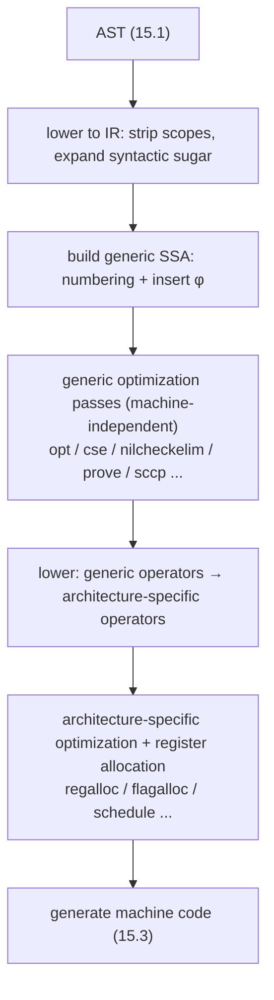

# 15.2 Intermediate Representation

[15.1](./parse.md) turned source code into a syntax tree (AST). The AST faithfully records the structure the programmer wrote down: variables, scopes, the nesting of expressions. But the moment we want to optimize, this structure sits too "high." Consider the most unremarkable line, `x = x + 1`: in the AST, the `x` on the left and the `x` on the right are the same name, and if the compiler wants to know "which assignment produced the value of the `x` used here," it has to repeatedly perform scope lookups and data-flow analysis. Names get shadowed, scopes nest, an assignment wipes out the old value, and all of this makes "where a value comes from and where it goes," which ought to be the most basic thing, murky. What the optimizer wants most is exactly to lay the data flow out in the open.

So between the AST and machine code, the Go compiler inserts a layer of **intermediate representation** (IR) made specifically for optimization. It first lowers the AST into a form closer to instructions yet still independent of any concrete machine, then converts it into the protagonist of this section: **static single assignment** (SSA) form. SSA is the nearly universal mid-level representation of modern optimizing compilers; LLVM, HotSpot's C2, and GCC's GIMPLE-SSA are all built on it. This section answers three questions: what SSA is, why it makes optimization direct, and how Go's SSA pipeline polishes a function all the way from "machine-independent" to "machine code generated for a specific architecture."

## 15.2.1 Static Single Assignment: Each Variable Is Assigned Only Once

The definition of SSA is a single sentence: **every variable in the program is assigned exactly once.** Once a name is assigned more than once, it gets numbered and split into several distinct versions. Returning to `x = 1; x = x + 1`, in SSA it becomes:

```
x_1 = 1
x_2 = x_1 + 1
```

The two assignments to `x` become `x_1` and `x_2`, two independent values each assigned only once. This step looks like a mechanical rename, but the benefit it brings is structural: when some later point uses `x_2`, its source is **unique and explicit**, namely the `x_1 + 1` above, with no scope lookup or data-flow inference needed. "Definition" and "use" are thus joined into an explicit graph (the use-def chain), and where a value comes from and who uses it is plain at a glance. Constant propagation, common subexpression elimination, dead-code elimination, and optimizations like them are at heart local rewrites on this graph; SSA demotes them from "requiring global analysis" to "rewriting against the graph."

The real difficulty appears where control flow merges. Consider a piece of code with branches:

```go
func abs(x int) int {
	var y int
	if x < 0 {
		y = -x
	} else {
		y = x
	}
	return y // which y is this?
}
```

The `y` used in `return y` is `-x` when the `if` is true and `x` when it is false. SSA requires each value to be defined only once, yet here two sources happen to merge at the same point. The solution is to introduce a special operator, the **φ function** (phi function): placed at the start of the merge block, it **selects** the corresponding version according to which predecessor edge control flow actually arrived on.

```
b_then:  y_1 = -x       // arriving from this edge, take y_1
b_else:  y_2 =  x       // arriving from this edge, take y_2
b_merge: y_3 = φ(y_1, y_2)   // merge: select y_1 or y_2 by the path taken
         return y_3
```

The φ function is SSA's only means of expressing control-flow-dependent data flow, and its soul. It corresponds to no real machine instruction; it is purely a notation telling the optimizer "the source of this value depends on which path was taken." Converting an ordinary piece of code into SSA comes down to two core tasks: numbering each assignment, and inserting φ functions at the appropriate merge blocks. Behind the word "appropriate" lies a classic algorithm based on the **dominance frontier**; Cytron et al. gave an efficient method for constructing it in their 1991 paper, so that φ is inserted only where genuinely needed, which is the foundational work that made SSA practical (see [Further Reading](#further-reading)).

It is worth reminding the reader that Go's SSA does not actually retain the concept of "variable name" internally. As the README of `cmd/compile/internal/ssa` says, SSA has no variables and no scopes; the `x_1` and `y_3` above are only mnemonic names written for the sake of explanation.

## 15.2.2 Go's SSA: Values, Blocks, and Memory

Down at the Go compiler's implementation, an SSA program is assembled from two levels of structure: **values** and **blocks**.

A **value** is SSA's basic unit. By the definition of SSA, a value is defined once but may be used any number of times. A value consists mainly of a unique identifier, an operator (`Op`), a type, and some arguments. The operator describes "how this value is computed," for example `Add8` takes two 8-bit integer arguments and yields their sum. Adding two `uint8`s looks roughly like this in SSA:

```
// var c uint8 = a + b
v4 = Add8 <uint8> v2 v3
```

Inside the angle brackets is the value's type, most of the time just a Go type. Note that values are named by a unique sequential ID (`v2`, `v4`); they rarely correspond to named entities in the source, which spares the compiler from maintaining a "name to value" map while still letting it trace any value back to the corresponding Go code via debugging and position information.

There is a class of types that do not come from Go but are specific to SSA, the most common of which is `memory`. It represents the **global memory state**. Every operator that reads or writes memory takes a `memory` value as an argument (depending on the current memory state) and produces a new `memory` value (representing that it has changed the memory state). This chain threaded through `memory` values is precisely how SSA pins down the ordering of memory operations:

```
// *a = 3
// *b = *a
v10 = Store <mem> {int} v6 v8 v1
v14 = Store <mem> {int} v7 v8 v10
```

The second `Store` takes `v10`, produced by the first, as its memory argument, so the two stores are locked into order by this dependency, and the optimizer will not reorder them. SSA hands control dependence to blocks and φ, and memory dependence to this memory chain; together they write all the constraints of data flow explicitly into the graph.

A **block** corresponds to a basic block in the control-flow graph; in essence it is a list of values plus a kind and a set of successors. The simplest is a `plain` block, which just hands control to its single successor; an `exit` block takes a memory state as its control value, corresponding to a function's return point; the most important is the `if` block, which carries a boolean control value and two successors, going to the first when the boolean is true and the second when it is false. Translating the `if` example from [15.2.1](#1521-static-single-assignment-each-variable-is-assigned-only-once) into Go's SSA, the skeleton is this:

```
// func(b bool) int { if b { return 2 }; return 3 }
b1:
    v1 = InitMem <mem>
    v6 = Arg <bool> {b}
    v8 = Const64 <int> [2]
    v12 = Const64 <int> [3]
    If v6 -> b2 b3
b2: <- b1
    v11 = Store <mem> {int} v5 v8 ...
    Ret v11
b3: <- b1
    v15 = Store <mem> {int} v5 v12 ...
    Ret v15
```

A **function**, in turn, consists of a name, a signature, the list of blocks making up the function body, and the single entry block among them. A function may have zero or more exit blocks (corresponding to a Go function's arbitrarily many `return` points), but it must have exactly one entry block.

## 15.2.3 The Pipeline: From Generic SSA to Machine Code

Having the program in SSA form is not enough; its value lies in "rewriting it being easy." The Go compiler organizes all optimization into a pipeline of **passes**, each of which takes an SSA function, improves it in some way, and by default runs once in sequence. The whole pipeline can be roughly divided into four stages:



The `passes` list in `cmd/compile/internal/ssa/compile.go` spells this pipeline out plainly; under go1.26 there are over fifty passes. A few representative ones:

- `opt`: applies the generic rewrite rules (detailed in the next section), the workhorse of local optimizations like strength reduction and constant folding, and it runs more than once in the pipeline (early/middle/late opt).
- `cse`: common subexpression elimination, merging multiple places that compute the same value into one. SSA's single-assignment property reduces "are two values equal" to "are the operator and arguments the same," which makes CSE especially easy to write.
- `nilcheckelim` / `prove`: removing provably redundant nil-pointer checks and bounds checks. `prove` maintains the range of values, and when it can prove `i` falls within `[0, len)`, the corresponding bounds check is eliminated.
- `sccp`: sparse conditional constant propagation, propagating constants along the use-def graph and trimming away unreachable branches along the way.
- `lower`: the pipeline's watershed, replacing machine-independent generic operators with an architecture's specific operators; from here SSA turns from "machine-independent" into "machine-dependent."
- `regalloc`: register allocation, assigning physical registers or stack slots to values, one of the backend's heaviest passes.

Placing optimization at the SSA layer is a considered choice. Lower than the AST, the data flow has already been laid out by SSA, and optimizations can rewrite against the graph directly; higher than machine code, the passes before `lower` are independent of any concrete instruction set, so one set of generic optimizations can serve all architectures, splitting off into each architecture's specific rules only after `lower`. This is precisely the dividend of "choosing the right intermediate layer": machine-independence lets optimizations be reused, data-flow-explicitness lets optimizations be simple, and SSA delivers both at once.

## 15.2.4 .rules: Declarative Rewrite Rules

Most passes in the pipeline are hand-written Go code, but one class (with `opt` and each architecture's `lower` as representatives) is **code-generated**. What generates them is a kind of **rewrite rule** with its own syntax, maintained collectively in `cmd/compile/internal/ssa/_gen/*.rules`. The shape of a rule is "the SSA pattern on the left => the SSA pattern on the right," optionally with an `&&` guard condition.

The most classic example is **strength reduction**: multiplying by a power of two can be replaced with a shift, and shifting is faster than multiplication. In go1.26's `_gen/generic.rules`, this optimization is declared in four lines (one each for bit widths 8/16/32/64):

```
// x * c, when c is a power of two, rewrites to x << log2(c)
(Mul64 <t> x (Const64 [c])) && isPowerOfTwo(c) && v.Block.Func.pass.name != "opt" =>
    (Lsh64x64 <t> x (Const64 <typ.UInt64> [log64(c)]))
```

It reads as: match a `Mul64` of "`x` times constant `c`," and when the guard `isPowerOfTwo(c)` holds (and we are not in the pass named `opt`, leaving it for a later stage to handle), replace the whole thing with an `Lsh64x64` that shifts left by `log64(c)` bits. **Bounds-check elimination** is written in the same declarative way; for instance, when "the index itself is some constant modulo," going out of bounds is necessarily false:

```
// the result of i % y must fall within [0, y), so IsInBounds is always true
(IsInBounds (Mod64u _ y) y) => (ConstBool [true])
(IsInBounds x x) => (ConstBool [false])
```

These rules are not interpreted. When the compiler is built, `_gen/rulegen.go` **compiles each rule into Go code**: the pattern on the left generates a series of nested `if`s (comparing operator, arguments, and guards layer by layer), and the right generates statements that construct the new value and rewrite the old one. They ultimately land in the auto-generated big files `rewritegeneric.go`, `rewriteAMD64.go`, and so on, and are called within the `opt` / `lower` passes. The operator table itself is the same, generated by `_gen/*Ops.go`. After changing rules or operators, run `go generate cmd/compile/internal/ssa` once to regenerate.

The trade-off of this "declarative rewriting" is clear. Its benefit is that simple optimizations are quick and intuitive to write, a rule being just one line of "what it looks like, what to turn it into," with no need for hand-written boilerplate to traverse and replace, and hundreds of rules collected together are readable and easy to review. Its boundary is equally clear: rewrite rules suit only **local optimizations whose patterns can be enumerated**, while an analysis like `prove` that needs to maintain global value ranges still has to be hand-written as a Go pass. Separating "declare what can be declared, hand-write only what cannot" is itself another victory of "choosing the right representation," the same engineering intuition as SSA choosing the right intermediate layer and as the [recurring runtime theme](../../part4memory/ch12alloc/component.md) of "using the right data structure": move a problem onto a representation that makes it simple.

## 15.2.5 GOSSAFUNC: Seeing the Pipeline Clearly

To get an intuitive feel for what each of the above steps does to a program, the most effective tool is `GOSSAFUNC`. Given the name of the function to observe, the compiler exports its SSA form **after every pass**, together with the final assembly:

```bash
GOSSAFUNC=abs go build
```

It generates an `ssa.html` in which each column corresponds to a compilation stage, ordered from the initial generic SSA all the way to the architecture SSA after `lower`, down to the generated assembly. Clicking a value or block highlights its associations, making it easy to trace along the use-def chain and the control flow. To verify whether the `x*8 => x<<3` from [15.2.4](#1524-rules-declarative-rewrite-rules) really happens, just compare the two columns before and after `opt` to see `Mul64` become `Lsh64x64`. GOSSAFUNC also supports package-qualified names (`GOSSAFUNC=pkg.Foo`), viewing the control-flow graph of only certain passes (`GOSSAFUNC="Foo:sccp,deadcode"`), and appending `+` to dump non-HTML text to standard output. Treat it as the workbench for reading the later sections of this chapter: every class of optimization discussed in [15.3 The Optimizer](./optimize.md) can be found in this table at the column before and after it takes effect.

## Further Reading

1. Ron Cytron, Jeanne Ferrante, Barry K. Rosen, Mark N. Wegman, F. Kenneth Zadeck.
   *Efficiently Computing Static Single Assignment Form and the Control Dependence Graph.*
   ACM TOPLAS 13(4), 1991. DOI: [10.1145/115372.115320](https://doi.org/10.1145/115372.115320)
   (The foundational paper on SSA construction and the dominance frontier.)
2. The Go Authors. *Introduction to the Go compiler's SSA backend (README).*
   `cmd/compile/internal/ssa/README.md`.
   https://github.com/golang/go/blob/master/src/cmd/compile/internal/ssa/README.md
3. The Go Authors. *Rewrite rules and code generation: `_gen/generic.rules`, `_gen/rulegen.go`, and the
   `passes` list in `compile.go`.* https://github.com/golang/go/tree/master/src/cmd/compile/internal/ssa/_gen
4. Keith Randall. *Generating Better Machine Code with SSA.* GopherCon 2015.
   (The design motivation and history of Go's introduction of the SSA backend.)
5. Steven S. Muchnick. *Advanced Compiler Design and Implementation.* Morgan Kaufmann, 1997.
   (A systematic textbook on SSA, data-flow analysis, and the various optimization passes.)
6. This book, [15.1 Lexical and Grammar](./parse.md) and [15.3 The Optimizer](./optimize.md).
