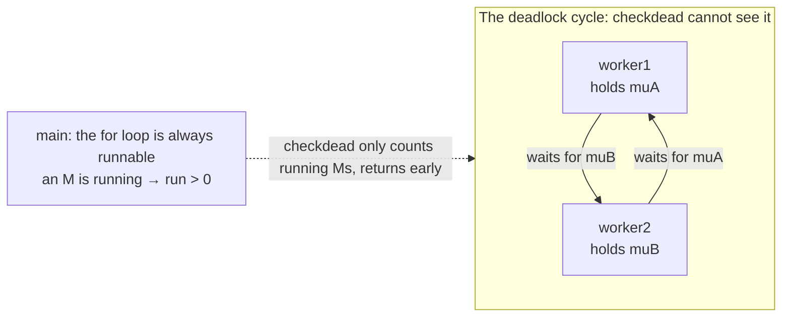

# 16.1 Runtime Deadlock Detection

`fatal error: all goroutines are asleep - deadlock!`, almost every Go programmer has seen this error. It
comes from the runtime's built-in deadlock detector. This section first makes clear how it decides and when
it fires, then turns to something more important: what it can guarantee in theory, and what it is
**structurally unable to detect**. The latter is the root of many production "hang" mysteries; understanding
it is worth more than memorizing that error message.

We state the conclusion first, then see how it follows from less than a hundred lines of code. The runtime's
deadlock detector does not maintain, and never inspects, a "who waits for whom" wait-for graph. It only asks
two very coarse questions: is any M still running? Will any timer fire in the future? If the answer to both is
"no", it declares a deadlock. This coarseness is not an oversight; it is precisely what fixes the detector's
boundary of capability. The second half of this section shows that, exactly because there are no per-resource
wait edges, the detector **cannot** find a deadlock cycle among a subset of goroutines.

## 16.1.1 The Criterion: Count Only Running Ms, Never Who Waits for Whom

The deadlock detection logic lives in `checkdead` in `runtime/proc.go`
([9.8](../../part3concurrency/ch09sched/sysmon.md)). Its criterion can be summed up in one sentence: **if no
thread is still running, and there is no way for any goroutine to become runnable again, the program is
deadlocked.** In code, "no thread is running" is a single subtraction: take the total number of machine
threads and subtract the various idle and system threads:

```go
// checkdead: decides whether a global deadlock has been reached (trimmed-down sketch).
// Must be called holding sched.lock.
func checkdead() {
    // When embedded into a host program as a c-shared / c-archive library, having no running
    // goroutine is normal; the host is still running. Cases like panicking and cgo extra Ms are
    // each exempted as well (omitted here).
    if (islibrary || isarchive) && GOARCH != "wasm" {
        return
    }

    // run = number of machine threads − idle Ms − locked idle Ms − system Ms, i.e. the count of
    // Ms currently running. run0 is usually 0 (1 when a cgo extra M exists). As long as some M is
    // still running, a global deadlock is impossible, so return immediately.
    run := mcount() - sched.nmidle - sched.nmidlelocked - sched.nmsys
    if run > run0 {
        return
    }
    // ... (see below)
}
```

Note that neither "lock", "channel", nor "WaitGroup" appears here. `checkdead` does not know, and does not
care, which primitive each goroutine is blocked on; it only counts how many Ms are still running. This is the
key to understanding all of its behavior.

When `run` is no greater than zero, no thread is indeed running anymore, it walks all goroutines once more to
do two things. First, a **consistency self-check**: since no M is running, there should be no goroutine left
in the runnable / running / syscall state, and if it finds one, the counts and states contradict each other,
so it `throw`s directly. Second, it counts the user goroutines that are genuinely waiting:

```go
    grunning := 0
    forEachG(func(gp *g) {
        if isSystemGoroutine(gp, false) {
            return // system goroutines (e.g. GC worker, sysmon offshoots) are not counted
        }
        switch readgstatus(gp) &^ _Gscan {
        case _Gwaiting, _Gpreempted:
            grunning++ // blocked and waiting: legitimate
        case _Grunnable, _Grunning, _Gsyscall:
            // no M is running, yet a runnable g remains: inconsistent counts, a runtime defect
            throw("checkdead: runnable g")
        }
    })
    if grunning == 0 {
        // not a single goroutine remains, usually because main called runtime.Goexit()
        fatal("no goroutines (main called runtime.Goexit) - deadlock!")
    }
```

At this point "all user goroutines are blocked" has been confirmed. But blocked does not mean deadlocked,
there is one last gate: **timers**. If any P's timer heap still has a timer waiting to fire, it will wake some
goroutine in the future, so this does not count as a deadlock:

```go
    // The playground's fake-time branch: if a goroutine is in Sleep, fast-forward time to the next
    // timer and wake it instead of reporting a deadlock (omitted here).

    for _, pp := range allp {
        if len(pp.timers.heap) > 0 {
            return // a timer will still fire, someone will wake in the future, not a deadlock
        }
    }

    unlock(&sched.lock)
    fatal("all goroutines are asleep - deadlock!")
}
```

The entire decision is two steps: "count the Ms" plus "scan the timers". It is concise to the point of being
stingy, and for that very reason it is reliable: anything that reaches that final `fatal` line must be a
genuine global standstill.

When `checkdead` is called is also worth a mention. It is not the result of periodic polling; it is called
when sysmon and templateThread start, and **whenever an M is about to become idle** (`mput`) or exits
(`mexit`). In other words, detection happens at the moment "the last M is about to stop", so once a global
deadlock forms it is reported almost immediately, rather than waiting for some polling cycle.

## 16.1.2 The Theoretical Frame: Sound but Incomplete

In the vocabulary of deadlock detection, `checkdead` is **sound** but **incomplete**. Let the program's true
deadlock state be $D$ and the detector's report be $R$; the relation between the two is:

$$
R \Rightarrow D \quad(\text{sound: a report is always true, no false positives}), \qquad
D \not\Rightarrow R \quad(\text{incomplete: a real deadlock is not always reported, there are misses}).
$$

Soundness shows up in the exemptions it sets for every situation where "no one seems to be running but in fact
is": when embedded as a c-shared / c-archive library (the host is still running), when panicking, when a cgo
extra M exists, and when a timer is still waiting to fire, it returns early. The sole purpose of these
exemptions is to avoid wronging a program that is not actually deadlocked. The price is incompleteness: it
lets a whole class of real deadlocks through, and the next section is about what it lets through.

This trade-off is deliberate on Go's part. Complete deadlock detection requires maintaining a per-resource
wait-for graph and periodically searching for cycles, which is not cheap; and a global deadlock is usually a
program logic error that should surface during development and testing. Go chooses to cover the most common
and most fatal case (the whole program stuck) with a near-zero-cost global check, and leaves the expensive
business of "cycle detection" to the programmer and external tools.

## 16.1.3 The Blind Spot: It Recognizes Only Global Deadlock, Not Local Deadlock

Since `checkdead` only counts running Ms, **as long as one M is still running, it returns immediately**. This
rule directly marks out its blind spot: it can only find a **global** deadlock, the case where **all**
goroutines are stuck. The moment only **some** goroutines deadlock against each other while others keep
running, `run > 0` holds, the detector turns around and leaves, blind to that local deadlock cycle. This is
not a matter of the implementation being inadequate; the criterion of "not looking at who waits for whom" is
structurally incapable of it: with no wait edges, there is no way to find a cycle within a subset.

The most classic local deadlock is acquiring two locks in reverse order (AB-BA). In the code below the main
loop is still cheerfully handing out work, while two workers deadlock against each other because they take the
locks in opposite order:

```go
var muA, muB sync.Mutex

func worker1() {
    muA.Lock()
    defer muA.Unlock()
    muB.Lock() // waits for worker2 to release muB
    defer muB.Unlock()
}

func worker2() {
    muB.Lock()
    defer muB.Unlock()
    muA.Lock() // waits for worker1 to release muA, each waits for the other: deadlock
    defer muA.Unlock()
}

func main() {
    go worker1()
    go worker2()
    for { // the main loop is always runnable: an M is running
        handle(<-requests)
    }
}
```

`worker1` and `worker2` are permanently stuck, but `main`'s for loop keeps at least one M running at all
times, so `checkdead` decides `run > 0` and says nothing. The program looks normal, new requests keep coming
in, and only those two goroutines never return while the locks and resources they hold leak permanently. This
is the root reason a class of failures like "the program did not crash, but some requests hang" is so hard to
diagnose: the built-in detector cannot help, its design dictates that it cannot see this.

Drawing this scene as a **wait-for graph** makes it obvious. Between `worker1` and `worker2` there is a
"hold-and-wait" cycle, which is exactly the deadlock; while `main` keeps running on some M, so the `run > 0`
that `checkdead` counts cannot see the cycle beside it:



No node in the cycle can move forward, the two wait for each other to release a lock; while `main` outside the
cycle keeps `run > 0` true forever. The detector only counts running Ms and never looks at the "who waits for
whom" edge, so it is blind to the cycle.

There is another kind of often-misunderstood "pseudo-deadlock": **all** goroutines are blocked, but some of
them are waiting on network I/O. Such a program is likewise never reported as deadlocked, and the mechanism is
in the scheduler's `findRunnable`: when there is no runnable work but there are network waiters, the scheduler
keeps one M running a **blocking `netpoll`** to wait for events to become ready, rather than parking it as an
idle M. So `run > 0` always holds and `checkdead` returns early. The reasoning behind this is the same as for
timers: a network event may wake someone in the future, so it cannot count as dead. Thus a program that purely
waits for external input that the other side never sends is not reported as deadlocked; it quietly waits
forever.

## 16.1.4 How Others Do It, and What to Rely On to Find Local Deadlock

Placing Go in this lineage makes its trade-off clearer. The JVM takes another route: at a thread dump
(`jstack` / thread dump) it builds a wait-for graph of locks and can directly report a cycle like "thread A
holds lock 1 and waits for lock 2, thread B holds lock 2 and waits for lock 1", naming even a **local** lock
deadlock. Databases go further: InnoDB and PostgreSQL detect cycles on the lock wait-for graph of
transactions, and once a cycle is found they proactively **abort one victim transaction** so the rest can
proceed. They all pay the runtime cost of maintaining a wait-for graph for "completeness". Go goes the
opposite way, doing the cheapest possible global check and pushing responsibility for the correctness of local
deadlock back to the programmer and external tools.

Since the built-in detector handles only global deadlock, local deadlock calls for another approach. A
**goroutine profile** (`pprof`'s goroutine profile, [16.5](./perf.md)) is the handiest weapon: it dumps the
current stack of every goroutine, letting you see "which goroutines are stuck on which line, waiting for
what". In the example above `worker1` and `worker2` are both stopped at a `Lock` call, and the cycle of mutual
deadlock is obvious. Execution tracing ([16.3](./trace.md)) and good logging help just as much. On prevention,
the two cures at the root are: always follow a consistent lock ordering for the same group of locks
([11.2](../../part3concurrency/ch11sync/mutex.md)) to eliminate AB-BA at the source; and use a `context`
timeout ([11.8](../../part3concurrency/ch11sync/context.md)) to put a deadline on operations that might block
forever, so a stuck goroutine at least wakes after the deadline and reports an error rather than leaking
silently.

The runtime deadlock detector is a useful tool with a **clear boundary**. What the reader should really
remember is not that error message but its boundary: it recognizes only global deadlock. Seeing a `deadlock`
report, count yourself lucky, the problem has been shoved right in your face on the spot; the truly nasty one
is the local deadlock it **does not** report, and that is the prey you have to hunt with a goroutine profile.

## Further Reading

1. The Go Authors. *runtime/proc.go: `checkdead`, `findRunnable`.*
   https://github.com/golang/go/blob/master/src/runtime/proc.go
2. E. G. Coffman, M. Elphick, A. Shoshani. *System Deadlocks.* ACM Computing Surveys, 3(2), 1971.
   https://dl.acm.org/doi/10.1145/356586.356588 (the four necessary conditions for deadlock and the classic framework of wait-for-graph detection)
3. The Go Authors. *Diagnostics (goroutine profile and other diagnostic means).* https://go.dev/doc/diagnostics
4. Oracle. *Java Platform: Detecting Deadlocks via Thread Dumps (`jstack` / `ThreadMXBean.findDeadlockedThreads`).*
   https://docs.oracle.com/javase/8/docs/technotes/guides/troubleshoot/ (a contrast with wait-for-graph detection)
5. Oracle. *MySQL Reference Manual: Deadlock Detection (InnoDB lock wait-for graph and victim abort).*
   https://dev.mysql.com/doc/refman/8.0/en/innodb-deadlock-detection.html
6. This book, [9.8 System Monitoring](../../part3concurrency/ch09sched/sysmon.md),
   [9.9 Network Poller](../../part3concurrency/ch09sched/poller.md),
   [11.2 Mutex](../../part3concurrency/ch11sync/mutex.md).
7. This book, [11.8 Context](../../part3concurrency/ch11sync/context.md) (preventing permanent blocking with timeouts),
   [16.3 Execution Tracing](./trace.md), [16.5 Performance Profiling](./perf.md) (locating local deadlock with a goroutine profile).
