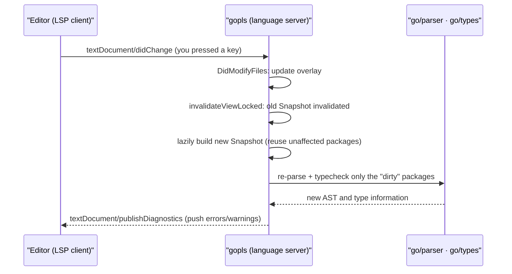

# 16.7 The Language Server Protocol

Auto-completion, jump-to-definition, live error reporting, refactoring: in modern editors these features, on the Go side, are provided by **`gopls`** (the Go language server, pronounced "go please"). Behind it stands the **Language Server Protocol** (LSP). This section makes three things clear: the combinatorial explosion that LSP untangles, how gopls builds on the reusable libraries of the compiler frontend, and why it deserves to be called the culmination of the Go toolchain's design philosophy.

## 16.7.1 LSP: Untangling the M×N Knot

Picture a world without LSP. To make **M editors** all support intelligent features for **N languages**, the naive approach is to write a separate integration for every "editor × language" pair: VS Code has to understand Go, understand Rust, understand Python; Vim has to learn each of them again; and the logic for completion, navigation, and error reporting is rewritten in every pair. The cost is **M×N** implementations, and any semantic update in a single language has to be followed up separately in all M editors. This growth curve was never going to scale.

LSP unties it into **M+N**. Microsoft proposed the protocol in June 2016 for Visual Studio Code (later opened up in collaboration with Red Hat and Codenvy, and now an industry standard). Its key move is to define **one standard protocol that is independent of both language and editor**: each language only needs to write **one** language server (implementing the protocol), and each editor only needs to write **one** LSP client. From then on, any editor paired with any language connects automatically. The language server is a separate process, and the editor communicates with it over standard input/output or a socket.

The protocol itself is built on **JSON-RPC**, with only three kinds of messages: the client sends a **request** and waits for the server's **response**, plus one-way **notifications**. Positions are expressed as "document URI + line and column", deliberately avoiding any language-specific abstraction (such as a given language's AST nodes), which is precisely what lets it work across languages. A single "jump to definition" round trip goes like this:

```json
// Client → server: the cursor rests on an identifier, asking where it is defined
{ "jsonrpc": "2.0", "id": 1, "method": "textDocument/definition",
  "params": {
    "textDocument": { "uri": "file:///app/main.go" },
    "position":     { "line": 41, "character": 7 } } }

// Server → client: the definition is at a certain line and column in another file
{ "jsonrpc": "2.0", "id": 1,
  "result": {
    "uri":   "file:///app/user/user.go",
    "range": { "start": { "line": 12, "character": 5 },
               "end":   { "line": 12, "character": 9 } } } }
```

Completion is `textDocument/completion`, renaming is `textDocument/rename`, formatting is `textDocument/formatting`. Error reporting goes the opposite direction: rather than the client asking, the server **pushes** a `textDocument/publishDiagnostics` notification on its own after analysis completes, and the editor draws those red squiggles accordingly. The editor tells the server about every keystroke and every save via `textDocument/didChange` and `textDocument/didSave`, and the server maintains its understanding of the project from these. Intelligence is thereby decoupled from the editor: write one language server, and all LSP editors benefit together.

At the start of a connection there is also an `initialize` handshake, where the two sides exchange the capabilities each supports: the server declares that it can do completion, can do renaming, can perform which code actions; the client declares what it can render. Capability negotiation lets the protocol evolve smoothly: when one side supports a new feature while the other has not yet caught up, both degrade gracefully based on the handshake result, instead of crashing outright. Because the protocol standardizes "capabilities" too, LSP could grow from its first few methods into today's 3.x specification, which covers dozens of interaction kinds such as semantic highlighting, inlay hints, and call hierarchy, while clients and servers across the ecosystem coexist without needing to upgrade in lockstep.

## 16.7.2 gopls: Built on go/types

`gopls` is the **official language server** developed and maintained by the Go team, and it provides this set of IDE capabilities to any LSP-compatible editor. Its capabilities are, in essence, **built on the reusable components of the compiler frontend**: it uses `go/parser` to parse source into an AST ([15.1](../ch15compile/parse.md)), `go/types` (the sister library of [8.3](../../part2lang/ch08generics/checker.md)) for type analysis, and the module mechanism to understand dependencies and build boundaries ([17 Modules](../ch17modules)). These three steps are exactly what the compiler frontend does, and Go made them into **independent, stable, public standard libraries** rather than locking them inside `cmd/compile`. So the same "parse + typecheck" logic can be called by gopls, and also by `go vet`, by various linters, by code generators, and by `gofmt`:

```go
// Outside the compiler, parse and type-check a piece of Go source: this is the kernel of every gopls analysis
fset := token.NewFileSet()
f, _ := parser.ParseFile(fset, "main.go", src, parser.AllErrors) // go/parser → AST
info := &types.Info{
    Defs: map[*ast.Ident]types.Object{}, // what each identifier "defines"
    Uses: map[*ast.Ident]types.Object{}, // which definition each identifier "references"
}
conf := types.Config{Importer: importer.Default()}
pkg, _ := conf.Check("app", fset, []*ast.File{f}, info)            // go/types → type information
```

The two tables `info.Defs` and `info.Uses` are all the raw material for "jump to definition", "find references", and "rename": a bidirectional mapping from identifier to symbol and from symbol to all reference sites, which the type checker builds along the way. In other words, gopls has no semantic analysis of its own; it reuses the results computed by the compiler frontend, only reorganizing the same information to answer the editor's questions.

This point is worth pausing on, because it explains **why Go's tooling ecosystem is so unusually thriving**. Making the frontend a reusable standard library is a deliberate design decision, and not every language goes this way; [16.7.4](#1674-lineage-and-comparison-why-the-frontend-as-library-is-the-crux) below will draw on clangd and rust-analyzer for contrast. For now it is enough to remember one sentence: gopls's intelligence is not built from scratch; it presents to the editor, for a different purpose, the very things the compiler had to compute anyway. And this is possible only because `go/parser` and `go/types` were turned into **libraries** early on (the "simple grammar + reusable frontend" of [15.1](../ch15compile/parse.md) bears fruit here).

## 16.7.3 Incremental Analysis: Every Keystroke Must Be Fast

Calling the frontend as a library only solves "can it compute the right answer". gopls's real engineering challenge lies in "can it compute **both fast and frugally**". A compiler is one-shot: read all the source, compute once, produce a binary, then exit. A language server is exactly the opposite. It is **resident**, facing a project that is **constantly being edited**, and on every keystroke it must, within tens of milliseconds, answer afresh "what errors are here now" and "what can be completed here". On a repository of hundreds of thousands of lines, fully re-parsing and re-typechecking from scratch on every keystroke is simply impossible.

gopls's answer is an incremental architecture centered on **immutable snapshots**. It layers the process state (trimmed sketch; the full definition lives in `gopls/internal/cache`):

```go
// gopls's state layering (sketch): Cache is shared across sessions, Session holds multiple Views, View holds the current Snapshot
type Session struct {
    cache *Cache          // shared across Sessions: parse caches, memoized computation results
    views []*View         // one workspace (usually one go.mod module) corresponds to one View
}

type Snapshot struct {       // an "immutable" view of the workspace state at a given moment
    view     *View
    files    map[URI]file.Handle // a content handle for each file at this moment
    packages map[PackageID]*Package // parsed and type-checked packages (on demand, memoized)
    refcount int                  // reference count: while an analysis still uses it, it cannot be reclaimed
}
```

The key is the word "immutable". When the editor sends a `didChange`, gopls does not **modify** the current snapshot; instead `DidModifyFiles` first updates the content overlay, then `invalidateViewLocked` marks the affected snapshots invalid, and on the next query a new snapshot is generated **lazily**. The new snapshot shares everything **untouched by the change** with the old one: you changed only one file, and the packages on the dependency graph that cannot reach it have their parse and type-check results reused as-is, with no recomputation. Immutability plus structural sharing makes "incremental" both correct (never reading a half-edited intermediate state) and efficient (recomputing only the small slice that actually got dirty). Reference counting handles reclamation: an old snapshot no longer held by any analysis has its memory freed, which is a key link in **bounding memory** on large repositories.

The round trip from one keystroke to one squiggle, strung together, looks like this:



The difficulty does not stop there. Module boundaries and build constraints (`//go:build` tags, [17](../ch17modules)) decide "which files belong to the current compilation and which set of dependencies it uses", and gopls must understand this as accurately as `go list` does, otherwise navigation and completion would point at the wrong package. Low latency, controlled memory, and smooth scaling with repository size: these mutually tugging constraints make up the hardest part of gopls's engineering.

Here lies a classic engineering trade-off. The most naive approach is to parse and type-check every package of the whole project and keep them resident in memory; queries are naturally lightning-fast, but memory swells linearly with repository size and soon buckles under a large monolithic repository (monorepo). The other extreme is to cache nothing and compute on every query, which is extremely frugal with memory but has ugly latency. gopls takes the middle road: the parse and type-check results of packages are computed and cached **on demand and memoized**, with the snapshot's reference count deciding when to reclaim; it also serializes some intermediate products (such as export information) to disk, reused across processes and sessions, trading I/O for memory. The tension between latency and memory is never "fully solved"; it is merely placed at a compromise point that is more economical for real-world projects, the same engineering wisdom that recurs in the allocator and the scheduler.

## 16.7.4 Lineage and Comparison: Why "Frontend as Library" Is the Crux

Placing gopls in the larger lineage of language servers makes its design choices clearer. Every language server faces the same problem: where to obtain an accurate, incremental, queryable understanding of the source. The answers different languages give happen to expose the differences in their respective frontend architectures.

- **Those that take the "frontend as library" road**: gopls and clangd are of one kind. clangd is "based on the clang compiler, with a kernel that runs the clang parser in a loop"; it reuses Clang's frontend, just as gopls reuses `go/parser` and `go/types`. The common point is that the language server and the compiler **share the same understanding of the source**, and are therefore precise: what the compiler accepts, the language server accepts too, with no rift where "it compiles but the IDE reports an error".
- **Those that did not take this road** pay an extra cost. Rust's `rustc` long exposed only an unstable internal API and did not present itself as a stable library; rust-analyzer therefore long existed as **a separate frontend implementation sharing no code with `rustc`**, amounting to **writing a second time** the parsing, name resolution, and type inference for the same language. This road is not impassable, but it pushes the cost of "making the frontend reusable" from the language design phase out to the tool development phase, to be borne repeatedly by the community.

By contrast, Go's choice is a **down payment paid in full early in the language design**: `go/parser` and `go/types` are standard libraries with a backward-compatibility promise, on which any tool can depend stably. This prepayment buys a whole toolchain such as `gopls`, `go vet`, `gofmt`, and staticcheck **standing on the same frontend**, with a naturally consistent understanding of "what this piece of Go code means". A thriving tool ecosystem is never a bonus of luck; it is the fruit that the design throughline of "simple grammar + frontend as library" ([15.1](../ch15compile/parse.md)) grows on the developer-experience end.

## 16.7.5 The Culmination of the Tool Ecosystem

gopls can be seen as the **culmination** of the Go toolchain's design philosophy: it integrates capabilities that were originally scattered across many small tools (parsing, types, modules, formatting, diagnostics, refactoring) into one unified, editor-independent intelligence backend. This step also has its evolution: before gopls, Go's editor intelligence was patched together from a heap of independently-acting command-line tools. Completion relied on gocode, navigation on godef, renaming on gorename, querying on guru, and each tool **re-parsed the project on its own**, sharing no state with the others, which was slow and inconsistent. gopls replaced this jumble with one resident process and a single shared understanding of the project, which is what "culmination" concretely refers to. The integration brings not only the saving of redundant parsing overhead, but a unification of semantics: the types completion sees, the definition navigation lands on, the scope a refactoring changes, all come out of the same snapshot, and are therefore self-consistent, with no rift where tool A thinks a symbol is here while tool B thinks it is there.

It embodies several Go values that run throughout this book: **simple grammar** makes parsing fast and reliable ([15.1](../ch15compile/parse.md)); **frontend as library** lets the capabilities of `go/parser` and `go/types` be reused by countless tools; the **unified toolchain** ([3.1](../../part1overview/ch03life/cmd.md)) makes all of this work out of the box and consistent in style. A Go developer, whether using VS Code, Vim, Emacs, or another editor, gets the same consistent intelligence experience driven by the same gopls, and this consistency is the extension of Go's "engineering-friendly" philosophy onto the developer-experience layer.

With this, the chapter on tooling and observability has surveyed Go's full set of tools, from **correctness** (deadlock detection [16.1](./deadlock.md), race detection [16.2](./race.md)), to **performance** (tracing [16.3](./trace.md), benchmarking and profiling [16.5](./perf.md)), to **quality** (testing [16.4](./testing.md)), to **operations** (metrics [16.6](./metric.md)), to **developer experience** (this section). Together they illustrate one of Go's core promises: **the value of a language lies not only in itself, but in the set of tools around it that let people write software correctly, run it fast, see it clearly, and maintain it well.** Go treats this set of tools as part of the language, and this is the confidence that lets it hold its ground in industry.

## Further Reading

1. Microsoft. *Language Server Protocol Specification (3.18).*
   https://microsoft.github.io/language-server-protocol/
2. Microsoft, Red Hat, Codenvy. *Language Server Protocol announced (2016-06-27).*
   https://en.wikipedia.org/wiki/Language_Server_Protocol
3. The Go Authors. *gopls documentation and source.* https://pkg.go.dev/golang.org/x/tools/gopls ;
   https://github.com/golang/tools/tree/master/gopls (the Session/View/Snapshot of `internal/cache`)
4. The Go Authors. *go/types, go/parser, go/ast (the reusable frontend libraries).*
   https://pkg.go.dev/go/types ; https://pkg.go.dev/go/parser
5. The Clang Team. *clangd Design.* https://clangd.llvm.org/design/
   ("based on the clang compiler, with a kernel that runs the clang parser in a loop", the isomorphic "frontend as library" idea)
6. This book, [15.1 Lexis and Grammar](../ch15compile/parse.md),
   [8.3 Type Checking Techniques](../../part2lang/ch08generics/checker.md),
   [17 Modules](../ch17modules), [3.1 Command Source Analysis](../../part1overview/ch03life/cmd.md).
