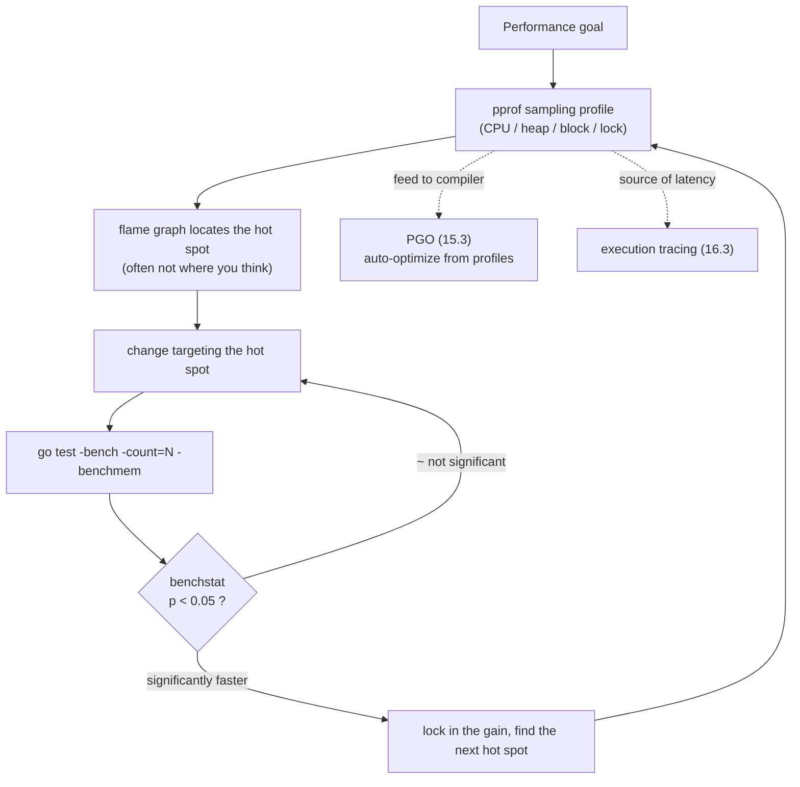

# 16.5 Benchmarking and Performance Profiling

The first principle of optimization is to measure before you act. Guessing at bottlenecks by intuition usually guesses wrong; the real hot spots are often not where you think they are. Go builds every tool this discipline requires straight into the toolchain: benchmarks answer "how fast," profiling answers "where is it slow, where does the memory go," and `benchstat` uses statistics to answer "did this change actually make things faster, or is it just noise." This section explains all three tools thoroughly and strings them into a measurement-driven loop of "profile to find the hot spot, change, benchmark to verify." One level up, this loop joins with PGO ([15.3](../ch15compile/optimize.md)) and execution tracing ([16.3](./trace.md)) to form Go's complete performance-engineering methodology.

## 16.5.1 Benchmarks: Making "How Fast" Reproducible

A benchmark is written with `func BenchmarkXxx(b *testing.B)` and run with `go test -bench`. The core difficulty it must solve is **measurement precision**: a single call to a nanosecond-scale function will have its signal drowned out by clock resolution and call overhead. Go's approach is to run the code under test in a loop many times, then divide by the count to get "time per operation" (ns/op). But how many times should the loop run? Too few and it is unstable; too many and it wastes time. The early style was to hand-write a loop from `0` to `b.N`, and the framework would **automatically adjust `b.N` and rerun for several rounds**, until the measurement window was long enough and the result stable enough:

```go
func BenchmarkFib(b *testing.B) {
    for i := 0; i < b.N; i++ { // the framework repeatedly grows b.N until timing is stable
        fib(30)
    }
}
```

This `b.N` mechanism is plain and reliable, but it has two pitfalls that have long drawn criticism. The first is the **timing boundary**: if the benchmark function does expensive setup, it gets counted into every measurement, and you have to manually `b.ResetTimer()`/`b.StopTimer()` to carve it out (see [16.5.3](#1653-two-classic-benchmark-pitfalls)). The second is **dead-code elimination**: the compiler sees that the return value of `fib(30)` is unused and may optimize the whole call away, so you end up measuring nothing.

Go 1.24 introduced `b.Loop`, which fixes both at once. The style is to write the loop condition as `for b.Loop()`:

```go
func BenchmarkFib(b *testing.B) {
    x := setupExpensiveInput() // setup, automatically excluded from measurement
    for b.Loop() {             // resets the timer on the first call, stops it when returning false
        sink = fib(x)
    }
}
```

`b.Loop` **resets the timer on its first call**, so setup before the loop is naturally excluded from measurement; it stops the timer when it returns `false`, so cleanup after the loop is excluded too. More importantly, the compiler applies a **special transformation** to `for b.Loop() { ... }`: it wraps the arguments, return values, and assignment targets inside the loop body in the `runtime.KeepAlive` builtin, **preventing the compiler from optimizing the loop body away**. This requires the loop condition to be written **verbatim** as `b.Loop()`, because this is a compiler transformation recognized at the syntactic level, not an ordinary function call. Another benefit is that `b.Loop` guarantees the benchmark function **runs as a whole only once per measurement**, whereas the `b.N` style reruns the benchmark function along with its setup/cleanup several times over.

Looking across to other ecosystems, "microbenchmarks must fight dead-code elimination" is a **universal problem**, and each language's solution is isomorphic but differs in technique. Java's JMH provides `Blackhole.consume()` to let you explicitly "consume" the result and fool the JIT; Rust's Criterion provides `black_box()` to do the same. Go's distinctive trait is that it pushes this down into the **compiler**: you do not have to sink results by hand, and `b.Loop`'s syntactic transformation keeps them alive for you. The cost is that it pins down the style (it must be `for b.Loop()`), a trade-off between "writing less boilerplate" and "syntactic restriction."

## 16.5.2 -benchmem: Spreading Out Allocation and GC Pressure

With `-benchmem` added, the benchmark additionally reports the memory allocated per operation in bytes (B/op) and the number of objects (allocs/op):

```
BenchmarkConcat-8     2000000    742 ns/op    248 B/op    5 allocs/op
```

The `allocs/op` column is extremely valuable: it tells you directly "how many objects this code allocates on the heap per run." Every heap allocation is one more piece of work handed to the garbage collector ([13 GC](../../part4memory/ch13gc)); the more allocations, the more frequently GC triggers and the heavier the scanning burden. So `allocs/op` going from 0 to 5 often means some value has **escaped** to the heap ([15.5](../ch15compile/escape.md)). Reading it alongside the escape-analysis output of `go build -gcflags=-m` can often pinpoint "which line put the object on the heap." This is the most direct way to turn the two abstract concepts of GC pressure and escape into a single concrete number that is quantifiable and can be tracked for regressions.

## 16.5.3 Two Classic Benchmark Pitfalls

The first pitfall is **writing setup into the timed region**. The benchmark below looks like it measures `process`, but it actually counts each round's input construction as well, so the reading is badly polluted:

```go
func BenchmarkProcess(b *testing.B) {
    for i := 0; i < b.N; i++ {
        data := makeLargeInput() // wrong: input construction is counted into every measurement
        process(data)
    }
}
```

The fix for the `b.N` style is to move setup outside the loop and call `b.ResetTimer()`; if setup cannot be hoisted out, use `b.StopTimer()`/`b.StartTimer()` to dig it out of the timing window. The `b.Loop` style naturally avoids the first case, since setup before the loop is not counted in the first place. Once you understand this pitfall, you understand why `b.Loop` makes "reset the timer on the first call" its default behavior.

The second pitfall is **noise**. On the same machine, CPU frequency scaling (DVFS / turbo boost), thermal throttling, background processes, and hyperthreading neighbors all make benchmark readings jitter by anywhere from a few percent to tens of percent. The community's standard practice for this is Austin Clements's `perflock`, an external tool **outside** the main Go repository that **serializes** multiple benchmark runs and **pins** the CPU frequency to a fixed value, suppressing jitter at the source. But even with noise controlled, a single comparison is untrustworthy: you need statistics.

## 16.5.4 benchstat: Using Statistics to Distinguish "Really Faster" from "Noise"

`benchstat` (`golang.org/x/perf/cmd/benchstat`) is a standard component of Go performance work. It takes two groups of benchmark results collected **repeatedly** before and after (`go test -bench=. -count=10`) and tells you whether the difference is **statistically significant**:

```
$ go test -bench=Concat -count=10 > old.txt
# ... change the code ...
$ go test -bench=Concat -count=10 > new.txt
$ benchstat old.txt new.txt
                │  old.txt    │              new.txt               │
                │   sec/op    │   sec/op     vs base               │
Concat-8          742.0n ± 2%   310.0n ± 1%  -58.22% (p=0.000 n=10)
ConcatSmall-8      31.5n ± 3%    31.8n ± 4%        ~ (p=0.481 n=10)
geomean           153.0n        99.3n       -35.10%
```

The new `benchstat` (rewritten after 2022) presents a ruled table: the `sec/op` column gives each group's median plus dispersion (`± 2%`), and the `vs base` column gives the relative change and the $p$ value. The `Concat` row has $p=0.000$ and dropped 58%, a significant gain; the `ConcatSmall` row's change is marked `~`, with $p=0.481$ far above $0.05$, meaning "indistinguishable from noise." The trailing `geomean` row is the geometric mean of all benchmarks, a single summary of the overall change. The `B/op` and `allocs/op` collected by `-benchmem` can be compared statistically the same way.

Why `-count=10` rather than running once? Because `benchstat` uses the **Mann-Whitney U test** (also called the Wilcoxon rank-sum test), a **non-parametric** statistical test. It was chosen over the more common t-test for a very practical reason: benchmark samples almost never follow a normal distribution, since scheduling jitter, cache warmth, and thermal throttling create outliers and even multimodal distributions, and the t-test's normality assumption does not hold here. Mann-Whitney makes no assumption about distribution shape and compares only the **ranks** of the two sample groups, which is far more robust. Its null hypothesis $H_0$ is "the two sample groups come from the same distribution," and it outputs a $p$ value; when $p$ is below the significance level $\alpha$ (default $0.05$), it rejects the null hypothesis and treats the difference as real. Otherwise, as in the `ConcatSmall` row above, it marks the delta as `~`, telling you plainly "this much change is indistinguishable from noise, do not take it seriously."

"First collect several groups with `-count=N`, then compare before and after with `benchstat`": this practice lifts a performance conclusion from "I feel it got faster" to "significantly 58% faster at $\alpha=0.05$," and is an unwritten yet near-mandatory norm in the Go community.

## 16.5.5 pprof: Sampling-Based Performance Profiling

Benchmarks tell you "how fast," but when you want to know "which functions this time was spent in," you turn to `pprof`. It collects several kinds of **profiles**. As of go1.26, the predefined profiles maintained by `runtime/pprof` are these:

- **CPU profile**: periodically interrupts at a fixed frequency (about 100 Hz by default), records the current call stack, and tallies which functions time was spent in, to find CPU hot spots. It streams output through `StartCPUProfile`/`StopCPUProfile` and is the only one that does not go through the `Profile` type.
- **Heap profile** (`heap` / `allocs`): samples allocation sites at `MemProfileRate` (one sample per 512KB allocated by default), to see which code allocates memory and what is currently held, finding memory hogs and leaks.
- **Block profile** (`block`): records the time goroutines block on synchronization primitives like channels and `sync.Mutex`, to find synchronization bottlenecks. It is **off by default** and must be enabled with `runtime.SetBlockProfileRate`.
- **Mutex profile** (`mutex`): records the holding stacks of contended locks, to locate lock-contention hot spots. It too is **off by default** and must be enabled with `runtime.SetMutexProfileFraction`.
- **Goroutine profile**: dumps the stacks of all current goroutines, a powerful aid for diagnosing localized deadlocks in [16.1](./deadlock.md).
- **`threadcreate` profile**: records the stacks where new OS threads are created.
- **`goroutineleak` profile** (new in go1.26): runs a round of GC before collection to detect goroutine leaks, and dumps the stacks of goroutines that are **permanently blocked and will never be woken again**. It turns a leak that used to be detectable only indirectly, by watching the total goroutine count slowly climb, into a profile you can locate directly.

Most of these profiles (the CPU profile excepted, since it is timed sampling by nature) are **sampled** rather than exhaustive. Sampling is a carefully weighed bargain: it trades statistical variance for overhead low enough to leave on continuously in production. At 100 Hz for CPU and one sample per 512KB for the heap, a single sample is meaningless on its own, but once thousands of samples aggregate, the relative proportions of the hot spots are highly trustworthy. Because the overhead is low, production services dare to keep profiling on all the time. The block and mutex profiles are **off by default** precisely as the other side of this bargain: they instrument timing on every synchronization primitive, costing more than the lightweight CPU and heap sampling, so they hand the decision of "is this overhead worth it" back to you, to be turned on as needed with `SetBlockProfileRate` and `SetMutexProfileFraction`.

## 16.5.6 Flame Graphs and Production Profiling

After collecting a profile, `go tool pprof` can visualize it in several forms, the most powerful of which is the **flame graph**. A flame graph stacks the sampled stacks by call relationship: the horizontal axis is a function's proportion of all samples (wider means hotter), and the vertical axis is stack depth, so you can see at a glance "which call chain the money is being spent on." This representation was introduced by Brendan Gregg and is now the industry's common language for performance diagnosis. It serves more than Go: the stacks collected by Linux `perf`, DTrace, and eBPF are also presented as flame graphs, and Go's `pprof` stands within this lineage of systems-performance observability.

To pull profiles in production, the standard approach is to import `net/http/pprof` anonymously, which registers the various profiles onto the `/debug/pprof/` routes:

```go
import _ "net/http/pprof" // registers the /debug/pprof/ endpoints

func main() {
    go func() { log.Println(http.ListenAndServe("localhost:6060", nil)) }()
    // ... application code ...
}
```

After that, at any moment you can pull profiles directly from the live service for analysis, for example collecting a 30-second CPU profile and entering an interactive flame graph:

```
go tool pprof -http=:8080 http://localhost:6060/debug/pprof/profile?seconds=30
```

A further step is **continuous profiling**: keeping profile collection resident, aggregating it into central storage, and reviewing the performance composition of any moment at will. Google's Google-Wide Profiling laid the foundation for this idea, and open-source systems like Parca and Pyroscope brought it to broader engineering practice. Go's low-overhead sampling profiles are exactly the precondition that makes continuous profiling viable.

## 16.5.7 A Measurement-Driven Optimization Culture

Stringing the three tools above together gives Go's **measurement-driven optimization** loop:



The discipline of this loop is: **do not optimize on a hunch**. First use a profile to locate the real bottleneck, and after the change use `benchstat` to confirm with data, rather than looking at the code and "feeling" that something here is slow. This loop also has two outward extensions. One is **PGO** ([15.3](../ch15compile/optimize.md), GA in Go 1.21): feed the CPU profile collected in production straight to the compiler so it can do more aggressive inlining and devirtualization. The profile here is upgraded from "a diagnosis for humans to read" to "an input for the compiler to read." The other is **execution tracing** ([16.3](./trace.md)): when the problem is not "slow on average" but "occasional long-tail latency," a profile's statistical average breaks down, and you need tracing to see which scheduling, GC, or system-call event a single request's time was spent on.

In terms of lineage, Go's contribution is not inventing any one tool: benchmarks, sampling profiles, flame graphs, and statistical-significance tests all existed before it. Go's contribution is to put the whole set of tools this **measurement-driven** discipline requires into every programmer's hands, built in and zero-configuration: `go test -bench` comes for free, `pprof` is in the standard library, and `benchstat` is one `go install` away. When the barrier to measurement is low enough to use on a whim, "performance is measured, not guessed" can shift from the cultivation of a few experts to the default habit of an entire community. Performance is not guessed; it is measured, changed, and measured again.

## Further Reading

1. The Go Authors. *Profiling Go Programs.* https://go.dev/blog/pprof ;
   *runtime/pprof, net/http/pprof.* https://pkg.go.dev/runtime/pprof
2. The Go Authors. *testing.B.Loop (introduced in Go 1.24).* https://pkg.go.dev/testing#B.Loop ;
   the `goroutineleak` profile is in `src/runtime/pprof/pprof.go` (Go 1.26).
3. The Go Authors. *benchstat.* https://pkg.go.dev/golang.org/x/perf/cmd/benchstat ;
   the implementation is in `golang.org/x/perf/benchmath` (Mann-Whitney U test).
4. Brendan Gregg. *Flame Graphs.* https://www.brendangregg.com/flamegraphs.html ;
   *Systems Performance.* 2nd ed. Pearson, 2020.
5. Aleksey Shipilëv. *JMH (Java Microbenchmark Harness).* https://openjdk.org/projects/code-tools/jmh/
   (`Blackhole` fights dead-code elimination, isomorphic to `b.Loop`).
6. Gang Ren, Eric Tune, et al. *Google-Wide Profiling: A Continuous Profiling Infrastructure
   for Data Centers.* IEEE Micro, 2010. (Foundational work on continuous profiling.)
7. This book's [15.3 The Optimizer (PGO)](../ch15compile/optimize.md), [16.3 Performance Tracing](./trace.md),
   [16.1 Deadlock Detection](./deadlock.md), [13 Garbage Collection](../../part4memory/ch13gc),
   [15.5 Escape Analysis](../ch15compile/escape.md).
