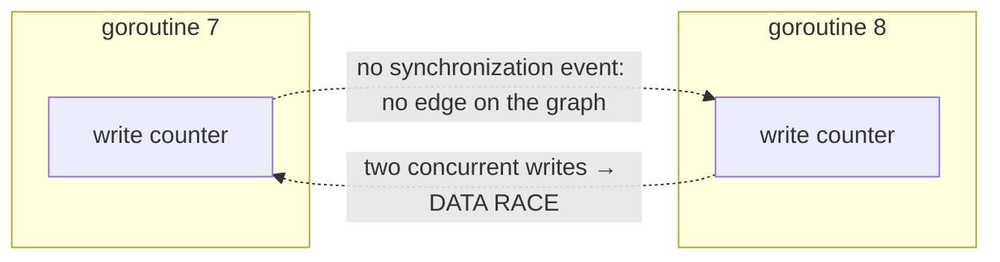

# 16.2 Race Detection

A data race is the most insidious and hardest-to-reproduce class of bug in concurrent programs. Its definition is short: if two goroutines
access the same memory address concurrently, at least one of them is a write, and no synchronization orders the two, then the program's behavior
is undefined ([11.9](../../part3concurrency/ch11sync/mem.md)). "Undefined" is not as gentle as "you read a stale value";
it means the compiler and the processor are both allowed to perform surprising reorderings, and the result may be right one time and wrong the next, may appear only under stress
load, only on a certain CPU, only in a certain version, just once in a while. There is no hope of catching this kind of bug by human code review. Go's
**race detector** (`-race`) is exactly the tool that turns this from "reproduce it by luck" into "run it once and it tells you". This section
explains its principle, the algorithmic cost behind it, and the two capability boundaries you must keep in mind.

## 16.2.1 Dynamic Detection Based on happens-before

`go test -race`, `go run -race`, `go build -race`, and `go install -race` all enable race detection. Its
core is **ThreadSanitizer** (TSan), the runtime that Google maintains in the LLVM `compiler-rt`, which Go links into the program as a precompiled
`.syso` (see `runtime/race/`, which is why `-race` depends on cgo). Its working principle is
**dynamic happens-before detection**: while the program runs, the compiler inserts a callback before every memory access, and the runtime
intercepts every synchronization event; together they let TSan maintain a happens-before relation graph in real time (the partial order from [11.9](../../part3concurrency/ch11sync/mem.md)).
When it finds that two goroutines accessed the same address, at least one being a write, and that there is **no** happens-before edge between them, it reports a data race.

Why intercept "access" and "synchronization" separately? Because these are exactly the two sources of the happens-before partial order. An access tells the detector
"who touched which block of memory and when", and synchronization tells it "an ordering was established between which two timelines". The set of hooks Go exposes in `runtime/race.go`
maps these two kinds of events one to one:

```go
//go:build race

// Access events: the compiler instruments a call automatically before every memory read/write
func RaceRead(addr unsafe.Pointer)
func RaceWrite(addr unsafe.Pointer)
func RaceReadRange(addr unsafe.Pointer, len int)  // bulk accesses such as slices, memmove
func RaceWriteRange(addr unsafe.Pointer, len int)

// Synchronization events: establish a cross-goroutine happens-before relation on addr
// original comment: establish happens-before relations between goroutines
func RaceAcquire(addr unsafe.Pointer)       // ≈ C11 atomic_load(acquire)
func RaceRelease(addr unsafe.Pointer)        // ≈ C11 atomic_store(release)
func RaceReleaseMerge(addr unsafe.Pointer)   // ≈ C11 atomic_exchange(release)
```

`RaceRead`/`RaceWrite` are access points. Inside the runtime, channel send and receive, the lock and unlock of `sync.Mutex`, every atomic operation in `sync/atomic`,
and the creation and exit of goroutines call the pair of primitives `raceacquire`/`racerelease`
internally to "weld" the happens-before edge into place. In other words, every ordering-establishing semantic specified in [11.9](../../part3concurrency/ch11sync/mem.md)
(a channel send happens-before the corresponding receive completes, an unlock happens-before a subsequent lock,
an atomic write synchronizes with the acquire of an atomic read in release order) lands, in TSan, as a concrete edge on the graph.
The memory model's abstract phrase "no happens-before means a race" thus becomes a decision that can actually catch the offender red-handed.

The classic "concurrent increment" below has a race. Both goroutines write `counter`, with only a
`WaitGroup` between them, and a `WaitGroup` only guarantees that main waits for both to finish; it establishes no ordering between the two writes:

```go
func main() {
	var counter int
	var wg sync.WaitGroup
	for range 2 {
		wg.Add(1)
		go func() {
			defer wg.Done()
			counter++ // read-modify-write, no synchronization: races with the counter++ in the other goroutine
		}()
	}
	wg.Wait()
	fmt.Println(counter)
}
```

Running it with `go run -race`, TSan prints the stacks of the two conflicting accesses and where the offending goroutine was created:

```
==================
WARNING: DATA RACE
Read at 0x00c0000160a8 by goroutine 8:
  main.main.func1()
      /tmp/race.go:11 +0x...
Previous write at 0x00c0000160a8 by goroutine 7:
  main.main.func1()
      /tmp/race.go:11 +0x...
Goroutine 8 (running) created at:
  main.main()
      /tmp/race.go:8 +0x...
==================
Found 1 data race(s)
exit status 66
```

The report pins down the file, the line number, and the identity of both goroutines. This is the payoff of dynamic detection: it does not guess "there might be a race here",
it points at the one conflict that actually happened and says "it is these two lines". The fix follows naturally: just put synchronization around `counter++`.
Serialize the increment with a channel (the send-receive ordering of [11.9](../../part3concurrency/ch11sync/mem.md)), or more
directly switch to an atomic operation, and the race disappears:

```go
var counter atomic.Int64
// ...
go func() {
	defer wg.Done()
	counter.Add(1) // atomic read-modify-write: TSan sees the release/acquire edge and no longer reports a race
}()
```

## 16.2.2 The Mechanism and Its Memory Cost

How does TSan internally decide "whether there is a happens-before edge between two accesses"? The core data structure is the **vector clock**.
Each goroutine holds a logical clock, and a vector clock $VC$ gathers all goroutines' clocks into
an array; when goroutine $t$ releases on some address and another goroutine $u$ acquires on the same address,
$u$'s vector clock takes the componentwise maximum with $t$'s, $VC_u \leftarrow \max(VC_u, VC_t)$, and this step encodes
"$t$'s prior events happen-before $u$'s subsequent events". To decide whether two accesses $a$ (in $t$) and $b$
(in $u$) are ordered, you only compare clocks: if the component $VC_t[t]$ has already been "seen" by $u$ (that is, $a$'s timestamp
$\le VC_u[t]$), then $a \to b$ holds and there is no race; otherwise the two are concurrent, and if one of them is a write, it is a race.

The cost hides right here. A naive implementation has to attach a full vector clock to **every monitored memory location**, with length proportional to
the number of goroutines, an overhead of $O(n)$ per address. TSan uses two engineering techniques to press it down. The first is **shadow memory**:
it maintains several "shadow cells" for each memory word of the application, recording the (thread, timestamp, read/write)
triple of the most recent few accesses, deciding from a fixed-size sliding window rather than an unbounded history; it is precisely this shadow structure spread out
in proportion to application memory that determines why `-race`'s memory footprint rises significantly. The second is the **FastTrack** insight
(Flanagan & Freund, PLDI 2009): the overwhelming majority of accesses are in fact fully protected by some happens-before chain,
and for these accesses a full vector clock can degenerate into a pair of scalar **epochs** (an epoch being "thread + timestamp"),
so the $O(n)$ comparison drops to $O(1)$ in the common case, and only when genuine read-concurrent sharing appears does it upgrade back to a full vector clock.
The vector clock guarantees the precision of the decision, and shadow memory and epochs let it run at industrial scale; together they are the trade-off of "trading memory and
speed for certainty".

By the official documentation's measurements, this mechanism increases the program's **memory footprint by roughly 5 to 10 times and slows runtime by roughly 2 to 20 times**;
in addition, each `defer`/`recover` takes about 8 extra bytes, and goroutines that run for a long time and periodically `defer`/`recover`
should keep this in mind.



## 16.2.3 Its Capability Boundaries

The race detector is extremely useful, but there are two boundaries you must keep in mind. First, it is **dynamic**: it can only detect races that **actually happened**,
and the code path that triggers the race must really be executed during some run with `-race`. A race hidden in a branch
that was never run is entirely unknown to it. This means the effectiveness of race detection **depends on test coverage**: you should run `-race` under loads that are as realistic
and as fully concurrent as possible, so that accesses that interleave only under high concurrency truly interleave, in order to knock the race loose. The contrast is static
analysis, which can scan all paths without running, at the cost of a great many conservative possible false positives. TSan chose the other end.

Second, it **has a cost**. The figures from the previous section, 5 to 10 times the memory and 2 to 20 times slower, are the unavoidable overhead of instrumentation and shadow memory.
So `-race`'s place is **testing and pre-release**: let it into CI, into stress tests, into the integration environment, rather than running it permanently in production. Treat
`-race` as a concurrency gate, not a long-resident runtime feature.

Precisely because it **reports only accesses that actually happened and genuinely lack a happens-before edge**, the race detector's reports have one valuable
property: **almost no false positives**. It decides a race with precise vector clock comparison rather than heuristic guessing, so once
`-race` raises an alarm, what it reports is basically always a real data race. This is utterly different from a tool that produces "a pile of possible false positives awaiting manual triage",
and it gives a simple, reliable engineering discipline: if `-race` reports it, take it seriously and fix it immediately.

## 16.2.4 The Resonance with the Memory Model

The race detector is the **practical realization** of the theory in [11.9 The Memory Consistency Model](../../part3concurrency/ch11sync/mem.md).
The memory model answers "what is correct": it defines a data race in terms of happens-before, and declares that the behavior of a program with a data race
must not be relied upon. This is a specification; it will not check any program for you on its own. The race detector answers "where your program is wrong": it builds
that partial order from the specification for real at runtime, so "does this code violate the memory model" turns from a question that needs human
reasoning into an executable decision of "run it once and see whether it reports". One draws the boundary, the other patrols the boundary.

Go **builds race detection into the toolchain**: a single `-race` flag, with no extra installation or code change, is part of its promise to "make correct
concurrency easier to write right". On one side the language gives you the means of correct synchronization with channels and locks ([11](../../part3concurrency/ch11sync)),
and on the other it uses the race detector to help you catch the places you did not synchronize well. "Concurrent code must pass the `-race` test" is therefore
a basic skill for writing reliable Go concurrent programs: the memory model defines right and wrong, and the race detector helps you discover the wrong.

## Further Reading

1. The Go Authors. *Data Race Detector.* https://go.dev/doc/articles/race_detector
2. Konstantin Serebryany, Timur Iskhodzhanov. "ThreadSanitizer: data race detection in
   practice." *WBIA 2009*. https://doi.org/10.1145/1791194.1791203 (the origin of ThreadSanitizer;
   what Go actually links in is the v2 runtime later rewritten in LLVM `compiler-rt`, see `runtime/race/README`)
3. Cormac Flanagan, Stephen N. Freund. "FastTrack: Efficient and Precise Dynamic Race
   Detection." *PLDI 2009*. https://doi.org/10.1145/1542476.1542490 (the optimization from vector clock to epoch)
4. The LLVM Project. *ThreadSanitizerAlgorithm.* https://github.com/google/sanitizers/wiki/ThreadSanitizerAlgorithm
5. The Go Authors. *The Go Memory Model.* https://go.dev/ref/mem
6. This book's [11.9 The Memory Consistency Model](../../part3concurrency/ch11sync/mem.md),
   [11 Concurrent Synchronization](../../part3concurrency/ch11sync).
