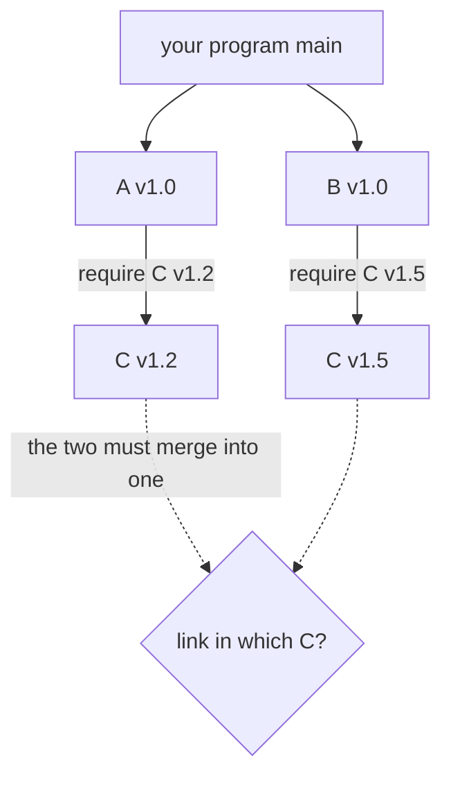
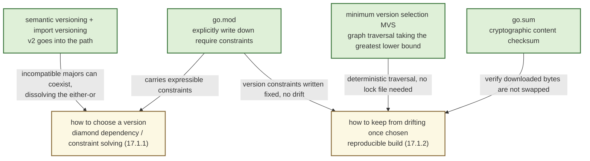

# 17.1 The Hard Parts of Dependency Management

Modern software is almost never written from scratch. For an ordinary server program, one level down the `import` list you find a logging library, an HTTP router, a serializer; one level further down are the cryptography, compression, and network primitives that each of those depends on. The code that is actually yours may be less than one percent of the whole dependency graph. This brings the dividend of reuse, and it also brings a question that is not yours by rights yet must be answered by you: **for every package in this graph, which version should you use?** This section is in no hurry to give Go's answer; first we want to make the difficulty of the problem itself clear. There are two main threads to it: one is **how to choose a version** (diamond dependencies and constraint solving), the other is **how to keep it from drifting once chosen** (reproducible builds). Only once these two are understood can you see why the "minimum version selection" scheme of [17.3](./minimum.md) deserves its own design, and what price Go paid to get there.

## 17.1.1 The Diamond Dependency: A Constraint Solving Problem

The core difficulty of dependency management is concentrated in a topology called the **diamond dependency**. Your program depends on both A and B, and A and B both depend on the same C. The dependency graph splits into two branches from the apex and converges again at C; drawn out, this is exactly a diamond. The trouble is that the two branches place **different version requirements** on C:



Why not let A use C v1.2 and B use C v1.5, each taking what it needs? Most languages cannot do this. The two versions of C usually export the same package path and the same set of type names, so linking both into one program makes the linker collide on duplicate symbols. Even if the linker allowed it, C v1.2's `Token` and C v1.5's `Token` are two mutually incompatible types in the type system. The moment A passes the `Token` it holds to B, the two would blow up at the boundary. This crack is clearer with a sketch of code:

```go
// A uses C v1.2 internally, and exposes C's type on its own API
package a
import c "example.com/c" // assume this resolves to v1.2
func NewClient() *c.Token { ... }

// B uses C v1.5 internally; its signature also has c.Token
package b
import c "example.com/c" // assume this resolves to v1.5
func Use(t *c.Token) { ... }

// your program wants to hand the Token from A to B
b.Use(a.NewClient())
// if v1.2 and v1.5 are "two different c.Token types", this line fails to compile:
// cannot use a.NewClient() (*c@v1.2.Token) as *c@v1.5.Token
```

Russ Cox traced this crack in detail in "Go & Versioning" using the OAuth2 example: an application depends on OAuth2 v1 indirectly through an Azure library, and on OAuth2 v2 indirectly through an AWS library. When an intermediate library exposes the type of an underlying dependency in its own API, coexistence of multiple versions turns from "can it be linked in" into "will the types fail to match at the seam". Reality therefore degenerates into a hard constraint: **for any given C, only one version can exist in the entire program.**

Once you accept "one version per package", the diamond dependency becomes a multiple-choice question: pick one from v1.2 and v1.5, and the one you pick must let both A and B work correctly. With two nodes this is still simple. But a real dependency graph has hundreds or thousands of nodes, each placing its own interval constraint on versions (C wants `>=1.2`, D wants `<2.0`, E wants `!=1.4`, and so on), and finding a combination of versions that satisfies **all** constraints at once is, fully and properly, a **constraint solving** problem.

How hard it is depends on what kinds of constraints you allow it to express. If the constraints can express **conditional dependencies**, implications with negation such as "if some version of X is chosen, then Y cannot be chosen", the solving problem immediately slides into the realm of **boolean satisfiability** (SAT). Cox's observation is rather pointed: "with just a little conditional constraint, version search falls into SAT", and SAT is an NP-complete problem with no known general efficient solution. Formally, given a set of variables $V$ (which version each package picks) and a set of constraints $\Phi$, deciding whether there exists an assignment making $\bigwedge_{\phi \in \Phi}\phi$ true is equivalent to 3-SAT when $\Phi$ contains arbitrary boolean clauses. This is exactly why package managers like Cargo, npm, and apt often carry a SAT solver inside them:

```text
# a constraint system that triggers SAT (sketch)
program  depends on A, B
A v1.0   depends on C >= 1.2
B v1.0   depends on C  < 1.5,  and  if C >= 1.3 then needs D >= 2.0
D v2.0   depends on C  < 1.3            <- negates the line above, creating combinatorial blowup
...      (thousands of packages, each with its own intervals and conditions)
the solver must find an assignment satisfying all constraints within an exponential space of version combinations
```

Bringing in a solver costs two things. One is **slowness**: in the worst case the search space grows exponentially with the number of packages, and a single dependency resolution in a large project can take a noticeable amount of time. The other is **surprise**: a SAT solver returns "some feasible solution", not necessarily the one that human intuition would consider "the one that should be chosen". A slight adjustment to the solver's internal search order or heuristic strategy can make the same set of constraints resolve to a different version combination. You merely upgraded an unrelated package, only to find that another package was "incidentally" swapped to a different major version. **Slowness and unpredictability are the inherent cost of treating version selection as general constraint solving.** Keep this in mind, and in [17.3](./minimum.md) Go's deliberate restriction of the problem to a polynomially solvable subclass (the constraints corresponding to MVS are simultaneously 2-SAT, Horn-SAT, and Dual-Horn-SAT) is no longer a flourish but a direct answer to this difficulty.

## 17.1.2 Reproducible Builds: The Me of Today Equals Next Month's CI

The second main thread is how to keep a chosen version from **drifting** after it is chosen. The requirement of a reproducible build can be stated in one sentence: the binary I build on my machine today must be compiled from the **same set of dependency versions** as the one built next month on the CI pipeline, on your laptop, or in some security rollback three years from now. Otherwise you fall into the defense every engineer knows so well: "works on my machine".

The reason this is a difficulty is that the act of "building" naturally carries a hidden dimension of time. If the rule for dependency resolution is "take the **latest** version that satisfies the constraints", the default in many ecosystems, then the resolution result becomes a function of the moment of building:

```text
# the same "take latest" rule gives different results at different times
January: require C >= 1.2  ->  the latest C then is v1.4  ->  link in v1.4
March:   require C >= 1.2  ->  C has since released v1.6   ->  link in v1.6  <- no one changed a line of code, yet the build changed
```

No one touched a line of source code or a line of dependency declaration; just because upstream released a new version between two builds, the artifact changed. Once the new version introduces a regression, the production bug cannot be reproduced on your machine, because you and production are quietly running different C's. Reproducibility therefore requires that version selection be **deterministic** (the same input always gives the same output), **recordable** (able to write down which versions were chosen this time), and **verifiable** (able to confirm that the bytes downloaded are the same bytes as before, untampered and unreplaced).

The mainstream ecosystems have two answers to this question. One is "**take latest plus a lock file**": resolution still takes the latest feasible version, but the whole set of resolved versions is pinned into a lock file (`package-lock.json`, `Cargo.lock`, `Gemfile.lock`), and the next build reproduces it from the lock file. This preserves reproducibility, yet as Cox notes, for a **library** it is "low fidelity": what the library author actually develops and tests against is mostly not the version that happens to be latest in some user's lock file, and the gap between the two is gratuitously introduced risk. The other answer is to make the resolution rule itself deterministic, so that the "lock file" is no longer a necessity. Go chose the latter, which foreshadows [17.3](./minimum.md).

Placing these two answers against other ecosystems makes the contours of the difficulty more vivid. npm allows multiple versions of the same package to coexist in the `node_modules` tree (nested installation), which amounts to dodging the diamond conflict of 17.1.1 by "giving up the single version", at the cost of a bloated dependency tree and the same type failing to recognize itself across different subtrees. Cargo takes "latest feasible plus `Cargo.lock`", which is good for applications but, as noted, leans toward low fidelity for libraries. Maven goes with "nearest-wins" proximity override, a simple rule that often gives surprising versions. Each makes a different choice, but all answer the same two questions: whom to choose on conflict, and how to keep from drifting once chosen. This is exactly what shows the difficulty to be ecosystem-independent rather than an accident of one particular language.

## 17.1.3 Go's Detour: The GOPATH Era

With these two difficulties laid out, looking back at Go's early dependency management lets us pinpoint exactly where it fell short. Before modules, Go used the **GOPATH mode**: all third-party code was spread across one global `$GOPATH/src` directory, the import path was directly the directory path, and `import "github.com/foo/bar"` corresponded to `$GOPATH/src/github.com/foo/bar`. The structure was plain, but against the difficulties of the previous two sections it was an almost total rout:

```text
$GOPATH/src/
  github.com/foo/bar/   <- one import path, only one copy of code, one version, on disk
  golang.org/x/net/     <- nowhere records "which version this is"
```

- **No notion of version.** `go get` pulled the **latest main branch** of the dependency repository. Pulling today and pulling next month might be different commits. The kind of drift from 17.1.2, "the code didn't change yet the build did", was the norm rather than the exception under GOPATH.
- **No way to express version constraints.** Under GOPATH there was simply nowhere to write down "I want C's v1.2". With no constraints expressible, the constraint solving of 17.1.1 was naturally out of the question too.
- **The diamond dependency was simply unsolvable.** One import path corresponded to one directory and one copy of code under `$GOPATH/src`. A wanted C v1.2, B wanted C v1.5, yet the disk could only hold one C. The conflict was forcibly flattened at the filesystem level, and the price of flattening was that one party silently ran on a version it had never tested against.

The community would not sit and wait. In the vacuum of GOPATH a batch of third-party tools sprang up; `godep`, `glide`, and `dep` are among the best known (this contest of tools and how it converged on the official solution is the subject of [17.4](./fight.md)). Their moves were much alike: **copy** a dependency's source code, together with a definite version, into a project-local `vendor/` directory, and at build time prefer this snapshot in `vendor/`, thereby circumventing GOPATH's "always latest"; then add a lock file (such as `Gopkg.lock`) recording which commit each dependency was pinned to, buying a little reproducibility. These patches did relieve the pain, yet they remained patches: formats varied and were mutually incompatible, and with no version model natively recognized by the toolchain, problems that need global solving, such as diamond dependencies, could still only be arbitrated by hand when one `vendor`ed manually.

This detour is itself the most forceful footnote to the difficulty of dependency management. Even Go, known for being engineering-friendly and for counting every grain of build speed, spent nearly a decade groping at the matter of versions before it settled. It is worth recording that GOPATH was not without merit: it forced every import path to be globally unique and addressable, a constraint later inherited by modules and made the foundation of "the module path is the import prefix". The parts trodden solid on a detour often remain in the correct solution.

## 17.1.4 Toward Go Modules

From 2018, **Go Modules** became the official answer, responding directly to every difficulty of the previous three sections. Its several cornerstones are taken apart one by one later in this chapter; here we first give the reader a global map:

- **`go.mod`** writes dependencies and version constraints **explicitly into** the repository. The "constraints with no way to express them" from 17.1.1 now have a vessel. Each `require` is an edge on the module graph, marking "at least some version of some dependency is needed".
- **`go.sum`** records a cryptographic checksum of each dependency's content, answering the "verifiable" of 17.1.2: if the downloaded bytes do not match `go.sum`, the build refuses, and a dependency cannot be quietly swapped out.
- **Semantic versioning** ([17.2](./semantics.md)) gives a set of rules all parties agree on for "is v1.2 or v1.5 newer, and are they compatible". In particular the rule "the major version goes into the import path" (`.../v2`) gives an incompatible major version of C a **different import path**, dissolving the "same path, two versions colliding" of 17.1.1 at the source.
- **Minimum version selection** (MVS, [17.3](./minimum.md)) is that distinctive solving algorithm. It does one deterministic graph traversal of the module graph and takes, for each dependency, the "**greatest lower bound** among all requirements". This both sidesteps the exponential complexity of SAT and makes the result naturally deterministic, so that the reproducibility of 17.1.2 **no longer depends on a lock file**: the same `go.mod` resolves to the same set of versions at any time and on any machine.

How these four cornerstones each map onto the two difficulties of the previous two sections can be drawn together in one diagram:



Put these four together and both main threads of dependency management are accounted for: how to choose a version is handed to the deterministic traversal of MVS; how to keep from drifting once chosen is handed to the written-fixed `go.mod` plus the verifying `go.sum`. The rest of this chapter unrolls along this line: first semantic versioning ([17.2](./semantics.md)) lays down the contract of the version number, then minimum version selection ([17.3](./minimum.md)) gives the kernel of the solving, and finally we look back at the contest of tools that decided Go's direction ([17.4](./fight.md)), to see clearly why it ultimately chose this path rather than the one others had worn smooth.

Dependency management is one of those rare engineering domains whose answer looks simple while the problem is extremely hard. It has no "perfect solution"; every scheme reapportions weight among **solving complexity**, **fidelity to the author's intent**, **strength of reproducibility**, and **the user's cognitive burden**. Go Modules is no exception, and its trade-offs are exactly what the following sections will examine one by one.

## Further Reading

1. Russ Cox. *Go & Versioning (the "vgo" series, a full account of the problem and the solution).* 2018.
   https://research.swtch.com/vgo (see especially "Semantic Import Versioning" and
   "Minimal Version Selection", corresponding respectively to the diamond dependency and solving complexity)
2. Russ Cox. *Minimal Version Selection.* 2018. https://research.swtch.com/vgo-mvs
   (argues that the constraints corresponding to MVS are simultaneously 2-SAT / Horn-SAT / Dual-Horn-SAT, hence polynomially solvable;
   and contrasts the low fidelity of "take latest plus lock")
3. The Go Authors. *Go Modules Reference.* https://go.dev/ref/mod
   (the authoritative definition of `go.mod`, `go.sum`, the module graph, the build list, and MVS)
4. Titus Winters, Tom Manshreck, Hyrum Wright. *Software Engineering at Google.*
   O'Reilly, 2020. Chapter 21, "Dependency Management" (the difficulties and trade-offs of large-scale dependency management)
5. Sam Boyer. *So you want to write a package manager.* 2016.
   https://medium.com/@sdboyer/so-you-want-to-write-a-package-manager-4ae9c17d9527
   (the author of `dep` systematically surveys version solving and SAT complexity)
6. This book: [17.2 Semantic Versioning](./semantics.md), [17.3 The Minimum Version Selection Algorithm](./minimum.md),
   [17.4 The vgo vs. dep Contest](./fight.md).
