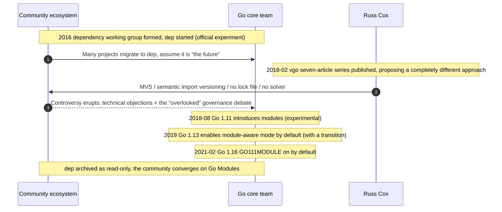

# 17.4 The vgo versus dep Dispute

Today's Go Modules did not exist from the start. They were born out of a rather dramatic, and rather controversial, community episode: **the vgo versus dep dispute**. This history is not mere gossip. It reflects the real tension among open-source project governance, technical decision-making, and community sentiment. It is the final piece for understanding why Go Modules are the way they are today, and it is also a concentrated performance, at the toolchain level, of the design philosophy this book has been discussing all along.

The previous two sections have already laid out the technical core of Go Modules. Semantic version management ([17.2](./semantics.md)) writes the major version into the import path, and minimal version selection ([17.3](./minimum.md)) uses one deterministic algorithm to pick each dependency's version. Together they let Go avoid both a lock file and a constraint solver. This section answers a different question: why **this** approach, rather than the one the community had already invested two years in and had almost taken for granted as "the future." To explain that clearly, we have to turn the clock back to 2016.

## 17.4.1 dep: The Community's "Official Experiment"

The dependency chaos of the GOPATH era ([17.1](./challenges.md)) spawned a whole crop of third-party tools: `godep`, `glide`, `govendor`, each going its own way and none compatible with the others. In 2016, the Go team decided to consolidate. It set up a dependency management working group, led by community members such as Sam Boyer, to build a tool positioned as an **official experiment**: **`dep`**. It was not one person's toy. It was endorsed by the Go team, deeply participated in by the community, and widely understood as the candidate that "would eventually be merged into the `go` command." Many companies and individuals adjusted their engineering practices accordingly and migrated their projects onto dep.

Technically, dep took the **mainstream** route of the time, in the same lineage as Rust's Cargo, Ruby's Bundler, and JavaScript's npm: a manifest file declares the version ranges you want, a **lock file** pins the exact versions resolved this time, and in between sits a **constraint solver**. What the solver does is, in essence, Boolean satisfiability (SAT): it translates constraints like "A needs B at `>=1.2`" and "C needs B at `<2.0`" into logical formulas, then searches for a version assignment that satisfies everyone at once.

```toml
# Gopkg.toml: dep's manifest, declaring constraints (illustrative)
[[constraint]]
  name = "github.com/pkg/errors"
  version = ">=0.8.0"

[[constraint]]
  name = "github.com/some/lib"
  branch = "master"
```

```toml
# Gopkg.lock: the exact versions the solver computed and locked this time (illustrative)
[[projects]]
  name = "github.com/pkg/errors"
  revision = "645ef00459ed84a119197bfb8d8205042c6df63d"
  version = "v0.8.0"
```

This design has its logic: the manifest writes "the range I can accept," the solver finds a solution within that range, and the lock file guarantees that everyone on the team, and every CI run, installs the same set. The problem lies in the solving itself. General SAT is NP-complete, and to produce a solution within acceptable time, solvers tend to **pick the newest feasible version**. As a result, the same manifest may resolve to a different result today than next month: as soon as any package in the dependency graph publishes a new version, the search space changes. The lock file exists precisely as a patch to hedge against this uncertainty. Put another way, the mainstream approach is "use a solver that drifts, then use a lock file to pin the drift down."

## 17.4.2 vgo: A Proposal Running Counter to the Mainstream

In February 2018, Russ Cox published, in one stroke, the **vgo** (versioned go) series of seven articles, titled in order: "Go += Package Versioning," "A Tour of Versioned Go," "Semantic Import Versioning," "Minimal Version Selection," "Reproducible, Verifiable, Verified Builds," "Defining Go Modules," and "Versioned Go Commands." What they put forward was not an improvement on dep but a **completely different** approach, namely what later became Go Modules.

vgo runs opposite to dep on almost every key decision:

| Dimension | dep (the mainstream approach) | vgo (the later Go Modules) |
|------|----------------|----------------------|
| Version selection | Constraint solver, tends to take the **newest** feasible version | Minimal version selection (MVS), takes the **smallest** satisfying version |
| Solving complexity | General SAT, NP-complete | Restricted to the Horn-formula subclass, linearly solvable, unique solution |
| Lock file | Required, to hedge against solver drift | Not needed; `go.mod` plus MVS is already deterministic |
| Coexistence of incompatible versions | Solver reports a conflict, requiring a human choice | Semantic import versioning: v2 goes into the path, two versions coexist |
| Design orientation | Maximum flexibility for the user | Maximum reproducibility for the build |

The most counterintuitive part is the direction of version selection. Everyone assumes a package manager should install the **newest** compatible version for you, yet vgo does the reverse and takes the **smallest**. Cox's argument rests on a mathematical fact: by restricting version selection to the solvable subclass of Schaefer's dichotomy theorem (Horn and dual-Horn formulas), one can sidestep NP-completeness and arrive at a problem with a **unique minimal solution**. And "taking the smallest" yields a property he calls a **high-fidelity build**: the version you get is exactly the version the author used when testing, and "the build deviates from the author's own build only when there is a genuine need." The release of a new version **does not** change the result of any existing build, because no one asked you to upgrade, so MVS will not upgrade for you. This is exactly what a lock file aims to achieve, yet barely achieves only by relying on an extra file, whereas MVS builds it directly into the algorithm.

```text
// The intuition behind MVS (see 17.3 for details): a version is not "solved" for, it is "read" off
build list = for the main module and all its dependencies' go.mod files,
             take, for each module, the maximum among the versions required by all parties
// No backtracking, no search, no notion of "newest version" coming in to stir things up
// The same set of go.mod files computes the same build list at any time, on any machine
```

Put both lines of thought onto the same dependency graph and the difference shows up at once. Suppose the main module depends on both A and B, both of which depend on a common library lib, where A requires `lib >= 1.2`, B requires `lib >= 1.4`, and lib's current latest release is `1.7`:

```text
       main module
        /     \
       A       B
   (lib≥1.2) (lib≥1.4)
       \     /
        lib  ──→ latest in the wild 1.7

dep solver:  pick "newest feasible" within the range → choose lib 1.7
             (neither A nor B tested 1.7; next week lib ships 1.8, the solution changes again, pinned by the lock file)

vgo's MVS:   take the maximum among all parties' requirements = max(1.2, 1.4) = lib 1.4
             (exactly the version B's author tested; lib shipping 1.8 has no effect, the result is naturally stable)
```

The difference is not which version is "higher," but **what determines this result**. dep chose 1.7 because 1.7 happened to be the latest in the wild at the moment of solving; the world outside the dependency graph (when others publish new versions) seeped into your build, so a lock file became necessary to keep it out. vgo chose 1.4 using only the information hardcoded inside the dependency graph in each `go.mod`; changes in the outside world cannot get in, and the build is therefore **reproducible by itself**, with no extra file required. This is the reason "taking the smallest" is counterintuitive yet more trustworthy.

Semantic import versioning ([17.2](./semantics.md)) then dismantles, at the root, the other knot that most troubles a solver: two **incompatible** major versions having to coexist within a **diamond dependency**. When dep's solver encounters "A wants lib v1, B wants lib v2," it can only report a conflict and ask a human to choose. vgo writes `v2` into the import path (`github.com/x/lib/v2`), so in the compiler's eyes v1 and v2 are two different packages that can exist at the same time, and the conflict simply does not arise. The hardest problem was defined away rather than solved.

## 17.4.3 The Controversy: Overlooked Investment and a Debate Over Process

vgo triggered one of the fiercest controversies in the history of the Go community, and the controversy unfolded on two levels at once. They are worth separating, and both worth presenting fairly.

The doubts at the **technical level** were real and should not be erased by the eventual outcome. MVS's "take the smallest version" violates almost every engineer's intuition, and many worried it would pin people, over the long run, to old versions with known bugs (vgo's answer was explicit upgrades via `go get -u`, plus the later `go.sum` and verification mechanisms). Semantic import versioning was criticized as too strict: it requires library authors to change the import path, and even the directory structure, when shipping v2, adding a non-trivial migration cost to the existing ecosystem, and the argument over "whether the major version should go into the path" went on for a long time. These were weighty technical objections raised by the dep camp.

The sentiment at the **governance level** was more complex. Many contributors who had poured nearly two years of effort into dep felt **overlooked**: they had participated in a project carried under the name "official experiment," which by rights should have been the direction of Go dependency management, yet the core team did not continue iterating on dep. Instead it started afresh and produced an approach with a markedly different philosophy that reused essentially none of dep's work. The focus of the argument thus slid from "which design is better" to "did this decision process respect the community's investment." dep's main author publicly expressed frustration, and discussion in the community about the Go team's decision-making mode grew quite heated for a time. There is no simple right or wrong here: on one side, a community invited to run an experiment, only to find the experiment's result not adopted; on the other, a core team holding an approach it believed to be superior and more coherent with the language's overall design. Both positions hold up, and the tension comes precisely from that.

## 17.4.4 The Outcome: vgo Wins, dep Exits



In the end, **vgo's approach won**. It evolved into Go Modules, introduced as "experimental, preliminary support" in **Go 1.11 (August 2018)**, with the official wording that "module support is still experimental, and details may change in response to user feedback." After several rounds of polishing across Go 1.13 and 1.14, by **Go 1.16 (February 2021)** `GO111MODULE` defaulted to `on`. Module-aware mode no longer required a `go.mod` to be present in order to become the default behavior, and the GOPATH era formally drew to a close. The `dep` repository was subsequently archived as read-only, with the official recommendation that users migrate to Go Modules.

Looking back, the arguments vgo was doubted on at the time largely held up. The **reproducibility, trustworthiness, and simplicity** MVS brings ([17.3](./minimum.md)) did prove more durable than the solver approach: with no solver drift, there is no need for a lock file as a patch; with no backtracking search, dependency resolution behaves predictably and can be worked out in one's head. Semantic import versioning, though strict, resolved at the root the thorniest diamond-dependency problem of coexisting incompatible versions, which is exactly where various solvers still have to wrestle repeatedly today. Go Modules now run well, and `go.sum`, `GOPROXY`, and `sum.golang.org` have grown a whole verifiable supply chain on top of them, already an indispensable cornerstone of the Go ecosystem. This does not mean the dep camp's technical objections were wrong: the lag of taking the smallest version and the cost of v2 migration are real costs that need supporting tooling to mitigate. The winning approach has its own trade-offs too; it is only that time has shown those trade-offs were placed in the right spot.

It is worth saying that "vgo won" does not equal "dep gained nothing." dep's three years of practice walked through many problems first: reliance on semantic versioning (SemVer), the need to vendor third-party code into the repository, and the bottom line that builds must be reproducible were all thoroughly discussed by the community and turned into consensus during the dep era, and Go Modules inherited these conclusions directly, only swapping in a simpler core to implement them. From this angle, dep was not a discarded draft that got knocked down, but a costly outpost that mapped out the direction. The controversy stung so much precisely because the investment was real and the contributions were valuable, and that is exactly the reason to tell this history in full.

## 17.4.5 Lessons: A Simple Algorithm, and the Resolve to Go Against the Mainstream

The lessons of this history reach beyond the technology itself.

It exposes the **real tension** of open-source governance. Between a project led by a few core designers who place great weight on design consistency (Go) and a community that expects to be fully consulted and has already put in hard investment, friction is almost structural and cannot be fully dissolved by goodwill alone. What the Go team learned from this controversy later settled into a more transparent proposal process and more restrained use of the term "official experiment," which is itself an evolution in governance. Telling the dep story in full is not about judging who was right or wrong, but because technical decisions are never purely technical questions: who decides, and through what procedure, matters as much as the decision itself.

It also reminds us that **"the mainstream practice" is not necessarily the optimal solution**. When the package managers of almost every language treated a constraint solver as the standard answer, Go dared to step back and ask "does this problem really need SAT," and took a different path with a simple algorithm restricted to the Horn-formula subclass, linearly solvable and uniquely solved, which was ultimately proven right. This required both the technical insight to see through the collective intuition that "complexity is necessary" and the resolve to hold the line in the face of two years of community investment and a surging controversy. Neither can be missing: insight without resolve compromises back to the mainstream under pressure; resolve without insight is merely stubbornness.

With this, the book sets out from Go's design philosophy ([1](../../part1overview/ch01intro)), passes through the language, concurrency, memory, compilation, and the toolchain, and finally lands on this choice in dependency management about "simplicity versus trustworthiness." dep wanted a flexible solver to satisfy everyone, handing the complexity to the algorithm to bear; vgo chose to pull the complexity out of the algorithm and place it into "semantic import versioning," a convention everyone can understand, letting version selection degenerate into a deterministic read. This is precisely the through-line running across the whole book: **place complexity in the right spot, and let simplicity be the result**. From the allocator's tiered cache ([12](../../part4memory/ch12alloc)) to the scheduler's work stealing ([9](../../part3concurrency/ch09sched)), and on to minimal version selection here, Go makes the same choice again and again, and the vgo versus dep dispute is merely the most dramatic, and most candid, self-demonstration of that through-line.

## Further Reading

1. Russ Cox. *Go & Versioning (the vgo series, February 2018, seven articles).*
   https://research.swtch.com/vgo . Among them, *Minimal Version Selection*
   (https://research.swtch.com/vgo-mvs) gives the argument for restricting MVS to the Horn-formula subclass and avoiding NP-completeness,
   and *Semantic Import Versioning* (https://research.swtch.com/vgo-import) explains the design of putting the major version into the path.
2. The Go Authors. *Using Go Modules (official blog series).* https://go.dev/blog/using-go-modules
3. Sam Boyer et al. *dep: the Go dependency management tool (official experiment, now archived).* https://github.com/golang/dep
4. The Go Authors. *Go 1.11 Release Notes (experimental, preliminary support for modules).* https://go.dev/doc/go1.11
5. The Go Authors. *Go 1.16 Release Notes (GO111MODULE on by default, modules become the default).*
   https://go.dev/doc/go1.16
6. The Go Authors. *Go Modules Reference (the authoritative description of cmd/go's module mechanism).* https://go.dev/ref/mod
7. This book's [17.2 Semantic Version Management](./semantics.md), [17.3 The Minimal Version Selection Algorithm](./minimum.md),
   and the design philosophy of [1 Introduction](../../part1overview/ch01intro).
