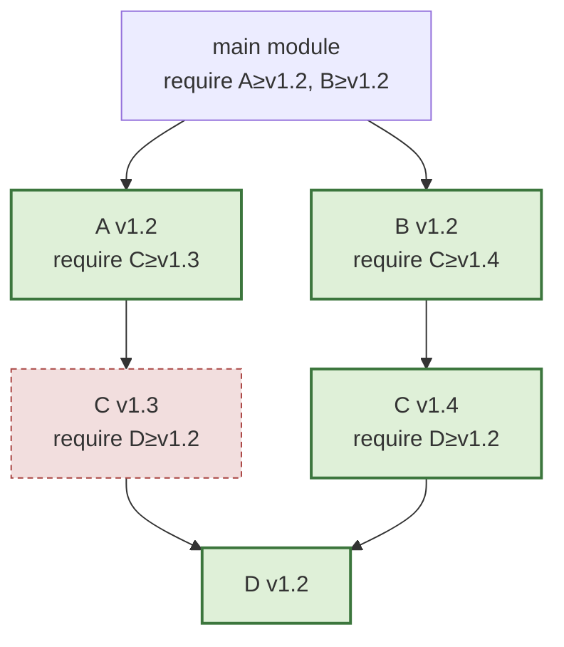

# 17.3 Minimal Version Selection

Having settled on semantic versioning ([17.2](./semantics.md)), one last question remains: when different modules in the dependency graph require different versions of the same dependency, **which version do we pick**? Go's answer is a counterintuitive yet remarkably concise algorithm, **Minimal Version Selection** (MVS). It is the most distinctive and the most thought-provoking part of Go's module design: other package managers turned this into a problem that needs a constraint solver, while Go compressed it into a single pass over a graph. This section first lays out the rules, then looks at why it can be this simple, and finally places it back within the broader lineage of the field to see exactly what it trades away and what it gains.

## 17.3.1 Pick the "lowest version that satisfies the requirements"

The MVS rule is surprisingly simple: for each dependency, pick **the highest of the lowest requirements among all requirements**, or to put it another way, pick the **lowest version that satisfies all module requirements**. Let us build intuition with the kind of small example this book favors. Your program directly requires C ≥ v1.2; dependency A requires C ≥ v1.3; dependency B requires C ≥ v1.1. The highest lower bound among the three requirements is v1.3, so MVS picks **C v1.3**. Note the key point here: even if C has already published v1.9 at this moment, MVS **does not pick v1.9**; it only picks the "lowest version that satisfies all requirements", namely v1.3.

Putting this rule into a real dependency graph gives the example used in Go's official documentation. The main module requires A ≥ v1.2 and B ≥ v1.2; A v1.2 requires C ≥ v1.3; B v1.2 requires C ≥ v1.4; and both C v1.3 and C v1.4 require D ≥ v1.2. Starting from the main module, MVS walks the whole graph along `require` edges, recording for each module the "highest requirement seen":



Each box in the graph corresponds to a `go.mod` on disk. The main module's file only states the lower bounds of its direct dependencies; the rest of the requirements are scattered across each dependency's own `go.mod`, and MVS reads them one by one as it walks the edges:

```go.mod
// go.mod of the main module (declares only the minimum versions of direct dependencies)
module example.com/main

go 1.26

require (
    example.com/A v1.2.0
    example.com/B v1.2.0
)

// in example.com/A@v1.2.0's go.mod: require example.com/C v1.3.0
// in example.com/B@v1.2.0's go.mod: require example.com/C v1.4.0
// in both versions of example.com/C: require example.com/D v1.2.0
```

For C, two requirements appear in the graph, v1.3 and v1.4, and taking the maximum gives v1.4; for D, the requirement is v1.2. The final build list is A v1.2, B v1.2, C v1.4, D v1.2. Note that C and D may well have higher versions already in their repositories, but "no module requires them", so MVS **will not** pick those; what it selects is precisely "the group of lowest version numbers per module that satisfies all requirements". This list can be seen right away with `go list -m all`:

```bash
$ go list -m all
example.com/main
example.com/A v1.2.0
example.com/B v1.2.0
example.com/C v1.4.0   # the maximum of v1.3 and v1.4
example.com/D v1.2.0
```

That is the whole algorithm: **walk the dependency graph, collect all version requirements for each module, and take the maximum among them (the highest lower bound)**. No backtracking, no constraint solver, no SAT; just one pass over the graph taking maxima. Written as pseudocode, the core is barely more than a dozen lines:

```go
// MVS build list (sketch): walk the dependency graph, take the highest required version for each module
func buildList(main module) map[path]version {
    selected := map[path]version{}        // currently selected version for each module
    queue := []module{main}               // module versions waiting to be visited
    for len(queue) > 0 {
        m := queue[0]; queue = queue[1:]
        for _, req := range requires(m) { // read the requires in m's go.mod
            if req.version > selected[req.path] { // take the highest lower bound
                selected[req.path] = req.version
                queue = append(queue, req)       // the subgraph of this version must be folded in too
            }
        }
    }
    return selected
}
```

There is also a plain equivalent description: compute the whole "rough build list" (every module version reachable in the graph), then keep only the **highest** version that appears for each module. Both formulations select the same group of versions.

## 17.3.2 One rule, four operations

People often mistakenly assume that MVS is just "computing a build list once". In his original write-up, Cox unified the everyday version operations under the same rule: they are all "tweak the graph, then run the max pass again":

- **Build list**: the default operation, as above, walking from the main module and taking the highest requirement. The time cost grows linearly with the number of modules.
- **Upgrade all** (`go get -u`): before running MVS, add to every edge in the graph a new edge "pointing at the latest version of each dependency", then take the maximum. This lifts the build list as a whole to the latest.
- **Upgrade one** (`go get C@v1.4`): add a single edge from the main module to the target version, fold in that version's subgraph, then take the maximum. Upgrading one module only incidentally upgrades the transitive dependencies it **actually needs**, without disturbing others for no reason.
- **Downgrade one** (`go get C@v1.2`): the reverse, **removing** from the graph all versions higher than the target, and along with them removing the modules that "require the deleted version" (they may be incompatible with the downgraded dependency), then taking the maximum. Downgrade is the dual of upgrade.

The four operations share one kernel: first adjust the dependency graph slightly according to intent, then run the same "take the highest lower bound" traversal. This sense of "one rule covering all scenarios" is itself part of the simplicity of MVS.

## 17.3.3 Why "minimal" is actually better

"Pick the lowest version" sounds strange; other package managers all lean toward picking the newest. But MVS picking the smallest brings exactly three key benefits, which correspond to the three challenges listed in [17.1](./challenges.md):

- **Reproducible**: the build result depends only on the requirements written in each module's `go.mod`; these requirements are fixed, so the selected versions are **deterministic** too. The same `go.mod` produces exactly the same build list today and a year from now, without drifting because "C published another new version today". For this reason Go **needs no lock file** to pin versions: `go.mod` itself is the single source of truth for versions. `go.sum` is responsible only for verifying the integrity of downloaded content (it stores the cryptographic hashes of each version); it comes into play **after** version selection and does **not** decide which version is picked. This point is often confused and worth remembering: look at `go.mod` to select versions, look at `go.sum` to verify content.
- **High-fidelity**: it selects the versions that each module author **explicitly tested and explicitly required**, rather than some newly published latest version that may have been tested by no one. The dependency versions a library is compiled against are exactly the group its author used when building it, lifted only when "forced" by a higher requirement elsewhere. Upgrades are therefore **explicit** (you only upgrade when you edit `go.mod`), rather than happening quietly at build time. Systems like Cargo and npm, which "take the latest feasible version by default", are exactly the opposite: a single `update` can combine code that was never tested together.
- **Simple**: a single max pass, with no NP-hard solving, and none of the solver-style unpredictability where "switching machines or switching one version yields a different solution". The algorithm is predictable, the result is explainable; when something goes wrong, you can derive it back with pen and paper.

Russ Cox's insight can be distilled into a single line: **others use a complex solver to find the "latest feasible version", while MVS uses the simplest algorithm to find the "most stable feasible version".** It returns the decision of "whether to use a new version" from "the automatic behavior of the build tool" back to "the developer's explicit choice". This is a profound shift in values: **determinism and trust take priority over automatically grabbing the new**. It is worth saying that "minimal" does not mean "stale": when you want a new version, a single `go get` upgrades it, and the tool hands the answer "use the new version" back to you plainly, leaving it to you to decide when to accept it.

## 17.3.4 A bit of theory: why it can be this fast

For readers willing to read on, here is the formal basis for the simplicity of MVS; readers who do not want to go deeper can skip this subsection, as the main thread does not depend on it. The general dependency-solving problem (finding a feasible assignment under a large number of "version compatibility" constraints) is equivalent to boolean satisfiability (SAT), which is **NP-complete**; this is precisely the complexity faced by the solvers behind npm, Cargo, pip, and apt, which in the worst case need exponential search and whose solutions may not be unique.

The reason MVS dodges this wall is that it constrains the problem into several subclasses of SAT that **can be solved in polynomial time**. Cox proves that the build-list problem itself is **NL-complete** (nondeterministic logarithmic space) and can be solved in **linear time** via graph reachability. The formula corresponding to the upgrade operation is a **Horn formula** (each clause has at most one positive literal), whose minimal solution that "makes as few modules true as possible" is unique; downgrade corresponds to a **dual-Horn formula**, whose minimal solution that "makes as few modules false as possible" is also unique. Linear time, unique solution, reproducible; all three stem from this deliberately narrowed constraint form.

This also explains why MVS **refuses** certain seemingly useful extensions. For example, "conditionally excluding a version" would introduce disjunction into the formula, breaking the Horn / dual-Horn form and pushing the problem back to NP-complete. Go therefore only allows the main module's `go.mod` to use `exclude` and `replace` (a dependency does not get to decide on its own), precisely to keep any party from breaking this good property of "solvable in polynomial time". The simplicity is not an oversight; it is an invariant that is strictly guarded.

## 17.3.5 The premises behind the minimalism

That MVS can be this simple comes down, in the end, to the two foundations laid earlier ([17.2](./semantics.md)).

First, the compatibility convention of **semantic versioning**. MVS assumes that "within the same major version, a higher version is compatible with a lower one", so "taking the highest lower bound that satisfies the requirements" is always safe; it will not break compatibility by lifting some dependency from v1.3 to the v1.4 that satisfies a requirement elsewhere. Without this convention, "taking the highest lower bound" could select an incompatible version, and the safety of the whole algorithm would no longer hold.

Second, **semantic import versioning**. Incompatible major versions have different import paths, are different packages, and can coexist in a single build, so MVS never has to "choose one of two incompatible versions"; that hardest case, the one most likely to trigger a solving explosion, has already been dissolved by the path rules at an earlier stage. What MVS faces is always only "picking a high-enough one within the same compatible family", and that is exactly what taking the maximum can handle.

In other words, the minimalism of MVS is built on "the earlier strong constraints having solved the hard problem in advance"; this is precisely the payoff of what [17.2](./semantics.md) calls "moving complexity forward": move the hard core into the design conventions, and what is left for the runtime algorithm is just a single max.

## 17.3.6 How others do it: lineage and evolution

Placed back within the whole field, MVS occupies a rather unique position. Mainstream package managers have almost uniformly chosen the "solver + lock file" route: npm, Yarn, Cargo, pip (the new resolver), Bundler, and apt all build in some kind of SAT or PubGrub-style solver, by default **taking the latest feasible version** under the constraints, then freezing the solving result into a lock file (`package-lock.json`, `Cargo.lock`, `Gemfile.lock`) to achieve reproducibility. The cost is twofold: the binary redundancy of manifest and lock needs to be kept in sync, and the solver carries unpredictability and occasional exponential time cost in corner cases.

Go does the opposite: not the latest, but "the lowest that satisfies the requirements"; not a solver, but a single traversal; no lock file, because `go.mod` plus a deterministic algorithm is enough on its own. Reproducibility shifts from "storing the result of one solve" to "the algorithm itself being deterministic". These are two different philosophies of dependency management, not a simple matter of better and worse: the solver route trades for the convenience of "automatically staying close to the latest", while the MVS route trades for the certainty of "reproducible, predictable, explainable". Cox himself admits that MVS is a deliberate bet that trades "giving up a little automatic freshness" for "enormous simplification".

In its evolution, MVS was proposed by Russ Cox in early 2018 in the `vgo` series of articles, entered the toolchain in experimental form with Go 1.11 (2018), and module mode became the default starting from Go 1.16 (2021). Go 1.17 (2021) introduced **module graph pruning**: from then on, `go.mod` writes an explicit `require` for every module that "provides a transitively imported package" (often with an `// indirect` note), so the `go` command can run MVS without loading the entire transitive dependency graph, further reducing the graph-traversal cost for large projects. Pruning does not change the selection semantics of MVS; it only makes it more economical at engineering scale.

As for the frontier, dependency management still has unresolved tensions. MVS provides reproducibility and predictability, but it does **not** proactively tell you that "a version you depend on has a known vulnerability"; security upgrades have to be driven by `govulncheck` and ecosystem tools (such as Dependabot) outside of MVS, landed by the developer explicitly editing `go.mod`. How to strike a balance between "determinism first" and "getting security fixes promptly" is a direction in which this system is still evolving; and how the two forces of "pick the lowest" and "push for upgrades" cooperate is an active topic in the current practice of the Go module ecosystem.

## 17.3.7 Summary

MVS is an excellent sample for observing Go's design philosophy: facing a problem that others solve with complex means (SAT solving), Go first uses strong constraints (semantic import versioning) to remove the hard core of the problem, then finishes with an algorithm of extreme simplicity (taking the highest lower bound); it obtains a reproducible, trustworthy, predictable result while pushing the implementation and mental burden to the minimum. **Simplicity is not a compromise of capability, but the result of placing complexity in the right position**; this sentence, running through the whole book, finds yet another confirmation in MVS. The next section ([17.4](./fight.md)) returns to the historical scene to see how the vgo route that MVS represents won out in its design contest with dep and became today's Go modules.

## Further reading

1. Russ Cox. *Minimal Version Selection.* 2018. https://research.swtch.com/vgo-mvs
   (the original design document of MVS: the algorithm, the four operations, the complexity proof, and the full argument for "why minimal is better")
2. The Go Authors. *Go Modules Reference: Minimal version selection.*
   https://go.dev/ref/mod#minimal-version-selection (the official specification, with the A/B/C/D build-list example)
3. Russ Cox. *Go & Versioning (the vgo series table of contents).* 2018. https://research.swtch.com/vgo
   (the overall design of semantic import versioning, minimal version selection, and the module protocol)
4. The Go Authors. *Module graph pruning (go.mod and the Go 1.17 pruning).*
   https://go.dev/ref/mod#graph-pruning (the engineering optimization of MVS on large dependency graphs)
5. Natalie Weizenbaum. *PubGrub: Next-Generation Version Solving.* 2018.
   https://medium.com/@nex3/pubgrub-2fb6470504f (a representative of the solver route, contrasting with the other path of MVS)
6. This book [17.1 The Difficulties of Dependency Management](./challenges.md), [17.2 Semantic Versioning](./semantics.md),
   [17.4 The vgo and dep Dispute](./fight.md).
