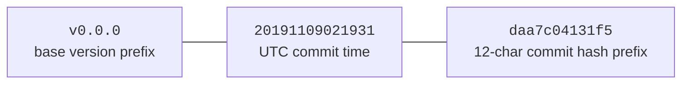
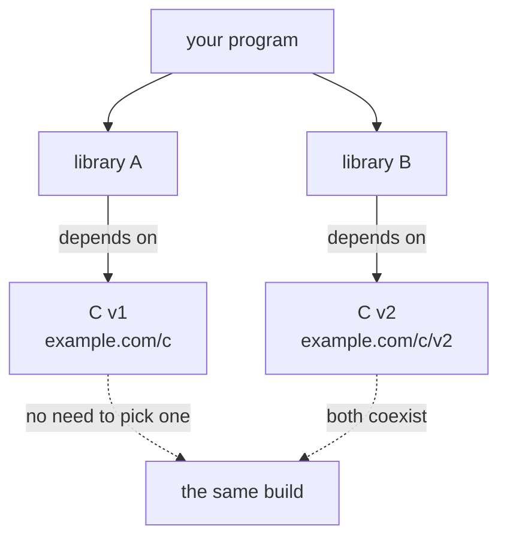

# 17.2 Semantic Version Management

To manage versions, we first have to make version numbers **mean something**. [17.1](./challenges.md)
reduced the difficulty of dependency management to two points: version conflicts in diamond
dependencies, and reproducible builds across machines and across time. Whether these two can be
solved depends on a more basic premise, **what a version number actually promises**. If the
relationship between `v1.5` and `v1.4` were entirely unpredictable, then no selection algorithm could
get started, and we would be forced back to a solver that "tries every pair of versions". The approach
Go modules take is to first turn the version number into a **contract a machine can trust**, and then,
on top of that contract, propose one distinctive and uncompromising rule, **semantic import
versioning**. This section makes both of these clear. They are the premise on which the version
selection algorithm of [17.3](./minimum.md) can stand, and stand simply enough to be "a single graph
traversal".

## 17.2.1 Semantic Versioning: Writing Compatibility Into the Numbers

Semantic Versioning (semver) was finalized as the 2.0.0 specification by Tom Preston-Werner in 2013.
Go modules adopt it directly, and uniformly prefix the version number with `v`. A version number has
the form **`vMAJOR.MINOR.PATCH`** (such as `v1.4.2`), where all three segments are non-negative
integers, and the increment of each segment carries a **conventionally specified meaning**:

- **PATCH** increment: "introduces only backwards-compatible bug fixes". `v1.4.1 → v1.4.2`, behavior
  unchanged, only correcting an error.
- **MINOR** increment: "adds functionality to the public API in a backwards-compatible way". `v1.4 →
  v1.5`, old code compiles and runs untouched, there is simply more available to use.
- **MAJOR** increment: "introduces backwards-incompatible API changes". `v1.x → v2.0`, old code may
  fail to compile, or its behavior may quietly change.

When this set of conventions is applied to a concrete change, which segment to increment is uniquely
determined by the nature of the change, with no room for discretion:

```text
Current version v1.4.2, what version number should the next release carry?
  Fixed a panic, no signature touched              → v1.4.3   (PATCH: compatible fix)
  Added an exported function Encode, old API intact → v1.5.0   (MINOR: compatible new feature)
  Removed Decode, or changed its parameter types    → v2.0.0   (MAJOR: breaks compatibility)
```

Note that each time a segment is bumped, the lower segments reset to zero: bumping the minor of
`v1.4.2` gives `v1.5.0` rather than `v1.5.2`, and bumping the major gives `v2.0.0`. This reset rule
guarantees that "under the same major version, the larger the version number, the more compatible
features it contains", so that the "take the maximum" of [17.3](./minimum.md) has a clear semantics.

The specification uses normative wording like **MUST**: the patch segment "**must** be incremented only
if backwards-compatible fixes are introduced", the minor segment "**must** be incremented if
backwards-compatible new functionality is introduced", and the major segment "**must** be incremented
if any incompatible change is introduced". The entire value of this convention lies in encoding a thing
that originally existed only in the author's head, "does this change break compatibility or not", into a
number a machine can read. When you see a bump from `v1.4` to `v1.5`, both you and the `go` command
know it is compatible, and can upgrade with confidence; when you see a bump to `v2.0`, you know you may
have to change code and re-test. **The version number is itself a compatibility promise.**

Semver also specifies two optional suffixes, which Go carries over: a **pre-release** identifier
introduced by a hyphen (`v1.5.0-rc.1`, lower priority than the release version, `v1.0.0-alpha <
v1.0.0`), and **build metadata** introduced by a plus sign (`v1.0.0+20130313`, ignored when comparing
priority). Among release versions, comparison proceeds segment by segment over the three numbers:
$v1.0.0 < v2.0.0 < v2.1.0 < v2.1.1$. This total order is precisely the mathematical basis on which the
selection algorithm of [17.3](./minimum.md) can "take the maximum".

Here we should point out a premise that is often overlooked: semver is a **social contract, not a fact
enforced by the compiler**. No tool can verify with one hundred percent certainty that an author truly
did not slip a breaking change into a PATCH release (tools such as `gorelease` and `apidiff` from Go
1.21 onward can help check differences in the exported API, but compatibility at the semantic level still
relies on the author's self-discipline). Go modules **depend heavily** on this convention; their entire
version selection logic ([17.3](./minimum.md)) is built on the assumption that "within the same major
version, a higher version is backwards compatible with a lower one". Once the convention is broken, it is
the downstream that gets hurt; and the semantic import versioning below exists precisely to give a
disciplined exit "when breakage is unavoidable".

There is also a class of version number that the semver specification itself does not have, yet which Go
needs in order for "take the maximum", this machine-made decision, to cover **untagged commits**, the
**pseudo-version**. When you depend on a commit in some repository that has no semver tag yet, the `go`
command synthesizes for it a version of the form `v0.0.0-20191109021931-daa7c04131f5`:



The pseudo-version is carefully designed to fall, in the semver total order, "after the tagged version
it is based on, and before the next release version", so that it can participate in the version
comparison of [17.3](./minimum.md) alongside real tags, without exception. This is an example of the
semver total order being carried through to the end in engineering: even if a commit was never named by
the author, Go still gives it a comparable, sortable, recordable version number.

## 17.2.2 Semantic Import Versioning: Writing the Major Version Into the Path

On top of semver, Go adds an unusually uncompromising rule, **semantic import versioning** (proposed by
Russ Cox): **when a module reaches v2 or a higher major version, its module path must carry a major
version suffix.** For example, the v1 of `example.com/mod`, upon reaching v2, must become
`example.com/mod/v2`, and at v3 it is `example.com/mod/v3`. The import then carries the suffix as well:

```go
import (
    "example.com/mod"      // this is v1 (including v0)
    "example.com/mod/v2"   // this is v2, "two different packages" from the one above
)
```

This rule stems from a plain yet profound principle, which Cox calls the **Import Compatibility Rule**,
in his own words:

> If an old package and a new package have the same import path, the new package must be
> backwards compatible with the old package.

Placing this rule alongside semver, the conclusion is forced out: by semver, a major version increment
**by definition** means not backwards compatible; by the import compatibility rule, incompatible code
**cannot** reuse the same import path. Multiplying the two together, the only way out is that **a new,
incompatible major version must use a new path**. So `example.com/mod/v2` is not a stylistic choice but
the inevitable corollary of the rule. Cox closes with an analogy: rather than giving the new API "a cute
but unrelated new name" (such as renaming an OAuth library to Pocoauth), better to call it `oauth2/v2`;
the version number itself becomes part of the name, preserving the clarity of semver while satisfying the
import compatibility rule.

The rule has a few corners in engineering, worth laying out together, otherwise the reader will hit them
the moment they upgrade:

- **v0 and v1 carry no suffix.** `v0` is the "unstable, no compatibility promised" development phase, and
  `v1` is usually a compatibility "settling" of the last `v0` rather than a breakage; both use the bare
  path `example.com/mod`. The suffix appears only starting from `v2`.
- **How a repository houses multiple major versions.** For one repository to provide both v1 and v2 at
  once, there are two common approaches: use a **major version branch** in the root directory (v2 code
  tagged `v2.x.x`), or open a **`/v2` subdirectory** in the repository to hold the v2 code separately
  with its own `go.mod`. Both are legal, and the `go` command recognizes both.
- **Historical baggage: `+incompatible`.** The module mechanism only entered the `go` command in 2018,
  and before that a large number of repositories had already tagged versions `v2.0.0` and above without a
  `go.mod` and without changing the path. To be compatible with them, the `go` command attaches an
  `+incompatible` suffix to such versions (such as `example.com/m v4.1.2+incompatible`), indicating "it is
  still treated as the same module at a lower major version". This is a compromise channel for the
  migration period, not the path a new module should take; when a new module migrates to v2, it simply
  changes the path properly.
- **The `gopkg.in` special case.** This versioned import service, which predates Go modules, wrote the
  major version into the path from the very start, and carried it from `v0` and `v1` onward, using a dot
  rather than a slash as the separator (such as `gopkg.in/yaml.v2`). It is in fact a "prequel" practice
  of semantic import versioning; Go modules standardized the same idea and extended it to all paths.

Seen within the wider ecosystem, the orientation of this rule is quite distinctive. Most languages put
version constraints in a manifest file separated from the source code (npm's `package.json`, Cargo's
`Cargo.toml`, Maven's `pom.xml`), the import statement **contains no version**, and a solver picks out a
set of compatible versions at build time. The price is that two incompatible major versions of the same
package are naturally **mutually exclusive**; either the solver reports a conflict, or it has to be
avoided through the kind of nested install npm uses, "stuffing different versions each into their own layer
of the `node_modules` subtree", which in turn causes the same type in two versions to be judged as
different types, planting hidden runtime errors. Go welds the version into the import path, which amounts
to moving "which major version" out of the manifest and into the type system itself; `mod` and `mod/v2`
are two unrelated packages at compile time, and their coexistence is a fact at the language level rather
than an installer's cleverness. This is exactly the root of its being "more troublesome, yet cleaner".

## 17.2.3 One Rule Unties One Knot

Semantic import versioning brings a consequence powerful enough to change the nature of the problem:
because `example.com/mod` (v1) and `example.com/mod/v2` are **two different import paths**, in the
compiler's eyes they are **two unrelated packages**, so they can exist in the same program at the **same
time**. This happens to dissolve the thorniest class of diamond dependency from [17.1](./challenges.md).

Imagine a dependency graph like this: your program uses both library A and library B, A depends on C's
v1, B depends on C's v2, and C's v1 and v2 are incompatible.



Down at the `go.mod` level, this coexistence is nothing special, just two unremarkable lines of
`require`, because to the `go` command they were two different modules all along:

```text
// go.mod
require (
    example.com/c     v1.7.0   // A depends on it indirectly
    example.com/c/v2  v2.3.1   // B depends on it indirectly
)
```

In a world without this rule (the GOPATH era, say, or the solver-based package managers of most
languages), in the end only **one** version of C can be linked into the program; choose v1 and B breaks,
choose v2 and A breaks, and this is precisely the most classic knot of "dependency hell". Under semantic
import versioning, A imports `example.com/c`, B imports `example.com/c/v2`, two paths, two packages, two
copies of code, the compiler compiles each on its own, and they do not fight. Cox describes it this way:
"the imports in all packages correspond exactly to what needs to be built." That **external constraint**
which would have required a solver to coordinate is **dissolved on the spot** within the import path.

It also incidentally enforces a good habit: when publishing a breaking change, the author **must
explicitly change the path** (bump the major version), which lets the downstream see clearly that "this is
an incompatible new version", and the upgrade becomes an open-eyed, deliberate migration rather than an
accident that quietly happens at build time. Putting the cost of a breaking change on the table itself
prompts the author to treat it more carefully; both the semver FAQ and Cox regard this "make breakage
expensive" as an extra benefit of the rule rather than a burden.

## 17.2.4 Design Trade-off: Moving Complexity Forward

Semantic import versioning is one of the smartest, and also one of the most controversial, designs in Go
dependency management, and it is worth stating its cost plainly.

The controversy lies in its **strictness**. Bumping to v2 once is not merely changing a number: you have
to change the module path, change the prefixes of all internal imports of each other accordingly, place
it specially in the repository (a subdirectory or a major version branch), and every import downstream
has to change along with it too. For a library author, this is a genuine nuisance, and the community once
had no shortage of complaints. Other systems' version constraints are often written in a separate manifest
file, easy to change; Go welds it into every line of import in the source code. Cox does not dodge this;
he admits that "introducing a new name for every incompatible change does have a cost", but his judgment
is that the cost is spent in the right place: it forces the author to face the impact of a breaking
change, and "an author who does not do this is in fact harming their users".

What it buys is that the whole version selection algorithm ([17.3](./minimum.md)) can become unusually
simple. In other ecosystems, the reason the solver has to do NP-hard backtracking and SAT solving is that
a large part of the effort goes precisely into "two incompatible versions can only have one chosen, and
how to choose so that the most constraints are satisfied". Semantic import versioning **erases this kind
of situation at the root**; incompatible versions are different packages, able to coexist, so the hardest
subproblem of "picking one of two" never arises at all, and only then can the MVS of
[17.3](./minimum.md) be simplified into "a single graph traversal taking the maximum lower bound", with
neither backtracking nor a solver.

This is a typical case of "**moving complexity forward**": moving the hard problem from "the solving
algorithm at build time" to "a single path constraint at publish time". The difficulty has not
disappeared; it has been relocated to an earlier, more explicit, and more controllable position; the
author pays a little more at the moment of publishing v2, and the entire ecosystem saves the whole cost
and uncertainty of solving at every build. This is of a piece with the "trade constraints for simplicity"
visible everywhere in Go (compare the MVS of [17.3](./minimum.md), and indeed the recurring theme of "place
complexity in the right position" throughout the book). With this path paved, the next section will show
how the selection algorithm of [17.3](./minimum.md) becomes, on this foundation, so simple that it hardly
looks like it is solving a "dependency resolution" problem at all.

## Further Reading

1. Tom Preston-Werner. *Semantic Versioning 2.0.0.* https://semver.org/
   (the normative definition of `vMAJOR.MINOR.PATCH` and the increment of each segment, the pre-release
   and build metadata syntax, the priority rules)
2. Russ Cox. *Semantic Import Versioning.* https://research.swtch.com/vgo-import
   (the original text of the import compatibility rule, the origin of the v2 path suffix, coexistence of
   multiple major versions)
3. The Go Authors. *Go Modules Reference: Major version suffixes, +incompatible versions,
   Pseudo-versions.* https://go.dev/ref/mod
   (v0/v1 carrying no suffix, repository housing approaches, the `+incompatible` migration channel, the
   pseudo-version format)
4. Russ Cox. *Go & Versioning (the overall discussion of the "vgo" series of articles).* https://research.swtch.com/vgo
5. The Go Authors. *golang.org/x/exp/cmd/gorelease, golang.org/x/exp/apidiff*
   (helping to check exported API compatibility, providing tool support for semver self-discipline).
6. This book's [17.1 The Difficulties of Dependency Management](./challenges.md), [17.3 The Minimum Version Selection Algorithm](./minimum.md).
