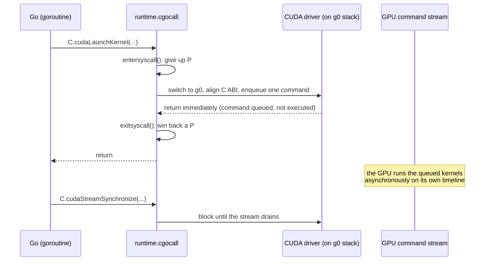
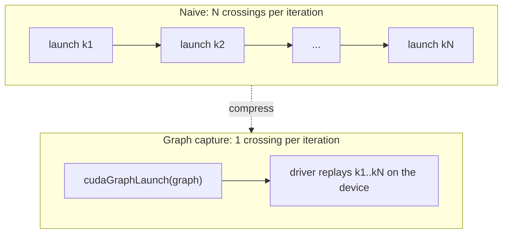

# 18.1 Crossing the FFI Boundary

[15.6](../../part5toolchain/ch15compile/cgo.md) already took the cgo bridge apart: a call
from Go into C must switch to the `g0` system stack, lay the arguments out again according
to C's ABI, `entersyscall` to give up the P, make the call, then `exitsyscall` to win back
a P, and the whole round comes out one or two orders of magnitude more expensive than a Go
call. The conclusion of that section was blunt: cgo suits a **small number of
coarse-grained** calls, and its worst enemy is a hot loop that crosses the boundary again
and again.

Set that conclusion in front of a GPU and the tension sharpens at once. The essence of GPU
programming is precisely to **cross the boundary often**. An ordinary inference or render
has the CPU side doing nothing but three kinds of thing: copy data from host memory to
device memory, launch one kernel after another, and copy results back. Every one of them
is a boundary crossing that leaves Go and enters the driver. A neural network of any size
has hundreds or thousands of operators, and launching them one by one, naively, is hundreds
or thousands of cgo calls strung along a single critical path. Section 15.6 says "do not
cross the boundary inside a tight loop," and the GPU workload is by nature grown inside
exactly such a tight loop. What this section answers is this: when crossing is unavoidable
and must be frequent, how should the boundary be designed so that the toll does not crush
it.

## 18.1.1 The Other Side of the Boundary: a World of Asynchronous Commands

First, see clearly who stands on the far side of the bridge. When you call a C library
function from Go, the far side is a stretch of C code that runs synchronously, and by the
time the call returns the work is done. The GPU is not like this. What the CPU side calls
is not "the computation itself" but **a command issued to the device**.

Take CUDA as an example. The software stack splits into two layers. The lower one is the
**driver API** (`libcuda`, prefixed `cu`), corresponding directly to the capabilities the
kernel-mode driver exposes; the upper one is the **runtime API** (`libcudart`, prefixed
`cuda`), which wraps the driver API more conveniently and manages contexts and modules
automatically. Whichever layer you go through, a single `cudaLaunchKernel` or
`cudaMemcpyAsync` on the CPU side merely stuffs a command into a queue called a **stream**
and then **returns immediately**. The actual computation is finished asynchronously by the
GPU on its own timeline. The CPU issues orders, the GPU does the work, and the two run on
different clocks.



This "enqueue and return" semantics is the fulcrum of everything that follows. It means the
cost of crossing the boundary (that one-or-two-orders-of-magnitude cgo tax) and the GPU's
actual computation **can overlap**: by the time the CPU has paid the toll and returned to
Go to issue the next order, the GPU is still digesting earlier commands. As long as
commands are issued fast enough that the queue does not run dry, the GPU never sits idle,
and the cgo tax is hidden in the shadow of the computation. Conversely, if you synchronize
after every command (`cudaStreamSynchronize`), all the benefit of asynchrony is lost, and
the fixed cost of the crossing is strung nakedly along the critical path, not one of them
saved.

## 18.1.2 Two Latencies, Do Not Confuse Them

There are in fact two distinct costs stacked on the boundary, and beginners often run them
together. Tell them apart and you can treat the right one.

The first is the **cgo crossing cost**, coming from the Go side: the state transition
section 15.6 dissected, switching stacks, `entersyscall`/`exitsyscall`, ABI alignment. It
is the fixed tax of the action "enter C from Go," and it has nothing to do with whether the
far side is a GPU; any C call pays it.

The second is **kernel launch latency**, coming from the GPU side. A launch command, from
being enqueued, through the driver and the hardware's command processor, to actually
beginning execution on the GPU, has an inherent latency on the order of microseconds. This
is a physical property of the device, with nothing to do with Go; C++ calling CUDA directly
cannot dodge it either.


Why separate the two? Because the responses differ. The first is specific to Go/cgo and can
in principle be trimmed by "routing around cgo," which is the topic of 18.1.4; the second
is inherent to the device, the same in any language, and can only be hidden inside an
overlap through **asynchrony and batching**, which is the topic of 18.1.3. Blaming GPU
slowness simply on "Go's cgo being too heavy" is often miscounting the second cost as the
first. For a coarse-grained large kernel, the computation runs into milliseconds and both
latencies together are negligible; what is truly dragged down by these two costs is a large
number of **small, fragmented kernels**, where the fixed overhead takes the lion's share.

## 18.1.3 Amortizing the Toll: Asynchrony, Batching, and Graph Capture

Since both the boundary crossing and the launch latency are fixed costs charged "once per
time," the only general idea for trimming them is to **reduce the number of crossings and
pack more work into each one**. This is the same medicine 15.6 prescribed for cgo,
"coarse-grained calls," only on the GPU it comes in a few sharper dosages.

**First, issue asynchronously and synchronize late.** Do not follow each command with a
synchronization. Push a whole run of kernels and copies asynchronously into the same stream,
and synchronize only once, at the moment you actually need the result. Then the boundary
crossings of the N commands overlap one another and overlap the GPU computation, and only
the wait for that last synchronization remains on the critical path.

```go
// Anti-pattern: synchronize after every command. N kernels pay N times
// "crossing + launch latency + waiting the whole way through"
for _, op := range ops {
    C.launch(op)                    // enqueue
    C.cudaStreamSynchronize(stream) // wait for it right now: asynchrony wasted
}

// Correct: pack the stream asynchronously, synchronize once at the end
for _, op := range ops {
    C.launchAsync(op, stream) // enqueue only, return immediately
}
C.cudaStreamSynchronize(stream) // the whole batch is done, wait just this once
```

**Second, batching.** Merge many small kernels into one large kernel at the algorithm
level, reducing the number of launches at the source. The "operator fusion" of deep
learning frameworks does exactly this: fuse `matmul → add bias → activation` into a single
kernel, three launches becoming one. This step usually happens in a compute-graph compiler
outside Go, but it directly decides how many times the Go side has to cross.

**Third, graph capture (CUDA Graphs).** This pulls the rug out from under the previous two.
In many workloads, the **structure** of that long run of commands is the same on every
iteration, and only the data changes. CUDA Graphs lets you **capture** the whole command
sequence into a static graph, after which each iteration needs only a single
`cudaGraphLaunch`, and the driver replays the entire graph in one go on the device side.
The original N boundary crossings plus N launch latencies are compressed into **one**. For
an inference graph made of hundreds of small operators with a fixed structure, this can trim
the CPU-side issuing cost by an order of magnitude.



All three dosages share one principle: **the number of boundary crossings is the variable
the Go side can actually move**. How fast the kernel computes is the GPU's business; what
the Go side can do is make every expensive crossing carry as much cargo as possible.

## 18.1.4 Routing Around cgo: Trimming the First Cost Too

We said the first cost (the cgo crossing) "can in principle be routed around." That is not
idle talk; the Go ecosystem does have two paths.

One is **`purego`** (maintained by the Ebitengine project). At runtime it loads a shared
library with `dlopen`/`dlsym`, then uses a hand-written assembly trampoline to call the
function address directly by the platform ABI, thereby **bypassing cgo's code generation
entirely**. Its motive is first of all an engineering one: not depending on a C compiler,
and so keeping the things 15.6 said cgo would forfeit, static builds, cross-compilation,
fast builds. It is worth noting that `purego` still has to reuse the runtime's `cgocall` to
do the stack switch and `entersyscall`; the comment at the top of `runtime/cgocall.go`
names it specifically. That is, what it routes around is cgo's **build-time** cost, not the
state transition of that one runtime-side crossing; the core of the first cost is still paid.

The other is more thorough but holds only in a specific case: when the "C library" is in
fact a **remote service**, there is no need to link it into the same process at all. Put
the GPU inference in a separate service process (often written in C++/Python, snug against
CUDA), and have the Go side talk to it over gRPC or shared memory. Then the Go process has
not a line of cgo in it, and the boundary turns from "in-process FFI" into "inter-process
IPC." The price is an extra serialization and a cross-process copy; the gain is a perfectly
clean Go side. This is exactly the deployment shape Chapter 20 will return to again and
again: Go stands at the serving and orchestration layer, with the dirty work pressed
tight against the device walled off in another process.

Either path says the same thing: the FFI boundary is not an iron law of all-or-nothing but
a movable design choice. You may put it at the granularity of a **function call**
(cgo/purego, the most intimate and fastest, but it pollutes the toolchain), or at the
granularity of a **process** (IPC, the cleanest, but with a serialization cost). Where you
put it depends on how frequent the calls are, how large the data is, and how much you care
about that pure-Go toolchain.

## Summary

The GPU lifts that "cross less" admonition of 15.6 from a piece of experience into a design
spine. The reason is that a GPU workload is by nature made of a large number of
fine-grained commands, and every command is a boundary crossing. The remedy lies not in
making a single crossing faster (its cost is structural), but in **reducing the number of
crossings**: use asynchrony to overlap crossings with GPU computation, use batching and
operator fusion to reduce commands at the source, use graph capture to compress a whole
command sequence into one crossing. Failing all that, you can still move the whole boundary
out of the process.

This section spoke only of "cross fast, cross seldom." But the bridge carries two more
things not yet detailed: one, what happens to the P given up and the M pinned when some
crossing **really does block for a long time** (such as that trailing
`cudaStreamSynchronize`), which is the business of [18.2](./sched.md); two, the pointers
passed back and forth on the bridge, which are Go's, which are the device's, and how the GC
should treat them, which is the business of [18.3](./memory.md).

## Further Reading

1. NVIDIA. *CUDA C++ Programming Guide.*
   https://docs.nvidia.com/cuda/cuda-c-programming-guide/
   (the authoritative definition of asynchronous concurrent execution, streams,
   `cudaMemcpyAsync`, and synchronization semantics)
2. NVIDIA. *CUDA Driver API* and *CUDA Runtime API.*
   https://docs.nvidia.com/cuda/cuda-driver-api/ ,
   https://docs.nvidia.com/cuda/cuda-runtime-api/
   (the layering of the driver API and the runtime API)
3. NVIDIA. *Getting Started with CUDA Graphs.* NVIDIA Technical Blog, 2019.
   https://developer.nvidia.com/blog/cuda-graphs/
   (how graph capture compresses a long run of launches into one submission to trim launch
   overhead)
4. The Go Authors. *runtime/cgocall.go.*
   https://github.com/golang/go/blob/master/src/runtime/cgocall.go
   (the cgocall reuse and the mention of `purego` by name, see the comment at the top of
   the file)
5. Ebitengine. *purego.* https://github.com/ebitengine/purego
   (runtime FFI without cgo: `dlopen`/`dlsym` plus an assembly trampoline)
6. This book: [15.6 cgo](../../part5toolchain/ch15compile/cgo.md),
   [2.2 Calling Convention](../../part1overview/ch02asm/callconv.md),
   [18.2 The Scheduler and Blocking Foreign Calls](./sched.md),
   [18.3 The Divide Between Device Memory and the Garbage Collector](./memory.md).
