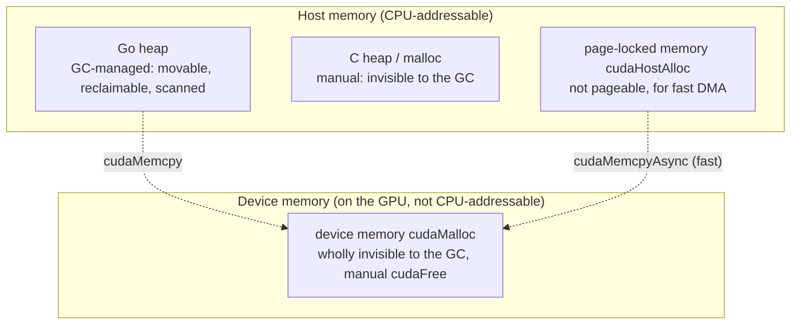

# 18.3 The Divide Between Device Memory and the Garbage Collector

[15.6](../../part5toolchain/ch15compile/cgo.md) covered cgo's pointer rules: Go's objects do
not belong to C, the GC may move or reclaim them at any time, and so C must not hold an
unpinned Go pointer after the call returns. That was deduced from a binary world of "two
memories, Go's and C's." The GPU complicates this map: now there are at least **four** kinds
of memory, under different jurisdictions and obeying different rules. This section first
draws that map clearly, then sees where the dividing lines between the garbage collector
and each of them fall, and which line is most easily trampled in asynchronous transfers.

## 18.3.1 A Memory Map

A program using Go to drive a GPU faces, roughly, four blocks of memory:



Of the four, only the first, the **Go heap**, is GC-managed; the allocation and reclamation,
the reachability scanning of Chapters 12 and 13, reach exactly this far. The latter three
are "abroad" as far as the GC is concerned: the C heap is manually `malloc`/`free`, the
page-locked memory is allocated by CUDA, and the **device memory is not in the CPU's address
space at all**, the CPU cannot even dereference it. The whole knack of this section is to
keep clear, at all times, which block a given pointer falls in.

## 18.3.2 A Device Pointer Is Not a Go Pointer

First, a fact that lets you breathe out. What `C.cudaMalloc` returns is a **device address**;
it points to some location in device memory. In a Go program this address is usually held as
an `unsafe.Pointer` or a `uintptr`, but it **does not point into host memory** at all, much
less into the Go heap. To the CPU it is just a number that cannot be dereferenced.

The direct consequence is that **cgo's pointer rules do not apply to a device pointer, and
the GC never touches it**. That recursive `cgoCheckPointer` scan in 15.6, that prohibition
of "a Go pointer must not point to an unpinned Go pointer," all target "pointers into the Go
heap." A device pointer does not point into the Go heap, so it can be passed freely to C,
stored in a C struct, held for the long term, without violating a single pointer rule;
cgocheck will not panic on it, and the collector will not scan one extra byte for it.

The price is on the other pan of the scale: **device memory is entirely manually managed**.
The GC will not reclaim a block of device memory `cudaMalloc`ed for you; you must `cudaFree`
it yourself, and forgetting is a device-memory leak. Go's memory safety does not hold on
this soil; the rule here, as with `C.malloc`, is C's rule. A common, prudent practice is to
wrap the device pointer in a Go wrapper type with a `Free()` method, and use
`runtime.AddCleanup` (or `SetFinalizer`) as a backstop, so that when a Go object is
reclaimed it releases the device memory in its name along with it.

## 18.3.3 Do Not Confuse the Two "Pins"

GPU programming has two things both called "pin," belonging to different regions of the map
above, and beginners confuse them all too easily. Setting them side by side is the key to
this section.

**First, pinning in the GC sense: `runtime.Pinner` (Go 1.21).** It acts on the **Go heap**,
to make the GC neither move nor reclaim some Go object for a stretch of time. Its
documentation says it plainly: a `Pin`ned object "will not be moved or freed by the garbage
collector until Unpin," and it specifically supports "letting C memory safely retain that Go
pointer even after the cgo call returns, provided the object remains pinned." This is the
lighter hand 15.6 mentioned, lighter than `C.malloc`.

**Second, pinning in the operating-system sense: page-locked / pinned memory
(`cudaHostAlloc`, `cudaMallocHost`).** It has nothing to do with the GC, and acts on the
operating system's **paging**: lock a block of host memory so the OS pager does not swap it
out to disk. Why does the GPU care? Because the GPU reads and writes host memory directly by
DMA, and DMA requires the target physical pages to **stay put**. An ordinary pageable block
the DMA engine cannot safely move on its own; page-locked memory it can, and so asynchronous
transfer (`cudaMemcpyAsync`) only truly runs with it.

| | `runtime.Pinner` | page-locked memory `cudaHostAlloc` |
|---|---|---|
| jurisdiction | Go's garbage collector | the OS pager |
| acts on | objects on the Go heap | host physical pages |
| prevents | GC move / reclaim | OS swap-out / relocation of physical pages |
| problem solved | C safely retaining a Go pointer | fast, asynchronous DMA transfer |

The two names collide, the meanings are orthogonal. A `[]byte` on the Go heap is both
**movable by the GC** and **swappable by the OS**; `Pinner` holds down only the former, not
the latter. Which leads to the most error-prone scenario in the next subsection.

## 18.3.4 Asynchronous Transfer: the Implicit Pin Is Not Enough

Copying a Go `[]byte` to device memory has two spellings, synchronous and asynchronous, and
their safety differs by a world.

**The synchronous copy is safe.** `cudaMemcpy` does not return until the data is moved during
the C call. As 15.6 said, a Go pointer passed in during a call is "implicitly pinned," and
the whole copy happens inside that implicit-pin window, so handing over `&buf[0]` directly
is no problem:

```go
buf := make([]byte, n)
// synchronous: the copy completes inside the call, implicit pin covers it all, safe
C.cudaMemcpy(dst, unsafe.Pointer(&buf[0]), C.size_t(n), C.cudaMemcpyHostToDevice)
```

**The asynchronous copy hides a lifetime that does not line up.** `cudaMemcpyAsync` pushes
the transfer command into the stream and **returns immediately**; the actual DMA happens at
some later moment (18.1's "enqueue and return"). The problem is right here: the implicit pin
lasts only until the **call returns**, while the DMA happens **after** the call returns. The
windows do not line up. Once the call returns and the implicit pin lapses, the GC regains the
freedom to move or reclaim `buf`, and at that moment the DMA may be about to read it, reading
a block of memory already moved or repurposed.

```go
// Wrong: after the async copy returns, the implicit pin has lapsed, but the DMA has not happened
C.cudaMemcpyAsync(dst, unsafe.Pointer(&buf[0]), C.size_t(n), kindH2D, stream)
// ←─ the call has returned, the implicit pin ends here; the GC may now move buf, but the DMA has not read it

// Correct 1: use a Pinner to extend the pin past the moment the DMA actually completes (stream sync)
var pinner runtime.Pinner
pinner.Pin(&buf[0])
C.cudaMemcpyAsync(dst, unsafe.Pointer(&buf[0]), C.size_t(n), kindH2D, stream)
C.cudaStreamSynchronize(stream) // the DMA is now genuinely complete
pinner.Unpin()                  // only now unpin

// Correct 2 (better): put the data directly in host memory the GC cannot touch and is page-locked
//   this both sidesteps the GC lifetime problem and meets DMA's page-locking requirement,
//   and the asynchronous transfer is faster too. The price is that this memory must be cudaFreeHost'd yourself
h := C.cudaHostAlloc(...) // page-locked, not the Go heap
// ... fill h with data ...
C.cudaMemcpyAsync(dst, h, C.size_t(n), kindH2D, stream)
```

This example brings the orthogonality of 18.3.3's two "pins" down to earth: correct 1 uses
`Pinner` to solve the **GC lifetime** problem (keeping `buf` still during the DMA), but `buf`
is still pageable and the DMA performance is not optimal; correct 2 uses page-locked memory
to solve both the **lifetime** (it is outside the GC's view) and the **DMA performance** (it
is page-locked) at once, at the price of returning to manual management. Real high-performance
data paths almost all use correct 2, and reuse such a page-locked buffer as a "staging
buffer," ferrying data back and forth between the Go heap and device memory.

## 18.3.5 Unified Memory: Blurring the Line, but Not Abolishing It

Recent hardware and drivers offer **unified memory** (`cudaMallocManaged`): one pointer that
both CPU and GPU can dereference, with the driver migrating physical pages between host and
device automatically by page fault. It does smooth over the rift between "host pointer" and
"device pointer," and is much easier to write.

But see clearly: what it blurs is the dividing line of the **address space**, not the
dividing line of **ownership**. This unified memory is still allocated by `cudaMallocManaged`
and freed by `cudaFree`, still outside the Go heap, still not GC-managed. It hands "whether
the programmer must write `cudaMemcpy` by hand" off to the driver, but it does not hand
"who reclaims this memory" off to the GC. For the spine this book keeps stressing, the
conclusion has not changed: **as long as the memory is not in the Go heap, the garbage
collector neither governs its life nor guarantees its safety**. Unified memory only makes
the cross-boundary data movement smoother; the dividing line itself is still there.

## Summary

The GPU expands cgo's "two memories" into four, while the garbage collector's jurisdiction
still reaches only the Go heap. From this fall a few dividing lines: a device pointer is not
a Go pointer, so it is exempt from the pointer rules but also gets no GC reclamation and must
be `cudaFree`d by hand; the two things both called "pin" belong to the GC and the OS
respectively, orthogonal and not interchangeable; asynchronous transfer is the most
error-prone, because the implicit-pin window is shorter than the DMA's lifetime, so either
use `Pinner` to extend the window past stream sync, or simply put the data in page-locked
non-Go memory; unified memory blurs the address space but does not return ownership to the
GC.

With this, [18.1](./boundary.md)'s "cross the bridge fast," [18.2](./sched.md)'s "crossing
the bridge occupies a thread," and this section's "who owns the memory on the bridge" have
said all three things on the FFI boundary. The last section, [18.4](./model.md), returns to
the concurrency model itself, to see just what the relation is between the GPU's asynchrony,
the device's parallelism, and the concurrency of goroutines.

## Further Reading

1. The Go Authors. *runtime.Pinner.* https://pkg.go.dev/runtime#Pinner
   (the semantics of `Pin`/`Unpin`: prevent the GC from moving or reclaiming, and support C
   retaining it after the call returns)
2. The Go Authors. *runtime.AddCleanup* and *runtime.SetFinalizer.*
   https://pkg.go.dev/runtime#AddCleanup
   (hanging a release callback on a Go object that wraps device memory, as a backstop for
   device-memory lifetime)
3. NVIDIA. *CUDA C++ Programming Guide: Page-Locked Host Memory / Unified Memory.*
   https://docs.nvidia.com/cuda/cuda-c-programming-guide/
   (`cudaHostAlloc` page-locked memory and DMA, `cudaMallocManaged` unified memory)
4. NVIDIA. *How to Optimize Data Transfers in CUDA C/C++.* NVIDIA Technical Blog.
   https://developer.nvidia.com/blog/how-optimize-data-transfers-cuda-cc/
   (why page-locked staging buffers and asynchronous transfer are faster)
5. This book: [12 Memory Allocation](../../part4memory/ch12alloc),
   [13 Garbage Collection](../../part4memory/ch13gc),
   [15.6 cgo Pointer-Passing Rules](../../part5toolchain/ch15compile/cgo.md),
   [18.1 Crossing the FFI Boundary](./boundary.md),
   [18.2 The Scheduler and Blocking Foreign Calls](./sched.md).
