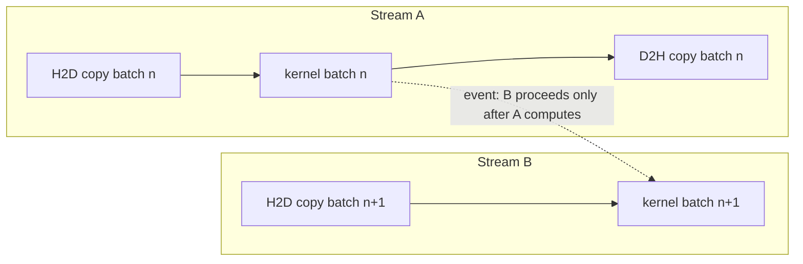

# 18.4 The Asynchronous Programming Model

The previous three sections all spoke of the "costs" on the FFI boundary: cross fast
([18.1](./boundary.md)), crossing occupies a thread ([18.2](./sched.md)), who owns the
memory on the bridge ([18.3](./memory.md)). This section changes the angle and returns to
the **concurrency model** itself. Go's concurrency is goroutines and channels, the GPU's
concurrency is something else, and the CPU hides a third kind. Laying these three
parallelisms out clearly and seeing how they connect is the close of this chapter, and the
key to understanding "when to push the work across the boundary, and when there is no need
at all."

## 18.4.1 Three Parallelisms, Do Not Confuse Them

The distinction between "concurrency" and "parallelism" was made in Chapter 9 in Rob Pike's
words: concurrency is the **structure of breaking a program into independently advanceable
parts**, parallelism is the **fact of executing at the same time**. With this ruler in hand,
it is clear what position each of these three takes.

- **Goroutine concurrency.** Go's signature skill, M:N **task-level** concurrency. Each
  goroutine is an independent thread of control, cheap, blockable, communicating through
  channels. It answers "how to organize a program into many concurrent tasks."

- **SIMT (GPU).** Single Instruction, Multiple Thread. A single kernel launch spreads out a
  grid of tens of thousands of threads that **run the same program, each processing one data
  element**, and the hardware advances them near-lockstep in units of a warp (32 threads to
  a group on NVIDIA). It answers "how to let a vast number of data elements be rolled over
  in parallel by the same computation." The programming model is: write the kernel for a
  single element, then launch a whole grid.

- **SIMD (CPU).** Single Instruction, Multiple Data. Within **one** CPU core, a single
  instruction acts at once on the several data lanes in a vector register (4, 8, 16 wide). It
  is the CPU's own **data-level** parallelism, needing no GPU, crossing no boundary.

These three are **orthogonal axes**, stackable: a Go program may well use goroutines to
handle many requests concurrently, vectorize the CPU inner loop of each request with SIMD,
and push the heaviest matrix multiply to the GPU as SIMT. Confusing them (for instance, "a
GPU thread is like a goroutine") steers the design wrong from the start: a goroutine is born
for a **blockable task**, a GPU thread is born for **branchless dense arithmetic**, and the
two design assumptions are poles apart.

## 18.4.2 Streams and Events: the Device Brings Its Own Concurrency, Go Only Feeds It

We have already met the GPU's asynchrony in [18.1](./boundary.md): commands return on
enqueue, and the GPU executes on its own timeline. What organizes this asynchrony are two
primitives.

**A stream is the device's unit of concurrency.** Commands within one stream execute
serially in submission order; different streams are independent of each other and can
overlap. So "do an H2D copy with stream A while computing the previous batch's kernel with
stream B" becomes possible, and transfer and computation go parallel. **An event is a
fine-grained synchronization point**: `cudaEventRecord` buries a marker in a stream, and
`cudaStreamWaitEvent` makes another stream wait for that marker to arrive. Streams plus
events, in essence, spell out a **directed acyclic graph of asynchronous tasks** (a DAG).



The crucial realization is here: **the device already comes with a full concurrency model**.
The DAG made of streams and events is exactly how the GPU side organizes asynchronous work.
What the Go side must do is **not re-implement it with goroutines**, but **feed it and
observe it**. A common anti-pattern is to spin up a goroutine per kernel and have the
goroutine synchronously wait for it, which lands squarely on the thread inflation of
[18.2.3](./sched.md) and also crudely simulates, with a pile of expensive blocking threads,
a DAG the device already has.

The correct connection is to align Go's concurrency granularity to the **independent
pipeline**, not the single kernel:

```go
// one goroutine per independent pipeline, each owning a stream (the single-owner shape of 18.2.5)
// goroutines pass "this batch is done" over channels, not each kernel
func pipeline(in <-chan Batch, out chan<- Result) {
    stream := C.cudaStreamCreate(...)
    for b := range in {
        submitAsync(stream, b)            // a whole copy-in -> compute -> copy-out, async into the stream
        C.cudaStreamSynchronize(stream)   // synchronize only at this pipeline's boundary, once
        out <- collect(b)
    }
}
```

The goroutines handle **task-level** orchestration (which pipeline, how batches flow, who
gets the result), and streams and events handle **device-level** asynchrony and dependency.
Two concurrency models, each to its own duty, stitched cleanly at the place where "one
goroutine owns one stream." This is exactly what it looks like to bring Chapter 10's
channels and [18.2.5](./sched.md)'s single-owner shape down to heterogeneous compute.

## 18.4.3 SIMD: the Parallelism That Crosses No Boundary

Pull the lens back from the GPU to the CPU, and you find the third parallelism has a
property the previous two could only wish for: **it crosses no boundary at all**.

SIMD is data parallelism inside the CPU core; the data is right there in host memory, right
there on the Go heap, and the computation happens in place. This means not one bit of the
whole set of costs from the previous three sections need be paid: no cgo boundary crossing,
no launch latency, no H2D/D2H copy, no device memory, no page-locking, no `Pinner`, and no
trouble for the scheduler whatsoever. It is the form "data parallelism" takes **inside**
Go's world, the exact mirror image of the bridge in [18.1](./boundary.md).

In the past, for a Go program to use SIMD there were only two undignified paths: write
**assembly by hand** (the runtime, `crypto`, and many high-performance libraries do this to
this day), or detour through cgo, both of which push the code out of readable, portable Go.
**Go 1.27 introduces an experimental `simd` package** (requiring `GOEXPERIMENT=simd`), which
for the first time lets SIMD be expressed in portable Go:

```go
//go:build goexperiment.simd
import "simd"

// add two float32 slices element-wise, compiled to one vector instruction per lane-group
func addVec(a, b, dst []float32) {
    var z simd.Float32s
    lanes := z.Len()                // how many float32 a vector holds, decided by the hardware at runtime
    i := 0
    for ; i+lanes <= len(a); i += lanes {
        va := simd.LoadFloat32s(a[i:])
        vb := simd.LoadFloat32s(b[i:])
        va.Add(vb).Store(dst[i:])   // one AVX/NEON add covers many lanes
    }
    for ; i < len(a); i++ {         // handle the tail remainder shorter than one vector
        dst[i] = a[i] + b[i]
    }
}
```

Two points, consistent with what we said before and worth stressing: first, **vector length
agnostic**. Types like `Float32s` and `Int8s` do not hard-code a width; the same code uses
wider registers on a machine with AVX512 and narrower ones where there is only NEON, the
width given at runtime by `.Len()`, with no need to assume it when writing the code. Second,
**use the hardware where present, emulate where absent**. Underneath it maps through
`simd/archsimd` to amd64's AVX/AVX2/AVX512 or arm64's NEON, and degrades to pure-Go
emulation where there is no corresponding hardware, guaranteeing portability. It also
provides mask types to express "act only on the lanes that meet a condition," and a fused
multiply-add like `MulAdd`, which is exactly the staple of the hottest inner loops of matrix
multiply, convolution, and geometric transforms. It must be honestly labeled: as of this
writing, `simd` is still an **experimental feature of Go 1.27**, its API may change, and it
needs `GOEXPERIMENT` turned on explicitly. But the direction it points is clear: take a
class of parallelism once obtainable only through assembly or the GPU, and bring it back
inside the Go language, back onto that fast path that crosses no boundary.

## 18.4.4 To Cross or Not: Settling the Whole Chapter's Accounts

With SIMD as a "no-crossing" reference, the chapter's whole cost account can finally be added
up in one place. For the same piece of data-parallel computation, the choice before you is
often two options: **compute it in place with SIMD on the CPU**, or **push it across the
boundary to the GPU's SIMT**?

The two pans of the scale are exactly the things the previous four sections kept weighing.
The GPU's throughput is far higher, but to cash in that throughput you must first pay in full
the tolls of 18.1 through 18.3: the boundary crossing, the launch latency, the two-way data
copy, the manual management of device memory. SIMD has no toll at all, but the parallel width
of a single core is limited and the throughput ceiling is far lower. So:

- **Small data, low arithmetic intensity, or data already on the Go heap**: SIMD usually
  wins. The tolls would eat up what little throughput advantage the GPU has, even running it
  at a loss. Processing only a few thousand elements at a time, the copy in and out alone is
  enough for the CPU to compute it several times over.
- **Large data, high arithmetic intensity, and reused repeatedly**: the GPU wins. When the
  kernel's computation is large enough, the tolls are amortized to the point of being
  ignorable, and SIMT's massive parallelism is truly cashed into overwhelming throughput.
  Moving the data onto device memory once, computing repeatedly, and fetching it back only at
  the end is precisely to spread that fixed toll over as much computation as possible.

This trade-off has no one-size-fits-all threshold; it shifts with data scale, arithmetic
intensity, and hardware. But it gathers the whole chapter into a single sentence: **the cost
of the FFI boundary is precisely the scale that judges "whether the GPU is worth it."** Only
by counting the boundary's cost clearly do you know whether a piece of computation should
stay in Go's world and be handled in place with SIMD, or is worth pushing across the bridge
to borrow the GPU's massive parallelism.

## Summary

This chapter used four sections to dissect the FFI boundary between Go and the GPU: the fixed
cost of crossing forces us to reduce crossings and use asynchrony to hide the cost inside an
overlap (18.1); a real block occupies a whole thread, relies on sysmon to take back the P,
and at concurrency turns into thread inflation, pushing the design toward a thread-pinned
single owner (18.2); of the four memories on the bridge only the Go heap is GC-managed, a
device pointer is exempt from the pointer rules but gets no reclamation, and asynchronous
transfer most easily trips on lifetime (18.3); and on the concurrency model, the device comes
with its own asynchronous DAG of streams and events, which Go need only feed with "one
goroutine owns one stream," while data parallelism that crosses no boundary has been brought
back inside the language by Go 1.27's `simd` (18.4).

Running through it all is one thread: **the boundary is the source of every cost, and the
fulcrum of every design**. The next chapter turns to graphics, the oldest heterogeneous
workload, where we will see this same boundary appear again in another few guises, in the
rendering pipeline, the graphics context, and the browser.

## Further Reading

1. Rob Pike. *Concurrency Is Not Parallelism.* 2012.
   https://go.dev/blog/waza-talk
   (the classic distinction between concurrency and parallelism, the starting point for
   understanding where each of the three parallelisms sits)
2. The Go Authors. *Package simd (Go 1.27, experimental, requires GOEXPERIMENT=simd).*
   Implementation in `src/simd/`, documentation in `simd/doc.go`:
   https://github.com/golang/go/tree/master/src/simd
   (portable, vector-length-agnostic SIMD types and operations, AVX/NEON backends or pure-Go
   emulation)
3. NVIDIA. *CUDA C++ Programming Guide: Streams and Events.*
   https://docs.nvidia.com/cuda/cuda-c-programming-guide/
   (the concurrency and overlap of streams, and the dependency DAG made of events and
   `cudaStreamWaitEvent`)
4. NVIDIA. *Volta Architecture / Independent Thread Scheduling* (the SIMT and warp execution
   model). https://docs.nvidia.com/cuda/cuda-c-programming-guide/#simt-architecture
5. This book: [9 The goroutine Scheduler](../../part3concurrency/ch09sched),
   [10 Channels and select](../../part3concurrency/ch10chan),
   [18.1 Crossing the FFI Boundary](./boundary.md),
   [18.2 The Scheduler and Blocking Foreign Calls](./sched.md),
   [18.3 The Divide Between Device Memory and the Garbage Collector](./memory.md),
   [19.3 Software Rendering and Parallelism](../ch19graphics/software.md).
