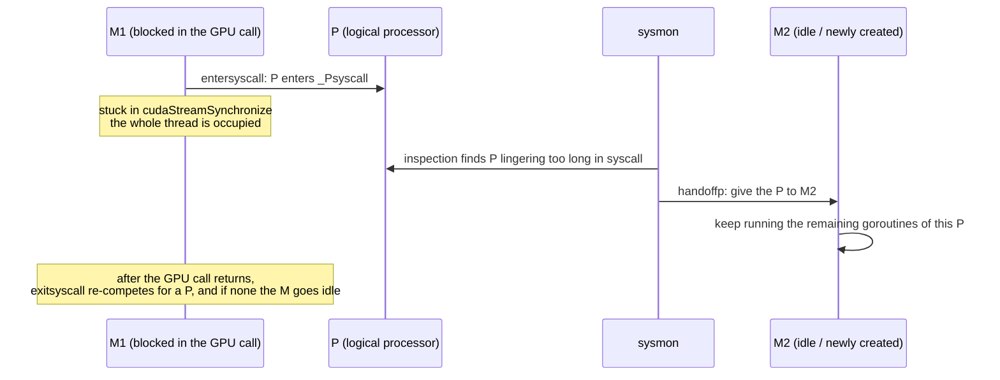

# 18.2 The Scheduler and Blocking Foreign Calls

The prescription [18.1](./boundary.md) gave was "asynchronous, synchronize seldom": push
commands into the stream, return immediately, wait only once at the end. But that "once at
the end" must after all be waited. `cudaStreamSynchronize` blocks until the GPU has drained
the whole stream; a synchronous `cudaMemcpy`, a driver call that does not take the
asynchronous path, will all leave the Go-side thread genuinely stopped inside C. What this
section asks is this: when a crossing **really does block for a long time**, how does the
scheduling machinery of [Chapter 9](../../part3concurrency/ch09sched) react? Will it be
dragged down by a single call stuck on the GPU?

The answer takes two directions. Go blocking inside C is one direction, C calling back into
Go is the other, and the scheduler has a response for each.

## 18.2.1 A Blocking Crossing, as the Scheduler Sees It

First recall the picture from Chapter 9: the scheduler orchestrates concurrency across M
(system threads), P (logical processors, limited in number by `GOMAXPROCS`), and G
(goroutines), and an M must bind a P before it can run Go code.

Section 15.6 already explained that `cgocall` calls `entersyscall` before crossing. The
meaning of that step becomes crucial now: **in the scheduler's accounting, a cgo call and a
system call are one and the same thing**. The M is marked "in a system call," and the P it
holds enters the `_Psyscall` state. From this moment until the C call returns, there is an
iron law:

> The scheduler can neither see nor preempt a goroutine executing inside C code. The M
> carrying it is firmly occupied for the whole duration of the C call.

The reason was given in 15.6: the C code runs on the M's `g0` system stack, the runtime
cannot move it, cannot insert a preemption point in its middle, cannot scan its stack. So
this M has no choice but to wait out the GPU call alongside it. But note that what is
occupied is the **M**, not the **P**. The P is the scarce resource (at most `GOMAXPROCS` of
them); the M is relatively cheap. What the scheduler must protect against is letting a
blocking call needlessly hog a P and starve the other goroutines.

## 18.2.2 sysmon Takes the P Back

The rescuer is exactly that monitoring thread from Chapter 9 that runs independently and
binds no P: **sysmon**. It periodically inspects all the Ps, and one of the things it does
is `retake`: reclaim a P trapped too long in a system call and hand it to another M. This
machinery applies as-is to a blocking cgo call.

```go
// runtime/proc.go: the relevant branch of retake (a trimmed sketch)
// for each P in _Psyscall:
if syscallBlockedTooLong(pp) {        // longer than ~one sysmon tick (tens of microseconds)
    thread.takeP()                    // wrest the P from the blocked M
    handoffp(pp)                      // hand it to another M to keep running this P's other Gs
}
```

So a blocking GPU call never freezes the whole program: on the order of tens of
microseconds, sysmon hands the P off, and the remaining `GOMAXPROCS - 1` worth of
concurrency keeps advancing. That M stuck in C, when the GPU call finally returns, competes
again for a P in `exitsyscall`; if it wins one it carries on, if not it hangs its own
goroutine back on the global queue and the M goes idle.



This is the conclusion of the first direction: **a blocking crossing cannot drag the
scheduler down**. The scarce resource, the P, is protected by sysmon. The only cost is that
the M is occupied for a stretch, plus a little churn from one P handoff.

## 18.2.3 The Real Cost: Thread Inflation

The cost is small, but there is one place where concurrency magnifies it, and it must be
seen clearly.

Compare two kinds of blocking. When a goroutine blocks on a **channel** or a **mutex**, the
scheduler **parks** it, the M is promptly freed to run other goroutines, and a single M can
serve tens of thousands of such blocked goroutines; this is the very root of Go's "cheap
goroutine." But when a goroutine blocks inside a **cgo call**, it **cannot be parked**: the
C code is occupying this thread's stack, and the runtime cannot move it. So this goroutine
and its M are bound fast together until C returns.

Set this in a concurrent scenario and the conclusion sharpens:

> Every goroutine **simultaneously** blocked inside a GPU call occupies one OS thread.

If you spin up a goroutine per request and have each **synchronously** wait for the GPU to
finish, then N concurrent requests will prop up as many as N threads. The cheapness of
goroutines has failed here; what you pay is the price of threads. And ironically, these
threads spend almost all their time merely waiting, because a single GPU physically digests
commands serially, and the N threads are still contending for the same one device.

This is the full weight of that line in 15.6's decision table, "high concurrency where the
C call may block: be careful," and it in turn vindicates why 18.1 stressed asynchrony so
hard. Boiled down into two actionable inclinations:

- **Do not scatter synchronous device calls across a large number of goroutines.** The more
  goroutines synchronously waiting for the GPU, the more threads, while the gain does not
  grow with them, because there is only one device.
- **Use asynchrony plus a small number of goroutines to feed the streams.** Let a few
  goroutines push commands asynchronously into the streams (18.1); they need not occupy
  threads while waiting, and the device is fed full all the same.

Section 18.2.5 gives an even more thorough way to gather this in: simply let **one**
dedicated goroutine own the device.

## 18.2.4 The Reverse Direction: Foreign Threads Calling Back into Go

So far we have spoken of "Go blocking inside C." But the bridge is bidirectional. GPU
runtimes often create **their own threads**, for instance a stream's completion callback (a
host function registered with `cudaLaunchHostFunc` is invoked on some thread of the
driver). When such a thread turns around and wants to call a Go function, trouble arrives:
**this is a thread the Go runtime never created and does not recognize; it is bound to no
M**. And without an M there is no `g0`, no scheduling context, and Go code has no way even
to start running.

The runtime keeps a hand ready for this, called the **extra M**. `needm` in
`runtime/proc.go` deals specifically with this situation:

```go
// when a foreign (non-Go-created) thread calls back into Go:
// needm borrows an M from a pre-prepared linked list of extra Ms;
// it carries its own g0 and curg, serving temporarily as the scheduling stack
// and current goroutine for this callback.
// when the callback finishes (or the C thread exits), dropm returns the M to the list.
```

To guarantee "there is always an M to borrow," the runtime seeds this list with one M at
the startup of a cgo-enabled program and maintains the invariant of "always one more than
needed": the moment `needm` takes the last one, its first task is to make a spare M and
hang it back on the list. Each extra M has its own `g0` and `curg`, "borrowed" for the
duration of the callback.

The cost is that `needm` is not cheap: it may have to create a thread, may have to allocate
memory, far heavier than an ordinary goroutine switch. A foreign thread that calls back
into Go **frequently** pays this borrow-and-return cost over and over. So the engineering
inclination is to minimize how often "a foreign thread actively calls back into Go," and
where "the Go side polls for the result" can replace "let C call back to notify," it is
often the better deal.

## 18.2.5 Pinning a Thread to Own the Device

The pressure of both directions above points in the end to one design, and it happens to
solve a problem this section has not yet named: **the thread affinity of the context**.

Many device APIs are **thread-bound**. A CUDA context, an OpenGL context
([19.2](../ch19graphics/bindings.md) will discuss this in detail), is a notion of being
"current on one particular OS thread." But goroutines migrate between Ms: running on thread
A this time, possibly scheduled onto thread B the next. If you set up the context on A and
the goroutine migrates to B, the context is no longer there, and the device call simply
errors.

The remedy is `runtime.LockOSThread`: **nail** a goroutine to its current M so that it never
migrates again, and all its device calls go out through the same thread. Put this together
with the thread cost above, and a clean shape emerges:

```go
// a dedicated "device goroutine": owns the device, pins the thread,
// exposes only a channel to the outside
func deviceWorker(reqs <-chan Request) {
    runtime.LockOSThread()         // pin: the context lives only on this thread henceforth
    defer runtime.UnlockOSThread()
    ctx := C.createContext()       // the context is bound to this thread
    defer C.destroyContext(ctx)
    for r := range reqs {          // serve requests serially, pushing commands into the stream
        r.result <- submit(ctx, r) // other goroutines talk to it through the channel
    }
}
```

This shape solves three things at once. First, **thread affinity**: the context always lives
on the same pinned thread and will not be invalidated by goroutine migration. Second, the
**thread count**: no matter how many goroutines upstream are issuing requests, only this
one thread-pinned worker actually touches the device, eliminating the thread inflation of
18.2.3. Third, **a return to Go's own colors**: the device, a shared resource, is owned by
one goroutine, and the rest communicate with it through a channel. The proverb "do not
communicate by sharing memory" holds once more, in the place closest to the hardware. The
agents of Chapter 21 will use this "single owner plus channel" shape again.

## Summary

The FFI boundary does not crush the scheduler, but it presses on it from two places. When
Go blocks inside C, that M is occupied for the whole stretch and cannot be parked, and only
sysmon's reclaiming of the scarce P saves the day; doing this concurrently trades it for
thread inflation, because a goroutine trapped in cgo is not cheap the way one trapped on a
channel is. In the reverse direction, a foreign thread calling back into Go has to borrow
an extra M temporarily, which is a cost too. Both pressures push the design toward the same
shape: do not scatter blocking device calls across a large number of goroutines, but let a
few, thread-pinned where necessary, goroutines own the device and connect it back to the
rest of the program through a channel.

The scheduler's account is settled, but the memory account remains: the pointers passed
back and forth on the bridge, which belong to the GC, which are device addresses, and on
what grounds the collector refrains from touching them. That is the business of
[18.3](./memory.md).

## Further Reading

1. The Go Authors. *runtime/proc.go.*
   https://github.com/golang/go/blob/master/src/runtime/proc.go
   (`entersyscall`/`exitsyscall`, sysmon's `retake`/`handoffp`, `needm`/`dropm` and the
   extra M)
2. The Go Authors. *runtime.LockOSThread.* https://pkg.go.dev/runtime#LockOSThread
   (nailing a goroutine to one OS thread, for thread-affine device/graphics contexts)
3. NVIDIA. *CUDA C++ Programming Guide: Asynchronous Concurrent Execution / Stream Callbacks.*
   https://docs.nvidia.com/cuda/cuda-c-programming-guide/
   (mechanisms like `cudaLaunchHostFunc` that call host code back on a driver thread)
4. Dmitry Vyukov. *Scalable Go Scheduler Design Doc.*
   https://golang.org/s/go11sched
   (the M/P/G model and the P handoff under a system call, the source of sysmon's design)
5. This book: [9.5 Thread Management](../../part3concurrency/ch09sched/thread.md),
   [9.8 System Monitoring](../../part3concurrency/ch09sched/sysmon.md),
   [15.6 cgo](../../part5toolchain/ch15compile/cgo.md),
   [18.1 Crossing the FFI Boundary](./boundary.md),
   [18.3 The Divide Between Device Memory and the Garbage Collector](./memory.md).
