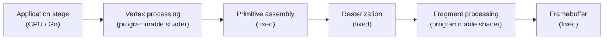

# 19.1 The Rendering Pipeline and Where Go Sits

Chapter 18 read the GPU as a "general-purpose parallel compute device." But the GPU's given name is the **Graphics** Processing Unit, and its first and most native job is to render graphics. For the two decades before "using the GPU for general computation" became a slogan, the graphics card was already doing parallel arithmetic for every pixel on the screen. Graphics is therefore the **oldest heterogeneous workload**: the massively parallel hardware on a GPU was built for it in the first place. This chapter returns to that origin to ask what role Go plays in graphics, and the starting point is to see clearly the **rendering pipeline** that runs through everything, and where exactly Go's code sits on it.

## 19.1.1 The Pipeline: A Staged Dataflow

To turn a pile of three-dimensional vertices into a frame of colored pixels on the screen, the GPU runs a **staged pipeline**. Each stage reads the output of the previous one, performs one class of transformation, and hands the result to the next. The classic graphics pipeline looks roughly like this:

Some stages in this pipeline are **fixed-function** (primitive assembly, rasterization, framebuffer blending), hardwired into the silicon, with only parameters left for you to configure; other stages are **programmable**, where vertex processing and fragment processing each run a small program called a **shader** that you supply. Rasterization is the heart of the line: it "fills" a triangle into the patch of pixels it covers, deciding which fragments need to be shaded. The pipeline as a whole is a natural fit for the GPU, because every vertex and every fragment can be processed independently and in parallel by the same shader, which is exactly the SIMT of Chapter 18.

## 19.1.2 Where Go Sits: The Orchestrator on the CPU Side

Now the key question: on this pipeline, which stage does Go's code sit on?

The answer is **the leftmost stage, and only that one**: the application stage. Go runs on the CPU, and what it does is "prepare data and issue commands." It organizes the scene's vertices, textures, and transform matrices, uploads them to video memory, and then issues one **draw call** after another, telling the GPU "with this data and this shader, draw." Once the draw call is out, the later stages of vertex processing, rasterization, and fragment processing all run on the GPU, and Go no longer intervenes. It only steps back in at the end, when the result must be read back or handed to the windowing system for display.

This means graphics programming has **two boundaries**, not one.

The first is the familiar **FFI boundary**. A draw call is, in essence, the command submission of [18.1](../ch18gpu/boundary.md): it enters the graphics driver through cgo, pushes a draw command into a queue, and returns immediately, while the GPU executes it asynchronously on its own timeline. The "enqueue and return" picture from 18.1 applies verbatim to `glDrawElements` or `vkCmdDraw`. Rendering one frame issues many draw calls, so 18.1's admonition to "reduce the number of crossings" becomes, here, the mantra every graphics programmer recites: "reduce draw calls."

The second boundary is subtler, a **language** boundary. Shaders are not written in Go. They are written in dedicated shading languages such as GLSL, SPIR-V, WGSL, and HLSL, and compiled by their own compilers into code the GPU can execute. **You cannot write a shader in Go that runs on the GPU.** Graphics programs are therefore inherently "bilingual": Go orchestrates on the CPU side, manages resources, and drives each frame's logic, while shaders do the real per-vertex and per-pixel computation on the GPU side. Go and the shaders meet through an agreed interface (vertex attributes, uniform variables, texture bindings). Seeing this language boundary clearly matters: it marks out what Go can and cannot do in graphics. Go is the director, not the actor.

## 19.1.3 The Cost of a Draw Call, and the Turn of Modern APIs

Since rendering one frame issues a large number of draw calls, and every draw call is a crossing, the fixed cost of a draw call became a classic graphics bottleneck. Historically a single draw call had to pass through a great deal of state validation and translation in the driver, and this CPU-side overhead was often more expensive than the GPU actually drawing the triangle. The remedy shares its source with 18.1, namely **pack more work into a single crossing**:

- **Batching**: merge many objects that use the same state into a single draw call.
- **Instancing**: use one draw call to draw hundreds or thousands of copies of the same mesh (a field of grass, a crowd of people), with only each copy's transform differing.

A deeper turn happened at the API level. The old OpenGL is **immediate** in style: you set state and issue commands one at a time, and the driver does a great deal of implicit management and validation behind your back, redone for every draw call. The new generation of **explicit** APIs, Vulkan, Metal, Direct3D 12, and WebGPU on the Web, moves that management **out of the driver and onto the application side**: you record a string of commands into a **command buffer** ahead of time, validation happens once, and the batch is submitted together. This is the same idea as CUDA Graphs in 18.1: separate the construction of a long command sequence from its submission, so that repeated submission costs almost nothing.

This turn is good news for Go. Constructing a command buffer happens on the CPU, and it is a large amount of data-structure orchestration and memory management, which is exactly what Go is good at: recording multiple command buffers concurrently across multiple goroutines and then submitting them together puts the concurrency machinery of Chapters 9 and 10 right onto the critical path of graphics. The explicit APIs turn Go's role in graphics from "a thin layer of bindings" into "a genuine orchestrator of commands." Projects like Ebitengine and Gio in the Go ecosystem do precisely this underneath: efficiently organize each frame's commands on the CPU side, then hand them to the GPU across a boundary kept as thin as possible.

## Summary

The GPU's native job is graphics, and the rendering pipeline is a staged dataflow in which fixed-function stages and programmable shader stages alternate. Go sits at only one position on this pipeline: the application stage on the CPU, responsible for preparing data and issuing draw calls. Graphics programming therefore has two boundaries: the first is 18.1's FFI boundary (a draw call is command submission, so "reduce draw calls" is "reduce crossings"), and the second is a language boundary (shaders are written in dedicated shading languages, and Go cannot write a GPU shader, it can only direct). The fixed cost of a draw call gave rise to batching and instancing, and the explicit APIs of this generation, Vulkan and WebGPU, move command orchestration back to the CPU side, which in turn gives Go's concurrency something to do.

The next section goes deep into a particular trouble that the first boundary brings in graphics: why a graphics context is nailed to one specific OS thread, and why [18.2.5](../ch18gpu/sched.md)'s `LockOSThread` is, here, not a trick but a necessity.

## Further Reading

1. Tomas Akenine-Möller, Eric Haines, Naty Hoffman, et al.
   *Real-Time Rendering, 4th Edition.* CRC Press, 2018.
   (The authoritative textbook on the real-time rendering pipeline; Chapters 2 to 3 detail each stage.)
2. The Khronos Group. *Vulkan Specification: Rendering and Command Buffers.*
   https://registry.khronos.org/vulkan/
   (How an explicit API separates command recording from submission with command buffers.)
3. The Khronos Group. *WebGPU Specification.* https://www.w3.org/TR/webgpu/
   (A modern explicit graphics/compute API on the Web; relevant to 19.4.)
4. Cass Everitt, Tim Foley, et al. *Approaching Zero Driver Overhead (AZDO).*
   GDC, 2014.
   (The sources of draw-call driver overhead and how to cut it.)
5. Ebitengine. https://ebitengine.org/ , Gio. https://gioui.org/
   (Two instances of orchestrating graphics commands on the CPU side in the Go ecosystem.)
6. This book: [18.1 Crossing the FFI Boundary](../ch18gpu/boundary.md),
   [18.4 The Asynchronous Programming Model](../ch18gpu/model.md),
   [19.2 Graphics Bindings and Thread Affinity](./bindings.md).
