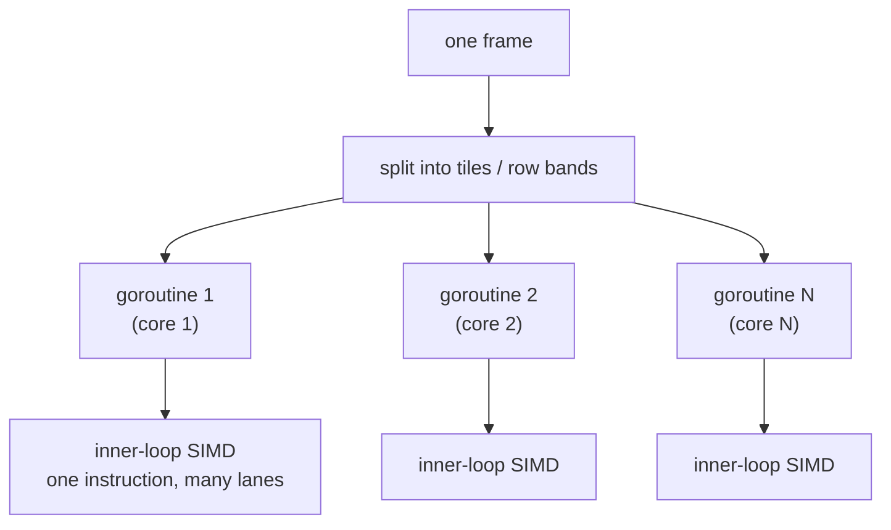

# 19.3 Software Rendering and Parallelism

Rendering in the previous two sections always crossed a boundary: hand the work and commands to the local GPU, pay the whole set of tolls from Chapter 18, and still attend to the thread discipline of the graphics context ([19.2](./bindings.md)). This section takes another road, **software rendering**: compute every pixel entirely on the CPU, touching no GPU, no driver, no FFI boundary of any kind. This road was once dismissed as "the slow and useless fallback," yet it is precisely the best stage on which to put Go's concurrency, and Go 1.27's `simd`, to work in graphics.

## 19.3.1 Why Software Rendering at All

If the GPU is so fast, why does anyone render on the CPU? Because there are several classes of scenario where the GPU is either unavailable or not worth it.

- **No GPU available.** Generating images, thumbnails, charts, and PDF renderings in bulk on the server, running on headless machines that have no graphics card and no display. This is Go's most mainstream deployment shape, and exactly where the GPU is most absent.
- **Determinism and portability required.** The result of software rendering is reproducible bit for bit, unaffected by driver version or graphics card model. When you need "the same input rendered to a pixel-identical image on any machine" (a test baseline, document generation), software rendering is the only reliable choice.
- **Simplicity and full control.** No context, no thread discipline, no boundary; the renderer is just an ordinary piece of Go code, readable, debuggable, steppable, with every pixel's provenance visible. Go's standard library `image`, `image/draw`, `golang.org/x/image`, and pure-Go renderers in the community (such as `polyred`) all take this road.

Sum these up in one sentence: software rendering is **the other side of the boundary**. The crossing costs that Chapters 18 and 19 spent so long computing simply do not exist here, at the price of giving up the GPU's massive throughput. The question therefore shifts from "how to cross the bridge more cheaply" to "**without crossing, how do we wring out the CPU's parallelism**." The answer has two layers, corresponding exactly to the two CPU members of the three-parallelism taxonomy in section 18.4: the task parallelism of goroutines, and the data parallelism of SIMD.

## 19.3.2 Slice the Screen into Tiles: Goroutine-Level Parallelism

Software rendering has one innate good property: **pixels are mostly independent of one another**. The pixels of different regions of one frame can be computed entirely independently. This is a textbook **embarrassingly parallel** problem, and Go's goroutines were born for exactly this kind of task-level parallelism.

The standard approach is **tiling**: cut the picture into tiles or scanline bands, each goroutine claims one, and each computes its own without interfering with the others.

```go
// Split the framebuffer into row bands; each goroutine renders one band, no overlap
func renderParallel(fb *Framebuffer, scene *Scene, workers int) {
    var wg sync.WaitGroup
    rows := fb.Height / workers
    for w := 0; w < workers; w++ {
        y0, y1 := w*rows, (w+1)*rows
        wg.Add(1)
        go func(y0, y1 int) {        // each goroutine an independent row band
            defer wg.Done()
            for y := y0; y < y1; y++ {
                renderScanline(fb, scene, y) // writes only the pixels of its own band
            }
        }(y0, y1)
    }
    wg.Wait()
}
```

There is one reef laid by Chapters 11 and 13 to steer around: **false sharing and write contention**. As long as each goroutine writes a **non-overlapping** region of the framebuffer, there is no data race and not even a lock is needed. This is exactly why we split into row bands above, rather than letting multiple goroutines fight over the same patch of pixels. Partitioned well, rendering throughput grows almost linearly with core count, which is the most direct dividend goroutines bring to graphics. This layer is **task-level** parallelism: split "draw a frame" into "draw many tiles" and let the scheduler spread them across multiple cores.

## 19.3.3 Vectorizing the Inner Loop: SIMD

Task-level parallelism spreads the work across multiple cores, but the layer of data parallelism **inside** each core has not yet been extracted. The innermost loop of rendering, doing color blending, vector dot products, interpolation, and lighting pixel by pixel, is a string of uniform arithmetic over small arrays. This is exactly where the SIMD of [18.4.3](../ch18gpu/model.md) comes in: one instruction acting on multiple data lanes in a vector register at once.

In the past, Go had only two unseemly roads to SIMD at this layer. One was **hand-written assembly**: the hot functions in the standard library's `image/draw` and `x/image` still hide hand-written SIMD assembly for each architecture to this day. The other was **hoping the compiler auto-vectorizes**, but the Go compiler does little of this and cannot be relied upon. Both roads either sacrifice portability and readability or simply fail to get vectorization at all.

**Go 1.27's experimental `simd` package** (requires `GOEXPERIMENT=simd`, see 18.4.3) lets the inner loop of software rendering be explicitly vectorized in portable Go for the first time. Take the most common case, alpha blending, `dst = src·α + dst·(1-α)`. Per channel this is a multiply-add, which falls exactly onto `simd`'s fused multiply-add `MulAdd`:

```go
//go:build goexperiment.simd
import "simd"

// Blend one channel of a row of pixels against the background by alpha (illustrative)
// src, dst, alpha are all []float32; one instruction advances a whole group of lanes
func blendRow(dst, src, alpha []float32) {
    var z simd.Float32s
    lanes := z.Len()
    one := simd.BroadcastFloat32s(1.0)
    i := 0
    for ; i+lanes <= len(dst); i += lanes {
        s := simd.LoadFloat32s(src[i:])
        d := simd.LoadFloat32s(dst[i:])
        a := simd.LoadFloat32s(alpha[i:])
        // MulAdd(y, z) returns x*y + z, so dst = s*a + d*(1-a)
        out := s.MulAdd(a, d.Mul(one.Sub(a)))
        out.Store(dst[i:])
    }
    for ; i < len(dst); i++ {            // scalar cleanup for the tail shorter than a vector
        dst[i] = src[i]*alpha[i] + dst[i]*(1-alpha[i])
    }
}
```

Two points consistent with 18.4.3 are worth restating in the graphics context. First, **vector-length agnostic**: `lanes` is given at runtime by the hardware, so the same blending code advances 16 float32 at a time on an AVX512 server and 4 at a time on ARM NEON, with no need to write a separate version per width. Second, **use hardware if present, emulate in pure Go otherwise**, which guarantees this rendering code compiles and runs on any target, exactly the portability software rendering cares about most. To be honest once more: `simd` is still an experimental feature in 1.27, and its API may change.

## 19.3.4 Composing the Two Layers, and the Divide with the GPU

Stacking the two layers, the parallel picture of software rendering on the CPU is complete:



**The outer layer uses goroutines to cut the frame into tiles and fill all cores (task parallelism); the inner layer uses SIMD to saturate each core's arithmetic (data parallelism).** These two layers are orthogonal and multiply together: N cores, each processing W lanes per instruction, can in the ideal case be about N×W times faster than naive scalar serial execution. This is the parallel ceiling a Go program can wring out of a single CPU without leaving the process or touching any boundary.

So where is the divide with the GPU? The answer is the same ledger computed in [18.4.4](../ch18gpu/model.md), made concrete in graphics. GPU rendering has far higher throughput, but pays the crossing tolls and the thread discipline of the context; software rendering has a ceiling on throughput, but is boundary-free, deterministic, portable, and runs on any headless machine. The divide is therefore clear: **real-time, high-resolution, shading-heavy interactive rendering** belongs to the GPU (games, real-time 3D); **headless bulk, deterministic, small-to-medium scale, or simply no-graphics-card scenarios** belong to software rendering (server-side image generation, documents and charts, rendering test baselines). The same scale, the cost of the boundary, once again weighs which side of the bridge the work should go on.

## Summary

Software rendering is the other side of the FFI boundary: give up the GPU's throughput in exchange for zero crossing cost, determinism, portability, and the ability to render on any headless machine, which is exactly Go's most mainstream deployment shape. Wringing out the CPU's parallelism takes two layers: the outer uses goroutines to cut the picture into tiles and fill multiple cores (task parallelism, partitioned into non-overlapping regions to avoid write contention), and the inner uses SIMD to vectorize the per-pixel arithmetic (data parallelism, where Go 1.27's `simd` lets it be written in portable Go for the first time rather than hand-written assembly). The two layers are orthogonal and multiply, approaching the parallel ceiling of a single CPU. Whether to switch to the GPU is still weighed by the "cost of the boundary" scale from section 18.4.

We have now seen both the CPU and GPU rendering roads. The last section changes the scene to the browser: [19.4](./wasm.md) looks at where the rendering boundary lands once Go is compiled to WebAssembly, and how WebGPU re-runs this whole heterogeneous-computing story inside the browser.

## Further Reading

1. The Go Authors. *Package image/draw and golang.org/x/image.*
   https://pkg.go.dev/image/draw , https://pkg.go.dev/golang.org/x/image
   (Go's standard and extended image libraries; the hand-written SIMD assembly in hot functions.)
2. The Go Authors. *Package simd (Go 1.27, experimental, requires GOEXPERIMENT=simd).*
   https://github.com/golang/go/tree/master/src/simd
   (`MulAdd`, `Broadcast`, vector-length-agnostic types, used to vectorize the inner loop.)
3. changkun. *polyred: a 3D graphics facility in pure Go.*
   https://github.com/changkun/polyred
   (A pure-Go software 3D renderer; tiled parallelism and portability in practice.)
4. Matt Pharr, Wenzel Jakob, Greg Humphreys. *Physically Based Rendering, 4th ed.*
   2023. https://pbr-book.org/
   (The architecture of a software renderer, with engineering discussion of tiled parallelism and vectorization.)
5. This book: [9 The goroutine Scheduler](../../part3concurrency/ch09sched),
   [11 Synchronization Primitives and Patterns](../../part3concurrency/ch11sync),
   [18.4 The Asynchronous Programming Model](../ch18gpu/model.md),
   [19.1 The Rendering Pipeline and Where Go Sits](./pipeline.md), [19.4 Rendering in the Browser](./wasm.md).
