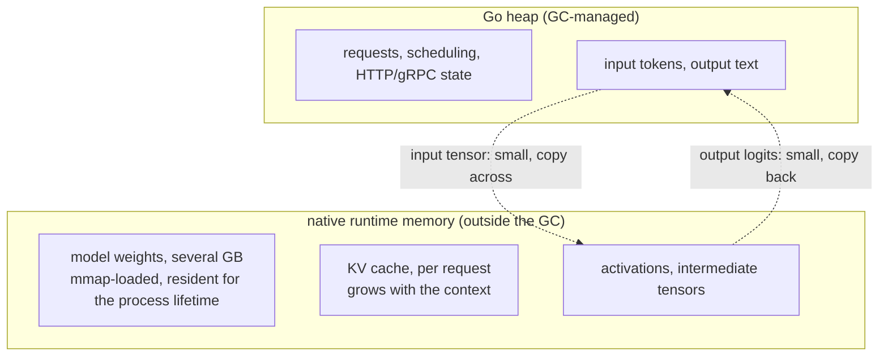

# 20.1 The Inference Runtime and FFI

The FFI boundary that recurred through Chapters 18 and 19 wears, with large models, its most
current face. Training large models is almost the domain of Python and CUDA, but when a model
is trained and is to be deployed to **serve** tens of millions of requests, the lead role
changes, and Go stands firm at this layer. This chapter is about how Go takes on AI's
inference and serving, and the first section must settle the lowest-level problem: Go does
not do matrix multiply itself, it has to wire in a local inference runtime, and this wiring
is, once again, the boundary of Chapter 18.

## 20.1.1 Training in Python, Inference and Serving Where?

First see the division of labor clearly. **Training** is a research-like thing: trying
different architectures, tuning hyperparameters, watching loss curves, wanting expressive
flexibility and a rich ecosystem, and Python plus PyTorch plus CUDA is its indisputable home.
Go has no place on the training side, and need not.

But **inference and serving** is a different thing. The model is frozen, the weights no
longer change, and what remains is uniformly a **systems problem**: how to serve a large
volume of concurrent requests with high throughput and low latency; how to load a model of
several gigabytes stably into memory and feed it to the device; how to make it a service that
deploys with one command, withstands production traffic, and is easy to monitor and operate.
Read this list out and you find it is exactly the class of problems Go was designed to solve:
statically compiled single-file deployment, native concurrency, controllable memory, a
mature network stack. So "training to Python, inference and serving to Go" is no accidental
choosing of sides, but the nature of two kinds of work drawing the two languages each to the
layer it is good at. Ollama, the most popular local large-model service today, is written in
Go.

## 20.1.2 Wiring in a Local Inference Runtime: That Boundary Again

Go stands at the serving layer, but the work that truly eats compute, the matrix multiplies,
the attention, the quantization, Go does not do itself; it hands these to a **local inference
runtime**: `llama.cpp`/`ggml` (C/C++), ONNX Runtime, or a vendor's runtime. These runtimes
are highly optimized tensor-computation libraries written in C/C++, able to drive the CPU's
SIMD or the GPU. For Go to use them, the means is still cgo.

So the whole machinery of Chapter 18 returns as-is. Ollama's documentation says it plainly:
it "includes native code compiled with CGO," its native inference engine built with CMake,
compiling out CUDA, ROCm, Vulkan and other backends on demand. This means the costs covered
in 15.6 and Chapter 18 are inherited together: a C/C++ toolchain at build time, the loss of
pure-Go portability ([15.6.4](../../part5toolchain/ch15compile/cgo.md)), and the state
transition tax on every crossing at runtime. Ollama's documentation even points out a
fragility 15.6 did not detail: the data structures shared by the Go and C sides "can get out
of sync, resulting in unexpected crashes," which is exactly the most insidious class of bug
at the seam where cgo stitches two worlds together.

The key design discipline is also consistent with 18.1: **coarse-grained**. You would never
cross the boundary once per operator, but in a single cgo call have the runtime "compute this
batch of tokens forward," keeping the execution of hundreds or thousands of operators inside
that one call on the C side. Section 18.1 said a GPU workload is by nature a torrent of
fine-grained commands, and the value of an inference runtime lies precisely in walling that
torrent off on the C side of the boundary, leaving only a coarse-grained interface before Go.

## 20.1.3 Tensor Ownership Across the Boundary

After the wiring, the most pressing engineering problem is **memory**, because a large
model's memory is measured in gigabytes, and the cost of copying it across the boundary is
real. Lay 18.3's memory map over inference, and the division of ownership is clear at a
glance:

Three points. First, **the model weights are not on the Go heap**. They are allocated by the
runtime, usually `mmap`ing a weights file like GGUF directly into the address space, resident
for the whole process lifetime. This is a multi-gigabyte block the GC should not meddle with;
the collector neither scans nor reclaims it, the direct embodiment of 18.3's "a device or
native pointer is not a Go pointer." Stuffing something this large into the Go heap would
bring the GC a catastrophic scanning burden.

Second, **the KV cache is a large per-request state**. During autoregressive generation, the
runtime maintains a key-value cache per sequence, growing with the context length; it too
lives in native memory, its lifetime managed by the runtime. What the Go side holds is only a
handle to it.

Third, **only small things are worth copying across the boundary**. The input tokens, and the
output logits and text, are small quantities relative to the weights, and copying them across
the boundary is harmless. The truly large blocks, the weights, the KV cache, the activations,
all stay on the native side throughout, and Go never moves them into its own heap. This is
the spirit of "zero copy" in inference: let the gigabyte-scale data **stay where it is**, with
Go passing only handles and moving only small data, never letting one request trigger one
gigabyte-scale crossing. Hold this line, and the memory cost of the FFI boundary will not run
away.

## 20.1.4 In-Process or Out-of-Process

Last is the choice of [18.1.4](../ch18gpu/boundary.md), surfacing again in inference
deployment, and especially crucial here: embed the runtime in the same process, or have it
start a separate process?

**In-process (cgo embedding).** Link `ggml`/`llama.cpp` directly into Go through cgo, one
binary serving all, the road Ollama takes. The advantage is no inter-process communication
and no serialization; input and output pass handles directly in the same address space,
lowest latency, simplest deployment. The price is inheriting all of cgo: the build needs a C
toolchain, the lightness of cross-compilation is lost, and moreover **an inference runtime
that crashes inside C takes the entire Go service down with it**, as 18.2 said the runtime
cannot govern a crash in C, and one native segfault is the end of the whole process.

**Out-of-process (IPC/RPC).** Run the inference runtime as an independent service (such as
`llama.cpp`'s own server, vLLM, Triton), with the Go process talking to it over gRPC or HTTP.
The Go side then has not a line of cgo, the pure-Go toolchain properties are all kept, and a
crashed inference process is merely a restartable dependency, not something that drags the Go
service down. The price is an added serialization and cross-process communication, latency
rising a little, and one more component to orchestrate in deployment.

There is no universal answer. For utmost latency, single-file deployment, and a willingness to
shoulder cgo, choose in-process; for isolation, pure Go, and treating inference as an
independently scalable and restartable backend, choose out-of-process. This is exactly what
18.1.4 said: **the FFI boundary is not an iron law but a movable design choice**, and in
inference deployment it directly decides your system topology.

## Summary

After a model is trained, serving it is a systems problem, and a systems problem is exactly
Go's home ground; this is the root of Go standing at AI's inference and serving layer. But Go
does not compute tensors itself; it wires in native runtimes like `ggml` and ONNX Runtime
through cgo, and so the boundary of Chapter 18, with all its costs, returns together: the
discipline of coarse-grained calls, the build-time C-toolchain burden, the runtime crossing
tax, and the kind of seam crash Ollama names as "the two sides' data structures out of sync."
On memory, laying 18.3's map over it, the gigabyte-scale weights (often `mmap`ed and
resident), the per-request KV cache, and the activations all stay on the native side, with Go
passing only handles and moving only small data like tokens and logits, holding inference's
"zero copy." And whether to embed the runtime in the process or start a separate one is
another instance of that movable boundary of 18.1.4, deciding the system topology directly.

With the home of weights and tensors settled, the next section steps into the data itself:
[20.2](./tokenize.md) sees how a piece of text is cut into tokens and turned back into text,
and why the mechanics of strings and bytes from Chapter 5 bear on correctness here.

## Further Reading

1. Ollama. *Development / CGO and native runtime.*
   https://github.com/ollama/ollama
   (embedding a native inference engine through CGO, building multiple backends with CMake,
   the fragility of keeping the two sides' data structures in sync)
2. Georgi Gerganov et al. *llama.cpp and ggml.*
   https://github.com/ggml-org/llama.cpp , https://github.com/ggml-org/ggml
   (a C/C++ tensor runtime, the GGUF weights format and `mmap` loading, the KV cache)
3. Microsoft. *ONNX Runtime C API.*
   https://onnxruntime.ai/docs/api/c/
   (an inference runtime exposed as a C API, wireable into Go through cgo)
4. vLLM. *vLLM: Easy, Fast, and Cheap LLM Serving.*
   https://docs.vllm.ai/
   (a representative out-of-process inference service, the far end Go connects to over RPC)
5. This book: [15.6 cgo](../../part5toolchain/ch15compile/cgo.md),
   [18.1 Crossing the FFI Boundary](../ch18gpu/boundary.md),
   [18.3 The Divide Between Device Memory and the Garbage Collector](../ch18gpu/memory.md),
   [20.2 Tokenization and Tensors](./tokenize.md),
   [20.3 Serving, Batching, and Streaming](./serving.md).
